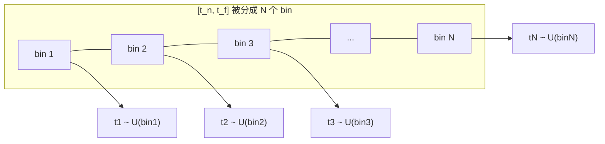

# 第 3 章 数学原理与体积渲染方程

> 本章是全文的数学核心。我们将从**连续积分**出发，推导出**离散化后的 alpha 合成**公式，并解释论文的分层（stratified）采样策略。请准备纸笔，跟着推导一遍。

---

## 3.1 物理模型：光沿直线穿过"雾"

一条相机光线参数化为：

$$
\mathbf{r}(t) = \mathbf{o} + t\,\mathbf{d}, \quad t \in [t_n, t_f]
$$

- $\mathbf{o}$：相机位置（ray origin）
- $\mathbf{d}$：单位方向（ray direction）
- $t$：沿光线的深度参数
- $t_n, t_f$：近/远界（near/far bounds）

**核心物理假设**（来自经典体积渲染，Kajiya & Herzen 1984）：
> 体密度 $\sigma(\mathbf{x})$ 解释为光线在 $\mathbf{x}$ 处**终止于一个无穷小粒子的微分概率**。

也就是说，$\sigma$ 越大，光线在这里"被挡住并停下"的概率越大。

---

## 3.2 期望颜色：体积渲染积分

一条光线的**期望颜色**（论文 Eq. 1）：

$$
C(\mathbf{r}) = \int_{t_n}^{t_f} T(t)\; \sigma(\mathbf{r}(t))\; \mathbf{c}(\mathbf{r}(t), \mathbf{d})\; dt
$$

其中**累积透射率**（accumulated transmittance）：

$$
T(t) = \exp\!\left(-\int_{t_n}^{t} \sigma(\mathbf{r}(s))\, ds\right)
$$

### 逐项理解这个积分

| 符号 | 含义 | 直觉 |
|------|------|------|
| $\sigma(\mathbf{r}(t))\,dt$ | 光线在小区间 $dt$ 内"碰到粒子"的概率 | 决定这里对像素的贡献权重 |
| $\mathbf{c}(\mathbf{r}(t), \mathbf{d})$ | 该点的视角相关颜色 | 被"挡下来"的光的颜色 |
| $T(t)$ | 光线从 $t_n$ 到 $t$ **没被任何粒子挡住**的概率 | 前面越"透明"，后面贡献越大 |

**整体直觉**：把 $[t_n, t_f]$ 切成无数小段，每段对最终像素颜色的贡献 = "能到达这里 $(T)$ × 在这里被挡住 $(\sigma dt)$ × 挡下来的颜色 $(\mathbf{c})$"。

注意：$T(t)$ 是单调递减的——走得越深，前面挡住的概率越大，能到达的概率越小。

---

## 3.3 关键性质：可微性

> 因为体积渲染**天然可微**（trivially differentiable），优化表示唯一需要的输入就是**一组已知位姿的图像**（论文 §1）。

这正是 NeRF 能用梯度下降训练的前提。我们不需要任何 3D 几何真值，只需"渲染出来的像素 ≈ 照片像素"。

---

## 3.4 数值积分：两种采样方式

连续积分无法解析计算，必须离散化。论文对比了两种方式：

### 方式 A：确定性积分（deterministic quadrature）

固定一组采样位置。问题：**分辨率受限于采样密度**——MLP 永远只在固定离散点被查询，无法表达更细的内容。

### 方式 B：分层采样（stratified sampling）⭐ 论文采用

把 $[t_n, t_f]$ 分成 $N$ 个等宽 bin，在每个 bin 内**均匀随机**取一个点（论文 Eq. 2）：

$$
t_i \sim \mathcal{U}\!\left[t_n + \frac{i-1}{N}(t_f - t_n),\; t_n + \frac{i}{N}(t_f - t_n)\right], \quad i = 1, \dots, N
$$

**为什么随机**？虽然用的是离散样本估计积分，但**随机化使 MLP 在整个优化过程中被连续位置查询**，从而表示一个"连续"的场景而非固定分辨率网格。这正是 NeRF 与"离散体素"的本质区别。

---

## 3.5 离散化渲染公式（alpha 合成）

论文用 Max (1995) 的求积规则离散化（论文 Eq. 3）：

$$
\hat{C}(\mathbf{r}) = \sum_{i=1}^{N} T_i\; (1 - e^{-\sigma_i \delta_i})\; \mathbf{c}_i
$$

$$
T_i = \exp\!\left(-\sum_{j=1}^{i-1} \sigma_j \delta_j\right)
$$

其中 $\delta_i = t_{i+1} - t_i$ 是相邻采样点距离，$\sigma_i = \sigma(\mathbf{r}(t_i))$，$\mathbf{c}_i = \mathbf{c}(\mathbf{r}(t_i), \mathbf{d})$。

### 等价于经典 alpha 合成

令：

$$
\alpha_i = 1 - e^{-\sigma_i \delta_i}
$$

则 $\alpha_i$ 就是第 $i$ 个采样点的 **alpha 值（不透明度）**，公式变成：

$$
\hat{C}(\mathbf{r}) = \sum_{i=1}^{N} T_i\, \alpha_i\, \mathbf{c}_i, \qquad
T_i = \prod_{j=1}^{i-1} (1 - \alpha_j)
$$

这是图形学中**从后到前的 alpha 合成**：从近到远累加，$T_i$ 是到第 $i$ 点为止"剩余透明度"。

### 一个直白的例子

假设 3 个采样点：$\alpha = [0.2, 0.5, 0.3]$，颜色 $\mathbf{c} = [红, 绿, 蓝]$：

| i | $T_i$ | $T_i \alpha_i$ | 加权颜色 |
|---|-------|----------------|----------|
| 1 | 1.0 | 0.2 | 0.2 × 红 |
| 2 | 1 - 0.2 = 0.8 | 0.4 | 0.4 × 绿 |
| 3 | 0.8 × (1-0.5) = 0.4 | 0.12 | 0.12 × 蓝 |

最终颜色 $= 0.2\text{红} + 0.4\text{绿} + 0.12\text{蓝} + (1-0.2-0.4-0.12)\times\text{背景}$。

---

## 3.6 数学性质小结

| 性质 | 内容 |
|------|------|
| 连续形式 | $C(\mathbf{r}) = \int T(t)\sigma(t)\mathbf{c}(t)\,dt$ |
| 离散形式 | $\hat C = \sum T_i \alpha_i \mathbf{c}_i$ |
| alpha | $\alpha_i = 1-e^{-\sigma_i\delta_i}$（单调：$\sigma,\delta$ 越大越不透明） |
| 透射率 | $T_i = \prod_{j<i}(1-\alpha_j)$（单调递减） |
| 可微性 | 全式对 $\sigma_i, \mathbf{c}_i$ 可微 → 可反传 |
| 复杂度 | 一条光线 $N$ 个采样点 → $N$ 次网络查询 |

**$N$ 次网络查询是最大的计算开销**——单张图 $800\times800=640\text{k}$ 条光线 × 256 点 ≈ 1.5~2 亿次查询（论文附录"Rendering Details"）。这就是第 5 章层次采样要解决的效率问题。

---

## 3.7 动手练习

1. 手推一遍：从连续积分公式出发，说明离散化后 $T_i$ 为什么是指数累加的形式。
2. 若某光线沿途 $\sigma$ 全为 0，$\hat C$ 应该等于什么？用公式验证。
3. 解释：为什么"固定网格确定性采样"会限制分辨率，而"分层随机采样"不会？

---

**下一章**：[04_网络架构与位置编码.md](04_网络架构与位置编码.md) — MLP 结构详解
