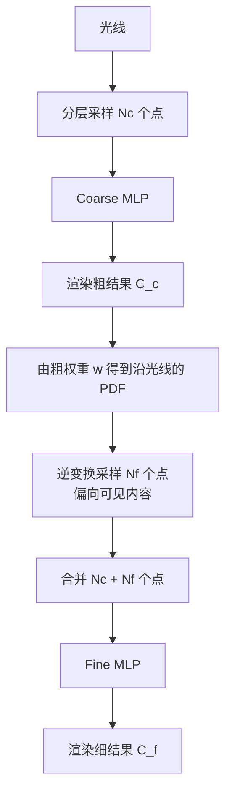
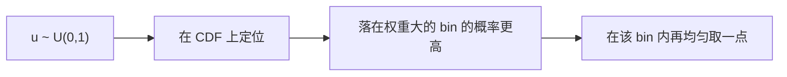

# 第 5 章 层次采样与训练细节

> 本章解决一个问题：**一条光线要查很多点，但大部分点（空白/被遮挡区域）对最终渲染毫无贡献**，纯属浪费。NeRF 用"coarse 先探路、fine 再细化"的双网络层次采样解决。

---

## 5.1 问题：均匀采样浪费严重

- 一条光线均匀采样 $N$ 个点，但**只有少数点落在可见物体表面**上
- 空白区域（$\sigma\approx 0$）和物体背后被遮挡的区域，查了也是白查
- 论文 §5.2（`sec:hierarchical`）明确说：均匀稠密采样在**自由空间和被遮挡区域反复采样**，效率低下

灵感来自早期体积渲染工作（Levoy 1990）：**按样本对最终渲染的"预期贡献"分配采样密度**——这就是重要性采样思想。

---

## 5.2 双网络架构：Coarse + Fine

不搞花哨，直接**同时优化两个 MLP**：

### Step 1：粗采样 + 粗渲染

先用分层采样（第 3 章）取 $N_c = 64$ 个点，过粗网络，用体积渲染得到 $\hat C_c$。

### Step 2：从粗权重构造分布

把粗渲染公式（论文 Eq. 5）改写为加权和：

$$
\hat C_c(\mathbf{r}) = \sum_{i=1}^{N_c} w_i\, \mathbf{c}_i, \qquad
w_i = T_i\, (1 - e^{-\sigma_i \delta_i})
$$

$w_i$ 就是第 $i$ 个采样点对最终颜色的**贡献权重**。归一化得到沿光线的**分段常数 PDF**：

$$
\hat w_i = \frac{w_i}{\sum_{j=1}^{N_c} w_j}
$$

### Step 3：按 PDF 细采样

用**逆变换采样（inverse transform sampling）**从该 PDF 中抽取 $N_f = 128$ 个新位置——**权重大的区域（即物体表面附近）被采得更多**。

### Step 4：合并渲染

把 $N_c + N_f = 192$ 个点**合并**（并排序）后一起送进 fine 网络，用第 3 章的公式渲染出最终颜色 $\hat C_f$。

> ⚠️ 注意：fine 网络不是只在细采样的点上工作，而是对"粗+细"全部 192 个点一起渲染。粗点提供覆盖，细点提供精度。

---

## 5.3 逆变换采样（Inverse Transform Sampling）

给定离散分布 $\{\hat w_i\}$（累计分布 CDF），生成均匀随机数 $u \sim \mathcal{U}(0,1)$，找到最小的 $k$ 使得 $\sum_{i=1}^{k}\hat w_i \ge u$，取第 $k$ 个 bin 内的一个随机点。

**效果**：表面附近（$w_i$ 大）的 bin 更容易被抽中 → 细采样集中在"看得见"的区域。

---

## 5.4 损失函数

论文 Eq. 7（`\Ltrain`）：

$$
\mathcal{L} = \sum_{\mathbf{r}\in\mathcal{R}} \left[\, \|\hat C_c(\mathbf{r}) - C(\mathbf{r})\|_2^2 + \|\hat C_f(\mathbf{r}) - C(\mathbf{r})\|_2^2 \,\right]
$$

- $\mathcal{R}$：每批随机采样的**光线集合**（从数据集所有像素中随机抽，通常 4096 条）
- 同时惩罚粗、细两个渲染结果与真值 $C(\mathbf{r})$ 的平方误差
- **为什么也监督 coarse？** 论文原文：即使最终渲染来自 $\hat C_f$，也要让粗网络的权重分布 $w_i$ 是"有用"的，否则第 2 步的 PDF 就是垃圾，细采样会采样到无意义的地方。

---

## 5.5 训练超参数（论文 §5.3 Implementation Details）

| 超参数 | 值 | 说明 |
|--------|-----|------|
| Batch size | 4096 条光线 | 每步随机抽样 |
| $N_c$ | 64 | 粗采样数 |
| $N_f$ | 128 | 细采样数 |
| 优化器 | Adam | $\beta_1=0.9,\ \beta_2=0.999,\ \epsilon=10^{-7}$ |
| 学习率 | $5\times10^{-4} \to 5\times10^{-5}$ | 指数衰减 |
| 迭代数 | 100k~300k | 单场景，V100 约 1~2 天 |
| 渲染点数（推理） | 64 + (64+128) = 256/光线 | 测试时 |
| 正则化（真实数据） | 对 $\sigma$ 输出加高斯噪声 $\mathcal{N}(0,1)$ | 略提升新视角视觉质量 |

---

## 5.6 三个"为什么"（论文结论前必答）

1. **为什么要 coarse + fine 两个网络而不是一个？** 单一网络无法既保证覆盖又保证精度；两个网络各司其职，且 coarse 免费提供重要性分布。
2. **为什么监督 coarse？** 让粗网络的权重分布准确，细采样才有效（见 §5.4）。
3. **为什么测试时渲染 256 点/光线而训练时最多 192？** 推理可以更稠密采样提高质量；训练要控制每步开销。

---

## 5.7 动手练习

1. 给定一条光线的粗权重 $w=[0.1,0.1,0.7,0.1]$，画出 CDF，并用逆变换采样说明 $u=0.85$ 会落在哪个 bin。
2. 解释"粗网络免费提供重要性分布"这句话。
3. 思考：如果只训练一个网络（无层次采样），为了达到同等质量需要多少均匀采样点？（消融实验"no hier 256"给的是 256 点——见第 7 章）

---

**下一章**：[06_数据集与实验结果.md](06_数据集与实验结果.md) — 数据集与结果解读
