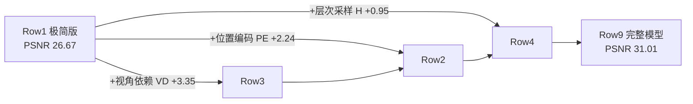

# 第 7 章 消融实验解读

> 消融实验（ablation study）回答"**去掉某个组件会怎样**"。论文 Table 2（`../paper/latex/ablationstable.tex`）在 Realistic Synthetic 360° 的 8 个场景上做了 9 行实验。逐行读懂它，你就真正理解了每个设计决策的价值。

---

## 7.1 消融表（论文 Table 2）

| # | 配置 | 输入 | #图 | $L$ | (Nc, Nf) | PSNR↑ | SSIM↑ | LPIPS↓ |
|---|------|------|-----|-----|----------|-------|-------|--------|
| 1 | 无 PE、无 VD、无 H | xyz | 100 | – | (256,–) | 26.67 | 0.906 | 0.136 |
| 2 | 无位置编码 PE | xyz+dir | 100 | – | (64,128) | 28.77 | 0.924 | 0.108 |
| 3 | 无视角依赖 VD | xyz | 100 | 10 | (64,128) | 27.66 | 0.925 | 0.117 |
| 4 | 无层次采样 H | xyz+dir | 100 | 10 | (256,–) | 30.06 | 0.938 | 0.109 |
| 5 | 更少图像 | xyz+dir | 25 | 10 | (64,128) | 27.78 | 0.925 | 0.107 |
| 6 | 较少图像 | xyz+dir | 50 | 10 | (64,128) | 29.79 | 0.940 | 0.096 |
| 7 | 更少频率 | xyz+dir | 100 | 5 | (64,128) | 30.59 | 0.944 | 0.088 |
| 8 | 更多频率 | xyz+dir | 100 | 15 | (64,128) | 30.81 | 0.946 | 0.096 |
| **9** | **完整模型** | **xyz+dir** | **100** | **10** | **(64,128)** | **31.01** | **0.947** | **0.081** |

（表头含义：PE=位置编码，VD=视角依赖，H=层次采样，$L$=位置编码最大频率，Nc/Nf=粗/细采样数）

---

## 7.2 逐行解读

### Row 1：极简版（无 PE / VD / H）— PSNR 26.67

只用 3D 位置 + 均匀 256 采样。这是"朴素隐式表示"的水平：低频、过度平滑、无高光。作为**基准下限**。

### Row 2：去掉位置编码 — PSNR 28.77（-2.24）

保留方向、层次采样，但**不加 $\gamma$**。网络直接吃原始坐标 → 高频细节（纹理、锐边）无法表达。**PE 贡献第 2 大**。

### Row 3：去掉视角依赖 — PSNR 27.66（-3.35）

去掉方向输入 → 颜色只能依赖位置 → **镜面高光完全消失**（论文 Fig. 4：铲车履带的反射重建不出来）。**VD 贡献第 1 大**（从 26.67 直接建模视角的收益，加上它本身是第二大单项差距）。

> 💡 论文原文说"PE 和 VD 提供最大的定量收益，其次是层次采样"——注意 Row 2（-2.24）与 Row 3（-3.35）都比较显著。

### Row 4：去掉层次采样 — PSNR 30.06（-0.95）

改用均匀 256 采样但保留 PE+VD。损失最小但仍明显 → **H 贡献第 3**，主要体现为**效率**收益（同样的采样预算，层次采样质量更高）。

### Row 5 / 6：减少输入图像数（25 / 50 张）— PSNR 27.78 / 29.79

- 25 张 → 27.78，**仍超过所有基线用 100 张**的成绩（NV 26.05 / SRN 22.26 / LLFF 24.88）
- 50 张 → 29.79，接近完整 100 张的 31.01
- 说明 NeRF 对稀疏视角相当鲁棒——这是它重要的实用价值

### Row 7 / 8：改变位置编码频率 $L$（5 / 15）— PSNR 30.59 / 30.81

- $L=5$（从 10 降到 5）→ 明显退化（30.59）
- $L=15$（从 10 升到 15）→ 几乎无提升（30.81）
- 结论：**$L=10$ 已够用**。因为一旦 $2^L$ 超过输入图像的最高频率（约 1024），再加无益（论文 §6.4 原文解释）

### Row 9：完整模型 — PSNR 31.01 🏆

三个组件全上，是质量上限。

---

## 7.3 一张图看懂各组件贡献

**贡献排序（PSNR 提升）**：视角依赖（3.35）> 位置编码（2.24）> 层次采样（0.95）

---

## 7.4 消融实验的设计方法论（可迁移）

1. **单因子变量**：每次只改一个组件，其余固定 → 能归因。
2. **有下限（Row1）有上限（Row9）**：读者能看到改进的"总空间"。
3. **覆盖超参数**：图片数、频率数——不仅验证必要性，还给出**使用指南**（多少张图够、$L$ 取多大）。
4. **结论与机制对齐**：频率饱和的结论由"图像采样频率"的机理支撑，不是拍脑袋。

---

## 7.5 动手练习

1. 为什么 Row 1 用 (256,–) 而不是 (64,128)？提示：无 H 时没有细采样，为了采样公平需用同等预算。
2. 基于 Row 5 的结论，"25 张图就够"这句话严格吗？有什么前提？（提示：物体复杂度、场景类型）
3. 如果某新方法自称"无需位置编码也能高清重建"，对照 Row 2，你该提出什么验证方案？

---

**下一章**：[08_参考实现与实战.md](08_参考实现与实战.md) — 环境搭建与实战
