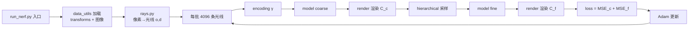

# 第 9 章 代码逐行精读

> 本章把参考实现（`../code/`）的核心代码与论文公式**逐行对应**。建议边读边对照第 3、4、5 章。这里只贴最关键片段，完整代码以仓库为准。

---

## 9.1 位置编码（`nerf/encoding.py`）↔ 论文 Eq.4

$$\gamma(p)=\left(\sin(2^0\pi p),\cos(2^0\pi p),\dots,\sin(2^{L-1}\pi p),\cos(2^{L-1}\pi p)\right)$$

```python
def positional_encoding(x: torch.Tensor, num_freqs: int) -> torch.Tensor:
    """对每个分量应用 γ(p) = [sin(2^k π p), cos(2^k π p)]_{k=0}^{L-1}"""
    freqs = 2.0 ** torch.arange(num_freqs, device=x.device) * math.pi  # [L]
    # x[..., None]  shape [..., 3, 1], freqs shape [L] -> [..., 3, L]
    args = x[..., None] * freqs                                      # [..., 3, L]
    return torch.cat([torch.sin(args), torch.cos(args)], dim=-1).flatten(-2)
    # 返回 shape [..., 3*2L]，例如 L=10 -> 60 维
```

**对应关系**：
- `num_freqs` = 论文的 $L$
- `x[..., None] * freqs` = 计算 $2^k\pi p$
- 先拼 $\sin$ 再拼 $\cos$（论文写作交替排列，等价，维度一致）

---

## 9.2 网络模型（`nerf/model.py`）↔ 论文 §3 + Fig.7

```python
class NeRF(nn.Module):
    def __init__(self, in_dim=60, view_dim=24, hidden=256, num_layers=8,
                 skip_at=4, use_viewdirs=True):
        ...
        # 主干 8 层，每层 256 通道
        self.blocks = nn.ModuleList([
            nn.Linear(in_dim if i == 0 else hidden, hidden)
            for i in range(num_layers)
        ])
        # skip connection：第 5 层（索引 4）输入拼回 γ(x)
        self.skip_connection = nn.Linear(in_dim + hidden, hidden)
        # σ 输出层（无激活，后续 ReLU）
        self.sigma_head = nn.Linear(hidden, 1)
        # 特征向量（256 维）用于颜色分支
        self.feature_head = nn.Linear(hidden, hidden)
        # 方向分支：拼接 γ(d) 后过一层 128
        self.dir_fc = nn.Linear(hidden + view_dim, 128)
        self.rgb_head = nn.Linear(128, 3)   # 末尾 sigmoid
```

**forward 逻辑（与 Fig.7 完全一致）**：

```python
def forward(self, x, view_dirs):
    h = self.blocks[0](x); h = F.relu(h)
    for i, layer in enumerate(self.blocks[1:], start=1):
        if i == self.skip_at:                      # 第 5 层：拼回原始 γ(x)
            h = torch.cat([h, x], dim=-1)
            h = self.skip_connection(h)
        else:
            h = layer(h)
        h = F.relu(h)
    sigma = F.relu(self.sigma_head(h))             # 密度非负（ReLU）
    feature = self.feature_head(h)
    if self.use_viewdirs:
        h = torch.cat([feature, view_dirs], dim=-1)
        h = F.relu(self.dir_fc(h))
    rgb = torch.sigmoid(self.rgb_head(h))          # 颜色压到 [0,1]
    return rgb, sigma
```

**要点**：
- $\sigma$ 在 `view_dirs` 拼接**之前**输出 → 密度与方向无关（多视图一致）
- 颜色分支拼接方向后才输出 → 视角相关
- 训练时对 $\sigma$ 加高斯噪声（真实数据正则化）在 `trainer.py` 中处理

---

## 9.3 分层采样（`nerf/sampling.py`）↔ 论文 Eq.2

$$t_i \sim \mathcal{U}\left[t_n + \tfrac{i-1}{N}(t_f-t_n),\ t_n + \tfrac{i}{N}(t_f-t_n)\right]$$

```python
def stratified_sample(near, far, n_samples, device):
    """把 [near, far] 分成 n 份，每份内均匀随机取一点"""
    bins = torch.linspace(near, far, n_samples + 1, device=device)  # [N+1]
    bin_size = (far - near) / n_samples
    # 每 bin 内随机偏移 [0, bin_size)
    u = torch.rand(*bins.shape[:-1], n_samples, device=device)
    t = bins[..., :-1] + u * bin_size        # t_i ∈ 第 i 个 bin
    return t                                  # [..., N]
```

---

## 9.4 体积渲染（`nerf/render.py`）↔ 论文 Eq.3

$$\hat C=\sum_i T_i(1-e^{-\sigma_i\delta_i})\mathbf c_i,\quad T_i=e^{-\sum_{j<i}\sigma_j\delta_j}$$

```python
def volume_render(rgb, sigma, deltas):
    """rgb [..., N, 3], sigma [..., N, 1], deltas [..., N]"""
    alpha = 1.0 - torch.exp(-sigma[..., 0] * deltas)   # α_i = 1-e^{-σδ}
    transmittance = torch.cumprod(
        1.0 - alpha + 1e-10, dim=-1)                    # 累积透射率 T_i
    transmittance = torch.cat([torch.ones_like(transmittance[..., :1]),
                               transmittance[..., :-1]], dim=-1)  # 前移一位
    weights = transmittance * alpha                     # w_i = T_i α_i
    color = (weights[..., None] * rgb).sum(dim=-2)      # Σ w_i c_i
    return color, weights                               # 颜色 + 权重(供层次采样)
```

**对应关系**：
- `alpha = 1 - exp(-σδ)` = 论文的 $\alpha_i$
- `cumprod(1-alpha)` = $T_i = \prod_{j<i}(1-\alpha_j)$（前移一位使 $T_1=1$）
- `weights = T·α` = 论文 Eq.5 的 $w_i$，**直接复用为层次采样的分布**

---

## 9.5 层次采样（`nerf/sampling.py`）↔ 论文 §5.2

```python
def hierarchical_sample(t_coarse, weights, n_fine, near, far, device):
    """从粗权重分布做逆变换采样，得到 n_fine 个新点"""
    w = weights + 1e-5                          # 数值稳定
    pdf = w / w.sum(dim=-1, keepdim=True)       # 归一化 PDF（论文 \hat w）
    cdf = torch.cumsum(pdf, dim=-1)             # 累计分布
    cdf = torch.cat([torch.zeros_like(cdf[..., :1]), cdf], dim=-1)
    cdf[..., -1] = 1.0
    # 均匀随机 u ∈ [0,1)，逆变换定位 bin
    u = torch.rand(*cdf.shape[:-1], n_fine, device=device)
    idx = torch.searchsorted(cdf, u)            # 每个 u 落在哪个 bin
    # 在选中 bin 内均匀取一点
    lo = torch.gather(t_coarse, -1, idx.clamp(max=t_coarse.shape[-1]-1))
    hi = torch.gather(t_coarse, -1, idx.clamp(min=1) - 1)
    t_fine = lo + torch.rand_like(lo) * (hi - lo)
    return t_fine
```

**要点**：这就是论文"用逆变换采样从粗网络权重构造的 PDF 中抽取细采样点"。注意要处理 `t_coarse` 必须按升序排序、`searchsorted` 的边界。

---

## 9.6 训练循环（`nerf/trainer.py`）↔ 论文 Eq.7

```python
loss_c = F.mse_loss(rgb_c, target)   # ||Ĉ_c - C||²
loss_f = F.mse_loss(rgb_f, target)   # ||Ĉ_f - C||²
loss = loss_c + loss_f               # 同时监督 coarse + fine
```

```python
# 每条光线：
t_coarse = stratified_sample(near, far, Nc, ...)      # 粗采样 64
rgb_c, sigma_c = model(xyz_c, dirs)                   # 粗网络
_, weights = volume_render(rgb_c, sigma_c, deltas)    # 粗渲染 + 权重
t_fine = hierarchical_sample(t_coarse, weights, Nf, ...)  # 细采样 128
t_all = torch.cat([t_coarse, t_fine], -1).sort(-1).values   # 合并排序
rgb_f, sigma_f = model(xyz_all, dirs)                 # 细网络渲染全部点
```

---

## 9.7 读代码的"路线图"



---

## 9.8 动手练习

1. 在 `model.py` 中把 `use_viewdirs=False` 打开，对比渲染是否出现高光丢失。
2. 把 `volume_render` 的 `cumprod` 换成循环，验证数值一致（理解"前移一位"的必要性）。
3. 修改 `stratified_sample` 为确定性均匀采样，观察训练是否震荡（体会"随机化"的意义）。

---

**下一章**：[10_术语表与FAQ.md](10_术语表与FAQ.md) — 术语速查
