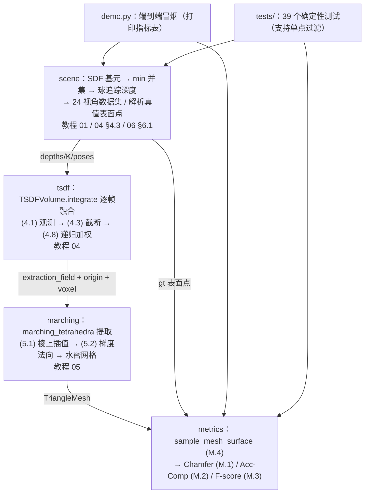

# 3D 重建教学代码库导读（TUTORIAL）

> 零基础基准撰写：不假设读者有机器人学/图形学背景，术语首现给中文通俗解释；
> 深度推导一律外链 [tutorials/3d_reconstruction/](../../tutorials/3d_reconstruction/README.md)
> 各章（重点：[第 04 章 TSDF](../../tutorials/3d_reconstruction/04_RGB-D融合与TSDF.md)、
> [第 05 章 表面提取](../../tutorials/3d_reconstruction/05_从体素到网格表面提取.md)、
> [第 06 章 SDF](../../tutorials/3d_reconstruction/06_学习式形状表示SDF与占据.md)），
> 本文只讲"代码里发生了什么"。
> 姊妹文档：[DEBUG.md](DEBUG.md)（调试与测试）｜ [METRICS.md](METRICS.md)（指标健康值）。

---

## 1. 这个项目做什么

**一句话**：从零实现一条最小 3D 重建管线——合成场景 → 多视角深度图 → TSDF 体素
融合 → Marching Tetrahedra 提取三角网格 → 与真值表面比 Chamfer/F-score——纯 numpy、
无第三方依赖、全定种子，对应教程第 04、05、06 章的可算核心。

**3D 重建**是什么：给定一组带位姿的深度/图像观测，恢复场景的**表面**——一个能回答
"这里有没有东西、朝向哪、离表面多远"三类问题的几何表示（教程
[第 01 章](../../tutorials/3d_reconstruction/01_3D重建问题与表示全景.md) 的"三问"）。
本项目的管线正是教程 (1.4) 三级管线的后两级：

1. **几何估计**（教程 02/03 章）：本项目用合成场景 + 球追踪渲染**造出**深度与真值位姿
   （`scene.py`），跳过多视图匹配——就像 SLAM 教学实现用 `simulate_rectangle` 造里程计；
2. **多视角融合**（教程 [第 04 章](../../tutorials/3d_reconstruction/04_RGB-D融合与TSDF.md)）：
   TSDF 体素网格把逐帧带噪深度融成一个场，`tsdf.py`；
3. **表面提取**（教程 [第 05 章](../../tutorials/3d_reconstruction/05_从体素到网格表面提取.md)）：
   从场里抽出三角网格，`marching.py`（选 Marching Tetrahedra 而非 Marching Cubes，
   理由见 §1 末尾与 README 保真度声明）；
4. **评测**（DTU / Tanks and Temples 惯例）：`metrics.py`。

**教学设计的两条主线**（与 projects/slam 同构）：① 自带合成数据生成器——场景的解析
SDF 让我们拥有**真值表面**（`sample_scene_surface` 的解析投影，误差 ~1e-16 m），
评测不需要下载数据集；② 全部随机性定种子，demo 与测试的每个数字可精确复现——既是
回归测试，也是 DEBUG 时判断"改坏了还是本来就这个数"的锚点。

**为什么选 Marching Tetrahedra 而不是 Marching Cubes**：教程
[5.1 节](../../tutorials/3d_reconstruction/05_从体素到网格表面提取.md) 的标准算法是 MC
（Lorensen & Cline 1987，256 配置 / 15 拓扑类查表），其结构性缺陷是二义面（5.2 节：
局部信息不可判定 → 孔洞风险）。MT 把每个立方体拆成 6 个四面体再查表：四面体只有
2⁴ = 16 种符号配置、每种配置的三角化唯一，16 行手写表 + 向量化核心 ~100 行即可保证
**水密**——这是教学实现"代码量与正确性"的权衡。MC 的三角形约定与歧义分析以教程
5.1–5.2 节说明为准；工业实践中要 MC 时建议直接用 Open3D/vedo 等成熟实现。

---

## 2. 环境与运行

本项目是**纯 numpy** 代码：conda `llm_env`（python 3.10 / numpy 2.2.6 / pytest 9.1.1）
与系统 python3（numpy 1.26.4）**均已实测通过**（39/39），无其他依赖、未用任何
numpy 2.x-only API。

```bash
conda activate llm_env            # 或任意 numpy >= 1.26 的环境（系统 python3 亦可）
python -c "import numpy; print(numpy.__version__)"   # 预期：>= 1.26（llm_env 2.2.6 / 系统 1.26.4）

cd projects/3d_reconstruction     # 必须在本目录运行（原因见 §7 常见问题第 1 条）
python tests/test_scene.py        # 预期：11/11 tests passed.   （~0.15 s）
python demo.py                    # 预期：端到端指标表          （~8 s）
```

逐文件测试命令清单（每条独立可跑；耗时为系统 python3 / numpy 1.26.4 实测，
llm_env 整体相当）：

```bash
cd projects/3d_reconstruction

python tests/test_scene.py        # 11/11 tests passed.    ~0.15 s  （SDF 基元/球追踪/位姿/Eikonal）
python tests/test_tsdf.py         #  8/8 tests passed.     ~0.2  s  （融合/权重/插值/点云）
python tests/test_marching.py     # 10/10 tests passed.    ~1.0  s  （MT 提取/水密/法向）
python tests/test_metrics.py      # 10/10 tests passed.    ~0.1  s  （四指标 + 朴素交叉验证）
```

全局一次跑完（在本目录）：

```bash
cd /home/dzxu/RoboTwinTutorial/projects/3d_reconstruction
python -m pytest tests/ -q
# 预期：39 passed（系统 python3 实测 1.38 s；llm_env 实测 1.40 s）
```

每个测试文件都支持**单点过滤**（传测试名子串，详见 [DEBUG.md](DEBUG.md) §1）：

```bash
python tests/test_marching.py normals   # 预期：2/2 tests passed.（只跑名字含 normals 的测试）
```

---

## 3. 目标输入与输出（最小可运行示例）

以下 5 段片段**每段都实际运行验证过**（输出为确定性复现值）。统一前提：
`cd projects/3d_reconstruction` 后在 Python 交互环境或 `python -c` 中执行。各模块的
输入都是内存中的 numpy 数组（形状/单位随段说明），无文件 I/O。

### 3.1 scene —— SDF 基元与合成场景（教程 01 章 (1.13)/(1.2)、06 章 (6.1)）

输入：查询点 (M, 3)（单位 m）；输出：SDF 值 (M,)（单位 m，**外正内负**、表面为 0）。

```python
import numpy as np
from scene import Sphere, Box, make_demo_scene, sample_scene_surface

sph = Sphere(np.zeros(3), 0.35)                            # 球心 + 半径
box = Box(np.array([0.60, 0.0, 0.0]), np.full(3, 0.15))    # 中心 + 半边长
p = np.array([[0.0, 0.0, 0.35], [0.0, 0.0, 0.0], [0.6, 0.0, 0.15]])
print("sphere.sdf =", sph.sdf(p))
scene = make_demo_scene()                                  # min 并集（球 + 盒）
print("scene.sdf  =", scene.sdf(p))
gt = sample_scene_surface(scene, 4, band=0.05, seed=0)     # 解析真值表面点
print("max |sdf(gt)| =", np.abs(scene.sdf(gt)).max())
```

实测输出：`sphere.sdf = [ 0. -0.35  0.26846584]`（球面上 0 / 球心 -0.35 / 盒面点由
盒主导）、`scene.sdf = [0. -0.35 0.]`、`max |sdf(gt)| = 5.55e-17`（解析投影精确落面）。

### 3.2 scene —— 球追踪深度渲染与数据集（教程 4.3 光线投射）

输入：场景、内参 K (3, 3)（px）、外参 T_wc (4, 4)（相机 → 世界，m/rad）、图像宽高；
输出：深度图 (H, W)（单位 m，无回波 = +inf）与 N 视角数据集 dict。

```python
import numpy as np
from scene import (make_sphere_scene, make_intrinsics, make_orbit_poses,
                   render_depth, render_dataset)

scene = make_sphere_scene(0.35)
K = make_intrinsics(50.0, 50.0, 27.5, 27.5)
T_wc = make_orbit_poses(1, radius=1.6, elevation=0.0)[0]   # 正对球心的相机
depth = render_depth(scene, K, T_wc, 56, 56)
print("center px =", round(depth[27, 27], 4), "m; 解析值 =", 1.6 - 0.35, "m")
print("无回波像素 =", int(np.isinf(depth).sum()))
data = render_dataset(scene, n_views=24, seed=0)           # 上下双环 24 视角 + 噪声
print("views =", len(data["depths"]), ", 有效像素 =",
      int(np.isfinite(data["depths"][0]).sum()))
```

实测输出：`center px = 1.2504 m; 解析值 = 1.25 m`（球追踪在 hit_eps=1e-4 内命中）、
`无回波像素 = 2744`、`views = 24 , 有效像素 = 392`。

### 3.3 tsdf —— 多视角融合与查询（教程 04 章 (4.1)/(4.2)/(4.3)/(4.8)/(4.13)）

输入：深度图 (H, W)（m，无回波 +inf）、内参、外参逐帧 `integrate`；输出体素场
`tsdf / weight`（各 (n, n, n)；tsdf 无量纲 [-1,1]、weight 单位 1/m²）与任意点查询。

```python
import numpy as np
from scene import make_demo_scene, render_dataset
from tsdf import TSDFVolume, depth_to_point_cloud

scene = make_demo_scene()
data = render_dataset(scene, n_views=24, seed=0)
vol = TSDFVolume(np.full(3, -0.8), np.full(3, 0.8), resolution=64)  # voxel=25 mm
for T_wc, depth in zip(data["poses"], data["depths"]):
    vol.integrate(depth, data["K"], T_wc)
print(vol.tsdf.shape, vol.weight.shape, "已观测 =", int((vol.weight > 0).sum()))
q = np.array([[0.0, 0.0, 0.351], [0.0, 0.0, 0.2], [1.0, 1.0, 1.0]])
print("signed_distance(q) =", np.round(vol.signed_distance(q), 4), "m")
pc = depth_to_point_cloud(data["depths"][0], data["K"], data["poses"][0])
print("单视角点云 =", pc.shape)
```

实测输出：`(64, 64, 64) (64, 64, 64) 已观测 = 16177`、
`signed_distance(q) = [0.0127 0.075 0.075] m`（带内线性恢复 + 带外饱和 ±mu）、
`单视角点云 = (578, 3)`。

### 3.4 marching —— Marching Tetrahedra 提取（教程 05 章 (5.1)/(5.2)）

输入：标量场 (n, n, n)（样本在体素中心：原点取 `origin + 0.5·voxel`；NaN = 未观测）、
采样原点 (3,)、体素边长（m）；输出 `TriangleMesh`：顶点 (V, 3)（m）、三角形 (T, 3)
int64、顶点法向 (V, 3)（单位向量，朝外）。

```python
import numpy as np
from scene import make_demo_scene, render_dataset
from tsdf import TSDFVolume
from marching import marching_tetrahedra

scene = make_demo_scene()
data = render_dataset(scene, n_views=24, seed=0)
vol = TSDFVolume(np.full(3, -0.8), np.full(3, 0.8), resolution=64)
for T_wc, depth in zip(data["poses"], data["depths"]):
    vol.integrate(depth, data["K"], T_wc)
mesh = marching_tetrahedra(vol.extraction_field(),        # W=0 -> NaN 权重掩码
                           vol.origin + 0.5 * vol.voxel_size, vol.voxel_size)
print(mesh.vertices.shape, mesh.triangles.shape, mesh.vertex_normals.shape)
```

实测输出：`(15076, 3) (29421, 3) (15076, 3)`。

### 3.5 metrics —— 四个指标（(M.1)-(M.4)，详见 [METRICS.md](METRICS.md)）

输入：估计/真值表面点 (N, 3) 与 (M, 3)（单位 m）；输出标量指标（Chamfer/Acc/Comp
单位 m²，F-score 无量纲）或采样点 (n, 3)。

```python
import numpy as np
from scene import make_demo_scene, sample_scene_surface
from tsdf import TSDFVolume
from marching import marching_tetrahedra
from metrics import chamfer_distance, accuracy_completion, f_score, sample_mesh_surface
from scene import render_dataset

scene = make_demo_scene()
data = render_dataset(scene, n_views=24, seed=0)
vol = TSDFVolume(np.full(3, -0.8), np.full(3, 0.8), resolution=64)
for T_wc, depth in zip(data["poses"], data["depths"]):
    vol.integrate(depth, data["K"], T_wc)
mesh = marching_tetrahedra(vol.extraction_field(),
                           vol.origin + 0.5 * vol.voxel_size, vol.voxel_size)
rec = sample_mesh_surface(mesh.vertices, mesh.triangles, 2000, seed=0)  # (M.4)
gt = sample_scene_surface(scene, 2000, band=0.05, seed=0)
print("chamfer =", round(chamfer_distance(rec, gt), 6), "m^2")            # (M.1)
print("acc/comp =", tuple(round(x, 6) for x in accuracy_completion(rec, gt)))
print("F@0.05 =", round(f_score(rec, gt, 0.05), 4))                       # (M.3)
```

实测输出：`chamfer = 0.000373 m^2`、`acc/comp = (0.000366, 0.000381)`、
`F@0.05 = 0.9957`。**注意采样密度与 tau 的匹配**：本段用 2000 点（平均间距 ~4 cm），
tau 取 50 mm；demo 用 8192 点（间距 ~2 cm），tau 取 20 mm——tau 小于采样间距时
F-score 会被"抽稀"人为压低（见 [DEBUG.md](DEBUG.md) §4 案例 4）。

---

## 4. 数据结构

核心约定：SDF/TSDF 一律**外正内负**（教程 (1.13)/(1.14)）；位姿 T_wc 是
**相机系 → 世界系**（`x_world = R @ x_cam + t`，相机 z 轴为光轴、y 轴向下）；深度图
无回波 = `+inf`。以下全部以代码 docstring 为准。

### 4.1 scene —— 基元与场景（`Sphere` / `Box` / `Plane` / `Scene`）

| 项 | 形状 | 含义 | 单位/取值 |
|----|------|------|-----------|
| `Sphere.center` / `.radius` | (3,) / 标量 | 球心 / 半径 | m / m |
| `Box.center` / `.half_size` | (3,) / (3,) | 盒中心 / 半边长（轴对齐） | m / m |
| `Plane.point` / `.normal` | (3,) / (3,) | 平面过点 / 法向（内部归一化） | m / — |
| `Scene.primitives` | tuple | 基元元组（均有 `sdf` 与 `closest_point`） | — |
| `Scene.bbox_lo / .bbox_hi` | (3,) 各 | 场景包围盒（真值采样的定义域） | m |
| `render_depth(...)` 返回 | (H, W) | 深度图 | m；无回波 = +inf |
| `render_dataset(...)` 返回 | dict | `"K"` (3,3)、`"poses"` list[(4,4)]、`"depths"` list[(H,W)] | px / m, rad / m |
| `sample_scene_surface(...)` 返回 | (n, 3) | 解析真值表面点（投影到最近基元表面） | m；\|sdf\| < 1e-9 |

### 4.2 tsdf —— 体素场（`TSDFVolume`）

| 属性 | 形状 | 含义 | 单位/取值 |
|------|------|------|-----------|
| `resolution` | int | 每轴体素数 n（要求包围盒为立方） | — |
| `voxel_size` | 标量 | 体素边长 | m |
| `origin` | (3,) | 网格原点 = bbox 最小角（体素 (0,0,0) 的角点） | m |
| `mu` | 标量 | 截断带宽（默认 3×voxel，教程 4.1"几个体素尺度"） | m |
| `tsdf` | (n, n, n) | 截断符号距离场 F；未观测处保持初值 +1 | 无量纲，[-1, 1] |
| `weight` | (n, n, n) | 累计权重 W = Σ w_k（w = 1/z²，(4.2)）；0 = 未观测 | 1/m² |
| `extraction_field()` 返回 | (n, n, n) | `tsdf` 的副本，W=0 处置 NaN（权重掩码提取） | 无量纲 / NaN |
| `depth_to_point_cloud(...)` 返回 | (M, 3) | 单帧反投影点云（M = 有效像素数） | m |

样本位置约定：`tsdf[k, j, i]` 位于 `origin + ((i+0.5)·voxel, (j+0.5)·voxel,
(k+0.5)·voxel)`（体素**中心**）；因此把场交给 marching 时原点要平移半个体素
（见 §3.4）。

### 4.3 marching —— 网格（`TriangleMesh`）与提取表

| 项 | 形状 | 含义 | 单位/取值 |
|----|------|------|-----------|
| `TriangleMesh.vertices` | (V, 3) | 顶点（每个"变号棱"恰一个顶点） | m |
| `.triangles` | (T, 3) | 顶点索引，取向统一为外法向 | int64 |
| `.vertex_normals` | (V, 3) | 场梯度方向的单位法向（(5.2)），朝外 | — |
| `MT_TRIANGLES` | dict[0..15] | 16 case → 三角形列表（棱编号三元组）；1/3 个内点 1 个三角形、2 个内点 2 个 | — |
| `_TETS` | (6, 4) | 立方体 6 四面体拆分（共享体对角线 0–7） | — |

### 4.4 metrics —— 指标函数签名

| 函数 | 输入 | 输出 |
|------|------|------|
| `chamfer_distance(P, Q)` | 两点集 (N,3)/(M,3)，m | 标量，m²，≥ 0 |
| `accuracy_completion(est, gt)` | 同上 | (accuracy, completion)，各 m² |
| `f_score(est, gt, tau)` | 同上 + tau（m，> 0） | 标量，无量纲，[0, 1] |
| `sample_mesh_surface(v, f, n, seed=0)` | 顶点 (V,3)、三角形 (T,3)、样本数 n | (n, 3) 表面点，m |

---

## 5. 计算公式

每处给出教程式号 + 代码位置；**推导一律看对应教程章**，此处只标"代码在哪、算的是什么"。

| 模块 | 公式（式号） | 代码位置 |
|------|--------------|----------|
| scene | SDF 外正内负 `s = ±dist(x, S)`（教程 (1.13)）；零水平集即表面（(1.2)） | `scene.py::Sphere.sdf` / `::Box.sdf` / `::Plane.sdf` / `::Scene.sdf`（min 并集） |
| scene | 水平集法向 `n̂ = ∇s/‖∇s‖`（教程 (1.3)）；Eikonal `‖∇s‖ = 1`（教程 (6.1)，测试数值验证） | `tests/test_scene.py::test_eikonal_property_of_analytic_sdf` |
| scene | 球追踪步进 `t ← t + s(o + t·d̂)`（Hart 1996；教程 4.3 节光线投射的自适应版）；深度 = 相机系 z = `t·d̂_z` | `scene.py::render_depth`（主循环） |
| scene | 深度噪声 `σ(z) = c·z²`（教程 (4.2) 的视差误差传播） | `scene.py::render_dataset` |
| scene | 反投影 `p = o + z·[(u−cx)/fx, (v−cy)/fy, 1]`（SLAM 教程 (5.10) 的逆） | `tsdf.py::depth_to_point_cloud` |
| tsdf | 离散观测 `s ≈ z(u) − z_x`（教程 (4.1) 的体素观测式） | `tsdf.py::TSDFVolume.integrate` |
| tsdf | 逆方差权重 `w = 1/z(u)²`（教程 (4.2)：σ∝z² ⇒ w∝1/σ²） | 同上 |
| tsdf | 截断 `F = clip(s/μ, −1, 1)`（教程 (4.3)/(1.14)），带外不写入（教程 4.2 第六步） | 同上（`f_obs` / `band`） |
| tsdf | 极大似然 = 逆方差加权（教程 (4.6)）与递归形式 `F ← (W·F + w·f)/(W + w)`（教程 (4.8)，Curless–Levoy / KinectFusion 融合式） | 同上（`w_new` / `f_new` 两行） |
| tsdf | 三线性插值（教程 (4.13)/(1.15)，凸组合、跨体素连续）；截断符号距离 = F·μ | `tsdf.py::TSDFVolume.sample_tsdf` / `::signed_distance` |
| tsdf | 权重掩码提取：W=0 → NaN（未知区不参与等值面，防幽灵内壁；KinectFusion 实践） | `tsdf.py::TSDFVolume.extraction_field` |
| marching | 16 = 2⁴ 符号配置；1/3 内点 1 三角形、2 内点四边形拆 2 三角形（四面体无二义性，教程 5.1 ③(b)） | `marching.py::MT_TRIANGLES` |
| marching | 棱上交点 `t = fₐ/(fₐ − f_b)`（教程 (5.1)） | `marching.py::marching_tetrahedra`（`tt = ...` 行） |
| marching | 顶点法向 `n̂ = ∇F/‖∇F‖`，梯度取中心差分（教程 (5.2)） | 同上（`np.gradient` 段；注意轴序 z,y,x → x,y,z 翻转） |
| marching | 顶点去重键 = 有序格点对（全局棱唯一 → 水密）；取向：面法向与梯度同侧（(1.3)/(1.13)） | 同上（`edge_keys` / `flip` 段） |
| metrics | 对称 Chamfer（式 (M.1)；Barrow et al. 1977 起源） | `metrics.py::chamfer_distance` |
| metrics | accuracy / completion（式 (M.2)；DTU，Jensen et al. 2014） | `metrics.py::accuracy_completion` |
| metrics | F-score@τ（式 (M.3)；Knapitsch et al. 2017，DTU/Tanks and Temples） | `metrics.py::f_score` |
| metrics | 面积加权表面采样（式 (M.4)；蒙特卡洛表面积分） | `metrics.py::sample_mesh_surface` |

---

## 6. 函数流水线

依赖方向如实取自 import 关系：`tsdf` / `marching` / `metrics` 互相独立、只依赖 numpy
（`tsdf` 与 `marching` 之间只共享"场数组 + 原点 + 体素"的数据约定）；`scene` 是数据
源头；`demo.py` 与 `tests/` 组装全管线。箭头 = 数据流。



一次典型阅读路径（与教程学习路径一致）：`scene.py`（01 章 SDF 是什么）→
`tsdf.py`（04 章融合推导的代码化）→ `marching.py`（05 章提取）→ `metrics.py`
（怎么量化"重建得好"）→ `demo.py`（串起来）。

---

## 7. 常见问题

**Q1：`ModuleNotFoundError: No module named 'scene'`（或 tsdf / marching / metrics）**
三个原因，按概率排查：① 工作目录不在 `projects/3d_reconstruction`——所有顶层模块
都以本目录为根，`cd projects/3d_reconstruction` 后再运行；② 用
`python /path/to/demo.py` 从别处跑——`sys.path[0]` 是**脚本所在目录**而非当前目录，
此时脚本目录就是模块目录、应当能跑；若从 tests/ 之外的自写脚本 import 失败，在脚本
开头加 `sys.path.insert(0, "/home/dzxu/RoboTwinTutorial/projects/3d_reconstruction")`
（tests/ 下的文件已这么做，可照抄）；③ VS Code 里 import 标红线——从仓库根打开窗口
并 Reload（`extraPaths` 生效，见 [.vscode/SETUP.md](../../.vscode/SETUP.md)）。

**Q2：pytest 与直跑两种方式怎么选？**
直跑（`python tests/test_X.py [子串]`）零依赖 pytest、自带单点过滤与友好的失败
回溯，适合快速迭代；pytest（`pytest tests/ -q` 或 `pytest tests/test_marching.py::test_mesh_is_closed_every_edge_shared_by_two_triangles`）
能被 VS Code Testing 侧栏发现、支持 `-k` 表达式，适合提交前回归。两种方式跑的是
同一批函数，结果一致。

**Q3：为什么 demo 重建的 F-score 不是 1？还有 ~1 cm 的误差从哪来？**
三个来源，量级都可解析估计：① 深度噪声 σ(z)=0.002·z² ≈ 5 mm @ z≈1.6 m（(4.2)）；
② 体素离散化 + MT 线性插值 ≈ voxel/10 ≈ 2.5 mm（球面实测 mean|r−1| = 0.45 mm）；③
像素最近邻对齐的量化噪声。合成后 RMS ≈ 1.1 cm，对应 Chamfer ≈ 1.3e-4 m²——这就是
demo 实测值（METRICS.md §1-§2），显著偏离该量级才说明有 bug。

**Q4：为什么提取要用 `extraction_field()` 而不是直接给 `tsdf`？**
未观测体素以 (F=+1, W=0) 初始化。直接提取时，"观测带内边界（F≈−1）与未知区（+1）"
的过渡本身是一个符号变化面 → 在物体内部生成一层**幽灵内壁**，Chamfer 会从 ~1.3e-4
恶化到 ~1e-3（实测）。`extraction_field()` 把 W=0 置 NaN，`marching_tetrahedra`
跳过含 NaN 角点的四面体——即 KinectFusion 实践中的权重阈值提取。

**Q5：参数怎么调（调参方向速查）？**
`resolution`（TSDF）：内存 = n³×16 字节，64³ ≈ 4 MB；精度 ≈ voxel/10，越细越准越慢；
`mu`：默认 3×voxel，加大更抗噪但表面更"圆"、细节丢失（教程 4.1 的两个依据）；
`depth_noise_coeff`：0 = 无噪声（几何自检）；`n_views`：16 → 24 显著补全背面，再多
收益递减；`F_SCORE_TAU`：应 ≥ 2×评测点云的平均采样间距（§3.5 的密度陷阱）；
`HIT_EPS / T_MAX / MAX_STEPS`（球追踪）：深度图出现"半月形"空洞时优先查 T_MAX
是否小于相机到场景的距离。

**Q6：numpy 版本差异会影响结果吗？**
`llm_env`（numpy 2.2.6 / pytest 9.1.1）与系统 python3（1.26.4）全部 39 个测试均通过，
demo 指标在打印末位（~2e-6 m²）内一致——本项目没有 SVD/特征分解这类版本敏感路径，
残差来自 BLAS 求和顺序的微小差异经"最近邻并列选择"（Chamfer/F-score 的 min 操作）
放大，属浮点正常现象；**同一环境内重跑则逐位可复现**。测试阈值（1e-10 级交叉验证
除外，均为同类实现对比）远大于该量级。唯一注意：双环境都要 numpy ≥ 1.26
（`np.random.default_rng` 的 `choice(p=...)` 等接口在更老版本行为不同）。

更多排障与断点技巧：[DEBUG.md](DEBUG.md)；指标健康值：[METRICS.md](METRICS.md)。
