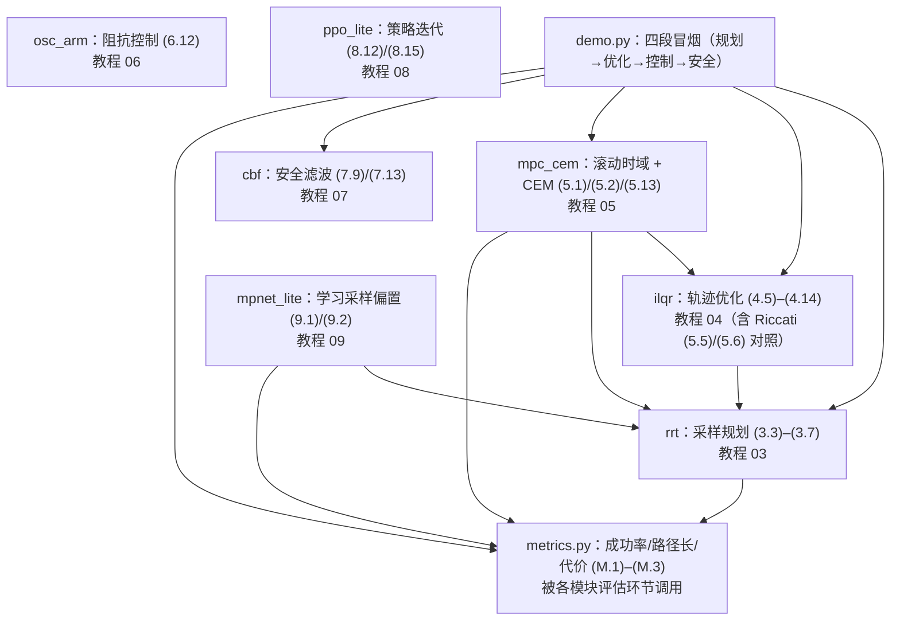

# 控制与规划教学代码库导读（TUTORIAL）

> 零基础基准撰写：不假设读者有机器人学/控制背景，术语首现给中文通俗解释；
> 深度推导一律外链 [tutorials/control_planning/](../../tutorials/control_planning/README.md) 各章，
> 本文只讲"代码里发生了什么"。
> 姊妹文档：[DEBUG.md](DEBUG.md)（调试与测试）｜ [METRICS.md](METRICS.md)（指标健康值）。

---

## 1. 这个项目做什么

**一句话**：把 7 个经典控制/规划算法写成能跑的教学代码——纯 numpy、
无任何第三方控制/规划库，每个模块对应教程一章，`tests/` 里每个模块都有
可直接运行、全定种子的端到端验证。

**控制与规划**在机器人栈里的位置：给定"从 A 到 B 并完成任务"，先由
**规划**（第 03 章）在带障碍的空间里找一条可行路径，再由**轨迹优化**
（第 04 章）把它变成"走得好"的轨迹，**模型预测控制**（第 05 章）在线滚动
执行并吸收扰动，**安全滤波**（第 07 章）兜底保证永不撞，**阻抗控制**
（第 06 章）决定末端"手感"，**强化学习**（第 08 章）则用交互数据直接学出
策略。本项目沿这条主线各取一个最小核心算法：

| 论文 | 模块（文件） | 核心机制 | 教程章 |
|------|--------------|----------|--------|
| RRT（LaValle, TR 98-11）/ RRT*（Karaman & Frazzoli, IJRR 2011） | `rrt.py` | 随机树 + 选父/重布线的渐近最优采样规划 | [03 运动规划 I](../../tutorials/control_planning/03_运动规划-i采样式规划.md) |
| DDP（Jacobson & Mayne 1970）/ iLQG（Tassa et al., ICRA 2012） | `ilqr.py` | 反向递推 + 前向回滚的轨迹优化 | [04 轨迹优化与最优控制](../../tutorials/control_planning/04_轨迹优化与最优控制.md) |
| PETS（Chua et al., NeurIPS 2018）已知动力学简化档 | `mpc_cem.py` | 滚动时域 + 交叉熵方法（无梯度采样优化） | [05 模型预测控制](../../tutorials/control_planning/05_模型预测控制mpc.md) |
| CBF 综述（Ames et al., ECC 2019） | `cbf.py` | 逐周期 QP 把期望控制"掰"进安全集合 | [07 安全控制](../../tutorials/control_planning/07_安全控制控制屏障函数.md) |
| Khatib（IEEE JRA 1987）/ Hogan（J-DSC 1985） | `osc_arm.py` | 任务空间阻抗控制（末端 = 弹簧-阻尼） | [06 操作空间控制与阻抗控制](../../tutorials/control_planning/06_操作空间控制与阻抗控制.md) |
| PPO（Schulman et al., 2017）/ GAE（Schulman et al., 2016） | `ppo_lite.py` | 截断代理目标的 on-policy 策略迭代 | [08 学习式控制](../../tutorials/control_planning/08_学习式控制强化学习.md) |
| MPNet（Qureshi et al., ICRA 2019） | `mpnet_lite.py` | 学习式采样偏置：网络建议点 + 经典 RRT 兜底 | [09 前沿学习式规划](../../tutorials/control_planning/09_前沿学习式规划与腿式控制.md) |
| ——（统一评估） | `metrics.py` | 成功率 / 路径长度 / 轨迹代价 | [METRICS.md](METRICS.md) |

**教学设计的两条主线**：① 被控对象统一为两套可手推的系统——**2D 双积分器**
（点质量：状态 `[x, y, vx, vy]`、控制 `[ax, ay]`，即"牛顿第二定律"的离散版）
与**平面 2R 机械臂**——简单到能解析验证（iLQR 对 Riccati 解、雅可比对中心
差分），复杂到能演示全部算法结构；② 全部场景定随机种子，每个测试的输出
数字可精确复现——这既是回归测试，也是 DEBUG 时判断"改坏了还是本来就
这个数"的锚点。

---

## 2. 环境与运行

本项目是**纯 numpy** 代码：conda `llm_env` 与系统 python3（numpy ≥ 1.26）
均已验证通过（53/53 测试，见 [.vscode/SETUP.md](../../.vscode/SETUP.md)），无其他依赖。

```bash
conda activate llm_env            # 或任意 numpy >= 1.26 的环境（系统 python3 亦可）
python -c "import numpy; print(numpy.__version__)"   # 预期：>= 1.26（llm_env 2.2.6 / 系统 1.26.4）

cd projects/control_planning      # 必须在本目录运行（原因见 §7 常见问题第 1 条）
python tests/test_rrt.py          # 预期：7/7 tests passed.   （~5.6 s）
```

逐文件测试命令清单（每条独立可跑；耗时在 llm_env / numpy 2.2.6 上实测，
系统 python3 / numpy 1.26.4 总体相当）：

```bash
cd projects/control_planning

python tests/test_metrics.py      #  7/7 tests passed.    ~0.1 s   （统一指标）
python tests/test_ilqr.py         #  7/7 tests passed.    ~0.2 s   （iLQR + Riccati 交叉验证）
python tests/test_osc_arm.py      #  7/7 tests passed.    ~0.3 s   （2R 臂 + 阻抗控制）
python tests/test_cbf.py          #  6/6 tests passed.    ~1.0 s   （CBF 安全滤波）
python tests/test_mpc_cem.py      #  6/6 tests passed.    ~4.4 s   （CEM-MPC）
python tests/test_rrt.py          #  7/7 tests passed.    ~5.6 s   （RRT / RRT*）
python tests/test_ppo_lite.py     #  6/6 tests passed.   ~19.9 s   （微型 PPO）
python tests/test_mpnet.py        #  7/7 tests passed.    ~1.4 s   （MPNet 采样偏置；系统 python3 ~4.2 s）
```

全局一次跑完（在仓库根目录）：

```bash
cd /home/dzxu/RoboTwinTutorial    # 仓库根
python -m pytest projects/control_planning/tests -v
# 预期：53 passed（llm_env 约 33 s；系统 python3 约 39 s）
```

每个测试文件都支持**单点过滤**（传测试名子串，详见 [DEBUG.md](DEBUG.md) §1）：

```bash
python tests/test_cbf.py projection   # 预期：1/1 tests passed.（只跑名字含 projection 的测试）
```

核心入口冒烟（四段演示，规划→优化→控制→安全，约 11 s）：

```bash
python demo.py    # 打印对齐表格：RRT*/iLQR/CEM-MPC/CBF 的健康值
```

---

## 3. 目标输入与输出（最小可运行示例）

以下 8 段片段**每段都实际运行验证过**（输出为确定性复现值）。统一前提：
`cd projects/control_planning` 后在 Python 交互环境或 `python -c` 中执行。
各模块的输入都是内存中的 numpy 数组（形状/单位随段说明），无文件 I/O。

### 3.1 rrt —— 采样式规划（教程 03）

输入：起点/目标 (2,)（m）、圆障碍列表 `[(center (2,), radius)]`、边界
`(xmin, xmax, ymin, ymax)`；输出 `PlanResult`：树数组 + 可行路径 + 代价。

```python
import numpy as np
from rrt import plan_rrt_star, make_corridor_obstacles
from metrics import path_length

obstacles = make_corridor_obstacles()      # 10x10 场地中部带缺口的圆墙（5 个 r=1 圆）
res = plan_rrt_star(np.array([0.5, 0.5]), np.array([9.0, 6.0]),
                    obstacles, (0.0, 10.0, 0.0, 10.0), seed=0, max_iters=6000)
print("success =", res.success)
print("cost    =", round(res.cost, 3))
print("path    =", res.path.shape, "->", round(path_length(res.path), 3), "m")
```

实测输出：`success = True`、`cost = 10.741`、`path = (31, 2) -> 10.741 m`
（同 seed 的普通 RRT 代价 12.5——RRT* 的重布线把首条折线剪短了 ~14%）。

### 3.2 ilqr —— 轨迹优化（教程 04）

输入：初态 (4,)（m, m/s）、控制初值 (N, 2)（m/s²）、`ReachCost` 代价结构、
步长 dt；输出 `ILQRResult`：标称轨迹 (N+1, 4)、控制 (N, 2)、反馈增益
K_fb (N, 2, 4) 与逐迭代代价。

```python
import numpy as np
from ilqr import ReachCost, ilqr_solve

cost = ReachCost(w_u=0.05, goal=np.array([9.0, 6.0]), w_goal=200.0, w_vf=5.0,
                 waypoint=(30, np.array([5.0, 6.0])), w_wp=200.0)   # 中途路标 = 走廊缺口
res = ilqr_solve(np.array([0.5, 0.5, 0.0, 0.0]), np.zeros((60, 2)), cost, dt=0.1)
print("J:", round(res.costs[0], 1), "->", round(res.costs[-1], 3),
      "| iters:", res.n_iters, "| converged:", res.converged)
print("terminal pos err = %.4f m" % np.linalg.norm(res.x_traj[-1, :2] - cost.goal))
print("waypoint err     = %.4f m" % np.linalg.norm(res.x_traj[30, :2] - cost.waypoint[1]))
print("K_fb shape =", res.K_fb.shape)
```

实测输出：`J: 30600.0 -> 6.331 | iters: 11 | converged: True`、
`terminal pos err = 0.0023 m`、`waypoint err = 0.0062 m`、`K_fb shape = (60, 2, 4)`。

### 3.3 mpc_cem —— 滚动时域控制（教程 05）

输入：初态 (4,)、目标 (2,)、障碍列表（与 rrt 同一口径）；输出 `MPCResult`：
实际轨迹 (T+1, 4)、执行的控制 (T, 2)、最小净距与终端误差。

```python
import numpy as np
from mpc_cem import cem_mpc_rollout, make_reach_scene

scene = make_reach_scene()
res = cem_mpc_rollout(np.array([0.5, 0.5, 0.0, 0.0]), scene["goal"],
                      scene["obstacles"], seed=3)
print("final_pos_err = %.3f m" % res.final_pos_err)
print("min_dist      = %.3f m" % res.min_dist)
print("traj shape    =", res.traj.shape, "| plans =", len(res.plans))
```

实测输出：`final_pos_err = 0.071 m`、`min_dist = 0.580 m`、
`traj shape = (81, 4) | plans = 80`（执行噪声 σ=0.05 下全程无碰撞）。

### 3.4 cbf —— 安全滤波（教程 07）

输入：恒定期望控制 (2,)（"直冲障碍"）、状态 (4,)、障碍列表；输出
`CBFSimResult`：轨迹、实际执行的控制、全程最小 h 与最小净距。

```python
import numpy as np
from cbf import simulate_filtered

obstacle = [(np.array([2.4, 0.0]), 0.5)]
x0 = np.array([0.0, 0.0, 1.5, 0.0])
raw = simulate_filtered(x0, np.array([1.2, 0.0]), obstacle, dt=1e-3, n_steps=6000, filtered=False)
safe = simulate_filtered(x0, np.array([1.2, 0.0]), obstacle, dt=1e-3, n_steps=6000, filtered=True)
print("raw : min_dist = %+.3f m, min_h = %+.3f m" % (raw.min_dist, raw.min_h))
print("safe: min_dist = %+.4f m, min_h = %+.1e m" % (safe.min_dist, safe.min_h))
```

实测输出：`raw : min_dist = -0.499 m, min_h = -1.630 m`（撞入）、
`safe: min_dist = +0.0000 m, min_h = -5.4e-16 m`（贴着安全边界停住，
h ≥ 0 保持——"无滤波撞入 / 有滤波安全"的活体对照）。

### 3.5 osc_arm —— 平面 2R 臂（教程 06）

输入：关节角 (2,)（rad）、目标位置 (2,)（m）、阻抗增益 (2,2)；输出：末端
位置 (2,)、雅可比 (2,2)、IK 解与力矩 (2,)。

```python
import numpy as np
from osc_arm import PlanarArm, dls_ik, impedance_torque, numeric_jacobian

arm = PlanarArm()
print("fk([0.3, 0.6]) =", np.round(arm.fk(np.array([0.3, 0.6])), 4))
J_a = arm.jacobian(np.array([0.4, -0.7]))
J_n = numeric_jacobian(arm, np.array([0.4, -0.7]))   # 中心差分对照
print("jac check:", np.abs(J_a - J_n).max())
q, err, hist = dls_ik(arm, np.array([0.3, 0.6]), np.array([0.8, 0.5]))
print("ik err = %.2e in %d iters" % (err, len(hist)))
tau = impedance_torque(arm, q, np.zeros(2), np.array([0.8, 0.5]), np.zeros(2),
                       80.0*np.eye(2), 30.0*np.eye(2))
print("tau (hold pose) =", np.round(tau, 4))
```

实测输出：`fk([0.3, 0.6]) = [1.4526 0.9222]`、`jac check: 5.15e-11`、
`ik err = 2.80e-10 in 6 iters`、`tau (hold pose) = [13.4077 -0.701]`
（持住当前位形所需力矩 ≈ 重力项）。

### 3.6 ppo_lite —— 微型强化学习（教程 08）

输入：无（环境/策略自包含）；`train` 输出策略参数与逐轮平均回报。

```python
import numpy as np
from ppo_lite import train, PointMassReachingEnv, policy_mean

params, hist = train(seed=0)     # 默认 120 轮 × 32 回合（~2.5 s）
print("return: %.2f -> %.2f (%.1fx)" % (hist[0], hist[-1], hist[0]/hist[-1]))
env = PointMassReachingEnv()
obs = env.reset()
for _ in range(env.n_steps):
    obs, r, _ = env.step(obs, policy_mean(params, obs[None, :])[0])   # 均值动作
print("greedy final err = %.4f m" % np.linalg.norm(obs[:2] - env.goal))
```

实测输出：`return: -39.75 -> -9.53 (4.2x)`、`greedy final err = 0.0838 m`
（学到的线性策略 ≈ PD 律 kp·e − kd·v，接近手工 PD 的 −8.9 量级）。

### 3.7 mpnet_lite —— 学习式采样偏置（教程 09）

输入：无文件 I/O（训练数据 = `rrt.plan_rrt` 在 40 个随机环境在线解出的
路径中间点）；`train_mpnet` 输出偏置网络与蒸馏损失曲线；`plan_rrt_biased`
以概率 `p_bias` 用网络建议点代替均匀采样（`p_bias=0` 即均匀对照臂）。

```python
import numpy as np
from mpnet_lite import make_random_env, plan_rrt_biased, train_mpnet

params, hist = train_mpnet(seed=0)      # 在线专家数据（rrt.py 解 40 个随机环境）+ 训练（~4 s）
print("distill loss (9.2): %.4f -> %.4f" % (hist[0], hist[-1]))
uni_all, bias_all = [], []
for env_seed in (101, 102, 103, 104):   # 训练未见过的随机环境（泛化口径）
    start, goal, obstacles = make_random_env(seed=env_seed)
    for plan_seed in (0, 1):
        uni = plan_rrt_biased(start, goal, obstacles, (0.0, 10.0, 0.0, 10.0),
                              params, p_bias=0.0, seed=plan_seed)
        bias = plan_rrt_biased(start, goal, obstacles, (0.0, 10.0, 0.0, 10.0),
                               params, p_bias=0.5, seed=plan_seed)
        uni_all.append(uni.n_iters)
        bias_all.append(bias.n_iters)
print("iters: uniform %.1f vs biased %.1f (ratio %.2f)"
      % (np.mean(uni_all), np.mean(bias_all), np.mean(bias_all) / np.mean(uni_all)))
```

实测输出：`distill loss (9.2): 2.6111 -> 0.1082`、
`iters: uniform 109.4 vs biased 86.0 (ratio 0.79)`（建议点让 RRT 的平均
求解迭代数降到 ~79%，且 8 组逐配对全部不劣于均匀臂；网络建议点的自由
空间比率 0.938 vs 均匀采样 0.868，见 tests/test_mpnet.py）。

### 3.8 metrics —— 统一评估（[METRICS.md](METRICS.md)）

输入：轨迹 list[(N, 2)] 或 (N, 2)（m）、目标 (2,)、障碍列表、容差（m）；
输出标量指标。

```python
import numpy as np
from metrics import success_rate, path_length, trajectory_cost

goal = np.array([3.0, 0.0]); obst = [(np.array([0.0, 0.0]), 0.5)]
t = np.linspace(0.0, 1.0, 50)[:, None]
hit = (1.0 - t) * np.array([0.9, 0.9]) + t * goal          # 命中
collide = np.hstack([t * 3.0, 0.5 - t])                    # 穿过障碍
miss = np.hstack([t * 3.0, 1.0 + 0.0 * t])                 # 未达
print("success_rate =", success_rate([hit, collide, miss], goal, obst, tol=0.1))
print("path_length  =", round(path_length(hit), 4), "m")
u = np.tile(np.array([[0.5, -0.2]]), (49, 1))              # 常值控制
print("traj_cost    =", round(trajectory_cost(hit, u, dt=0.1), 4))
```

实测输出：`success_rate = 0.3333333333333333`（命中/碰撞/未达各 1）、
`path_length = 2.2847 m`、`traj_cost = 1.421`。

---

## 4. 数据结构

核心约定：平面世界系 (x, y)（m）；双积分器状态 `x = [px, py, vx, vy]`
（m, m/s）、控制 `u = [ax, ay]`（m/s²）；关节角 q = (θ1, θ2)（rad）。
以下全部以代码 docstring 为准。

### 4.1 rrt —— 树与结果（`PlanResult`）

| 属性 | 形状 | 含义 | 单位/取值 |
|------|------|------|-----------|
| `nodes` | (n, 2) | 全部树节点构型，第 0 行恒为起点 | m |
| `parent` | (n,) | 父节点下标，根为 -1（重布线后父可后于子） | — |
| `node_costs` | (n,) | 各节点代价 (3.5)（根到该点的折线长） | m |
| `cost` | 标量 | 路径代价 = `node_costs[goal_idx]`；失败为 nan | m |
| `path` | (K, 2) | 起点 → 目标邻域的可行路径；失败为 None | m |
| `success` / `goal_idx` / `n_iters` | 标量/int | 是否成功 / 目标节点下标 / 采样轮数 | — |

### 4.2 ilqr —— 代价结构与结果（`ReachCost` / `ILQRResult`）

| 项 | 形状 | 含义 | 单位/取值 |
|----|------|------|-----------|
| `ReachCost.w_u / w_goal / w_vf / w_wp` | 标量 | 控制功效 / 终端位置 / 终端速度 / 路标点权重 | 无量纲缩放 |
| `ReachCost.waypoint` | `(int, (2,))` 或 None | 路标步下标与位置 | m |
| `ILQRResult.x_traj` | (N+1, 4) | 标称状态轨迹（含初态，精确满足动力学） | m, m/s |
| `.u_traj` | (N, 2) | 标称控制序列 | m/s² |
| `.k_ff` / `.K_fb` | (N, 2) / (N, 2, 4) | 前馈修正 k 与反馈增益 K（(4.11)） | m/s², 1/s |
| `.costs` | (iters+1,) | 逐迭代总代价（第 0 项为初值） | — |
| `.mu_hist` / `.ratio_hist` | list | 正则化 μ 更新史 / 接受步增益比（DEBUG 表 I-2/I-3） | — |

### 4.3 mpc_cem —— 计划与执行（`CEMPlanResult` / `MPCResult`）

| 项 | 形状 | 含义 | 单位 |
|----|------|------|------|
| `CEMPlanResult.u_seq / mean` | 各 (H, 2) | 精英均值动作序列（首步即执行量）/ 搜索分布均值 | m/s² |
| `.sigma_trace` | (n_iters,) | 每轮精英方差迹的逐时刻均值（收缩仪表） | (m/s²)² |
| `.elite_cost_mean` | (n_iters,) | 每轮精英集平均代价（收敛仪表） | — |
| `MPCResult.traj` | (T+1, 4) | 实际状态轨迹（含执行噪声） | m, m/s |
| `.u_applied` | (T, 2) | 实际执行的首步控制 | m/s² |
| `.min_dist / .final_pos_err` | 标量 | 全程最小净距 / 终端误差 | m |
| `.plans` | list[T] | 各周期 CEM 解的代价（DEBUG 表 M-3） | — |

### 4.4 cbf —— 屏障与滤波（`barrier_affine` / `cbf_filter` / `CBFSimResult`）

| 项 | 形状 | 含义 | 单位/取值 |
|----|------|------|-----------|
| `barrier_affine` 返回 | (h, L_fh, L_gh) | 屏障值（m）、漂移李导数（m/s）、输入李导数 (2,) | 见 (7.7) |
| `cbf_filter` 返回 `u_safe` | (2,) | 滤波后控制（u_des 已安全时不变） | m/s² |
| `info["h"] / ["A"] / ["b"]` | (k,) / (k,2) / (k,) | 各障碍屏障值 / 约束行 / 约束常数（(7.9) 移项） | — |
| `info["viol_before/after"] / ["du_norm"]` | 标量 | 修改前/后最大违反、修改量范数 | m/s² |
| `CBFSimResult.traj / u_applied / u_des_seq` | (T+1,4) / (T,2) / (T,2) | 状态轨迹 / 实际控制 / 期望控制 | m, m/s² |
| `.min_h / .min_dist / .viol_resid` | 标量 / (T,) | 全程最小屏障值 / 最小净距 / 逐步投影残余 | m |

### 4.5 osc_arm —— 机械臂（`PlanarArm`）

| 项 | 形状 | 含义 | 单位/取值 |
|----|------|------|-----------|
| `PlanarArm` 参数 | 标量 ×7 | l1/l2 连杆长、m1/m2 质量、lc1/lc2 质心距、I1/I2 转动惯量 | m, kg, kg·m² |
| `fk(q)` | (2,) | 末端位置 | m |
| `jacobian(q)` | (2, 2) | 位置雅可比 ∂f/∂q（教程 (6.3)） | m/rad |
| `mass_matrix(q)` | (2, 2) | 关节惯性阵 M ≻ 0（(6.2)） | kg·m² |
| `gravity(q) / coriolis_torque(q, dq)` | (2,) | 重力 / 科氏离心力矩 | N·m |
| `dls_ik` 返回 | (q, err, hist) | 解 (2,)（rad）、终端误差（m）、逐迭代误差 | — |
| `simulate_impedance` 返回 | (q_traj, x_traj) | 各 (T+1, 2)：关节与末端轨迹 | rad, m |

### 4.6 ppo_lite —— 策略与批次（`PolicyParams` / rollout dict）

| 项 | 形状 | 含义 | 单位/取值 |
|----|------|------|-----------|
| `PolicyParams.W / b` | (2, 6) / (2,) | 策略均值线性阵与偏置（μ = Ws + b） | 混合 |
| `.log_std` | (2,) | 高斯对数标准差（σ = exp(log_std)，train 默认冻结） | 无量纲 |
| `.v_w / .v_c` | (8,) / 标量 | 值函数系数（作用于 `value_features` 的 8 维特征）与偏置 | — |
| 观测 obs | (6,) | `[px, py, vx, vy, ex, ey]`（e = g − p 相对误差） | m, m/s |
| rollout dict | — | `obs (T,6)`、`act (T,2)`、`logp (T,)`、`reward (T,)`、`value (T,)`、`last_obs (6,)` | — |
| `compute_gae` 返回 | (T,) ×2 | 优势估计 Â 与价值回归目标 returns = Â + V | — |

### 4.7 mpnet_lite —— 偏置网络与编码（`MLPParams` / 编码与建议点）

| 项 | 形状 | 含义 | 单位/取值 |
|----|------|------|-----------|
| `MLPParams.W1 / b1` | (4+k², H) / (H,) | 输入→隐层权重与偏置（tanh 隐层；默认 k=16、H=32） | 混合 |
| `.W2 / .b2` | (H, 2) / (2,) | 隐层→输出（建议的下一采样点偏移） | m |
| `sdf_grid` 返回 | (k²,) | 障碍的粗 SDF 网格编码（[-1,1]，负 = 格心在障碍内；替代 Enet） | 无量纲 |
| `make_inputs` 返回 | (N, 4+k²) | 输入批 = (当前点/s, 目标点/s, SDF 编码)，s = 工作空间对角线 | 混合 |
| `plan_rrt_biased` 返回 | — | 复用 rrt 的 `PlanResult`（树 + 路径 + 代价 + `n_iters`） | 同 rrt |
| `train_mpnet` 返回 | (params, history) | 权重与蒸馏损失曲线（长度 = epochs+1） | — |

### 4.8 metrics 的公共结构

| 项 | 形状 | 含义 |
|----|------|------|
| 轨迹输入 | (N, 2) 或 (N, 4) | 位置序列（(N, 4) 自动取前两维），单位 m，N ≥ 2 |
| 控制输入 | (N-1, 2) | 与状态同网格的加速度序列，单位 m/s² |
| 障碍列表 | list[((2,), float)] | 圆心 + 半径（点机器人口径），单位 m |

---

## 5. 计算公式

每处给出教程式号 + 代码函数名；**推导一律看对应教程章**，此处只标"代码在哪、
算的是什么"。

| 模块 | 公式（式号） | 代码位置 |
|------|--------------|----------|
| rrt | steer 限步长 $q_{new} = q_{near} + \min(\epsilon, \lVert q_{rand}-q_{near}\rVert)\hat d$（式 3.3） | `rrt.py::steer` |
| rrt | 增量碰撞检测 / motion validation（式 3.4；穿隧口径 3.10） | `::segment_free` / `::segments_free_batch` |
| rrt | 节点代价递归 $c(v) = c(parent) + \lVert q_v - q_{parent}\rVert$（式 3.5）与单调性（3.6） | `::_plan_core`（重布线子树传播） |
| rrt | 收缩半径 $r(n) = \min\{\gamma(\log n / n)^{1/d}, \eta\}$（式 3.7，Theorem 38） | `::neighbor_radius` / `::gamma_constant` |
| rrt | goal bias 期望等待 1/p_g（式 3.11） | `::_plan_core`（采样分支） |
| ilqr | 离散 OCP（式 4.5）：`x+ = f(x,u)`、$J = \sum \ell + \ell_f$ | `ilqr.py::double_integrator_step` / `::ReachCost` |
| ilqr | Q 函数四块（式 4.8–4.9）与 DDP 二阶项差异（4.10，docstring 注） | `::ilqr_solve` 反向扫 |
| ilqr | 仿射反馈 $\delta u = k + K\delta x$（式 4.11）与阻尼逆 $(Q_{uu}+\mu I)^{-1}$（4.14） | `::ilqr_solve`（`k_ff / K_fb / mu`） |
| ilqr | 前向回滚（式 4.13）与预期下降 ΔV（配方法） | `::ilqr_solve` 前向扫 |
| ilqr | Riccati 递推 (5.5) 与代数 Riccati (5.6)（iLQR 的线性特例交叉验证） | `::riccati_lqr` / `::riccati_fixed_point` |
| mpc_cem | 滚动时域 OCP (5.1) 与状态反馈策略 (5.2) | `::cem_mpc_rollout`（测量→重解→执行首步） |
| mpc_cem | 候选评分（式 5.11；已知动力学档 λ=0，对照 5.12） | `::candidate_cost` |
| mpc_cem | 精英重分布（式 5.13，方差加下限） | `::cem_plan` |
| cbf | 控制仿射分解与李导数展开（式 7.6–7.7） | `cbf.py::affine_fields` / `::barrier_affine` |
| cbf | CBF-QP 安全滤波（式 7.9）与闭式投影 (7.13)（(L_gh L_ghᵀ+εI)⁻¹ 批量推广） | `::cbf_filter` / `::project_halfspaces` |
| cbf | class-K 线性 α 的指数回拉（式 7.4–7.5，离散容差见 docstring） | `::simulate_filtered` |
| osc_arm | 正运动学与速度映射（式 6.3）、关节动力学（6.2） | `osc_arm.py::PlanarArm.fk / .mass_matrix / .dynamics` |
| osc_arm | 广义力映射 τ = JᵀF（式 6.4，虚功原理） | `::impedance_torque` |
| osc_arm | DLS 逆运动学（第 02 章 (2.7)–(2.10) 阻尼伪逆） | `::dls_ik` |
| osc_arm | 阻抗律（式 6.12）与闭环误差系统 (6.13)/(6.14)（仿真验证） | `::impedance_torque` / `::simulate_impedance` |
| ppo_lite | 策略梯度定理的轨迹形式（式 8.5/8.7，reward-to-go） | `ppo_lite.py::policy_gradient_estimate` |
| ppo_lite | 截断代理目标（式 8.12，(8.9) 重要性比率 + clip 掩码） | `::ppo_update`（`ratio / masked`） |
| ppo_lite | GAE（式 8.13–8.15：TD 残差的 (γλ)ˡ 反向递推） | `::compute_gae` |
| mpnet_lite | 障碍的粗 SDF 编码（论文式 (1) Enet 的固定特征替代） | `mpnet_lite.py::sdf_grid` |
| mpnet_lite | MSE 蒸馏损失（论文式 (2)/教程 (9.2)）与手写反向 | `::mse_loss_grad`（`::train_mpnet` Adam 外层） |
| mpnet_lite | 建议点 = 条件均值 + 高斯抖动，以概率 p 代替均匀采样（教程 (9.1)） | `::plan_rrt_biased`（采样分支）/ `::propose_points` |
| mpnet_lite | steer (3.3) 与增量碰撞检测 (3.4)（复用经典底座） | 复用 `rrt.steer / rrt.segment_free` |
| metrics | 规划成功率（M.1）/ 路径长度（M.2）/ 轨迹代价（M.3） | `metrics.py::success_rate / ::path_length / ::trajectory_cost` |

---

## 6. 函数流水线

依赖方向如实取自各模块的 import 关系（箭头 = "复用"）：`rrt` 自成一体
（几何 + 随机数即可）；`mpc_cem` 复用 `ilqr` 的双积分器与 `rrt` 的走廊场景
（被控对象/环境同一套）；`mpnet_lite` 复用 `rrt` 的 steer/碰撞检测与
`PlanResult`（学习偏置插在采样分支上）；`cbf`、`osc_arm`、`ppo_lite` 不依赖
库内其他模块；全部模块的评估环节取用 `metrics`（纯函数层）。



一次典型"全主线"阅读路径（与[教程 README](../../tutorials/control_planning/README.md) 的
章节顺序一致）：`rrt`（03）→ `ilqr`（04，注意它同时是第 05 章 Riccati 的
非线性推广）→ `mpc_cem`（05）→ `osc_arm`（06）→ `cbf`（07，套在任意
u_des 外层）→ `ppo_lite`（08）→ `mpnet_lite`（09，学习偏置插回 03 的
采样分支——混合范式的最小实例）→ `metrics`（各处评估）→ `demo.py`
（全串起来）。

---

## 7. 常见问题

**Q1：`ModuleNotFoundError: No module named 'rrt'`（或 ilqr / cbf …）**
三个原因，按概率排查：① 工作目录不在 `projects/control_planning`——所有
模块都以该目录为根，`cd projects/control_planning` 后再运行；② 用
`python3 /path/to/script.py` 从别处跑脚本——此时 `sys.path[0]` 是**脚本所在
目录**而非当前目录；在脚本开头加
`sys.path.insert(0, "/home/dzxu/RoboTwinTutorial/projects/control_planning")`
（tests/ 下的文件已经这么做了，可照抄）；③ VS Code 里 import 标红线——从
仓库根打开窗口并 Reload（`extraPaths` 生效，见 [.vscode/SETUP.md](../../.vscode/SETUP.md)）。

**Q2：pytest 与直跑两种方式怎么选？**
直跑（`python tests/test_X.py`）零依赖 pytest、自带单点过滤与友好的失败
回溯，适合快速迭代与远程/脚本场景；pytest（`pytest tests/test_X.py -v` 或
`pytest tests/test_X.py::test_name`）能被 VS Code Testing 侧栏发现、支持
`-k` 表达式，适合提交前的整套回归。两种方式跑的是同一批函数，结果一致。

**Q3：单点过滤怎么用？**
`python tests/test_cbf.py projection` 只跑名字含 `projection` 的测试；子串
写错时程序会**列出全部可用测试名**再退出（退出码 1），照着选即可。等价
pytest 写法：`pytest tests/test_cbf.py -k projection -v`。

**Q4：numpy 版本差异会影响结果吗？**
`llm_env`（numpy 2.2.6）与系统 python3（1.26.4）全部 53 个测试均通过，且
打印数字当前逐位一致。历史上 iLQR 的**收敛轮数**曾出现跨解释器 2–3 轮的
浮动——浮点求和顺序差异使相对下降在 1e-6 阈值附近的穿越轮次不同，最终
J 一致（详见 [DEBUG.md](DEBUG.md) §4 案例 4）。因此本项目对迭代数只断言
单调性与收敛标志，不绑具体轮数；其余断言阈值对版本不敏感。

**Q5：为什么被控对象是"2D 双积分器 + 平面 2R 臂"这么简单的系统？**
教学实现的取舍：双积分器是"牛顿第二定律"的离散版——线性、可手推，于是
iLQR 能与 Riccati 代数解**逐位对照**（`test_lqr_special_case_matches_riccati`）、
CBF 的屏障几何能画在纸上；2R 臂有真实的非线性/奇异位形/重力项，足以演示
DLS 与阻抗控制的全部结构。算法的**结构**（递推、约束、采样）与系统复杂度
正交——结构学会了，换 MuJoCo 里的高自由度模型只是换 `f(x,u)` 和雅可比
（保真度边界见 [README](README.md) 的声明表）。

**Q6：参数怎么调（调参方向速查）？**
`eta`（rrt 步长）：绕障失败 → 减小；`goal_bias`：首解慢 → 加大（>0.3 会伤
探索性）；`w_obs / r_safe`（mpc_cem）：出现擦碰 → 加大（默认 2000 / 0.6）；
`alpha / kappa`（cbf）：贴边太近 → 加大 α（更早减速）；`damping`（osc_arm）：
奇异位形附近步长震荡 → 加大；`lr / epochs`（ppo_lite）：回报平台太高 → 加
epochs，发散 → 减 lr；`p_bias / jitter`（mpnet_lite）：偏置反而变慢 → 降
p_bias 或加 jitter（默认 0.5/0.5），建议点频频撞墙 → 加大 k（编码分辨率，
须与训练一致）。更多排障与断点技巧：[DEBUG.md](DEBUG.md)；
指标健康值：[METRICS.md](METRICS.md)。
