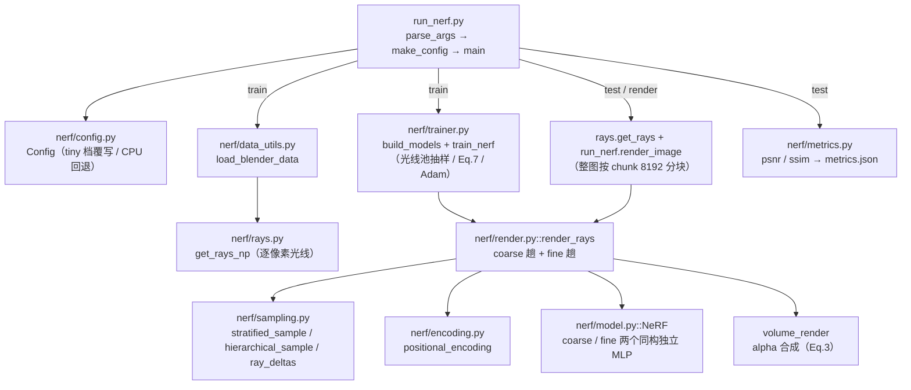

# NeRF 代码导读（TUTORIAL.md）

> **适用对象**：零基础读者——不假设你有三维视觉 / 深度学习背景，术语首现给中文通俗解释；
> 公式的完整推导不在本文展开，统一外链到 [`tutorials/nerf/`](../../tutorials/nerf/README.md)
> 的对应章节（导读只讲"代码里发生了什么"）。
> **配套文档**：[README.md](README.md)（快速开始）·
> [DEBUG.md](DEBUG.md)（调试与测试）· [METRICS.md](METRICS.md)（指标教程）·
> [09_代码逐行精读.md](../../tutorials/nerf/09_代码逐行精读.md)（逐行讲解，与本文互引）。

---

## 1. 这个项目做什么

**一句话**：这是 NeRF 论文（Mildenhall et al., *NeRF: Representing Scenes as Neural Radiance
Fields for View Synthesis*, ECCV 2020）的**最小可运行 PyTorch 教学复现**——给一组带相机
位姿的照片，训出两个小神经网络，之后就能渲染出没拍过的新视角图像。

### 1.1 原理概览：体渲染三件套

NeRF 把三维场景表示成一个**连续函数**：输入空间中任意一点的位置 $(x,y,z)$ 和观察方向
$(\theta,\phi)$，一个 MLP（多层感知机，可以理解为"很多层矩阵乘法堆起来的可学习函数"）
输出该点的**颜色** $\mathbf{c}$ 和**密度** $\sigma$（密度可理解为"此处挡光的能力"）。
要把一张图渲染出来，对每条相机光线沿路"积分"颜色和密度——这套流程由三件核心机制支撑，
也是本仓库代码的三条主线：

| 机制 | 解决什么问题 | 对应教程章节 |
|------|-------------|-------------|
| **位置编码**（positional encoding） | 把连续坐标升到高维，让 MLP 能拟合高频细节（否则渲染结果发糊） | [04_网络架构与位置编码.md](../../tutorials/nerf/04_网络架构与位置编码.md) |
| **分层采样 + 层次采样**（stratified / hierarchical sampling） | 一条光线是连续的，只能离散取点积分；先均匀粗探、再往"有东西"的地方细看 | [05_层次采样与训练细节.md](../../tutorials/nerf/05_层次采样与训练细节.md)（数值积分的两种方式见 [03 章 §3.4](../../tutorials/nerf/03_数学原理与渲染方程.md)） |
| **体积渲染**（volume rendering / alpha 合成） | 把沿光线采样点的颜色/密度加权合成出一个像素颜色，且整个过程可微、能反向传播 | [03_数学原理与渲染方程.md](../../tutorials/nerf/03_数学原理与渲染方程.md) |

### 1.2 论文 → 代码模块 → 教程章 总表

| 论文位置 | 内容 | 代码模块（函数） | 教程章节 |
|---------|------|-----------------|---------|
| **Eq.4** | 位置编码 $\gamma(p)$ | [`nerf/encoding.py::positional_encoding`](nerf/encoding.py) | [04 章](../../tutorials/nerf/04_网络架构与位置编码.md)（§4.2） |
| **Eq.2** | 分层采样（粗采样） | [`nerf/sampling.py::stratified_sample`](nerf/sampling.py) | [05 章](../../tutorials/nerf/05_层次采样与训练细节.md)（方式 B 的推导见 [03 章 §3.4](../../tutorials/nerf/03_数学原理与渲染方程.md)） |
| **Sec.5.2** | 层次采样（细采样，Eq.5 权重复用） | [`nerf/sampling.py::hierarchical_sample`](nerf/sampling.py) | [05 章 §5.2–5.3](../../tutorials/nerf/05_层次采样与训练细节.md) |
| **Eq.3** | 体积渲染积分（离散 alpha 合成） | [`nerf/render.py::volume_render`](nerf/render.py) | [03 章 §3.5](../../tutorials/nerf/03_数学原理与渲染方程.md) |
| **Sec.3 / Fig.7** | NeRF MLP（密度头 + 视角颜色头 + skip） | [`nerf/model.py::NeRF`](nerf/model.py) | [04 章 §4.3–4.4](../../tutorials/nerf/04_网络架构与位置编码.md) |
| **Eq.7** | coarse + fine 联合训练损失 | [`nerf/trainer.py::train_nerf`](nerf/trainer.py) | [05 章 §5.4](../../tutorials/nerf/05_层次采样与训练细节.md) |
| **Sec.6.1** | 数据格式（nerf_synthetic / Blender 约定） | [`nerf/data_utils.py`](nerf/data_utils.py) · [`nerf/rays.py`](nerf/rays.py) | [06_数据集与实验结果.md](../../tutorials/nerf/06_数据集与实验结果.md) |
| — | 命令行入口（训练/测试/渲染三合一） | [`run_nerf.py`](run_nerf.py) | [08 章](../../tutorials/nerf/08_参考实现与实战.md)、[09 章](../../tutorials/nerf/09_代码逐行精读.md) |
| **Sec.6** | 评测指标 PSNR / SSIM | [`nerf/metrics.py::psnr / ssim`](nerf/metrics.py) | [06 章 §6.2](../../tutorials/nerf/06_数据集与实验结果.md)；指标详解见 [METRICS.md](METRICS.md) |

---

## 2. 环境与运行

> 操作步骤，不含理论。以下所有命令的**输出与耗时均为实跑记录**（Linux / WSL2，CUDA 可用，
> torch 2.11.0+cu130 + numpy 2.2.6 + pytest 9.1.1；CPU 机器同样能跑，只是慢几倍）。

### 2.1 环境准备（一次性）

```bash
conda activate llm_env                # 全项目统一主环境（python 3.10 / torch）
cd RoboTwinTutorial/projects/nerf     # 后续命令都在本目录下执行
pip install -r requirements.txt       # torch / numpy / imageio / scipy / tqdm / Pillow，缺什么装什么
# 验证（应打印版本号且 cuda 为 True；无 GPU 时 cuda False 也能跑，见 §7.3）
python -c "import torch, numpy; print(torch.__version__, numpy.__version__, torch.cuda.is_available())"
```

### 2.2 冒烟流程三连（生成数据 → 训练 → 评测/渲染）

**① 生成演示数据**（无需下载官方数据集，脚本解析渲染一个彩色小球，输出标准
nerf_synthetic 格式）：

```bash
python scripts/make_demo_data.py --out data/demo_scene --n_train 8 --res 32
```

```text
[demo] wrote data/demo_scene  (32x32, 8 train / 8 test images, focal=44.44)
```
实跑约 **2 秒**。产出 `data/demo_scene/` 下 3 个 `transforms_*.json` 与 `train/ val/ test/` 三个图像目录。

**② 冒烟训练**（tiny 档 + 80 步，只验证"管线通畅、损失在降"）：

```bash
python run_nerf.py --config data/demo_scene --mode train --exp demo_smoke --tiny --steps 80
```

```text
[data] 8 train images @ 16x16, focal=22.2
train: 100%|██████████| 80/80 [00:03<00:00, 25.77it/s, loss=0.2024, lr=5.00e-04]
[train] done in 3.1s, final loss 0.0247
[train] saved -> logs/demo_smoke/latest.pt
```
实跑：训练本体 **3.1 秒**（CUDA，约 26–32 it/s；含解释器启动约 8 秒）。
进度条上的 `loss=0.2024` 是第 0 步的损失（每 100 步才刷新一次，80 步冒烟时不会刷新），
真实收敛看最后一行 `final loss 0.0247`。

**③ 测试打分**（渲染测试集新视角 + 计算 PSNR / SSIM）：

```bash
# 默认 testskip=8：8 张测试图每隔 8 张取 1 张 → 只评 1 张，最快
python run_nerf.py --config data/demo_scene --mode test --exp demo_smoke --ckpt logs/demo_smoke/latest.pt
# --testskip 1：评全部 8 张
python run_nerf.py --config data/demo_scene --mode test --exp demo_smoke --ckpt logs/demo_smoke/latest.pt --testskip 1
```

```text
[test] 1 test images @ 16x16
[test] PSNR 16.23 | SSIM 0.7682        # 默认 testskip=8
[test] 8 test images @ 16x16
[test] PSNR 19.23 | SSIM 0.8346        # --testskip 1
```
每次实跑约 **4 秒**。这两个数是本仓库的**冒烟基线**（与 [METRICS.md](METRICS.md) §1.3/§2.3 一致）；
逐张渲染图存 `logs/demo_smoke/test/pred_XXX.png`，汇总写入 `logs/demo_smoke/metrics.json`。

**④ 渲染相机轨迹**（沿圆轨迹生成一圈新视角帧，可拼成视频）：

```bash
python run_nerf.py --config data/demo_scene --mode render --exp demo_smoke --ckpt logs/demo_smoke/latest.pt --frames 8
```

```text
[render] 8 frames @ 16x16
[render] done -> logs/demo_smoke/video
```
实跑约 **4 秒**；帧存 `logs/demo_smoke/video/frame_0000.png` 起连续编号。正式出片用默认
`--frames 120`。

### 2.3 单元测试（不训练、秒级）

```bash
python -m pytest tests/ -v      # 全局：15 个测试
```

```text
tests/test_core.py::test_positional_encoding_shape PASSED   [  6%]
...
============================== 15 passed in 1.94s ==============================
```

单点跑法与调试入口见 [DEBUG.md](DEBUG.md)。

---

## 3. 目标输入与输出

### 3.1 各入口脚本的输入 / 输出一览

| 入口 | 输入 | 输出 |
|------|------|------|
| `scripts/make_demo_data.py` | 命令行参数（`--out` 输出目录、`--n_train/--n_test` 图像数、`--res` 分辨率） | nerf_synthetic 格式的迷你场景：`transforms_{train,val,test}.json` + 各 split 的 `r_XXX.png`（纯 RGB，像素 ∈ [0,255]） |
| `run_nerf.py --mode train` | 场景目录（§4.1 的 JSON + PNG） | checkpoint `logs/<exp>/latest.pt`；训练日志（tqdm + final loss） |
| `run_nerf.py --mode test` | 场景目录 + `--ckpt` 权重 | 每张测试图渲染 PNG（`logs/<exp>/test/pred_XXX.png`）+ `metrics.json`（PSNR/SSIM 均值与逐张列表）+ 汇总打印 |
| `run_nerf.py --mode render` | 场景目录（只为取 H/W/focal）+ `--ckpt` | `logs/<exp>/video/frame_XXXX.png` 一圈轨迹帧 |
| `nerf/metrics.py`（可独立调用） | 两张 `[H, W, 3]`、∈ [0,1] 的 numpy 数组 | PSNR 标量（dB）/ SSIM 标量（无量纲） |

### 3.2 最小可运行示例（每段均已实跑，输出为实测值）

以下片段可以整段拷进 `projects/nerf` 目录下的 Python 会话执行（在本目录下 `import nerf` 才成立，见 §7.1）。

**位置编码**（`nerf/encoding.py`）——把坐标升维，让 MLP 能表达高频：

```python
import torch
from nerf.encoding import positional_encoding
x = torch.zeros(2, 3)                       # 两个三维坐标点，形状 [2, 3]
enc = positional_encoding(x, num_freqs=10)  # L=10：每个分量出 10 个 sin + 10 个 cos
print(enc.shape)                            # torch.Size([2, 60])  → 3 * 2 * 10
```

实跑：`torch.Size([2, 60])`。排布规律：每个分量先排 L 个 sin、再排 L 个 cos（零点处
sin 全 0、cos 全 1，可直接手算验证，对应测试 `test_positional_encoding_zero`）。

**分层采样 + 段长**（`nerf/sampling.py`）——在 [near, far] 上每光线取 N 个点：

```python
from nerf.sampling import stratified_sample, ray_deltas
t = stratified_sample(near=2.0, far=6.0, n_samples=64, num_rays=4)  # [4, 64]
d = ray_deltas(t)                                                   # 相邻点间距 δ
print(t.shape, float(t.min()), float(t.max()), float(d[0, -1]))
```

实跑：`torch.Size([4, 64]) 2.023 5.967 10000000000.0`——深度全部落在 [2, 6]；
`deltas` 末位补 1e10 近似"无穷远"（体积渲染用它吸收残余权重）。

**层次采样**（`nerf/sampling.py`）——按 coarse 权重再采 N_f 个点：

```python
from nerf.sampling import hierarchical_sample
w = torch.softmax(torch.rand(4, 64), dim=-1)   # 模拟 coarse 权重（非负、和为 1）
t_fine = hierarchical_sample(t, w, n_fine=128)
print(t_fine.shape, float(t_fine.min()), float(t_fine.max()))
```

实跑：`torch.Size([4, 128]) 2.031 5.966`——点数正确，且不越出 coarse 覆盖的深度范围。

**体积渲染**（`nerf/render.py`）——alpha 合成出每条光线的颜色：

```python
from nerf.render import volume_render
rgb = torch.ones(1, 64, 3) * 0.8
color, weights = volume_render(rgb, torch.zeros(1, 64, 1), d)   # σ 全 0 = 真空
print(color[0].tolist(), float(weights.sum()))                  # [0.0, 0.0, 0.0] 0.0
sigma = torch.zeros(1, 64, 1); sigma[0, 30] = 1e4               # 单个不透明点
color, _ = volume_render(rgb, sigma, d)
print([round(v, 3) for v in color[0].tolist()])                 # [0.8, 0.8, 0.8]
```

实跑：σ 全 0 → 颜色全黑、权重和 0（`test_volume_render_empty_space_is_black`）；
单个 σ=1e4 的点 → α=1−e^(−1e4)≈1，光线颜色恰为该点颜色（`test_volume_render_single_opaque_point`）。

**相机 → 光线**（`nerf/rays.py`）——由位姿展开成逐像素光线网格：

```python
import numpy as np
from nerf.rays import get_rays_np, get_rays
c2w = np.eye(4, dtype=np.float32); c2w[:3, 3] = [4, 0, 0]   # 相机放在 (4,0,0) 朝原点看
ro, rd = get_rays_np(32, 32, 44.44, c2w)                    # H, W, focal(像素), c2w
print(ro.shape, rd.shape, bool((ro == np.array([4, 0, 0], dtype=np.float32)).all()))
```

实跑：`(32, 32, 3) (32, 32, 3) True`——原点网格全部等于相机中心；`get_rays` 是同逻辑的
PyTorch 版（render 模式逐帧生成光线用它）。

**NeRF 网络前向**（`nerf/model.py`）：

```python
from nerf.model import NeRF
model = NeRF(in_dim=60, view_dim=24)          # 默认结构：8 层 256 通道
rgb, sigma = model(torch.rand(8, 60), torch.rand(8, 24))
print(rgb.shape, sigma.shape, float(rgb.min()), float(rgb.max()), bool((sigma >= 0).all()))
```

实跑：`torch.Size([8, 3]) torch.Size([8, 1]) 0.435 0.548 True`——颜色经 sigmoid 落在
[0,1]（未训练时约 0.5 附近），密度经 ReLU ≥ 0。

**指标**（`nerf/metrics.py`，纯 numpy、无 torch 依赖）：

```python
import numpy as np
from nerf.metrics import psnr, ssim
a = np.random.default_rng(0).random((16, 16, 3))
b = np.clip(a + 0.1, 0, 1)
print(round(psnr(a, b), 2), round(ssim(a, b), 4), psnr(a, a))
```

实跑：`20.34 0.9838 100.0`——相同图像的 PSNR 被数值稳定项截断为 100 dB（实现上限，
见 [METRICS.md](METRICS.md) §1.2）。

---

## 4. 数据结构

### 4.1 `transforms_*.json`（nerf_synthetic 场景描述文件）

每个 split 一份（`transforms_train.json` / `_val.json` / `_test.json`），与图像目录同放于
场景根目录（如 `data/lego/`）。字段以 `make_demo_data.py` 实际写出的结构为准：

| 字段 | 含义 | 取值 / 形状 |
|------|------|------------|
| `camera_angle_x` | 水平视场角（弧度）；由它反推焦距 | demo 取 0.691111（对齐官方场景） |
| `frames` | 帧列表，每帧一张图 + 一个位姿 | 长度 = 该 split 图像数 |
| `frames[i].file_path` | 图像路径（不含 `.png` 后缀） | 如 `"./train/r_000"` |
| `frames[i].transform_matrix` | 相机到世界 **c2w** 矩阵（4×4，Blender 约定：相机朝 **−z** 看） | 4×4，旋转在上 3×3、平移在末列 |

焦距不在 JSON 里，加载时按针孔模型计算：`focal = 0.5·W / tan(0.5·camera_angle_x)`
（`data_utils.py::load_blender_data`，32×32 时 focal=44.44 像素）。

### 4.2 光线池与图像（`load_blender_data` 的返回值）

| 数组 | 形状 | 含义 | 取值范围 / 单位 |
|------|------|------|----------------|
| `rays_o` | [N, H, W, 3] | 每像素光线原点（即相机中心，同一帧内全相同） | 世界坐标，与场景同单位 |
| `rays_d` | [N, H, W, 3] | 每像素光线方向（世界系，**未归一化**，模长随像素位置变化） | 方向向量 |
| `imgs` | [N, H, W, 3] | 真值图像（RGBA 已按白底合成） | 像素 ∈ [0, 1]，float32 |
| `poses` | [N, 4, 4] | c2w 位姿矩阵堆 | 同 4.1 |
| `H, W` | 标量 | 分辨率（`half_res=True` 时减半，demo_scene 32→16） | 像素 |
| `focal` | 标量 | 焦距（half_res 时同步减半，demo_scene 44.44→22.22） | 像素 |

训练前 `trainer.py::train_nerf` 把它们摊平成"光线池"：`ro / rd / target = [N·H·W, 3]`
（demo_scene 8×16×16 = 2048 条），每步用 `torch.randint` 抽一个 batch。

### 4.3 网络侧的中间量（`render_rays` 输出 dict）

论文里的 `raw` 记号（每采样点的 [密度 σ, 颜色 c]，即 [..., N, 3+1]）在代码中拆成两个
返回值：`model.NeRF.forward` 返回 `rgb [..., N, 3]`（sigmoid ∈ [0,1]）与 `sigma [..., N, 1]`
（ReLU ≥ 0）。合成后的整体输出：

| 键 | 形状 | 含义 |
|----|------|------|
| `out["rgb_coarse"]` | [R, 3] | coarse 网络（N_c 个点）渲染的每条光线颜色 ∈ [0,1] |
| `out["rgb_fine"]` | [R, 3] | fine 网络（N_c+N_f 个点）渲染的最终颜色 ∈ [0,1] |
| `out["weights"]` | [R, N_c] | coarse 合成权重 w_i = T_i·α_i（非负、沿 N_c 求和 ≤ 1；训练损失与层次采样共用） |

### 4.4 `Config` 超参数分组表（`nerf/config.py`，默认值对齐论文 Sec. 5.3）

| 分组 | 字段（默认值） | 含义 |
|------|---------------|------|
| 数据 | `datadir`（"data/lego"）、`half_res`（True） | 场景目录；半分辨率加载（快一倍以上，论文用全分辨率） |
| 模型 | `l_xyz`（10）、`l_dir`（4） | 位置/方向编码频率数 L → 编码后 60 维 / 24 维 |
| 模型 | `use_viewdirs`（True）、`hidden`（256）、`num_layers`（8）、`skip_at`（4） | 视角分支开关；隐层宽/深；第 5 层输入处接 skip connection |
| 采样 | `n_coarse`（64）、`n_fine`（128） | 每条光线 coarse 点数 N_c、fine 附加点数 N_f |
| 训练 | `batch_size`（1024）、`lr`（5e-4）、`lr_decay`（0.1）、`steps`（200000）、`random_seed`（0） | 每步光线数；Adam 初始学习率；全程指数衰减因子（终止 lr = lr·lr_decay）；总步数；随机种子 |
| 渲染边界 | `near`（2.0）、`far`（6.0） | 光线采样近/远边界（Blender 场景在原点边长 2 的立方体内，相机距离约 4） |
| 其他 | `device`（"cuda"）、`exp_name`、`log_dir`（"logs"） | 无 CUDA 时 `make_config` 自动回退 "cpu" |

`--tiny` 冒烟档的覆写（`run_nerf.py::make_config`）：`batch_size=256、steps=1000、
n_coarse=32、n_fine=64`（显式传 `--steps` 可再覆盖，冒烟例再降到 80）。

### 4.5 产物文件

| 文件 | 内容 |
|------|------|
| `logs/<exp>/latest.pt` | checkpoint，dict 含两个键：`"coarse"` 与 `"fine"`，各为对应网络的 `state_dict`（默认结构 26 个张量，如 `blocks.0.weight` [256, 60]、`dir_fc.weight` [128, 280]、`rgb_head.weight` [3, 128]） |
| `logs/<exp>/metrics.json` | test 模式写出：`psnr_mean` / `ssim_mean`（均值）+ `psnr_list` / `ssim_list`（逐张列表） |
| `logs/<exp>/test/pred_XXX.png`、`logs/<exp>/video/frame_XXXX.png` | 渲染产物（uint8 PNG，保存前裁剪到 [0,1]×255） |

---

## 5. 计算公式

> 深度推导全部外链教程，这里只列"代码里发生了什么"。式号沿用论文编号（Eq.2/3/4/7），
> 教程章节对应 [`tutorials/nerf/`](../../tutorials/nerf/README.md)；逐行对照见
> [09_代码逐行精读.md](../../tutorials/nerf/09_代码逐行精读.md)。

**① 位置编码（Eq.4）**——`nerf/encoding.py::positional_encoding`，教程 [04 章 §4.2]：

$$\gamma(p) = \big(\sin(2^0\pi p),\cos(2^0\pi p),\ \dots,\ \sin(2^{L-1}\pi p),\cos(2^{L-1}\pi p)\big)$$

对 $(x,y,z)$ 每个分量独立施加，频率是几何级数 $2^k\pi$；L=10 → 每点 3×2×10=60 维。
代码里就是三行：构造 `freqs` → 外乘得 `args[..., D, L]` → `cat([sin, cos]).flatten(-2)`。

**② 分层采样（Eq.2）**——`nerf/sampling.py::stratified_sample`，教程 [03 章 §3.4 方式 B]：

$$t_i \sim U\!\big[t_n + \tfrac{i-1}{N}(t_f - t_n),\ t_n + \tfrac{i}{N}(t_f - t_n)\big)$$

把 [near, far] 均分为 N 个 bin，每 bin 内均匀随机取一点；随机化使采样位置对连续积分
"无偏"。代码：`torch.linspace` 做 bin 边界 + `torch.rand` 做 bin 内偏移。

**③ 体积渲染与离散 alpha 合成（Eq.3）**——`nerf/render.py::volume_render`，教程 [03 章 §3.5]：

$$C(\mathbf{r}) = \int_{t_n}^{t_f} T(t)\,\sigma\big(\mathbf{r}(t)\big)\,\mathbf{c}\,\mathrm{d}t
\ \approx\ \sum_{i=1}^{N} T_i\,\alpha_i\,\mathbf{c}_i,\qquad
\alpha_i = 1 - \mathrm{e}^{-\sigma_i\delta_i},\quad
T_i = \exp\Big(-\sum_{j<i}\sigma_j\delta_j\Big)$$

- $\alpha_i$（不透明度）= 第 i 段被挡光的概率，代码第 40 行
  `alpha = 1.0 - torch.exp(-sigma[..., 0] * deltas)`；
- $T_i$（透射率）= 到达第 i 点前未被吸收的比例，代码第 43–47 行：先
  `torch.cumprod(1.0 - alpha + 1e-10)` 再右移一位并补首元素 1（`1e-10` 是数值保护，
  防止 σ·δ 过大时下溢成精确 0）；
- 最终权重 `weights = transmittance * alpha`（论文 Eq.5 的 $\hat{w}_i$），颜色
  `color = (weights[..., None] * rgb).sum(dim=-2)`——渲染就是一个凸组合。

**④ 层次采样（Sec.5.2，复用 Eq.5 权重）**——`nerf/sampling.py::hierarchical_sample`，教程 [05 章 §5.2–5.3]：

把 coarse 权重 $\hat{w}_i$ 归一化成分段常数 PDF，累加得 CDF，再对 $u\sim U[0,1)$ 做
**逆变换采样**（`torch.searchsorted(cdf, u)` 查表落回深度轴）：权重高处自动多采点。
评测时 `perturb=False` 取 bin 中点保证确定性。

**⑤ 训练损失（Eq.7）**——`nerf/trainer.py::train_nerf`，教程 [05 章 §5.4]：

$$\mathcal{L} = \sum_{\mathbf{r}\in\mathcal{R}}\Big(\big\|\hat{C}_c(\mathbf{r}) - C(\mathbf{r})\big\|_2^2 + \big\|\hat{C}_f(\mathbf{r}) - C(\mathbf{r})\big\|_2^2\Big)$$

代码一行：`loss = F.mse_loss(out["rgb_coarse"], batch_target) + F.mse_loss(out["rgb_fine"], batch_target)`；
学习率按 `lr = cfg.lr * cfg.lr_decay ** (step / cfg.steps)` 指数衰减（5e-4 → 5e-5）。

**⑥ 相机模型（针孔）**——`nerf/data_utils.py`（focal 反推）与 `nerf/rays.py::get_rays_np`，
教程 [06 章 §6.1]：

$$\text{focal} = \frac{0.5\,W}{\tan(0.5\,\text{camera\_angle}_x)},\qquad
\mathbf{d}_{cam} = \Big(\tfrac{i - W/2}{f},\ -\tfrac{j - H/2}{f},\ -1\Big),\quad
\mathbf{rays_d} = R\,\mathbf{d}_{cam},\ \ \mathbf{rays_o} = \mathbf{t}$$

**⑦ 评测指标**——`nerf/metrics.py::psnr / ssim`：PSNR $=10\log_{10}(1/\text{MSE})$（dB），
SSIM 为高斯窗口的三因子乘积式。公式、健康值与出处见 [METRICS.md](METRICS.md)（式 M.1 / M.2）。

---

## 6. 函数流水线

与 `nerf/__init__.py` 模块 docstring 的流水线一致（箭头 = 调用）：



一条训练步的时序：`train_nerf` 抽 batch 光线 → `render_rays` 里 coarse 趟
（stratified_sample → 编码 → NeRF → volume_render 得 `rgb_coarse, weights`）→
用 `weights` 做 hierarchical_sample、与 coarse 点合并排序 → fine 趟再渲染得 `rgb_fine`
→ Eq.7 两项 MSE 相加 → `loss.backward()` + `optimizer.step()`。

---

## 7. 常见问题

**Q1：`ModuleNotFoundError: No module named 'nerf'`**
分两种情况。① 运行 `python run_nerf.py ...` 本身**任何目录都能启动**（Python 会自动把
脚本所在目录加进 `sys.path`），但 `--config data/...`、`logs/...` 这类**相对路径**按
当前目录解析——所以约定一律 `cd projects/nerf` 再跑，否则要么找不到数据、要么把
checkpoint 写去别处。② 在交互解释器或自写脚本里 `import nerf`：必须先
`sys.path.insert(0, "<projects/nerf 的绝对路径>")`（参考 `tests/test_core.py` 开头与
`scripts/make_demo_data.py` 开头的现成写法），或干脆 cd 到 `projects/nerf`。

**Q2：`ModuleNotFoundError: No module named 'torch'`（或 numpy/scipy）**
解释器没选对——本模块依赖 torch，必须用 conda 的 `llm_env`。终端里先
`conda activate llm_env`；VS Code 里 `Ctrl+Shift+P → Python: Select Interpreter` 选
`llm_env`（`.vscode/settings.json` 已写默认指向，重开窗口即生效）。详见
[.vscode/SETUP.md](../../.vscode/SETUP.md) §2。

**Q3：没有 GPU / CUDA 不可用怎么办？**
不用做任何事：`run_nerf.py::make_config` 检测 `torch.cuda.is_available()`，为假时自动把
`cfg.device` 回退为 `"cpu"`。启动打印的 `[config] Config(..., device='cpu', ...)` 可确认。
CPU 只是慢——80 步冒烟实测约 **38 秒**（CUDA 约 3 秒）；同设备上种子固定，结果可复现。

**Q4：单点过滤怎么用？"没有匹配的测试"是什么意思？**
两个测试文件都支持子串直跑：`python tests/test_core.py volume_render`（只跑名字含
`volume_render` 的测试）；子串写错时程序会列出全部可用测试名并退出码 1，照着改就行。
等价 pytest 写法：`python -m pytest tests/test_core.py::test_volume_render_empty_space_is_black -v`。
更多见 [DEBUG.md](DEBUG.md) §1。

**Q5：为什么 80 步冒烟 PSNR 只有 ~19 dB，论文明明 31 dB？**
步数差 3 个数量级：论文 200k 步、batch 4096、全分辨率；冒烟档 80 步、batch 256、
16×16 半分辨率。冒烟只证明"管线通畅、损失在降（0.20 → 0.025）、指标量级自洽
（MSE≈0.01–0.02 ⇒ PSNR 17–20 dB）"，**不要拿冒烟值对标论文值**（详见
[METRICS.md](METRICS.md) §1.3）。要逼近论文结果：用官方 lego 数据、去掉 `--tiny`、
`--steps 200000`（V100 约 6–10 小时）。

**Q6：训练进度条里的 `loss=0.2024` 一直不动，是不是没在学？**
不是。tqdm 角标每 100 步才刷新一次（`step % 100 == 0` 时 `set_postfix`），80 步冒烟里
它显示的是第 0 步的损失；真实收敛看结束行 `[train] done in ..., final loss 0.0247`。
想中间看损失，把步数提到 ≥200 或直接看 [DEBUG.md](DEBUG.md) 的断点调试一节。
