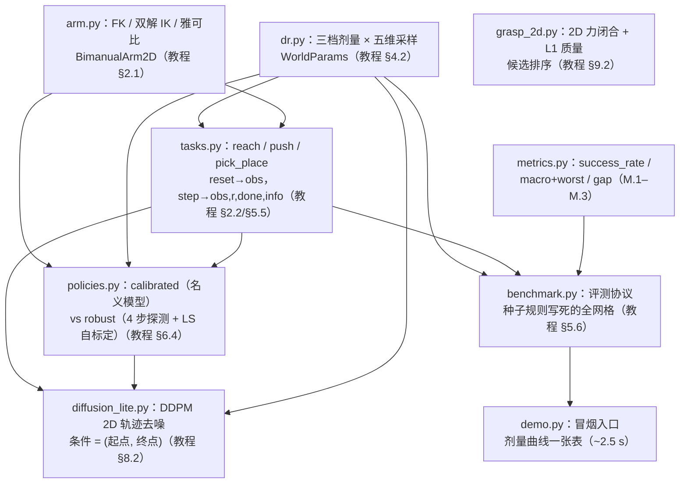

# RoboTwin 迷你基准代码导读（TUTORIAL）

> 零基础基准撰写：不假设读者有机器人学背景，术语首现给中文通俗解释；
> 深度推导一律外链 [tutorials/robotwin/](../../tutorials/robotwin/README.md) 各章，
> 本文只讲"代码里发生了什么"。
> 姊妹文档：[DEBUG.md](DEBUG.md)（调试与测试）｜ [METRICS.md](METRICS.md)（指标健康值）。

---

## 1. 这个项目做什么

**一句话**：把 RoboTwin 2.0 论文（Bu et al., arXiv:2506.18088）的两条方法论主线——
**域随机化（DR）+ 基准评测协议**——做成一个纯 NumPy、双臂、2D 平面的迷你基准，
让读者在 1 分钟内亲手复现教程第 04/06 章的"DR 剂量 vs 成功率"曲线。

**先说清它不是什么**：这不是 RoboTwin 本体的复刻——真 RoboTwin 需要
CoppeliaSim 仿真、MLLM 写专家代码、GPU 训练 VLA 策略（[教程第 07 章](../../tutorials/robotwin/07_环境搭建与实战.md)
与[第 08 章](../../tutorials/robotwin/08_策略训练与部署.md)、
[官方仓库](https://github.com/RoboTwin-Platform/RoboTwin)）。本项目里
**"策略"= 脚本化对照物 + 生成式策略的最小教学版**：两个手工写死的策略，
一个信任出厂标定（`calibrated`），一个每回合用带噪观测自标定（`robust`）；
[diffusion_lite.py](diffusion_lite.py) 再补上"学出来的策略"长什么样的最小
标本（2D 轨迹的条件去噪生成）；真正的 VLA 策略训练不在本项目范围，
见[教程第 08 章](../../tutorials/robotwin/08_策略训练与部署.md)。

**原理概览**：整个项目是一台"评测机器"。`dr.py` 先把世界参数抽歪
（DR 施加）→ `tasks.py` 提供三种双臂任务的回合环境 → `policies.py`
的策略在歪世界里执行任务 → `benchmark.py` 按协议跑完全部回合格 →
`metrics.py` 聚合成论文口径的指标。`arm.py` 是所有环节共用的双臂运动学。
两个旁支模块各对应一篇策略/抓取论文：`diffusion_lite.py`（Diffusion
Policy 的 2D 轨迹 DDPM）复用 `tasks/policies` 的回合接口采演示数据；
`grasp_2d.py`（DexGraspNet 的 2D 力闭合化）是独立的纯几何判据层。

| 组件 | 作用 | 教程章 |
|------|------|--------|
| [arm.py](arm.py) | 平面 2 连杆臂 FK/IK/雅可比，双臂 = 两条固定基座的臂 | [02 章 §2.1](../../tutorials/robotwin/02_双臂操作与仿真基础.md)（关节/自由度/正逆运动学） |
| [dr.py](dr.py) | 三档剂量 × 五维随机化采样（对象尺寸/摩擦/臂长/观测噪声/动作缩放） | [04 章 §4.2](../../tutorials/robotwin/04_核心技术详解.md)（五维 DR 与剂量控制） |
| [tasks.py](tasks.py) | `reach / push / pick_place` 三种回合环境（观测/奖励/成功判定） | [02 章 §2.2](../../tutorials/robotwin/02_双臂操作与仿真基础.md)、[05 章 §5.5](../../tutorials/robotwin/05_数据集与基准.md) |
| [policies.py](policies.py) | `calibrated` vs `robust` 脚本策略（对照实验的"被评测者"） | [04 章 §4.2.3](../../tutorials/robotwin/04_核心技术详解.md)、[06 章 §6.4](../../tutorials/robotwin/06_实验结果与解读.md) |
| [benchmark.py](benchmark.py) | 评测协议：种子规则写死的 (档位×任务×分层×回合) 全网格 | [05 章 §5.6](../../tutorials/robotwin/05_数据集与基准.md) |
| [metrics.py](metrics.py) | 成功率 / 宏平均+最差任务 / 泛化差距（公式 M.1–M.3） | [05 章 §5.6](../../tutorials/robotwin/05_数据集与基准.md)、[06 章 §6.5–6.6](../../tutorials/robotwin/06_实验结果与解读.md) |
| [diffusion_lite.py](diffusion_lite.py) | 扩散策略教学代理：DDPM 去噪生成 2D 轨迹（条件 = 起终点） | [08 章 §8.2](../../tutorials/robotwin/08_策略训练与部署.md)、[精读 Diffusion Policy](../../tutorials/robotwin/精读/DiffusionPolicy_RSS2023.md) |
| [grasp_2d.py](grasp_2d.py) | 2D 力闭合判据 + Ferrari–Canny L1 质量 + 候选排序（平行夹爪） | [09 章 §9.2](../../tutorials/robotwin/09_进阶研究方向.md)、[精读 DexGraspNet](../../tutorials/robotwin/精读/DexGraspNet_NeurIPS2022.md) |

**教学设计的两条主线**：① 全部场景定随机种子——同 seed 逐位复现，既是
回归测试也是 DEBUG 锚点；② 对照实验只动一个自变量——两个策略共享同一套
技能骨架（同用解析 IK、同用状态机），差异**只有**"模型参数从哪来"
（CAD 名义值 vs 带噪观测自标定），因此成功率曲线的差异只能归因于
"标定 vs 自适应"，这正是教程 §6.4 用 clean/randomized 两列数据讲的事情。

---

## 2. 环境与运行

本项目是**纯 numpy** 代码：conda `llm_env` 与系统 python3（numpy ≥ 1.26）
均已验证通过（52/52 测试、demo 输出逐位一致），无其他依赖。

```bash
conda activate llm_env            # 或任意 numpy >= 1.26 的环境（系统 python3 亦可）
python -c "import numpy; print(numpy.__version__)"   # 预期：>= 1.26（llm_env 2.2.6 / 系统 1.26.4）

cd projects/robotwin              # 必须在本目录运行（原因见 §7 常见问题第 1 条）
python tests/test_arm.py          # 预期：7/7 tests passed.   （~0.2 s）
python demo.py                    # 预期：打印成功率表（~2.5 s）
```

逐文件测试命令清单（每条独立可跑；耗时实测：系统 python3 / numpy 1.26.4，
llm_env / numpy 2.2.6 整体更快——其 BLAS 多线程下 DDPM 训练 ~1.2 s，
系统 python3 ~4.7 s）：

```bash
cd projects/robotwin

python tests/test_arm.py            #  7/7 tests passed.    ~0.1 s   （FK/IK/雅可比）
python tests/test_dr.py             #  6/6 tests passed.    ~0.1 s   （DR 采样器）
python tests/test_metrics.py        #  6/6 tests passed.    ~0.1 s   （指标纯函数）
python tests/test_tasks.py          #  7/7 tests passed.    ~0.1 s   （回合环境）
python tests/test_benchmark.py      #  4/4 tests passed.    ~1.1 s   （协议确定性）
python tests/test_policies.py       #  5/5 tests passed.    ~2.5 s   （剂量对照实验）
python tests/test_grasp_2d.py       #  9/9 tests passed.    ~0.2 s   （力闭合判据）
python tests/test_diffusion_lite.py #  8/8 tests passed.    ~3 s（llm_env）/ ~11 s（系统；含 2 次 DDPM 训练）
```

全局一次跑完（在仓库根目录）：

```bash
cd /home/dzxu/RoboTwinTutorial    # 仓库根
python -m pytest projects/robotwin/tests -v
# 预期：52 passed（系统 python3 实测 ~14 s，llm_env ~7 s）
```

每个测试文件都支持**单点过滤**（传测试名子串，详见 [DEBUG.md](DEBUG.md) §1）：

```bash
python tests/test_arm.py jacobian   # 预期：1/1 tests passed.（只跑名字含 jacobian 的测试）
```

---

## 3. 目标输入与输出（最小可运行示例）

以下 7 段片段**每段都实际运行验证过**（输出为确定性复现值；3.7 的采样
轨迹含随机性，同 seed 逐位复现）。统一前提：
`cd projects/robotwin` 后在 Python 交互环境或 `python -c` 中执行。各模块的
输入都是内存中的 numpy 数组（形状/单位随段说明），无文件 I/O。

### 3.1 arm —— 双臂运动学（教程 02 章 §2.1 工具）

输入：关节角 `(2,)`（rad）、目标点 `(2,)`（m，桌面系）；输出末端位置 `(2,)`、
关节解 `(2,)`、雅可比 `(2, 2)`；`BimanualArm2D` 状态为双臂关节角 `(4,)`。

```python
import numpy as np
from arm import link_fk, link_ik, link_jacobian, BimanualArm2D, BASES, LEFT

q = np.array([0.9, -1.8])
print("FK  =", link_fk((0.45, 0.35), q).round(4))          # 关节角 -> 末端位置
target = np.array([0.45, 0.25])
q_sol = link_ik((0.45, 0.35), target, BASES[LEFT])          # 末端位置 -> 关节角（选肘向）
print("IK  =", q_sol.round(4), "回代误差 =",
      float(np.linalg.norm(link_fk((0.45, 0.35), q_sol, BASES[LEFT]) - target)))
print("J   =", link_jacobian((0.45, 0.35), q).round(3).tolist())
arm = BimanualArm2D()
print("双臂末端 =", arm.end_effectors().round(4).tolist())
```

实测输出：`FK = [0.4973 0.0783]`（基座原点）、`IK = [0.7989 -1.9702]
回代误差 = 7.85e-17`（解析解闭合到机器精度）、`J = [[-0.078, 0.274],
[0.497, 0.218]]`、`双臂末端 = [[0.4973, 0.3283], [0.4973, -0.1717]]`
（左右肩分别偏置 ±0.25 m）。

### 3.2 dr —— 域随机化采样（教程 04 章 §4.2）

输入：档位名 + numpy Generator；输出 `WorldParams`（臂长/半径 m、摩擦/
动作缩放无量纲、噪声 m）。

```python
import numpy as np
from dr import sample, REGIMES
for regime in REGIMES:
    p = sample(regime, np.random.default_rng(0))
    print(regime, "L左", tuple(round(v, 3) for v in p.left_link),
          "半径", round(p.object_radius, 3), "摩擦", round(p.friction, 2),
          "噪声", round(p.obs_noise_std, 4), "动作", round(p.action_scale, 3))
```

实测输出：`none L左 (0.45, 0.35) 半径 0.05 摩擦 1.0 噪声 0.0 动作 1.0`、
`mild L左 (0.456, 0.355) 半径 0.041 摩擦 0.85 噪声 0.0049 动作 1.041`、
`strong L左 (0.468, 0.364) 半径 0.032 摩擦 0.7 噪声 0.0122 动作 1.124`——
剂量越大，世界离名义值越远（`none` 恒等于名义值）。

### 3.3 tasks —— 回合环境（教程 02 章 §2.2 / 05 章 §5.5）

输入：动作 `(5,) = [qL1, qL2, qR1, qR2, grip]`（rad + 夹爪位）；输出
观测 dict、进度奖励、done、info（`success` 是协议唯一关心的结果变量）。

```python
import numpy as np
from tasks import make_task
from dr import sample
env = make_task("push", sample("none", np.random.default_rng(0)))
obs = env.reset(seed=3)
print("obs keys:", sorted(obs))
print("q =", obs["q"].round(2), "ee左 =", obs["ee"][0].round(3))
print("对象 =", obs["object"].round(3), "目标 =", np.asarray(obs["goal"]).round(3))
obs, reward, done, info = env.step(np.concatenate([obs["q"], [0.0]]))
print("一步后: reward =", round(reward, 4), "done =", done, "info keys:", sorted(info))
```

实测输出：`obs keys: ['ee', 'goal', 'has_object', 'holding', 'object', 'q',
'radius']`、`q = [0.9 -1.8 0.9 -1.8]`、`ee左 = [0.497 0.328]`、
`对象 = [0.279 0.2]`、`目标 = [0.487 0.151]`、原地保持一步后
`reward = 0.0 done = False`、`info keys: ['contact', 'dist', 'ee_true',
'success', 't']`。

### 3.4 policies —— 自标定策略（教程 04 章 §4.2.3 / 06 章 §6.4）

输入：观测 dict；输出动作 `(5,)`。robust 策略前 4 步探测测量，之后用
测量值解 IK——测量应贴近该回合的真值臂长。

```python
import numpy as np
from dr import sample
from tasks import make_task
from policies import RobustPolicy
params = sample("strong", np.random.default_rng([0, 2, 0, 0, 0]))
env = make_task("reach", params)
obs = env.reset(seed=100)
pol = RobustPolicy(); pol.reset("reach")
for step in range(4):                       # 前 4 步是探测测量
    a = pol.act(obs, step)
    obs, r, done, info = env.step(a)
print("真值 L左 =", tuple(round(v, 3) for v in params.left_link),
      "测量 L左 =", tuple(round(v, 3) for v in pol.measured_links[0]))
```

实测输出：`真值 L左 = (0.496, 0.386) 测量 L左 = (0.498, 0.392)`——
带噪观测的最小二乘把臂长测到 ~0.005 m 内（对照：calibrated 会报名义值
(0.45, 0.35)，误差 ~0.04）。

### 3.5 benchmark + metrics —— 评测协议与指标（教程 05 章 §5.6）

输入：策略实例 + 任务/档位/回合数配置；输出逐回合记录列表
（`EpisodeRecord`），再聚合成协议口径的成功率/宏平均/泛化差距。

```python
import benchmark as bm
import metrics as mt
from policies import CalibratedPolicy
records = bm.run(CalibratedPolicy(), tasks=("reach",), regimes=("none",),
                 episodes_per_task=8, seed0=0)
table = bm.aggregate(records)
seen = table["none"]["reach"]["seen"]; unseen = table["none"]["reach"]["unseen"]
print("seen =", seen, "unseen =", unseen,
      "gap =", mt.generalization_gap([seen], [unseen]))
print("记录数 =", len(records), "首条 =", records[0])
```

实测输出：`seen = 1.0 unseen = 1.0 gap = 0.0`（标定世界无 seen/unseen 之分）、
`记录数 = 8`、`首条 = EpisodeRecord(task='reach', regime='none',
split='seen', episode=0, seed=16890301, success=True)`。

### 3.6 一键复现剂量曲线

```bash
python demo.py    # 3 任务 × 3 DR 档 × 40 回合 × 2 策略（~2.5 s，确定性）
```

输出与逐行解读见 [METRICS.md](METRICS.md) §1–3 的"健康值"——一句话版：
calibrated 宏平均 1.00 → 0.85 → 0.34（剂量↑ 单调下降），robust
0.98 → 0.92 → 0.82（自标定基本持平）。

### 3.7 diffusion_lite —— 扩散策略教学代理（教程 08 章 §8.2）

输入：演示数据自动从 `tasks` 回合接口采集（48 条 push/reach 末端轨迹，
每条 = (起点, 终点) 条件 + 8 路径点 16 维向量，归一化单位）；输出训练
损失曲线与米制 2D 轨迹 (8, 2)。训练 ~5 s（3500 轮全批，确定性）。

```python
import numpy as np
import diffusion_lite as dl
conds, trajs = dl.collect_demonstrations()           # 48 条演示（reach 双臂 32 + push 16）
model, losses = dl.ddpm_train(conds, trajs, seed=0)  # 3500 轮全批，~5 s
print("训练损失:", round(losses[0], 2), "→", round(losses[-1], 4))
start, end = np.array([0.497, 0.328]), np.array([0.372, 0.147])
traj = dl.plan(model, start, end, rng=np.random.default_rng(7))
print("生成轨迹 (m):", traj.round(3).tolist())
print("端点偏差 (m):", round(float(np.linalg.norm(traj[0] - start)), 4),
      round(float(np.linalg.norm(traj[-1] - end)), 4))
```

实测输出：`训练损失: 3.17 → 0.0222`、生成轨迹首点 ≈ 条件起点、末点 ≈
条件终点（`端点偏差` ≈ 0.04 / 0.02 m——采样有随机性，同 seed 逐位复现）。
机制一句话：网络学"给定噪声水平和 (起点, 终点)，这团噪声里藏的是哪条
路径"，采样 = 从纯噪声出发按 T=50 步反向"擦"出轨迹。

### 3.8 grasp_2d —— 2D 力闭合抓取质量（教程 09 章 §9.2）

输入：凸物体（正方形顶点 / 圆盘）+ 摩擦系数 μ；输出力闭合布尔与
Ferrari–Canny L1 质量（wrench 凸包内切半径）。全确定性，毫秒级。

```python
import numpy as np
import grasp_2d as g
sq = g.ConvexPolygon(np.array([[-0.5, -0.5], [0.5, -0.5], [0.5, 0.5], [-0.5, 0.5]]))
p1, n1 = sq.contact(0, 0.5); p2, n2 = sq.contact(2, 0.5)
anti = g.Grasp2D(np.stack([p1, p2]), np.stack([n1, n2]))   # 上下边中点对径
p3, n3 = sq.contact(1, 0.5); p4, n4 = sq.contact(2, 0.5)
adj = g.Grasp2D(np.stack([p3, p4]), np.stack([n3, n4]))    # 右边+上边（偏离对径）
print("对径: 力闭合 =", g.is_force_closure(anti, 0.4), "L1 =", round(g.grasp_quality(anti, 0.4), 4))
print("邻边: 力闭合 =", g.is_force_closure(adj, 0.4), "L1 =", g.grasp_quality(adj, 0.4))
disk = g.Disk(np.zeros(2), 0.3)
best = g.best_grasp(g.disk_grasp_candidates(disk, 12), mu=0.4)
ang = lambda p: float(np.degrees(np.arctan2(p[1], p[0])))
print("圆盘最优抓取角 (deg):", round(ang(best.points[0]), 1), "/", round(ang(best.points[1]), 1),
      "L1 =", round(g.grasp_quality(best, 0.4), 4))
```

实测输出：`对径: 力闭合 = True L1 = 0.1674`、`邻边: 力闭合 = False
L1 = 0.0`、`圆盘最优抓取角 (deg): 0.0 / 180.0 L1 = 0.1072`——对径
（antipodal）是圆盘上 L1 最大的构型，候选排序自动回到对径。

---

## 4. 数据结构

核心约定：2D 平面世界 = 桌面坐标系（m，x 向前、y 向左）；双臂 = 左肩
`(0, +0.25)`、右肩 `(0, −0.25)` 两条 2 连杆臂；状态 = 双臂关节角 `(4,)`。

### 4.1 dr —— 世界参数（`WorldParams`，frozen dataclass）

| 字段 | 形状 | 含义 | 单位/取值 |
|------|------|------|-----------|
| `left_link` / `right_link` | 各 (2,) | (L1, L2) 左/右臂连杆长 | m，[0.05, 1.0] |
| `object_radius` | 标量 | 对象（圆盘）半径 | m，[0.01, 0.2] |
| `friction` | 标量 | 接触传递系数（对象位移 = f × 法向推入量） | 无量纲，(0.05, 1] |
| `obs_noise_std` | 标量 | 末端/对象/半径观测的高斯噪声标准差 | m，[0, 0.1] |
| `action_scale` | 标量 | 关节伺服对"目标−当前"的增益（控制接口失配） | 无量纲，[0.1, 2] |

三档剂量区间（`REGIME_BOUNDS`，strong ⊇ mild 有测试守恒）：
arm_scale none=(1,1) mild=(0.95,1.05) strong=(0.85,1.15)；radius_scale
1 / (0.8,1.2) / (0.6,1.4)；friction 1 / (0.85,1) / (0.7,1)；noise
0 / (0,0.006) / (0,0.015)；action 1 / (0.95,1.05) / (0.85,1.15)。

### 4.2 tasks —— 观测 / 动作 / info

| 项 | 形状 | 含义 | 单位/取值 |
|----|------|------|-----------|
| `obs["q"]` | (4,) | 双臂关节角（本体感知，无噪声） | rad |
| `obs["ee"]` | (2, 2) | 双臂末端位置（行 = [左, 右]，带噪声） | m |
| `obs["object"]` | (2,) | 对象位置（reach 任务为零占位，带噪声） | m |
| `obs["radius"]` | 标量 | 对象半径读数（带噪声） | m |
| `obs["goal"]` | (2,2)/(2,) | 目标：reach 为双臂目标点对；push/pick 为对象目标点（**无噪声** = 任务指令） | m |
| `obs["has_object"]` / `obs["holding"]` | 标量 bool | 有无对象 / 是否已吸附 | — |
| `action` | (5,) | `[qL1, qL2, qR1, qR2, grip]`：关节目标 + 夹爪（<0.5 开） | rad / — |
| `info["success"]` | bool | **协议唯一结果变量**（pick_place 须松开后才可为 True） | — |
| `info["dist"]` / `info["t"]` | 标量 | 成功判据距离 / 步数 | m / 步 |
| `info["contact"]`（push） | bool | 本步是否有臂接触圆盘 | — |
| `info["holding"]` / `["holding_side"]`（pick） | bool / int | 吸附状态 / 持握臂 | — |

关键成功容差（`tasks.py` 常数）：`REACH_TOL=0.035`、`PUSH_TOL=0.055`、
`PLACE_TOL=0.05`、`GRASP_PAD=0.015`、`PUSH_PAD=0.012`；回合上限
`MAX_STEPS=64`、关节限速 `JOINT_SPEED=0.15` rad/步。

场景分层（`SCENE_RANGES`，单位 m）：seen 目标在 x∈[0.34,0.54] 标定工作
空间内部，unseen 在 x∈[0.55,0.63] 外围一圈；两档都保证在最短 DR 臂长
（0.8 m × 0.85）下物理可达——排除"任务本身不可能"的样本。

### 4.3 policies —— 策略内部状态

| 项 | 含义 |
|----|------|
| `_model_links` / `_model_radius` | 策略自认为的连杆长/半径：calibrated 恒为名义值；robust 测量后更新 |
| `measured_links` / `measured_radius` | RobustPolicy 最近一次测量的连杆长 ((2,),(2,)) / 半径（测试与 DEBUG 用） |
| `_phase` | push：`""→side→back→push`；pick_place：`""→approach→grasp→carry→release` |
| `_plan` | reach 一回合一次的关节目标缓存 (4,) |
| `_best_dist` / `_since_improve` | push 卡滞检测：历史最优距离 / 距上次改善步数（>10 步无 0.005 改善 → 退回 back 重推） |
| `PROBE_Q` | robust 探测位形 `(0.45, −0.9)`×2（与 home (0.9, −1.8) 拉开保证 LS 良态） |

### 4.4 benchmark —— 评测记录（`EpisodeRecord`，frozen dataclass）

| 字段 | 含义 |
|------|------|
| `task / regime / split` | 任务名 / DR 档位 / 泛化分层（seen/unseen） |
| `episode` | 格内回合序号（0 起） |
| `seed` | 环境种子 = `7919·episode + 104729·(task_idx+1) + 1299709·(regime_idx+1) + 15485863·(split_idx+1) + seed0`（素数混散，写死于 `episode_seed`；idx 按**本次调用**的遍历序列编号） |
| `success` | 该回合是否成功（`info["success"]`） |

`bm.aggregate(records)` → `dict[regime][task][key]`，key ∈
`{seen, unseen, all}`（分层成功率与合并成功率）。

### 4.5 diffusion_lite —— 扩散变量 / 条件 / 网络参数

| 项 | 形状 | 含义 | 单位/取值 |
|----|------|------|-----------|
| `trajs` | (N, 16) | 干净路径点向量 $x^0$（K=8 点 × 2 维展平，**归一化单位**，`from_workspace` 还原米） | 工作区：`(x−0.45)/0.4, y/0.4` |
| `conds` | (N, 4) | 条件 = (起点, 终点) 串联（同归一化） | 同上 |
| `BETAS` / `ALPHAS_BAR` | 各 (50,) | 线性 β 调度 0.005→0.24 / 累积 $\bar\alpha$（$\bar\alpha_T$ ≈ 0.0012，实测） | 无量纲 |
| `BETA_TILDE` | (50,) | 后验方差 $\tilde\beta_t$（采样步长方差，$\tilde\beta_0=0$） | 无量纲 |
| `NoiseMLP.params` | dict | W1 (96,36) / W2 (96,96) / W3 (16,96) + 偏置 + 残差捷径 U (16,16)（零初始化） | — |
| `plan(...)` 返回 | (8, 2) | 米制生成轨迹（首末 ≈ 条件起终点） | m |

训练配置（`ddpm_train` 默认）：3500 轮全批、Adam lr 6e-3 余弦退火到
2e-4、seed=0；实测损失 3.17 → 0.022、训练 ~5 s（系统 python3）。

### 4.6 grasp_2d —— 物体 / 候选 / 判据量

| 项 | 形状/类型 | 含义 | 单位/取值 |
|----|-----------|------|-----------|
| `Disk` | (2,) + 标量 | 圆盘（圆心 + 半径），接触内法向 = 径向反向 | m |
| `ConvexPolygon` | (n, 2) | 凸多边形（CCW，构造即校验），接触内法向 = 边向左转 90° | m |
| `Grasp2D.points / .normals` | 各 (2, 2) | 接触点对 / 内法向对；`.axis` = 拟合轴单位向量、`.width` = 张开宽度 | m |
| `friction_wrenches` | (m, 3) | 单接触摩擦锥 wrench（m=N_RAYS=8 射线；第三维 = 力矩 $p_x f_y − p_y f_x$） | 力无量纲化（幅值 1） |
| `wrench_hull_analysis` | (bool, float) | 原点内点判定 + L1 = 凸包内切半径（支撑平面枚举） | L1 量纲 = wrench |
| `grasp_quality` | 标量 | L1 质量（不可行返回 0.0） | ≥ 0 |
| 候选生成 | list[Grasp2D] | 正方形 54 / 圆盘(12 角) 66 个候选（确定性网格） | — |

---

## 5. 计算公式

每处给出教程/论文出处 + 代码函数名；**推导看教程**，此处只标"代码在哪、
算的是什么"。

| 公式 | 出处 | 代码位置 |
|------|------|----------|
| FK：`x = bx + L1·cos q1 + L2·cos(q1+q2)`，y 同理（教程 (2.1) 的平面版） | [02 章 §2.1](../../tutorials/robotwin/02_双臂操作与仿真基础.md)；Siciliano 2009 §2.3 | `arm.py::link_fk` |
| IK：`cos q2 = (r²−L1²−L2²)/(2·L1·L2)`，`q2 = ±arccos(·)`，回代 `q1`（余弦定理几何法双解） | 教程 §2.1.2 ②；Siciliano 2009 §2.13 | `arm.py::ik_both` / `::link_ik` |
| 雅可比 `J = [[−L1 s1−L2 s12, −L2 s12], [L1 c1+L2 c12, L2 c12]]`；数值对照 = 中心差分 | 教程 §2.1.2（奇异位形即 J 降秩） | `arm.py::link_jacobian` / `::numerical_jacobian` |
| DR 采样：每维独立 `Uniform(lo, hi)`（附录 C"合理区间均匀随机"口径）；覆盖条件 `D_test ⊆ D_train`（教程 (4.2)） | [04 章 §4.2](../../tutorials/robotwin/04_核心技术详解.md)；RoboTwin 2.0 §2.2 | `dr.py::sample` / `REGIME_BOUNDS` |
| 接触-摩擦推：`Δobject = f · max(⟨Δee, n̂⟩, 0) · n̂`，`n̂ = (圆心−ee)/‖·‖`（法向单侧：推得动、拉不动、切向不拖拽） | 本项目教学模型（论文 push 任务的 2D 化简） | `tasks.py::PushTask._task_dynamics` |
| 连杆长自标定：FK 对 (L1,L2) 线性 ⇒ `M(q)·[L1,L2] = ee − base`，4 组读数堆成 (8,2) 最小二乘 | 本项目教学设计（线性性是选 2 连杆做本体的重要原因） | `policies.py::RobustPolicy._measure` |
| 成功率 (M.1)：`SR = (1/N)·Σ sᵢ`，sᵢ∈{0,1} | RoboTwin 2.0 附录 G；[05 章 §5.6](../../tutorials/robotwin/05_数据集与基准.md) | `metrics.py::success_rate` |
| 宏平均+最差 (M.2)：`macro = (1/K)·Σ rₖ`，`worst = minₖ rₖ`（"报均值更报最差"的双层报告） | RoboTwin 2.0 附录 L；教程 §5.6 知识点五步 | `metrics.py::macro_mean_and_worst` |
| 泛化差距 (M.3)：`Gap = mean(seen) − mean(unseen)`（Table 4 的 {seen, unseen} 配置轴） | RoboTwin 2.0 §4.4；教程 §5.6 ④、§6.5 | `metrics.py::generalization_gap` |
| DDPM 前向闭式 (D0′)：`xᵗ = √ᾱ·x⁰ + √(1−ᾱ)·ε`；训练损失 = MSE(ε, ε̂)（ε-预测，变分下界化简） | Ho et al. 2020；[精读 Diffusion Policy §4.1](../../tutorials/robotwin/精读/DiffusionPolicy_RSS2023.md)（(D0′) 与论文式 (3)(5) 的记号对应） | `diffusion_lite.py::q_sample` / `::eps_prediction_loss` |
| DDPM 反向采样：`x^{t−1} = (xᵗ − β/√(1−ᾱ)·ε̂)/√α + √β̃·z`（后验均值 + 后验方差） | Ho et al. 2020 §3.2；精读式 (1)(4) 的标准闭式版 | `diffusion_lite.py::ddpm_sample` |
| 2D 力闭合：`0 ∈ int Conv(∪ᵢ Wᵢ)`（摩擦锥 wrench 凸包含原点为内点）；两接触特例 = Nguyen 连线在锥内 | Ferrari & Canny 1992；Nguyen 1988；[精读 DexGraspNet §4.3](../../tutorials/robotwin/精读/DexGraspNet_NeurIPS2022.md)（式 (1) 是其可微松弛） | `grasp_2d.py::wrench_hull_analysis` |
| L1 质量：`Q1 = 原点到 wrench 凸包边界的最小距离`（内切球半径，支撑平面距离取 min） | Ferrari & Canny 1992；精读式 (7)（$Q_1$）；[3D 重建 10 章 (10.5)](../../tutorials/3d_reconstruction/10_机器人场景中的重建实战与选型.md) | `grasp_2d.py::grasp_quality` |

---

## 6. 函数流水线

依赖方向如实取自 import 关系（箭头 = "复用"）：`arm` 与 `dr` 不依赖库内
其他模块（仅 numpy）；`tasks → arm, dr`；`policies → arm, dr, tasks`；
`benchmark → dr, tasks, metrics`（策略由调用方注入）；`metrics` 只依赖
numpy——被测模块不进指标，指标不进被测模块（纯函数层）。两个论文旁支
模块单向挂靠、不进评测闭环：`diffusion_lite → tasks, policies, dr`
（只用回合接口采演示数据）；`grasp_2d` 只依赖 numpy（纯几何判据；
与 `tasks.py` 的联动只出现在测试里：最优抓取点满足 pick_place 吸附条件）。



一次典型评测回合（`benchmark.run` 内循环）：
`dr.sample(regime, rng)` 抽世界参数 → `tasks.make_task(task, params)` 建环境
→ `env.reset(seed, split)` 采场景 → 循环 `policy.act(obs, step)` +
`env.step(action)` 到 `done` → 记录 `info["success"]` → 全部跑完后
`bm.aggregate` + `metrics` 三函数出协议口径的表。

---

## 7. 常见问题

**Q1：`ModuleNotFoundError: No module named 'dr'`（或 arm / tasks …）**
三个原因，按概率排查：① 工作目录不在 `projects/robotwin`——全部模块都以
它为根，`cd projects/robotwin` 后再运行；② 用 `python3 /path/to/script.py`
从别处跑脚本——`sys.path[0]` 是脚本目录而非 cwd；在脚本开头加
`sys.path.insert(0, "/home/dzxu/RoboTwinTutorial/projects/robotwin")`
（tests/ 下的文件已这么做，可照抄）；③ VS Code 里 import 标红线——从仓库
根打开窗口并 Reload（`extraPaths` 生效）。

**Q2：pytest 与直跑两种方式怎么选？**
直跑（`python tests/test_X.py`）零依赖 pytest、自带单点过滤与友好回溯，
适合快速迭代；pytest（`pytest tests/test_X.py -v` 或
`pytest tests/test_X.py::test_name`）能被 VS Code Testing 侧栏发现、支持
`-k` 表达式，适合提交前回归。两种方式跑同一批函数，结果一致。

**Q3：单点过滤怎么用？**
`python tests/test_policies.py dose` 只跑名字含 `dose` 的测试；子串无匹配时
程序**列出全部可用测试名**再退出（exit 1），照着选即可。等价 pytest 写法：
`pytest tests/test_policies.py -k dose -v`。

**Q4：为什么我的 calibrated@strong 数字和文档差一点？**
种子规则里的 `regime_idx/task_idx` 是**本次调用传入序列**中的下标：用完整
`REGIMES` 跑（demo 的方式）strong 的 `regime_idx=2`；只传 `("strong",)`
（部分测试的方式）时它是 0——种子不同、样本不同，但都完全确定。对表时请用
与文档相同的调用方式（详见 DEBUG.md §4 案例 4）。

**Q5：为什么 push 在强 DR 下两种策略都掉？**
摩擦维（f 低至 0.7）是"世界变难"，不是"策略变笨"：位移传递物理下推送
距离有硬上限（≈ 初始间隙 × f/(1−f)），脚本策略靠"卡滞检测 + 退回重推"
部分补偿。教程 §6.4 也有同构现象——Hard 档下**所有**策略都下滑
（DP 甚至 0.6%），DR 不豁免任何人。calibrated 在 push 上额外吃亏于
模型失准（进近/钳位点系统性偏移），因此同档位总是低于 robust。

**Q6：参数怎么调（调参方向速查）？**
剂量区间（`dr.REGIME_BOUNDS`）：想让 mild/strong 更狠，先保持
"strong ⊇ mild"的守恒关系（有测试把关）；回合预算（`tasks.MAX_STEPS=64`）：
robust 的探测占 4 步、push 重推每轮 ~10 步——预算太紧先砍重推次数
（`_since_improve > 10` 的阈值）；容差（`REACH_TOL` 等）：想放大剂量曲线的
分叉，调小容差即可（calibrated 的强档失败本质是偏移 ~0.05-0.08 m 超容差）。

更多排障与断点技巧：[DEBUG.md](DEBUG.md)；指标健康值：[METRICS.md](METRICS.md)。
