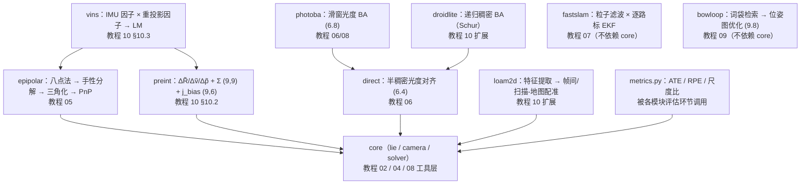

# SLAM 教学代码库导读（TUTORIAL）

> 零基础基准撰写：不假设读者有机器人学背景，术语首现给中文通俗解释；
> 深度推导一律外链 [tutorials/slam/](../../tutorials/slam/README.md) 各章，本文只讲"代码里发生了什么"。
> 姊妹文档：[DEBUG.md](DEBUG.md)（调试与测试）｜ [METRICS.md](METRICS.md)（指标健康值）。

---

## 1. 这个项目做什么

**一句话**：把 9 篇经典 SLAM 论文的核心算法写成能跑的教学代码——纯 numpy、
无任何第三方 SLAM 库，每个模块对应教程一章，`tests/` 里每个模块都有可直接
运行、全定种子的端到端验证。

**SLAM（Simultaneous Localization and Mapping，同步定位与建图）** 是什么：
机器人进入没有 GPS 的未知环境，只靠自身传感器（相机 / IMU / 激光），在
"边走边建图"的同时确定"我在哪"——这两个问题互为前提，SLAM 把它们放进
同一个概率估计框架里联立求解（[教程第 01 章](../../tutorials/slam/01_SLAM问题定义与全景.md)）。

**原理概览**：9 个算法模块按"前端（运动估计）→ 后端（优化）→ 回环 →
多传感器融合"的脉络组织，每篇论文一个目录；`core/` 是它们共用的数学地基。

| 论文 | 模块（目录） | 核心机制 | 教程章 |
|------|--------------|----------|--------|
| FastSLAM（Montemerlo et al., AAAI 2002） | `fastslam/` | Rao-Blackwellized 粒子滤波 | [07 后端 I](../../tutorials/slam/07_后端-i滤波与增量估计.md) |
| PTAM / ORB-SLAM 前端（特征点法几何） | `epipolar/` | 对极几何、三角化、PnP | [05 视觉里程计 I](../../tutorials/slam/05_视觉里程计-i特征点法.md) |
| ORB-SLAM 回环（DBoW2, Gálvez-López & Tardós 2012） | `bowloop/` | 词袋检索 + 位姿图优化 | [09 回环检测](../../tutorials/slam/09_回环检测.md) |
| LSD-SLAM（Engel et al., ECCV 2014） | `direct/` | 半稠密直接法（光度对齐） | [06 视觉里程计 II](../../tutorials/slam/06_视觉里程计-ii直接法.md) |
| DSO（Engel et al., ECCV 2016） | `photoba/` | 滑窗光度 BA + 曝光补偿 | [06](../../tutorials/slam/06_视觉里程计-ii直接法.md) / [08](../../tutorials/slam/08_后端-ii图优化与-ba.md) |
| LOAM（Zhang & Singh, RSS 2014） | `loam2d/` | 边缘/平面特征 + 双速率里程计/建图 | [10 建图与系统实战](../../tutorials/slam/10_建图与系统实战.md) 扩展 |
| IMU 预积分（Forster et al., T-RO 2017） | `preint/` | 流形预积分测量 | [10](../../tutorials/slam/10_建图与系统实战.md) §10.2 |
| VINS-Mono（Qin et al., T-RO 2018） | `vins/` | 视觉惯性紧耦合因子图 | [10](../../tutorials/slam/10_建图与系统实战.md) §10.3 |
| DROID-SLAM（Teed & Deng, NeurIPS 2021） | `droidlite/` | 递归稠密 BA（结构演示，无学习组件） | [10](../../tutorials/slam/10_建图与系统实战.md) 扩展 |
| ——（共享工具层） | `core/` | SO(3)/SE(3) 李代数、针孔相机、GN/LM 求解器 | [02](../../tutorials/slam/02_三维刚体运动旋转与位姿.md) / [03](../../tutorials/slam/03_概率状态估计基础.md) / [04](../../tutorials/slam/04_相机模型与特征提取.md) / [05](../../tutorials/slam/05_视觉里程计-i特征点法.md) / [08](../../tutorials/slam/08_后端-ii图优化与-ba.md) |
| ——（统一评估） | `metrics.py` | ATE / RPE / 尺度比 / 旋转误差 | [METRICS.md](METRICS.md) |

**教学设计的两条主线**：① 每个模块都自带合成数据生成器（`simulate_rectangle`、
`make_keyframe_scene`、`make_sequence`……），不需要下载数据集就能复现论文的
核心主张（如"IMU 把错误尺度的单目初始化拉回米制"、"mapping 把 odometry
漂移压到 1/6"）；② 全部场景定随机种子，每个测试的输出数字可精确复现——
这既是回归测试，也是 DEBUG 时判断"改坏了还是本来就这个数"的锚点。

---

## 2. 环境与运行

本项目是**纯 numpy** 代码：conda `llm_env` 与系统 python3（numpy ≥ 1.26）
均已验证通过（见 [.vscode/SETUP.md](../../.vscode/SETUP.md)），无其他依赖。

```bash
conda activate llm_env            # 或任意 numpy >= 1.26 的环境（系统 python3 亦可）
python -c "import numpy; print(numpy.__version__)"   # 预期：>= 1.26（llm_env 2.2.6 / 系统 1.26.4）

cd projects/slam                  # 必须在本目录运行（原因见 §7 常见问题第 1 条）
python tests/test_core_slam.py    # 预期：11/11 tests passed.   （~0.1 s）
```

逐目录测试命令清单（每条独立可跑；耗时在系统 python3 / numpy 1.26.4 上实测，
llm_env 的 numpy 2.2.6 整体约快 40%）：

```bash
cd projects/slam

python tests/test_core_slam.py    # 11/11 tests passed.    ~0.1 s   （李代数/相机/GN 求解器）
python tests/test_epipolar.py     #  7/7 tests passed.     ~0.1 s   （对极几何/三角化/PnP）
python tests/test_metrics.py      # 13/13 tests passed.    ~0.1 s   （统一指标）
python tests/test_bowloop.py      #  9/9 tests passed.     ~0.1 s   （词笔回环 + 位姿图）
python tests/test_fastslam.py     #  7/7 tests passed.     ~0.3 s   （FastSLAM 2D）
python tests/test_loam2d.py       #  7/7 tests passed.     ~0.9 s   （2D 激光 SLAM）
python tests/test_preint.py       #  6/6 tests passed.     ~1.0 s   （IMU 预积分）
python tests/test_vins.py         #  4/4 tests passed.     ~1.2 s   （视觉惯性紧耦合）
python tests/test_direct.py       #  7/7 tests passed.     ~2.3 s   （半稠密直接法）
python tests/test_photoba.py      #  4/4 tests passed.     ~4.5 s   （光度 BA）
python tests/test_droidlite.py    #  5/5 tests passed.     ~6.5 s   （递归稠密 BA）
```

全局一次跑完（在仓库根目录）：

```bash
cd /home/dzxu/RoboTwinTutorial    # 仓库根
python -m pytest projects/slam/tests -v
# 预期：80 passed（系统 python3 约 16 s；llm_env 约 10 s）
```

每个测试文件都支持**单点过滤**（传测试名子串，详见 [DEBUG.md](DEBUG.md) §1）：

```bash
python tests/test_fastslam.py gate     # 预期：3/3 tests passed.（只跑名字含 gate 的测试）
```

---

## 3. 目标输入与输出（最小可运行示例）

以下 11 段片段**每段都实际运行验证过**（输出为确定性复现值）。统一前提：
`cd projects/slam` 后在 Python 交互环境或 `python -c` 中执行。各模块的输入
都是内存中的 numpy 数组（形状/单位随段说明），无文件 I/O。

### 3.1 core —— 李代数 / 相机 / 求解器（教程 02 / 04 / 08 工具）

输入：旋转矢量 (3,)（rad）、李代数矢量 (6,) = (τ, φ)（m, rad）、相机系点 (N, 3)（m，
要求深度 Z > 0）；输出同域数组。**旋转矩阵约定为 world-to-camera**。

```python
import numpy as np
from core.lie import so3_exp, se3_exp, so3_log, transform_points

R = so3_exp(np.array([0.0, 0.0, np.pi / 2]))    # (3,) 旋转矢量 -> (3,3) 旋转矩阵
T = se3_exp(np.array([1.0, 0.0, 0.0, 0.0, 0.0, np.pi / 2]))  # (6,)=(tau,phi) -> (4,4)
p = transform_points(T, np.array([[1.0, 0.0, 0.0]]))         # (N,3) 点集刚体变换
print("R @ R.T = I ?", np.allclose(R @ R.T, np.eye(3)))
print("p =", p)

from core.camera import make_intrinsics
cam = make_intrinsics(500.0, 500.0, 320.0, 240.0)
uv = cam.project(np.array([[0.0, 0.0, 4.0]]))   # (N,3) 相机系点 -> (N,2) 像素
X = cam.unproject(uv, np.array([4.0]))          # 已知深度的反投影 -> (N,3)
print("uv =", uv)
```

实测输出：`R @ R.T = I ? True`、`p = [[0.6366 1.6366 0.]]`（SE(3) 平移经左雅可比
映射）、`uv = [[320. 240.]]`（光轴上的点投到主点）。

### 3.2 fastslam —— Rao-Blackwellized 粒子滤波（教程 07）

输入：`simulate_rectangle` 产出的里程计 `(T, 3)`（机体系增量，单位 m, m, rad）、
观测 `(T, K_max, 2)`（距离 m + 方位角 rad）；输出：加权平均位姿 `(3,)` 与地图
`(K, 2)`（m）。

```python
from fastslam import simulate_rectangle, FastSLAM2D

sim = simulate_rectangle(seed=0)                    # 矩形巡逻 + 5x4 路标网格
slam = FastSLAM2D(n_particles=50, n_landmarks=20, seed=0)
slam.initialize(sim.gt_trajectory[0])               # 全部粒子从已知起点出发
for t in range(sim.odometry.shape[0]):
    k = sim.n_obs[t]
    slam.step(sim.odometry[t], sim.observations[t, :k], sim.associations[t, :k])
print("pose_estimate() ->", slam.pose_estimate())           # (3,) 加权平均位姿
print("map_estimate().shape ->", slam.map_estimate().shape)  # (20, 2) 路标地图
print("N_eff =", round(slam.effective_sample_size(), 1))     # 有效样本数
```

实测输出：`pose_estimate() -> [-0.009 -0.208 0.071]`（真值闭环回原点）、
`map_estimate().shape -> (20, 2)`、`N_eff = 27.4`。

### 3.3 epipolar —— 对极几何 / 三角化 / PnP（教程 05）

输入：两帧匹配像素 `(N, 2)`（px，N ≥ 8）与内参 `K (3, 3)`；输出本质/基本矩阵
`(E, F)`（(3,3)）、唯一相对位姿 `(R, t)`、三角化场景点 `(N, 3)`（m）。

```python
import numpy as np
from core.camera import make_intrinsics
from core.lie import se3_exp, transform_points
from epipolar import eight_point, decompose_E, triangulate

cam = make_intrinsics(500.0, 480.0, 320.0, 240.0)
K = cam.matrix()
T2 = se3_exp(np.array([0.6, -0.1, 0.25, 0.35, 0.2, -0.12]))
rng = np.random.default_rng(7)
X1 = np.column_stack([rng.uniform(-1.5, 1.5, 60),
                      rng.uniform(-1.5, 1.5, 60),
                      rng.uniform(3.0, 9.0, 60)])    # 相机 1 前方 3D 点 (60,3)
u1 = cam.project(X1)                                 # (60,2) 参考帧像素
u2 = cam.project(transform_points(T2, X1))           # (60,2) 第二帧像素

E, F = eight_point(u1, u2, K)                        # 归一化八点法 -> (E, F)
R, t = decompose_E(E, u1, u2, K)                     # 手性检验 -> 唯一 (R, t)
X = triangulate(np.eye(4), T2, u1, u2, K=K)          # DLT 三角化 -> (60, 3)
print("E shape", E.shape, "F shape", F.shape)
print("triangulation err =", np.abs(X - X1).max())
```

实测输出：`E shape (3, 3) F shape (3, 3)`、`triangulation err = 4.6e-14`（无噪声
数据还原到机器精度；单目 `t` 只有方向可观）。

### 3.4 bowloop —— 词笔回环 + 位姿图（教程 09）

输入：各帧描述子 `(N, D)`（教学实现用实向量模拟 ORB 描述子）、位姿图节点
`(3,)`（x, y, theta）与体坐标系相对位姿边 `(3,)`（m, m, rad）；输出：确认回环对
列表与优化后节点位姿。

```python
import numpy as np
from bowloop import Vocabulary, detect_loop, PoseGraph2D

rng = np.random.default_rng(42)
bases = rng.normal(size=(18, 8))                       # 18 个"场景"的偏置向量

def snap(s):
    """场景 s 的一帧描述子 = 场景偏置 + 小噪声（同一地点长得像）。"""
    return bases[s][None, :] + rng.normal(scale=0.35, size=(20, 8))

train = np.vstack([snap(s) for s in range(18) for _ in range(3)])
vocab = Vocabulary(n_words=10, seed=0).fit(train)      # 离线 k-means 词表 + IDF
# 帧 0 看场景 0，帧 1-16 各看一个不同场景，帧 17-19 重回场景 0（连续 3 帧）。
frames = ([snap(0)] + [snap(s) for s in range(1, 17)]
          + [snap(0), snap(0), snap(0)])
vectors = [vocab.transform(d) for d in frames]         # 每帧 TF-IDF BoW 向量
print("loops =", detect_loop(vectors, min_gap=5, score_thresh=0.7))

pg = PoseGraph2D()
pg.add_node(0, [0.0, 0.0, 0.0])
pg.add_node(1, [1.1, 0.15, 0.05])                      # 带漂移的节点初值
pg.add_edge(0, 1, [1.0, 0.0, 0.0])                     # 体坐标系相对位姿边
pg.optimize()                                          # GN 优化 (9.8)
print("poses()[1] =", np.round(pg.poses()[1], 6))      # 被边拉回 [1, 0, 0]
```

实测输出：`loops = [(19, 0)]`（重访段被时间一致性确认）、`poses()[1] = [1. 0. 0.]`。

### 3.5 direct —— 半稠密直接法（教程 06）

输入：参考/目标图像 `I1, I2 (H, W)`（灰度无量纲）、参考帧深度图 `(H, W)`（m，
固定不优化）、初值位姿 `(4, 4)`；输出：优化后的位姿 `(4, 4)`（参考 → 目标相机）。

```python
import numpy as np
from core.lie import se3_exp, se3_log
from direct import make_textured_plane, semi_dense_align

I1, I2, T_gt, cam, depth = make_textured_plane(seed=7)  # 合成纹理平面 + 真值小运动
T0 = se3_exp(np.array([0.05, 0.0, 0.0, 0.0, 0.0, 0.0])) @ T_gt   # 带误差初值
T_est = semi_dense_align(I1, I2, depth, cam, T0)        # 半稠密 G-N 光度对齐
err = se3_log(T_est @ np.linalg.inv(T_gt))
print("trans err =", np.linalg.norm(err[:3]), "rot err =", np.linalg.norm(err[3:]))
```

实测输出：`trans err = 1.40e-04 m, rot err = 3.34e-05 rad`（约 5 cm 初值误差被
G-N 拉回重建底限）。

### 3.6 photoba —— 滑窗光度 BA（教程 06/08，DSO 思想）

输入：3 关键帧观测图像（list[(H, W)]）、第 0 帧深度图 `(H, W)`（m）、3 个初值
位姿 `(4, 4)`；输出 `PhotometricBAResult`：优化位姿（`T_0` 是规范锚点固定不动）、
曝光 `(a, b)` 各 `(3,)`、逆深度 `(N,)`（1/m）、点 `(N, 3)`（m）、代价与收敛标志。

```python
from photoba import make_keyframe_scene, PhotometricBA

scene = make_keyframe_scene(seed=11)                    # 3 关键帧真值场景（带曝光）
ba = PhotometricBA(scene.images, scene.depth, scene.cam,
                   scene.poses, max_points=200, seed=11)
result = ba.solve(n_iters=60)                           # 流形 LM 求解 (6.8)
print("exposure_a =", result.exposure_a)                # (3,) 仿射增益（真值 0/0.2/-0.15）
print("exposure_b =", result.exposure_b)                # (3,) 仿射偏移（真值 0/3/-2）
print("cost =", round(result.cost, 3), "converged =", result.converged,
      "points =", result.inverse_depths.shape)
```

实测输出：`exposure_a = [0. 0.202 -0.148]`、`exposure_b = [0. 2.799 -2.299]`
（与真值差在渲染底限量级内）、`cost = 3.984 converged = True points = (200,)`。

### 3.7 preint —— IMU 预积分（教程 10 §10.2）

输入：原始 IMU 采样序列 `[(t, gyro(3,), accel(3,))]`（s, rad/s, m/s²）与偏置估计
`b̄ (6,)`；输出：预积分增量 `ΔR̃ (3,3)`、`Δṽ/Δp̃ (3,)`、协方差 `Σ (9,9)`、偏置
雅可比 `(9,6)`。

```python
import numpy as np
from preint import ImuParams, Preintegration

params = ImuParams(rate=100.0)
# 静止场景：陀螺仪读 0，比力读数 = R^T(-g) = [0, 0, +9.81]（托住重力）
samples = [(k * 0.01, np.zeros(3), np.array([0.0, 0.0, 9.81])) for k in range(100)]
pre = Preintegration(samples, np.zeros(6), params)      # 偏置估计 b̄ = 0
print("delta_R is I ?", np.allclose(pre.delta_R, np.eye(3)))
print("delta_v =", pre.delta_v, " delta_p =", pre.delta_p)  # = -R^T g Δt（非零！）
print("cov shape", pre.cov.shape, "j_bias shape", pre.j_bias.shape)  # (9,9)/(9,6)
R_j, v_j, p_j = pre.predict(np.eye(3), np.zeros(3), np.zeros(3))    # 零噪声状态预测
print("predict recovers init ?", np.allclose(p_j, np.zeros(3)))     # 重力项加回后闭合
```

实测输出：`delta_R is I ? True`、`delta_v = [0. 0. 9.81]  delta_p = [0. 0. 4.905]`、
`cov shape (9, 9) j_bias shape (9, 6)`、`predict recovers init ? True`。
**读懂非零的 Δṽ**：预积分定义中"无重力"指重力的*贡献*被吸收进比力积分——静止
时比力恰等于 $-R^\top g$，故 `Δṽ = -R^T g Δt ≠ 0`；`predict()` 反解测量模型
(10.5) 把 $-\frac{1}{2}g\Delta t^2$ 加回，才精确返回初值（模型闭合的自检）。

### 3.8 vins —— 视觉惯性紧耦合（教程 10 §10.3）

输入：`simulate_vi_scene` 产出的 IMU 采样（每关键帧区间一段）、归一化坐标观测
`(K, L, 2)`（无量纲）与**故意错误尺度**（0.5x）的初始化；输出 `ViResult`：
优化后的关键帧状态与路标。

```python
import numpy as np
from vins import simulate_vi_scene, build_vins_bundle, align_se3

sim = simulate_vi_scene(seed=7)          # 初始化被故意设成错误尺度（0.5x）
bundle = build_vins_bundle(sim)          # 组装 IMU 因子 + 重投影因子的因子图
res = bundle.solve(n_iters=150)          # LM 流形求解
p_est = np.array([s.T_wb[:3, 3] for s in res.states])
p_gt = np.array([s.T_wb[:3, 3] for s in sim.gt_states])
R, t, p_aligned = align_se3(p_est, p_gt)          # SE(3) 对齐消 4 自由度规范
ate = np.sqrt(np.mean(np.sum((p_aligned - p_gt) ** 2, axis=1)))
print(f"ATE = {ate * 100:.2f} cm, iters = {res.n_iters}, converged = {res.converged}")
```

实测输出：`ATE = 2.36 cm, iters = 17, converged = True`——IMU 因子把 0.5x 的
错误尺度钉回米制（对照：`imu_weight=0` 的纯视觉运行尺度停在 0.38–0.42）。

### 3.9 loam2d —— 2D 激光里程计与建图（教程 10 扩展）

输入：T 帧量程序列（每帧 `(n_beams,)`，无回波为 `inf`）与机体角序列 `(n_beams,)`；
输出 `Loam2DOutput`：双速率轨迹 `poses_odom / poses_map (T, 3)`（m, m, rad）、
累积地图点 `(M, 2)`（m）与逐帧诊断 `RegistrationResult`。

```python
import numpy as np
from loam2d import make_room, render_scan, run_loam2d

room = make_room()                                       # 矩形墙 + 3 根方柱
gt = [np.array([0.35 * t, 0.0, 0.012 * t]) for t in range(26)]   # 直线轨迹真值
scans = [render_scan(room, p, range_noise_std=0.01, seed=100 + t)[0]
         for t, p in enumerate(gt)]                      # 每帧极坐标扫描 (720,)
ang = render_scan(room, np.zeros(3))[1]                  # 机体角序列
out = run_loam2d(scans, ang, mapping_every=5)            # 双速率主流程
print("odom  final pose =", np.round(out.poses_odom[-1], 4))
print("map   final pose =", np.round(out.poses_map[-1], 4))
print("map points =", len(out.map_points), " keyframes =", out.key_indices.tolist())
```

实测输出：`odom final pose = [8.7495 -0.0011 0.2992]`、`map final pose =
[8.749 -0.0027 0.2999]`（真值 `[8.75, 0, 0.3]`；mapping 链的终端漂移小于纯
odometry 链）、`map points = 744  keyframes = [5, 10, 15, 20, 25]`。

### 3.10 droidlite —— 递归稠密 BA（教程 10 扩展，无学习组件）

输入：`make_sequence` 产出的 GT 光流 `(K-1, N, 2)`（px，N = grid² = 32² = 1024
个宿主像素）、扰动位姿初值与常数逆深度初值（1/m）；输出 `DroidLiteResult`：
优化位姿、逆深度 `(N,)` 与逐轮 RMSE 诊断 `(R+1,)`。

```python
import numpy as np
from core.lie import se3_exp
from droidlite import make_sequence, DenseBA

seq = make_sequence(grid=32, flow_noise_std=0.3, seed=7)   # GT 光流 + 噪声
rng = np.random.default_rng(0)
poses_init = [np.eye(4)] + [se3_exp(rng.normal(0, 0.03, 6)) @ seq.poses_gt[k]
                            for k in range(1, len(seq.poses_gt))]
ba = DenseBA(seq, poses_init, 1.0 / 3.0)      # 逆深度置常数 = 深度全盲初值
res = ba.solve(n_rounds=6)                    # Algorithm 1 递归主循环
print("pose_rmse =", np.round(res.pose_rmse, 5))           # 逐轮位姿 RMSE，单调不升
print("inverse_depths shape =", res.inverse_depths.shape)  # (1024,) = 32x32 网格
```

实测输出：`pose_rmse = [0.06408 0.00156 0.00077 0.00039 0.0002 0.0001 5.e-05]`
（位姿增益约 1225 倍）、`inverse_depths shape = (1024,)`。

### 3.11 metrics —— 统一评估（[METRICS.md](METRICS.md)）

输入：估计/真值轨迹 `(N, 3)`（m，逐帧一一对应）、步长 `(N-1,)`；输出标量指标
（m / deg / 无量纲）或对齐参数 `(R, t, s)`。

```python
import numpy as np
from metrics import ate_rmse, umeyama_align, scale_ratio, rpe_translation

t = np.linspace(0.0, 10.0, 100)
traj_gt = np.column_stack([t, 0.5 * np.sin(t), np.zeros(100)])   # (100, 3) 真值
traj_est = 0.9 * traj_gt + np.array([0.1, -0.2, 0.05])           # 尺度 0.9 + 平移
R, tt, s = umeyama_align(traj_est, traj_gt, with_scale=True)     # Sim(3) 对齐
print("umeyama scale s =", round(s, 4))
print("ATE RMSE =", ate_rmse(traj_est, traj_gt), "m")            # 默认 align=True
print("scale_ratio =", round(scale_ratio(
    np.linalg.norm(np.diff(traj_est, axis=0), axis=1),
    np.linalg.norm(np.diff(traj_gt, axis=0), axis=1)), 4))
print("RPE(d=1) =", rpe_translation(traj_est, traj_gt, delta=1), "m")
```

实测输出：`umeyama scale s = 1.1111`（= 1/0.9，对齐把 0.9 倍尺度摆正）、
`ATE RMSE = 1.8e-15 m`（对齐后形状完全一致）、`scale_ratio = 0.9`（尺度比在
对齐*前*独立说话）、`RPE(d=1) = 0.0107 m`。

---

## 4. 数据结构

核心约定：`core` 的位姿是世界系→相机系（`x_cam = R @ x_world + t`）；
`vins` 的 `T_wb` 反向（机体系→世界系）；2D 模块（fastslam / bowloop / loam2d）
用 `s = (x, y, theta)` 的 SE(2) 三元组。以下全部以代码 docstring 为准。

### 4.1 fastslam —— 粒子数组（`FastSLAM2D`，N 粒子 × K 路标槽位）

| 属性 | 形状 | 含义 | 单位/取值 |
|------|------|------|-----------|
| `poses` | (N, 3) | 每粒子位姿采样 (x, y, theta) | m, m, rad |
| `landmark_means` | (N, K, 2) | 每粒子每路标的高斯均值 (lx, ly)；未初始化槽位为 0 | m |
| `landmark_covs` | (N, K, 2, 2) | 每粒子每路标的 2x2 协方差 | m² |
| `observed` | (N, K) | 布尔掩码：该粒子是否已初始化该路标槽位 | — |
| `log_weights` | (N,) | 对数重要性权重，初始均匀 `-log(N)` | — |
| `n_resamples` | int | 累计系统重采样次数（调试观察量） | — |

仿真器 `SimulationResult`：`gt_trajectory (T+1, 3)`、`gt_landmarks (M, 2)`、
`odometry (T, 3)`（机体系增量 m, m, rad）、`observations (T, K_max, 2)`（m, rad，
超出 `n_obs` 的槽位 NaN）、`associations (T, K_max)`（真值关联，填充 -1）、
`n_obs (T,)`。

### 4.2 preint —— 预积分测量（`Preintegration`）

| 属性 | 形状 | 含义 | 单位 |
|------|------|------|------|
| `delta_R` | (3, 3) | ΔR̃：右乘增量旋转（Eq.(37)） | 无量纲 |
| `delta_v` | (3,) | Δṽ：无重力速度积分 | m/s |
| `delta_p` | (3,) | Δp̃：无重力位置积分 | m |
| `cov` | (9, 9) | Σ：噪声 η^Δ = [δφ; δv; δp] 的协方差 | rad², (m/s)², m² |
| `j_bias` | (9, 6) | 偏置雅可比 ∂(ΔR̃, Δṽ, Δp̃)/∂(b^g, b^a)，分块 [R; v; p] × [g; a] | 混合 |
| `duration` / `n_samples` | 标量 / int | 区间总时长 [s] / 样本数 | — |

### 4.3 vins —— 因子图状态布局（`ViBundle`）

| 项 | 形状 | 含义 | 单位 |
|----|------|------|------|
| `KeyframeState.T_wb` | (4, 4) | 机体系→世界系位姿 | m, rad |
| `.v` / `.b_g` / `.b_a` | 各 (3,) | 世界系速度 / 陀螺零偏 / 加计零偏 | m/s, rad/s, m/s² |
| `ViBundle.states` | list[K] | 滑窗关键帧（教学实现 K=4） | — |
| `ViBundle.landmarks` | (L, 3) | 全局 XYZ 路标（非逆深度） | m |
| `n_params` | 标量 | 堆叠切向量总长 = 15K + 3L | — |
| 单关键帧切向量 | (15,) | [δτ(3), δφ(3), δv(3), δb^g(3), δb^a(3)]，位姿走左乘流形回缩 | m, rad, m/s, rad/s, m/s² |

### 4.4 bowloop —— 位姿图与词表（`PoseGraph2D` / `Vocabulary`）

| 项 | 形状 | 含义 | 单位 |
|----|------|------|------|
| 节点（`add_node`） | (3,) | SE(2) 位姿 (x, y, theta)，存于 `dict[node_id]` | m, m, rad |
| `PoseGraphEdge.z` | (3,) | 体坐标系相对位姿测量 (dx, dy, dtheta) | m, m, rad |
| `PoseGraphEdge.info` | (3, 3) | 信息矩阵（噪声协方差之逆）；回环边通常 ×100 | — |
| `Vocabulary.words` | (K, D) | 视觉单词（k-means 簇中心） | — |
| `Vocabulary.idf` | (K,) | 逆文档频率 `log(N / n_i)`（式 9.1） | 无量纲 |
| `transform` 输出 | (K,) | TF-IDF 加权、L1 归一化的 BoW 向量（非负、和为 1） | — |

### 4.5 photoba —— 参数向量布局（`PhotometricBA`）

增量向量 `δx` 全长 **16 + N**，布局（`parameter_layout()` 可打印）：

```
[ δξ_1 (6) | δξ_2 (6) | δρ_1..δρ_N (N) | δa_1, δa_2 (2) | δb_1, δb_2 (2) ]
```

| 项 | 形状 | 含义 | 单位/取值 |
|----|------|------|-----------|
| δξ_j | (6,) | 第 j 帧位姿左扰动（j = 1, 2；`T_0` 是位姿规范锚点永不动） | m, rad |
| δρ_k | (N,) | 第 k 点 host 帧逆深度增量；`δρ_0` 是尺度规范锚点不激活 | 1/m |
| ρ 物理箱 | (N,) | 每步增量被裁剪到 `0.25 ρ0 ≤ ρ ≤ 4 ρ0`（`_rho_lo` / `_rho_hi`） | 1/m |
| (a_j, b_j) | (3,) 各 | 仿射亮度参数；(a_0, b_0) = (0, 0) 是亮度规范锚点 | 无量纲 / 灰度 |
| `PhotometricBAResult` | — | `poses`（3 个 (4,4)）、`exposure_a/b` (3,)、`inverse_depths` (N,)、`points` (N,3)、`cost`、`n_iters`、`converged` | 见 §3.6 |

### 4.6 droidlite —— 宿主网格与逐轮诊断（`SequenceData` / `DenseBA`）

| 项 | 形状 | 含义 | 单位 |
|----|------|------|------|
| `host_pixels` | (N, 2)，N = grid²（默认 32×32 = 1024） | 第 0 帧（宿主帧）像素网格 | px |
| `rays` | (N, 3) | 宿主射线 `K^{-1}[u, v, 1]`，第三分量恒 1 | — |
| `rho_gt` / `rho` | (N,) | 逐像素逆深度（DROID/DSO 逆深度参数化） | 1/m |
| `flows_gt` | (K-1, N, 2) | 第 0 帧 → 第 k 帧的 GT 光流 | px |
| `valid` | (K-1, N) | 观测有效掩码（GT 投影落在图像内） | bool |
| 增量状态 `x` | (6(K-1) + N,) | [ξ_1..ξ_{K-1} \| Δρ]，深度块对角（Schur 消元结构基础） | — |
| `DroidLiteResult.pose_rmse / depth_rmse / flow_cost` | (R+1,) | 逐轮诊断（第 0 项为初值） | rad+m / 1/m / px² |

### 4.7 loam2d —— 配准结果与诊断（`RegistrationResult` / `Loam2DOutput`）

| 项 | 形状 | 含义 | 单位/取值 |
|----|------|------|-----------|
| `FeatureSet.edge_idx / planar_idx` | (E,) / (P,) | 边缘/平面特征点索引（机体系，与位姿无关） | — |
| `RegistrationResult.pose` | (3,) | 配准位姿（当前帧在目标系中） | m, m, rad |
| `.condition_number` | 标量 | 终端线性化点 `J^T J` 的条件数（可观测性诊断） | 良态 ~10，退化 inf |
| `.healthy` | bool | `condition_number ≤ max_condition` 且残差数 ≥ 3 | — |
| `Loam2DOutput.poses_odom / poses_map` | (T, 3) | 纯 odometry / mapping 精化后的轨迹 | m, m, rad |
| `.map_points` | (M, 2) | 终端累积地图点（体素降采样后） | m |

### 4.8 core 与 metrics 的公共结构

| 项 | 形状 | 含义 |
|----|------|------|
| `PinholeCamera`（frozen dataclass） | — | `fx, fy, cx, cy`（px）；`project` (N,3)→(N,2)、`unproject` 需给定深度 |
| `GNSolution` | — | `x (n,)` 最优参数、`cost` 加权代价、`n_iters`、`converged` |
| `metrics` 输入轨迹 | (N, 3) | 估计/真值位置逐帧对应，单位 m；步长 (N-1,) |

---

## 5. 计算公式

每处给出教程式号 + 代码函数名；**推导一律看对应教程章**，此处只标"代码在哪、
算的是什么"。

| 模块 | 公式（式号） | 代码位置 |
|------|--------------|----------|
| core | Rodrigues 公式 `exp(φ̂) = I + sinθ/θ·φ̂ + (1-cosθ)/θ²·φ̂²`（Eq. 2.15–2.19） | `core/lie.py::so3_exp` |
| core | SE(3) 指数映射 `T = [[R, Jl(φ)τ], [0, 1]]`（Eq. 2.20–2.24） | `core/lie.py::se3_exp` |
| core | 针孔投影 `u = fx·X/Z + cx`（Eq. 4.1–4.5） | `core/camera.py::PinholeCamera.project` |
| core | 正规方程 `(JᵀWJ + λI)dx = -JᵀWe`（Eq. 8.5–8.8，LM 阻尼自适应） | `core/solver.py::gauss_newton` |
| epipolar | 对极约束 `x2ᵀ E x1 = 0`（式 5.1）与 `E = hat(t) R`（式 5.3） | `epipolar/epipolar.py::essential_from_rt` |
| epipolar | Hartley 归一化（式 5.5）+ 本质流形投影 `diag(σ, σ, 0)`（式 5.6） | `::eight_point`（内部 `_normalize_points_hartley`） |
| epipolar | 重投影残差解析雅可比（式 5.11，左扰动 `T <- exp(δξ̂)T`） | `::reprojection_jacobian`、`::pnp_refine` |
| direct | 光度残差 `e_p(ξ) = I2(π(Tp)) - I1(π(p))`（式 6.4） | `direct/direct.py::photometric_residuals` |
| direct | 雅可比三因子链：图像梯度 × 投影导数 × 位姿扰动（式 6.5） | `::photometric_jacobian`、`::projection_jacobian` |
| photoba | 仿射亮度残差 `e = (e^{a_j}I_j + b_j) - (e^{a_0}I_0 + b_0)`（式 6.6；不变性 6.7） | `photoba/photoba.py::PhotometricBA.residual_vector` |
| photoba | 滑窗光度 BA 目标（式 6.8）+ Nielsen 增益比阻尼（式 8.6 思想） | `::PhotometricBA.solve` |
| fastslam | 距离-方位角测量模型（论文 Eq.(2)）及雅可比 `H = [[dx/r, dy/r], [-dy/r², dx/r²]]`（Eq.(9)/(11) 用） | `fastslam/fastslam.py::range_bearing_measurement` / `::range_bearing_jacobian` |
| fastslam | 有效样本数 `N_eff = 1 / Σ w_i²`（教程 03 章 §3.3） | `::FastSLAM2D.effective_sample_size` |
| fastslam | 平方马氏距离门控 `d² = νᵀS⁻¹ν`（论文 Eq.(12)，门限 `GATE_DEFAULT`） | `::FastSLAM2D._update_nearest` |
| bowloop | TF-IDF 权重 `w_i = tf_i · log(N/n_i)`（式 9.1）与 L1 相似度评分（式 9.3） | `bowloop/bowloop.py::Vocabulary.fit` / `::score` |
| bowloop | SE(2) 位姿图目标 `Σ eᵀΛe`（式 9.8）+ 首节点锚定（gauge fixing） | `::PoseGraph2D.optimize` |
| preint | 预积分测量模型（含 `-½gΔt²` 重力项；教程 (10.5) / 论文 Eq.(38)） | `preint/preint.py::Preintegration.predict` |
| preint | 协方差递推 `Σ ← A Σ Aᵀ + B Σ_η Bᵀ`（教程 (10.7) / Eq.(46)-(47)） | `::Preintegration._propagate_covariance` |
| preint | 一阶偏置修正 `ΔR̃(b̄+δb) ≈ ΔR̃ Exp((J_R δb^g)^)`（教程 (10.8) / Eq.(44)） | `::Preintegration.correct` |
| vins | IMU 白化残差 r_ΔR / r_Δv / r_Δp + 零偏随机游走（教程 (10.10) / Eq.(45)+(48)） | `vins/vins.py::ImuFactor.residual` |
| vins | 尺度可观性：缩放轨迹改变 IMU 残差、不改变视觉残差（教程 §10.3 第 3 步） | `::ViBundle.solve`（`imu_weight=0` 复现退化） |
| loam2d | 平滑度 `c_i`（论文 Eq.(1)）与点到线带符号垂距（论文 Eq.(2) 的 2D 叉积形式） | `loam2d/loam2d.py::smoothness` / `::point_line_residuals_jacobian` |
| loam2d | 协方差特征值直线对应 `λ1/λ2 ≥ min_linearity`（论文 §VI） | `::register_scan_to_map` |
| droidlite | DBA 目标 `E = Σ‖r_ij·p_ij - π(G'π⁻¹(p_i, d'_i))‖²`（论文 Eq.(4)） | `droidlite/droidlite.py::DenseBA.residuals` |
| droidlite | Schur 补正规方程 `Δξ = [B - EC⁻¹Eᵀ + λI]⁻¹(v - EC⁻¹w)`（论文 Eq.(5)） | `::DenseBA._schur_step` |
| metrics | ATE RMSE（式 M.2，Umeyama 对齐 M.1 前置）；RPE（式 M.5）；尺度比（式 M.4） | `metrics.py::ate_rmse` / `::rpe_translation` / `::scale_ratio` |

---

## 6. 函数流水线

依赖方向如实取自各模块的 import 关系（箭头 = "复用"）：`fastslam` 与 `bowloop`
**不依赖 core**（2D 平面三角函数 / 纯词袋机制自成一体）；`vins` 复用 `preint`
的预积分与 `epipolar` 的三角化；`photoba`、`droidlite` 复用 `direct` 的场景合成
与投影雅可比；`loam2d` 只取 `core.solver` 的 GN/LM。



一次典型"全系统"阅读路径（与[教程 README](../../tutorials/slam/README.md) 的
学习路径一致）：`core.lie`（02）→ `epipolar`（05）/ `direct`（06）→
`fastslam`（07）→ `core.solver` + `photoba`（08）→ `bowloop`（09）→
`preint` + `vins` + `loam2d`（10）→ `droidlite`（前沿）。

---

## 7. 常见问题

**Q1：`ModuleNotFoundError: No module named 'core'`（或 fastslam / preint …）**
三个原因，按概率排查：① 工作目录不在 `projects/slam`——所有顶层包
（`core/`、`fastslam/`……）都以 `projects/slam` 为根，`cd projects/slam` 后
再运行；② 用 `python3 /path/to/script.py` 从别处跑脚本——此时 `sys.path[0]`
是**脚本所在目录**而非当前目录，cwd 在路径里也没用；在脚本开头加
`sys.path.insert(0, "/home/dzxu/RoboTwinTutorial/projects/slam")`（tests/ 下的
文件已经这么做了，可照抄）；③ VS Code 里 import 标红线——从仓库根打开窗口并
Reload（`extraPaths` 生效，见 [.vscode/SETUP.md](../../.vscode/SETUP.md)）。

**Q2：pytest 与直跑两种方式怎么选？**
直跑（`python tests/test_X.py`）零依赖 pytest、自带单点过滤与友好的失败
回溯，适合快速迭代与远程/脚本场景；pytest（`pytest tests/test_X.py -v` 或
`pytest tests/test_X.py::test_name`）能被 VS Code Testing 侧栏发现、支持
`-k` 表达式，适合提交前的整套回归。两种方式跑的是同一批函数，结果一致。

**Q3：单点过滤怎么用？**
`python tests/test_fastslam.py gate` 只跑名字含 `gate` 的测试；子串写错时
程序会**列出全部可用测试名**再退出（退出码 1），照着选即可。等价 pytest
写法：`pytest tests/test_fastslam.py -k gate -v`。

**Q4：numpy 版本差异会影响结果吗？**
`llm_env`（numpy 2.2.6）与系统 python3（1.26.4）全部 80 个测试均通过。
唯一的版本敏感点是 `tests/test_droidlite.py` 的 Schur/稠密交叉验证：numpy 2.x
的线性代数实现与 1.26 有 ~1e-6 量级差异（实测 2.17e-6），故该断言容差取
1e-5——调试时若此项在两个解释器下数字略有不同属预期（真实实现错误通常
> 1e-2）。其余测试的阈值对版本不敏感。

**Q5：为什么 fastslam 不用 core（bowloop 也是）？**
`fastslam` 的位姿推演与测量几何全部发生在 SE(2) 平面——只需要
`cos/sin/atan2`，引入 SE(3) 李代数反而抬高阅读门槛；粒子数组
`(N, K, 2, 2)` 的批量 EKF 用纯 numpy 广播写完。`bowloop` 的词袋检索与 SE(2)
位姿图同理（k-means、L1 评分、3x6 解析雅可比都只用 numpy）。`core` 服务的是
三维视觉各模块（SE(3) 流形、针孔投影、稠密 GN）。依赖图见 §6。

**Q6：参数怎么调（调参方向速查）？**
粒子数 `n_particles`（fastslam）：N_eff 长期 < 0.3N → 加粒子或查噪声设置；
`mahalanobis_gate`：路标被复制 → 检查是否用了过紧的 `GATE_CHI2_2DOF_95`（5.991），
基准场景应使用 `GATE_DEFAULT`（30，双尺度依据见其 docstring）；`imu_weight`
（vins）：恢复不了尺度时先确认它不是 0；`lm_damping` / `huber_delta`
（photoba）：发散先看 λ 与线搜索 α（[DEBUG.md](DEBUG.md) §4 案例 3）；
`mapping_every`（loam2d）：漂移压不住 → 缩短 mapping 周期；`flow_decay`
（droidlite）：= 1 时光流不细化，逐轮 RMSE 出现平台。

更多排障与断点技巧：[DEBUG.md](DEBUG.md)；指标健康值：[METRICS.md](METRICS.md)。
