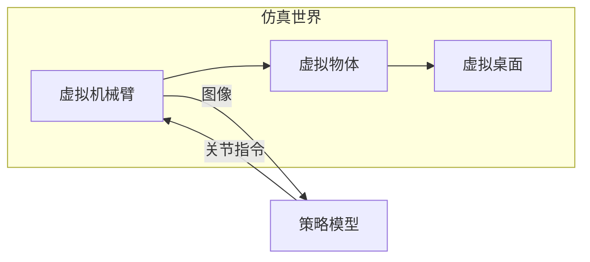
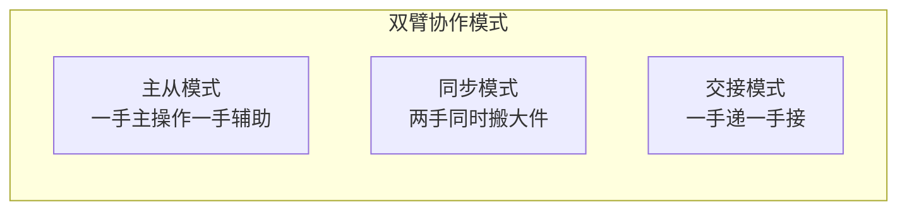

# 第 1 章：具身智能入门

> 本章目标：让完全没有背景的你，建立关于「具身智能」的整体地图，理解 RoboTwin 2.0 所处的坐标位置。

---

## 1.1 什么是具身智能（Embodied AI）？

**具身智能** = 拥有**身体**（embodiment）的人工智能。

传统 AI（如 ChatGPT）只处理**文字**，它没有眼睛、没有手、没有身体，只能"想"不能"做"。

具身智能强调 **智能必须通过身体与世界互动才能产生**。一个具身智能体（embodied agent）通常包含：

典型例子：
- **人形机器人**：在工厂搬运、在家庭做家务
- **机械臂**：抓取物体、组装零件、倒水
- **自动驾驶**：感知路况、规划路径、控制方向盘

**RoboTwin 2.0** 属于**桌面双臂机械臂操作（bimanual robotic manipulation）**这一子方向——让两台机械臂像人的左右手一样协作完成任务。

---

## 1.2 具身智能的三大学问

| 学问 | 英文 | 做什么 | 类比 |
|------|------|--------|------|
| **感知** | Perception | 看懂世界：物体在哪、是什么、什么状态 | 人的眼睛+大脑视觉区 |
| **决策** | Policy / Decision | 决定下一步动作：抓哪里、怎么抓、往哪放 | 人的"计划能力" |
| **控制** | Control | 把决策变成电机指令：关节转多少度 | 人的肌肉和神经 |

RoboTwin 2.0 主要关注**决策与数据**：它自己不做感知算法，而是**生成训练决策模型所需要的数据**。

---

## 1.3 机器人怎么"学会"做事？（三大范式）

让机器人学会操作，目前有三条主流路线：

### 路线一：强化学习（Reinforcement Learning, RL）
机器人自己"瞎试"，做对了给奖励，做错了给惩罚，靠试错学出策略。

- 优点：能探索出人类想不到的解法
- 缺点：在真实世界试错太危险、太慢（摔坏机器人）

### 路线二：模仿学习 / 行为克隆（Imitation Learning / Behavior Cloning）
让人类（或专家系统）先做一遍演示，机器人**照着学**。

- 优点：安全、直接、像"看师傅做菜"
- 缺点：数据从哪里来？—— 这是 RoboTwin 的核心问题

### 路线三：大模型直接生成动作（VLA，Vision-Language-Action）
用海量数据预训练一个"看见图+听懂话→直接输出动作"的大模型。

- 优点：通用性强，一个模型做很多任务
- 缺点：极度依赖大规模高质量数据

> 🔑 **记住**：RoboTwin 2.0 = **模仿学习 + 大模型（VLA）的数据工厂**。它不直接训练最终策略，而是用自动化方式**造出海量高质量演示数据**，供模仿学习和 VLA 使用。

---

## 1.4 为什么"数据"是当前最大的瓶颈？

你可能疑惑：让机器人学"把碗放好"，需要多少条演示？

- 人类看 1~2 次就能学会
- 而现代机器人策略模型，通常需要 **数千到数百万条**演示

**在真实世界采集数据**的三大痛点：
1. **贵**：需要真人操控（遥操作 teleoperation）、昂贵的机器人
2. **慢**：一条演示几十秒，采集 10 万条要数月
3. **脏**：很难覆盖各种光线、背景、杂乱场景

于是人们想到：**能不能在"仿真世界"里用"数字人"自动表演？**

这就是 **仿真数据合成（Simulation-based Data Synthesis）** 的由来，也是 RoboTwin 2.0 的立足点。

---

## 1.5 什么是"仿真"（Simulation）？

**仿真** = 用计算机程序模拟真实世界。

RoboTwin 2.0 用的仿真器叫 **SAPIEN**，它提供了：
- **物理引擎**：重力、碰撞、摩擦
- **渲染引擎**：光线、阴影、材质（看起来像真的）
- **可交互物体**：能打开的门、能按的开关

**为什么要在仿真里训练？**
- ✅ 无限次试错不损坏硬件
- ✅ 时间可以加速
- ✅ 可以任意改变光线、背景（真实世界很难做到）
- ✅ 成本趋近于零（只需 GPU 电费）

---

## 1.6 关键概念：Sim-to-Real（仿真到现实迁移）

仿真虽好，但有一个巨大的坑：**仿真和现实永远有差距（Sim-to-Real Gap）**。

- 仿真里的红色和现实里的红色不一样
- 仿真里的物理规律是近似值
- 仿真里的机器人运动比现实"理想"得多

**在仿真里学得再好的模型，一到现实世界可能立刻"失灵"**。解决这个差距，是 RoboTwin 2.0 的核心目标之一。

两大主流应对策略：

| 策略 | 英文 | 思想 | 本论文是否使用 |
|------|------|------|---------------|
| **域随机化** | Domain Randomization | 训练时故意加各种随机干扰，让模型"见过大风大浪"，到现实就不怕了 | ✅ 核心方法 |
| **数字孪生** | Digital Twin | 把真实场景 1:1 复刻到仿真里，尽量消除差距 | ✅ 承袭 RoboTwin 1.0 |

> 💡 **一句话理解域随机化**：像备考时故意做各种"超纲难题"，考试时见到正常题就不紧张了。

---

## 1.7 本论文出现的核心角色（先混个脸熟）

| 缩写/名词 | 全称 | 通俗解释 | 详细位置 |
|-----------|------|---------|---------|
| **RoboTwin-OD** | RoboTwin Object Dataset | 731 个 3D 物体模型库 | 第 5 章 |
| **MLLM** | Multimodal Large Language Model | 能"看图+读文"的大模型 | 第 4 章 |
| **VLA** | Vision-Language-Action Model | 输入图+语言、输出动作的模型 | 第 8 章 |
| **VLM** | Vision-Language Model | 能"看图说话"的模型（用来看执行对不对） | 第 4 章 |
| **DoF** | Degrees of Freedom | 机器人关节的自由度数 | 第 2 章 |
| **域随机化** | Domain Randomization | 训练时随机干扰环境 | 第 4 章 |
| **Code Agent** | 代码智能体 | 用 LLM 自动写机器人执行代码 | 第 4 章 |
| **RDT / Pi0 / ACT / DP / DP3** | 各种策略模型 | 论文用来评测的 5 种策略 | 第 6、8 章 |

---

## 1.8 为什么专门研究"双臂"（Bimanual）？

人有很多事情需要**两只手配合**：
- 递东西（一只手递、一只手接）
- 拧瓶盖（一只手握瓶身、一只手拧盖）
- 端盘子、叠衣服

机器人"双臂"任务远比单臂复杂，因为要处理**两只手的协调**：

RoboTwin 2.0 专门设计了 50 个双臂协作任务（如 Handover Block 递积木、Stack Bowls 叠碗），并支持 5 种不同机器人平台，就是为了攻克双臂这一难点。

---

## 1.9 本章小结（自测清单）

学完本章，你应该能回答：
1. 具身智能和传统 AI 的区别是什么？
2. 机器人学习的三大范式是什么？
3. 为什么真实世界采集数据贵且慢？
4. 什么是 Sim-to-Real Gap？域随机化如何缓解它？
5. 为什么双臂任务比单臂难？
6. RoboTwin 2.0 在具身智能版图中扮演什么角色？

> **动手练习**：拿出一张纸，画出"感知→决策→动作→世界→感知"的闭环，并标注 RoboTwin 2.0 主要作用于哪个环节（提示：决策环节所需的数据）。

---

## 1.10 延伸阅读

- RoboTwin 2.0 项目主页：https://robotwin-platform.github.io/
- RoboTwin 1.0（前作，CVPR 2025 Highlight）：arXiv:2504.13059
- 若想系统学习具身智能，推荐从斯坦福 CS330、伯克利 CS285 等公开课入门（第 9 章有详细清单）
