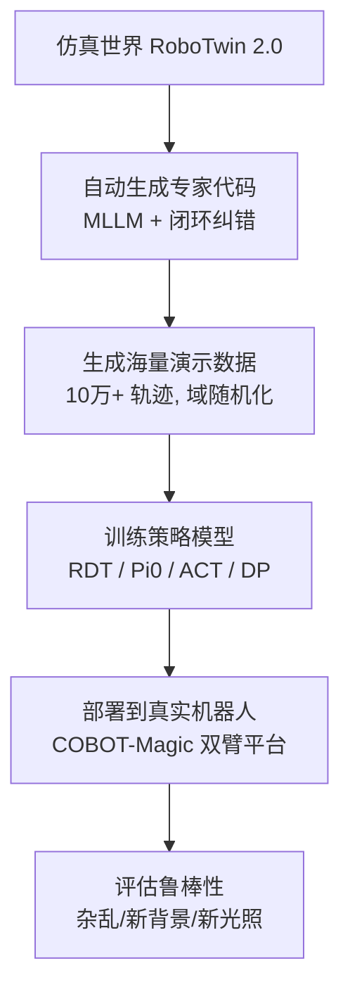

# 第 2 章：双臂操作与仿真基础

> 本章目标：让你理解"机械臂如何运动、双臂如何协作、仿真器如何工作"，为精读论文扫清障碍。

---

## 2.1 机械臂基础：关节、连杆与自由度

### 2.1.1 关节与连杆

机械臂像人的手臂，由**连杆（link）**和**关节（joint）**组成：
- **连杆**：手臂的"骨头"
- **关节**：骨头之间的"关节"，能让骨头的角度变化


### 2.1.2 自由度（Degrees of Freedom, DoF）

**自由度** = 一个系统可以独立运动的方向数量。

- 每个可旋转的关节 = 1 个自由度
- 一个 7 自由度（7-DoF）机械臂 = 7 个关节都可以独立转动

**为什么 DoF 重要？**
DoF 越高，机械臂越灵活，能摆出的姿势越多：
- **7-DoF（如 Franka、UR5）**：非常灵活，可以从正上方"精准下抓"（top-down grasp）
- **6-DoF（如 Piper、ARX-X5、Aloha-AgileX）**：灵活度有限，往往只能从侧面抓（lateral/side grasp）

> 🔑 **这是理解论文第 2.3 节（体态感知抓取）的关键**：同一件物体，高自由度机械臂能"从顶上抓"，低自由度机械臂只能"从旁边抓"。论文专门为此设计了适配机制。

### 2.1.3 末端执行器（End-Effector / Gripper）

机械臂末端通常装**夹爪（gripper）**来抓东西：
- **平行夹爪**：像两根手指并拢夹取
- **灵巧手**：像人手一样多指操作（本论文主要用夹爪）

论文中出现的夹爪：**Panda gripper**（Franka 标配）、**WSG gripper** 等。

---

## 2.2 双臂系统与协作模式

### 2.2.1 什么是双臂系统？

**双臂系统（bimanual system）** = 两个机械臂 + 一个固定基座（或移动底盘），共同工作。

RoboTwin 2.0 支持 **5 种机器人平台（embodiment）**：

| 平台 | DoF | 特点 | 擅长 |
|------|-----|------|------|
| **Franka** | 7 | 高灵活性，可顶抓 | 精细操作 |
| **UR5** | 7 | 工业级，工作空间大 | 通用任务 |
| **Aloha-AgileX** | 6 | 低成本，遥操作友好 | 双臂协作 |
| **ARX-X5** | 6 | 低成本六轴 | 侧抓任务 |
| **Piper** | 6 | 低自由度 | 受限场景（本论文重点提升对象） |

> 💡 **论文核心洞察**：6-DoF 平台在 RoboTwin 1.0 里成功率极低（如 Piper 仅 2.4%），因为旧数据生成方法没考虑它们"够不着、姿势受限"。RoboTwin 2.0 通过"体态感知抓取"把 Piper 提升到 25.1%（见第 6 章）。

### 2.2.2 双臂为何难？

1. **运动空间冲突**：两只手臂可能互相碰撞，需要避障
2. **抓取策略差异**：左右手分工不同
3. **任务耦合**：一个动作依赖另一个动作（如先递后接）
4. **多模态输入**：需要多视角摄像头同时观察两只手

### 2.2.3 双臂任务举例（来自论文 50 任务）

| 任务 | 双臂协作方式 |
|------|-------------|
| **Handover Block**（递积木） | 左手抓起积木→递到中间→右手接住→放到目标位置 |
| **Stack Bowls**（叠碗） | 一手拿碗，一手稳住，把碗叠起来 |
| **Open Microwave**（开微波炉） | 一手拉门，一手放东西 |
| **Shake Bottle**（摇瓶子） | 双手握住瓶子来回摇 |
| **Put Bottles Dustbin**（放垃圾桶） | 双手各拿一个瓶子放入垃圾桶 |

---

## 2.3 机器人如何"编程"执行任务？（两种路线）

要让机械臂完成"把积木放进篮子里"，有两条路线：

### 路线 A：手写/自动生成"技能代码"（Scripted / Code-based）

像写 Python 一样，一步步调用 API：

```python
# 伪代码：机器人执行"递积木"
left_arm.grasp(box)          # 左手抓住盒子
left_arm.move(handover_pose) # 左手移到交接点
right_arm.grasp(box)         # 右手抓住盒子
left_arm.release()           # 左手松开
right_arm.place(target)      # 右手放到目标位置
```

- 优点：可控、可复现、执行确定性高
- 缺点：要有人/模型来写这些代码

**RoboTwin 2.0 的创新之一**：让**大模型（MLLM）自动写这些代码**，写完放到仿真里跑，跑错了就让模型改（闭环迭代）。详见第 4 章。

### 路线 B：端到端学习（End-to-End Policy Learning）

不写代码，而是训练一个神经网络：
输入「当前摄像头画面 + 任务文字」→ 直接输出「关节目标角度序列」。

- 优点：无需人工编程，泛化性好
- 缺点：需要海量数据 —— 这正是 RoboTwin 2.0 造数据的用途！

> 🔑 **重要区分**：
> - 路线 A（自动写代码）= RoboTwin 2.0 的**数据生成引擎**
> - 路线 B（策略学习）= 用生成的数据**训练最终机器人大脑**
>
> 两者是"造数据的"和"用数据的"关系，论文中分别称为 **数据生成（Data Generation）** 与 **下游策略学习（Downstream Policy Learning）**。

---

## 2.4 仿真器入门

### 2.4.1 什么是仿真器（Simulator）？

仿真器 = 一个"虚拟物理世界"软件。RoboTwin 2.0 基于 **SAPIEN** 构建。

SAPIEN 提供三大能力：
1. **物理仿真**：物体受重力、有碰撞、有摩擦（像真的）
2. **视觉渲染**：用 GPU 画出"看起来逼真"的画面
3. **可交互物体**：铰链、按钮、抽屉都可以被操作（PartNet-Mobility 提供）

### 2.4.2 仿真器里有什么？

```text
仿真场景（Scene）
├── 机器人（Embodiment）：Franka / UR5 / Piper ...
│   └── 夹爪（Gripper）：Panda / WSG
├── 物体（Objects）：来自 RoboTwin-OD（731 个 3D 模型）
│   └── 每个物体带标注：放置点、功能点、抓取点、抓取轴
├── 桌面（Tabletop）：高度可变
├── 背景/纹理（Background/Texture）：11000 张贴图
├── 灯光（Lighting）：颜色、强度、位置可调
└── 摄像头（Camera）：多视角 RGB 相机
```

### 2.4.3 运动规划器（Motion Planner）

机器人要把手从 A 点移动到 B 点，**不能瞬移**，需要规划一条不撞障碍物的路径。

RoboTwin 2.0 使用 **CuRobo**（NVIDIA 出品）这个 GPU 加速的规划器：
- 输入：目标位置 + 障碍物
- 输出：一系列关节角度（路径）
- 特点：快、支持复杂约束

---

## 2.5 Sim-to-Real 全流程（论文大背景）

让我们把第 1 章的概念串成完整流程：



**关键环节解释：**

| 环节 | 作用 | 论文中的实现 |
|------|------|-------------|
| 数据生成 | 造演示 | MLLM 自动写代码 + 域随机化 |
| 策略训练 | 学"看图做动作" | 5 种策略模型（第 8 章） |
| 迁移评测 | 验证是否能用 | 仿真内 Easy/Hard + 真实世界 |

---

## 2.6 数据格式与存储（为实战做准备）

RoboTwin 2.0 采集的数据存放在 `data/` 目录，一个回合（episode）一个文件：

| 内容 | 格式 | 说明 |
|------|------|------|
| 观测与动作 | **HDF5** (.h5) | 相机图像（位流）、关节角度、夹爪状态 |
| 语言指令 | 文本 | 每回合对应的自然语言指令 |
| 视频 | MP4 | 头戴相机视角的演示视频 |
| 辅助文件 | seed.txt / scene_info.json | 随机种子、场景信息（可复现） |

> 💡 图像以"位流"形式存，读取代码：
> ```python
> image = cv2.imdecode(np.frombuffer(image_bit, np.uint8), cv2.IMREAD_COLOR)
> ```

---

## 2.7 本章小结（自测清单）

1. 什么是自由度？7-DoF 和 6-DoF 机械臂抓取方式有何差异？
2. 双臂任务为什么比单臂难？列举 3 种协作模式。
3. "写代码执行"和"端到端学习"两条路线各自优缺点？
4. SAPIEN 仿真器提供哪三大能力？
5. 运动规划器（CuRobo）解决什么问题？
6. 数据采集后的 HDF5 文件里存了什么？

> **动手练习**：打开 RoboTwin 官方任务文档（https://robotwin-platform.github.io/doc/tasks/），任选 3 个任务（如 handover_block、stack_bowls_two、open_microwave），尝试用"双臂协作模式"的视角描述它们。

---

## 2.8 延伸阅读

- SAPIEN 仿真器：https://github.com/haosulab/SAPIEN
- CuRobo 规划器：https://github.com/NVlabs/curobo
- RoboTwin 官方 50 任务文档：https://robotwin-platform.github.io/doc/tasks/
