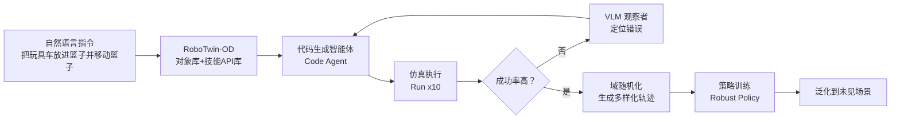
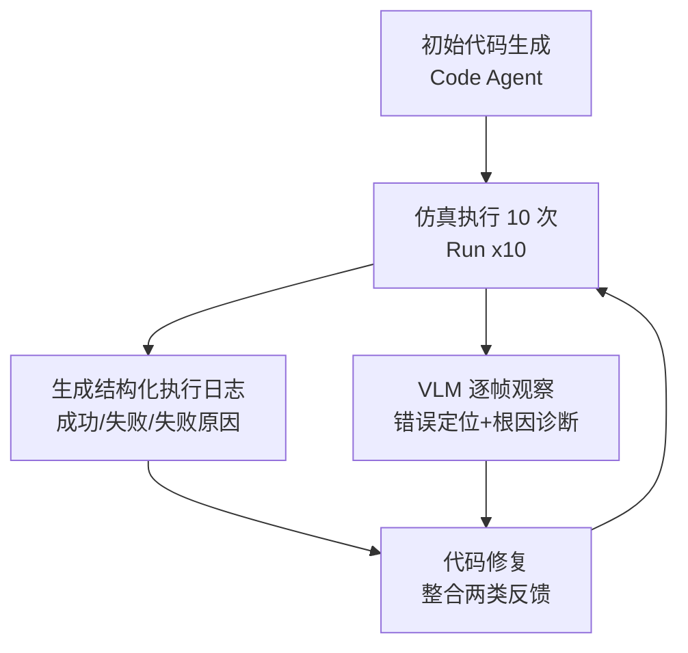

# 第 3 章：RoboTwin 2.0 论文精读

> 本章目标：逐节精读论文 *RoboTwin 2.0: A Scalable Data Generator and Benchmark with Strong Domain Randomization for Robust Bimanual Robotic Manipulation*（arXiv:2506.18088），让你能"看懂一篇顶会论文"，并建立自己的精读笔记模板。
>
> 建议：本章对照论文原文阅读效果最佳。论文位于 `../paper/2506.18088v2.pdf`。

---

## 3.0 读论文前的准备：先看这 6 个问题

读完全文后，你应该能回答：

1. 论文要解决什么问题？（动机）
2. 为什么现在的方法解决不了？（不足）
3. 论文提出了什么方案？（方法）
4. 方案如何被验证？（实验）
5. 实验结果证明了什么？（结论）
6. 论文的局限和后续方向是什么？（讨论）

带着问题读，效率翻倍。

---

## 3.1 标题解读（先读懂论文在做什么）

> **RoboTwin 2.0: A Scalable Data Generator and Benchmark with Strong Domain Randomization for Robust Bimanual Robotic Manipulation**

拆解标题，四个关键词：

| 关键词 | 含义 |
|--------|------|
| **Scalable Data Generator** | 可扩展的数据生成器（能自动化、大规模造数据） |
| **Benchmark** | 基准评测（统一的测试任务集，方便比较不同算法） |
| **Strong Domain Randomization** | 强域随机化（训练时大量随机干扰，增强鲁棒性） |
| **Robust Bimanual Robotic Manipulation** | 鲁棒的双臂机器人操作（最终目标） |

一句话：**RoboTwin 2.0 是一个既能"自动大规模生成仿真数据"、又能"统一评测"的双臂操作平台，通过强域随机化让策略在真实世界更鲁棒。**

---

## 3.2 摘要精读（Abstract）

### 3.2.1 背景与问题

> 基于仿真的数据合成已经成为提升真实世界机器人操作的有力范式。然而，现有合成数据集在鲁棒的双臂操作上仍然不足，原因有二：
> **（1）缺乏可扩展、可自动化的新任务数据生成方法；**
> **（2）仿真环境过于简化，无法捕捉真实世界的复杂性。**

**翻译成人话**：
- 问题 1：想加一个新任务，得人工写代码、人工布置场景，扩展性差
- 问题 2：仿真里太"干净"了（没有杂物、光线固定），学出来的模型到真实世界就"傻"

### 3.2.2 方法概述（论文的四板斧）

| 组件 | 英文 | 一句话解释 |
|------|------|-----------|
| **对象库** | RoboTwin-OD | 731 个物体、147 类，带语义和操作标注 |
| **专家数据合成流水线** | Expert Data Synthesis Pipeline | 用 MLLM 自动写任务执行代码 + 仿真内闭环纠错 |
| **五维域随机化** | Domain Randomization | 对杂波、光照、背景、桌面高度、语言指令 5 个维度做随机化 |
| **50 任务 × 5 平台** | 50 Tasks × 5 Embodiments | 在 5 种机械臂上实例化 50 个双臂任务 |

### 3.2.3 结果摘要（记住这几个数字）

| 结果 | 数值 | 含义 |
|------|------|------|
| 代码生成成功率提升 | +10.9% | 自动写代码更可靠 |
| 少样本（10 条真实验 + 大规模合成数据） | +367% 相对提升 | 合成数据威力巨大 |
| 零样本（纯合成数据） | +228% 相对提升 | 纯合成也能用 |
| 数据集规模 | 10 万+ 条轨迹 | 大而全 |

---

## 3.3 引言精读（Introduction）

### 3.3.1 为什么要做双臂操作？

> 双臂操作对机器人完成复杂真实世界任务至关重要：协同装配、工具使用、物体交接等。

**发展双臂 VLA 基础模型**需要**同时满足**高质量、多样性、大规模的数据集——这是全文反复强调的"不可能三角"（数据质量、数据多样性、数据规模）。

### 3.3.2 真实世界数据采集为何不可行？

> 缺乏物体几何、场景杂乱度、光照、语言指令、机器人平台（embodiment）的足够变化时，学到的策略容易过拟合到狭窄分布，无法泛化到新环境或新硬件。而在大规模上采集真实演示极其昂贵、耗时且后勤复杂。

**三个痛点**：贵、慢、脏（前面第 1 章讲过）。

### 3.3.3 现有仿真数据流水线的三大缺陷（论文核心立论！）

这是论文最重要的"靶子"，务必记住：

| 缺陷 | 说明 |
|------|------|
| **① 缺乏自动化质量控制** | 没有"专家级验证闭环"，生成的大量轨迹包含执行失败或次优抓取，污染策略学习 |
| **② 域随机化流于表面** | 场景太干净太单一，缺少杂乱、光照变化、模糊语言指令等真实因素 |
| **③ 忽视跨平台（embodiment）差异** | 不同机械臂的抓取习惯不同（低 DoF 爱侧抓、高 DoF 能顶抓），现有数据集没编码这种差异 |

> 🔑 **记住这三个缺陷，因为它们逐一对应 RoboTwin 2.0 的三大组件**：
> - 缺陷① → **MLLM + 仿真内反馈的专家数据生成**
> - 缺陷② → **五维域随机化**
> - 缺陷③ → **体态感知适配（Embodiment-Aware Adaptation）**

### 3.3.4 论文的三大贡献（正文明确列出）

1. **自动化专家数据生成框架**：MLLM + 仿真内闭环反馈 → 专家级轨迹
2. **系统性域随机化策略**：提升数据多样性和 sim-to-real 泛化
3. **体态感知适配机制**：基于物体功能属性（affordance）生成机器人专属操作候选

以及**释放的资源**：
- RoboTwin-OD 资产库（731 物体）
- 大规模预采集的多平台、域随机化轨迹数据集（10 万+ 条，50 任务，5 平台）
- 可扩展双臂数据生成器 + 标准化评测基准

---

## 3.4 方法总览（Method Overview）

论文整体流水线（对应论文 Figure 2）：



**一句话理解流水线**：
> 自然语言任务描述 + 对象库 + 技能 API → MLLM 写代码 → 仿真里跑 10 遍 → 成功率高就收下（配域随机化收集数据），失败就让 VLM 找错、MLLM 改代码，最多迭代 5 轮。

---

## 3.5 方法精读（第 2 节 Method）

### 3.5.1 专家代码生成（2.1 节）——闭环双智能体

**两个智能体：**

| 智能体 | 角色 | 输入 → 输出 |
|--------|------|-------------|
| **代码生成智能体（Code Agent）** | 写程序 | 任务描述 + API 列表 + 示例 → Python 代码 |
| **VLM 观察者（VLM Observer）** | 检查执行 | 执行视频帧 + 代码 → 错误定位 + 原因诊断 |

**输入规格（Input Specification）**：
- 任务名称 + 自然语言目标描述
- 通用 API 列表
- 示例函数调用
- 层级化约束规格（hierarchical constraint specification）

**闭环迭代流程：**



**停止条件**：
- ✅ 某轮 10 次运行成功率 > 0.5（50%），收下代码
- ❌ 连续 5 轮未达标，放弃（避免无限迭代）

> 💡 **为什么要跑 10 次？** 因为仿真有随机性（动力学噪声、控制器抖动、传感器噪声），跑 10 次取成功率更可靠，避免"运气好跑通一次"。

**与之前方法（GenSim2、RoboGen）的区别**：RoboTwin 2.0 支持**零样本生成复杂双臂行为**，不止于简单的 pick-and-place。

### 3.5.2 域随机化（2.2 节）——五维随机化

| 维度 | 做法 | 为什么有用 |
|------|------|-----------|
| **场景杂乱** Clutter | 加入任务无关的干扰物（从 RoboTwin-OD 采样），排除与任务物体相似的干扰物 | 模型学会"无视无关物体" |
| **背景纹理** Background | 用 Stable Diffusion v2 生成 + 人工筛选出 11000 张贴图 | 防止过拟合"干净仿真背景" |
| **光照** Lighting | 随机化光颜色、类型、强度、位置 | 颜色温度会大幅改变物体外观 |
| **桌面高度** Tabletop Height | 在合理范围随机 | 改变视角与机器人-物体空间关系 |
| **语言指令** Language | 用 MLLM 生成多样任务模板 + 多样物体描述，组合成无数种指令 | 提升语言泛化 |

> 🔑 **关键数字**：纹理库 **11000 张**（由 1000 条 LLM 生成的表面描述 × Stable Diffusion 每描述 20 张 = 20000 张初筛，人工过滤到 11000 张）。

**语言组合示例**（论文原文例子）：
- 模板："用 {a} 把 {A} 放到 {B} 的左边"
- 实例 1："用左臂把酱油罐放到灰色厨房锅的左边"
- 实例 2："用左臂把白色塑料盖酱油罐放到厨房锅左边以便烧饭烹饪"

**组合爆炸**：任务指令数 × 物体描述数 = 极大数量的指令变体。

### 3.5.3 体态感知抓取适配（2.3 节）

**问题**：同样抓一个罐子——
- **Franka（7-DoF）**：喜欢从上往下抓（顶抓）
- **Piper（低 DoF）**：只能从侧面抓（侧抓）

**做法**：
1. 给每个物体标注丰富的**候选操作位姿**（多个抓取轴 + 多个接近方向）
2. 施加偏向高可达方向的**角度扰动**，扩大可行空间
3. 结合"优选操作方向 + 随机位姿扰动 + 并行运动规划尝试"生成候选抓取

> 💡 这本质上是给机器人"按能力定制抓取方案"，解决低 DoF 机械臂"够不着"的问题。

---

## 3.6 数据与基准精读（第 3 节）

### 3.6.1 RoboTwin-OD 对象库（3.1 节）

**构成（731 个物体 = 三部分）：**

| 来源 | 数量 | 用途 |
|------|------|------|
| 自建（Rodin 平台 RGB→3D 重建 + 凸分解 + 网格合并） | 534 个 / 111 类 | 主要操作物体 |
| Objaverse | 153 个 / 27 类 | 增强干扰物视觉语义多样性 |
| SAPIEN PartNet-Mobility（可活动物体） | 44 个 / 9 类 | 铰接/活动物体操作 |

**每个物体的标注**：
- **语言标注**：每个物体 15 条描述（形状、纹理、功能、部件、粒度各不相同）
- **操作标注（affordance）**：放置点、功能点、抓取点、抓取轴

### 3.6.2 50 任务基准（3.2 节）

- **50+ 双臂协作任务**（放物、递物、叠放、开门、按压、摇晃……）
- **5 种机器人平台**（Aloha-AgileX、ARX-X5、Piper、Franka、UR5）
- **10 万+ 预采集轨迹**（HuggingFace 公开下载）

---

## 3.7 实验精读（第 4 节）——先看结构

论文实验回答三个问题：

| 实验 | 问题 | 对应论文章节 |
|------|------|-------------|
| 实验 1（4.1） | 代码生成器能不能自动写出好代码？ | Table 1 |
| 实验 2（4.2） | 体态感知抓取有没有用？ | Table 2 |
| 实验 3（4.3） | 域随机化数据能不能提升策略鲁棒性？ | Table 3 |
| 实验 4（4.4） | 真机 sim-to-real 表现如何？ | Table 4 |
| 实验 5（4.5） | 作为基准，各策略表现如何？ | Table 5 |

> 详细解读见第 6 章《实验结果与解读》。

---

## 3.8 相关工作（第 5 节）——领域地图

论文把相关工作分成三块，帮你建立领域地图：

### 5.1 机器人操作的数据集与基准
| 工作 | 特点 |
|------|------|
| SAPIEN | 2300+ 可活动物体仿真 |
| ManiSkill2 | 百万级演示 |
| Meta-World / CALVIN / LIBERO / RoboVerse | 多任务 / 语言条件 / 终身学习 / 域随机化 |
| RoboCasa | 大规模人类演示（缺自动化、缺双臂） |
| AgiBot World / RoboMIND / Open X-Embodiment / Bridge | 真实世界大规模数据集 |
| **RoboTwin 1.0** | 用仿真数字孪生镜像真实演示做双臂基准（本作前身） |

### 5.2 操作策略学习
- **RT-1 / RT-2**：Google 的视觉-语言-动作模型（VLA 鼻祖）
- **RDT-1B / π0 (Pi0)**：扩散式 VLA，双臂大模型
- **OpenVLA / CogACT / Octo / LAPA**：开源 VLA 与微调适配
- **DP / ACT / DP3 / 3D Diffusion Policy**：单任务策略（有的用 3D 点云）

### 5.3 模仿学习中的域随机化
- Tobin et al.（2017）、Peng et al.（2018）：域随机化开山之作
- DART（噪声注入）、EPOpt（最坏情形集成）：鲁棒策略
- **区别**：以往"孤立随机化"，RoboTwin 2.0 将**交互式仿真反馈 + 系统性域随机化**结合

---

## 3.9 结论（第 6 节）与局限

**论文结论**：
> RoboTwin 2.0 集成了 MLLM 任务生成、体态自适应行为合成、全面域随机化，产出了视觉、语言、物理多样性丰富的数据，并验证了对杂乱环境鲁棒、对未见任务泛化、跨平台操作的能力。

**作者自述的未来方向**：
- 真实世界部署（real-world deployment）
- 多物体任务复杂度

**作为读者应补充的局限**（批判性思考）：
1. 主要评估仍是"仿真为主 + 少量真机"，真机仅 4 个任务、单平台
2. 代码生成成功率仍有相当比例失败（平均 43.34%，见附录 G.3）
3. VLM 观察者的误报率偏高（见附录 G.4，精确率仅 0.208）
4. 域随机化可能让某些任务变得更难（如 Hard 条件下所有策略成功率大幅下降）

---

## 3.10 附录精读（快速浏览哪些值得看）

| 附录 | 内容 | 值得关注的点 |
|------|------|-------------|
| B | 与现有基准对比表 | 一键看清 RoboTwin 2.0 差异化定位 |
| C | 域随机化设置 | 桌面高度变化 ≤3cm 等细节 |
| D | 训练细节 | RDT/Pi0/ACT/DP/DP3 超参数 |
| F | 与 1.0 代码质量对比 | AST 相似度、CodeBLEU 等指标 |
| G | 代码生成实验细节 | 指标定义、VLM 观察者真实能力评估 |
| H/I | 语言指令/描述生成示例 | 很直观，零基础可读 |
| K | 50 任务完整基准表 | 所有策略全任务结果 |
| L | 各平台成功率表 | 跨平台对比 |

---

## 3.11 一篇论文的"精读笔记模板"（建议收藏）

> 以后读任何论文，都可以用这个模板：

```markdown
# 论文精读：[标题]
- 会议/年份：
- 一句话总结：
- 1. 动机（要解决什么问题）：
- 2. 不足（现有方法差在哪）：
- 3. 方法（核心思路，画流程图）：
- 4. 实验（验证了什么，关键数字）：
- 5. 结论（证明什么）：
- 6. 局限与未来工作：
- 7. 与我的研究的关系：
```

---

## 3.12 本章小结（自测清单）

1. 现有仿真数据流水线的三大缺陷是什么？
2. 论文的三大组件如何逐一对应三大缺陷？
3. 代码生成闭环的流程、停止条件是什么？
4. 五维域随机化分别是哪五个？
5. 为什么需要"体态感知抓取"？
6. RoboTwin-OD 的三部分构成和标注是什么？
7. 论文四大实验结果各回答什么问题？

> **动手练习**：用 3.11 的模板，独立为 RoboTwin 2.0 写一份你自己的精读笔记（不要看本章内容，凭记忆写，再对照检查）。
