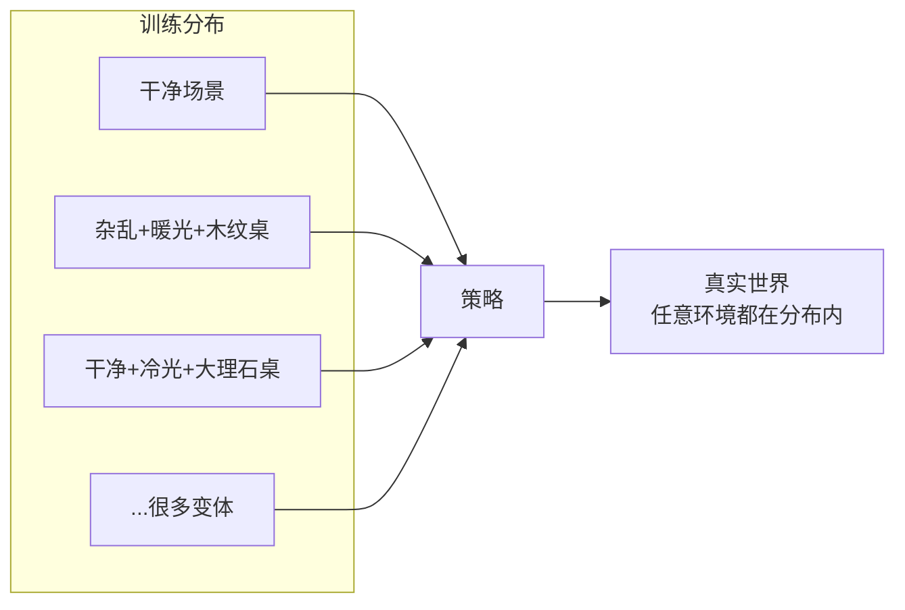
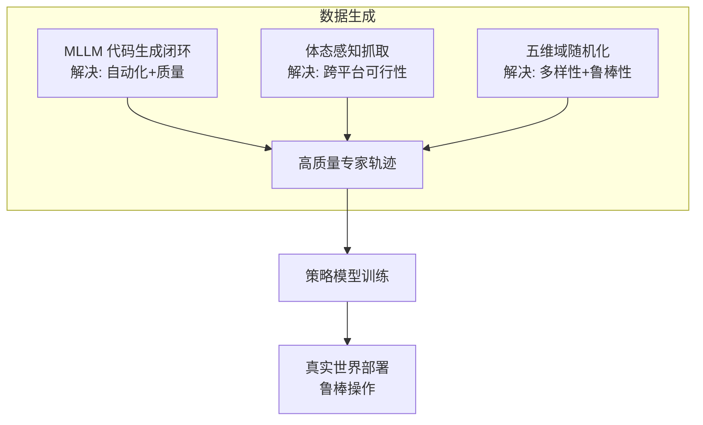

# 第 4 章：核心技术详解

> 本章目标：深入拆解 RoboTwin 2.0 的三大核心技术，让零基础读者真正"弄懂原理"。三大技术对应论文第 2 节：
> 1. **MLLM 专家代码生成闭环**（2.1 节）
> 2. **五维域随机化**（2.2 节）
> 3. **体态感知抓取适配**（2.3 节）

---

## 4.1 技术一：MLLM 专家代码生成闭环

### 4.1.1 为什么让大模型"写代码"而不是"直接出动作"？

这是一个重要的设计选择，值得理解：

| 方案 | 做法 | 优点 | 缺点 |
|------|------|------|------|
| 让 LLM 直接输出动作 | 输入画面→输出关节角度 | 端到端简单 | 大模型没见过机器人控制，极易出错 |
| **让 LLM 写"技能代码"** | 输入任务→输出 Python 调用 API 的代码 | 代码可检查、可执行、可纠错、语义明确 | 需要可靠的"技能 API 库" |

**RoboTwin 2.0 的选择**：让 MLLM **在 API 库的约束下写代码**。这等于给大模型一支"高级积木"，它只需要把积木按正确顺序拼起来。

> 💡 类比：不是让大模型直接开车（动作），而是让它用"方向盘、油门、刹车"这几个抽象接口写"驾驶步骤"。

### 4.1.2 三个输入条件（代码生成的前提）

代码智能体生成代码时被"喂"了三样东西：

```
输入 1：通用 API 列表
    grasp_actor(actor, arm_tag, ...)   # 抓取物体
    place_actor(actor, arm_tag, target_pose, ...)  # 放置物体
    move_by_displacement(...)          # 平移
    back_to_origin(...)                # 回原点
    open_gripper / close_gripper(...)  # 开关夹爪
    ...

输入 2：示例函数调用（few-shot 示例）
    展示几个"正确用法"

输入 3：层级化约束规格
    任务特定的约束（如"必须用左臂抓""约束模式=align"）
```

### 4.1.3 生成一个真实例子（论文附录 G.5 的 place_shoe）

我们来看看大模型为"放鞋子"任务生成的代码（节选，理解风格即可）：

```python
class gpt_place_shoe(place_shoe):
    def play_once(self):
        # 1. 保存初始画面
        self.save_camera_images(task_name="place_shoe", step_name="step1_initial_scene_state")

        # 2. 判断鞋子在左还是右，选择用哪只手
        shoe_pose = self.shoe.get_pose()
        arm_tag = ArmTag("left" if shoe_pose.p[0] < 0 else "right")

        # 3. 抓取鞋子
        self.move(self.grasp_actor(actor=self.shoe, arm_tag=arm_tag, pre_grasp_dis=0.1))

        # 4. 抬起鞋避免碰撞
        self.move(self.move_by_displacement(arm_tag=arm_tag, z=0.07, move_axis='world'))

        # 5. 获取目标块的功能点作为放置目标
        target_pose = self.target_block.get_functional_point(1, "pose")

        # 6. 放置鞋子（对齐约束）
        self.move(self.place_actor(actor=self.shoe, arm_tag=arm_tag,
                                   target_pose=target_pose, functional_point_id=0,
                                   constrain="align"))

        # 7. 抬爪、回原点、保存最终画面
        self.move(self.move_by_displacement(arm_tag=arm_tag, z=0.07, move_axis='world'))
        self.move(self.back_to_origin(arm_tag=arm_tag))
```

**你能看到的关键点**：
- 代码是**步骤化**的，每步有注释
- 用到了**功能点（functional point）**——物体的"关键位置"标注（第 5 章详述）
- 用 `arm_tag` 区分左右手——支持双臂
- 用 `constrain="align"` 指定对齐约束

### 4.1.4 闭环反馈：VLM 观察者怎么"挑错"

**执行日志（Execution Log）** 是"定量"反馈，能告诉我们：
- 哪些试次成功/失败
- 失败类型：代码不可执行 / 左手抓取失败 / 右手抓取失败 / 目标位置错误

**VLM 观察者**是"定性 + 定位"反馈：
- 逐帧看执行视频
- 判断每一步是否成功
- 定位失败发生在第几步
- 诊断根本原因（逻辑错误？API 用错？）

**一个 VLM 观察者的真实推理案例**（论文附录 G.4，挂杯子任务）：

> Step 1: 左臂成功从左侧拿起杯子
> Step 2: 左臂成功把杯子放到中间位置
> Step 3: 右臂成功从中间拿起杯子
> Step 4: 右臂尝试把杯子挂到架子上但**失败**
> Step 5: 右臂挂完正在移开
>
> 整体任务未完成。失败发生在 **Step 4**。代码中 `middle_target_pose` 是一个 list，而代码用了 `.p` 访问其属性，应改为 `middle_target_pose[0]`……（定位到具体代码行）

**厉害之处**：VLM 不仅能说"失败了"，还能说出"哪一行代码错了、怎么改"。

### 4.1.5 迭代流程与停止条件（回顾）

```
每轮：
  1. 生成/修复代码
  2. 仿真执行 10 次
  3. 生成执行日志 + VLM 观察
  4. 汇总两类反馈
  5. 修复代码

终止：
  ✅ 某轮成功率 > 50%  → 接受代码
  ❌ 连续 5 轮未达标  → 放弃
```

**评估指标回顾**（论文附录 G.1）：
- **ASR**：Average Success Rate，所有生成代码的平均成功率
- **Top5-ASR**：每任务取前 5 好的候选的成功率（模拟"择优选择"）
- **CR-Iter**：平均迭代轮数
- **Token**：生成代码的平均 token 数（成本）

### 4.1.6 小测验

1. 为什么选择"写代码"而不是"直接出动作"？
2. 代码生成的三个输入是什么？
3. 定量反馈（执行日志）和定性反馈（VLM）各自提供什么？
4. 停止条件是什么？

---

## 4.2 技术二：五维域随机化（Domain Randomization）

### 4.2.1 原理：为什么随机化有用？

**域随机化（Domain Randomization, DR）** 的核心思想：

> 训练时把环境"往死里随机"——物体乱摆、光线乱打、背景乱换——让策略学会在各种条件下都能完成任务。到了真实世界，无论环境如何，都落在模型"见过"的分布里。



### 4.2.2 五个维度的实现细节

#### 维度①：场景杂乱（Clutter）
- 从 RoboTwin-OD 采样**任务无关的干扰物**加到桌面
- 用**碰撞感知放置 + 预计算体积**保证物理合理
- **排除与任务物体视觉/语义相似的干扰物**，避免"模型看错对象"
- 每个物体带放置标注 → 通用 API 可自动插入

> 💡 类比：考试时故意在卷子里放几道"陷阱题"干扰项，训练"定力"。

#### 维度②：背景纹理（Background Textures）
**纹理库是怎么来的？**
1. 用 LLM 提示生成 + 网页爬取 → 1000 条表面描述（如"暖木纹桌面""大理石厨房台面"）
2. 用 **Stable Diffusion v2** 每条描述生成 20 张图 → 20000 张
3. 人工筛选 → **11000 张**高质量纹理

#### 维度③：光照变化（Lighting）
- 随机化：光**颜色、类型、强度、位置**
- 保持物理合理范围
- 效果：颜色温度改变会让物体外观剧烈变化（如暖光 vs 冷光下的鞋子）

#### 维度④：桌面高度（Tabletop Height）
- 在合理范围均匀随机（实验设置：≤3cm）
- 改变相机视角和机器人-物体空间关系

#### 维度⑤：语言指令（Language Instructions）
**两级生成**：
- **任务模板**：如 "用 {a} 把 {A} 放到 {B} 的左边"（60 个模板：50 训练 + 10 评测）
- **物体描述**：每个物体 15 条（如 041_shoe 有 "绿色鞋""青绿运动鞋""厚米色鞋底青绿跑鞋"……）

**组合方式**：
$$指令数 = 任务模板数 \times 物体描述数$$

一条轨迹的指令由"模板 + 物体描述"随机组合而成，产生**语言上的组合爆炸**，显著提升语言泛化。

### 4.2.3 五维随机化的"剂量"控制（为什么不是越随机越好）

- **语义冲突排除**：干扰物不能和任务物体长得太像（否则策略学混）
- **物理合理范围**：光照、高度都在合理区间（否则学到的模式不真实）
- **评估区分**：Easy（干净）与 Hard（随机化）两档，用于衡量"抗干扰能力"

> 🔑 **核心数字**：RoboTwin 2.0 中所有实验的域随机化包含：杂乱场景 + 随机光照 + 桌面高度变化（≤3cm）+ 未见语言指令 + 随机背景纹理。

### 4.2.4 小测验

1. 域随机化的核心思想一句话是什么？
2. 五维分别是哪五个？
3. 纹理库的生成流程是什么？最终多少张？
4. 为什么干扰物要排除"和任务物体相似"的？

---

## 4.3 技术三：体态感知抓取适配（Embodiment-Aware Grasp Adaptation）

### 4.3.1 问题本质：不同机械臂"手癖"不同

同一个罐子，不同的机械臂有**不同的最优抓法**：

| 机械臂 | DoF | 抓取偏好 |
|--------|-----|---------|
| Franka | 7 | 从上往下顶抓（top-down），精准 |
| Piper | 6（低） | 只能从侧面抓（side/lateral） |

**为什么低 DoF 需要侧抓？**
低 DoF 机械臂的**可达工作空间（reachable workspace）**小、手腕自由度少，无法摆出"从正上方垂直下压"的姿势。如果数据生成时强行要求顶抓，就会大量失败。

### 4.3.2 论文的做法（三步）

**第 1 步：丰富的候选操作位姿标注**
每个物体标注多个候选操作位姿，覆盖：
- 多个**抓取轴**（grasp axis）
- 多个**接近方向**（approach direction）

**第 2 步：偏向高可达方向的扰动**
施加**角度扰动**，且扰动偏向"机器人可达性更高"的方向，扩大可行抓取空间。

**第 3 步：并行运动规划**
用并行的运动规划尝试组合出最终候选，确保抓取在运动学上可行。


### 4.3.3 效果（预告，详见第 6 章）

| 平台 | RoboTwin 1.0 成功率 | RoboTwin 2.0 成功率 | 提升 |
|------|--------------------|--------------------|------|
| Aloha-AgileX | 65.1% | 78.8% | **+13.7%** |
| **Piper** | 2.4% | 25.1% | **+22.7%** |
| ARX-X5 | 68.6% | 74.2% | +5.6% |
| Franka | 67.3% | 67.2% | ≈0（本来就很灵活） |
| UR5 | 57.6% | 57.1% | ≈0（本来就很灵活） |

**关键结论**：体态感知抓取对**低自由度/受限平台**提升巨大，对高自由度平台提升有限（本来就能抓）。

### 4.3.4 小测验

1. 为什么低 DoF 机械臂更适合侧抓？
2. 体态感知抓取的三步流程是什么？
3. 实验结果说明了什么规律？

---

## 4.4 三大技术的协同关系

三大技术不是孤立的，它们共同服务于"造出高质量、多样、真实的数据"：



| 技术 | 主要解决 | 对应论文缺陷 |
|------|---------|-------------|
| MLLM 代码生成闭环 | 自动生成专家级轨迹 | 缺陷①（无自动化质量控制） |
| 五维域随机化 | 数据多样性与 sim-to-real | 缺陷②（环境过于简化） |
| 体态感知抓取 | 跨平台可行性 | 缺陷③（忽视 embodiment 差异） |

---

## 4.5 本章小结（自测清单）

1. 用你自己的话，讲清楚"代码生成闭环"是如何工作的。
2. 五维域随机化中，哪一维你最难理解？为什么论文需要它？
3. 体态感知抓取为什么能显著提升 Piper 但几乎不影响 Franka？
4. 三大技术如何形成"一个完整的数据生成系统"？

> **动手练习**：选一个日常双臂动作（如"剥香蕉"或"倒水"），尝试：
> - 把它拆成 API 步骤（像 4.1.3 那样写伪代码）
> - 设计三个域随机化维度来增强它
> - 思考低自由度机器人做这个动作会遇到什么困难
