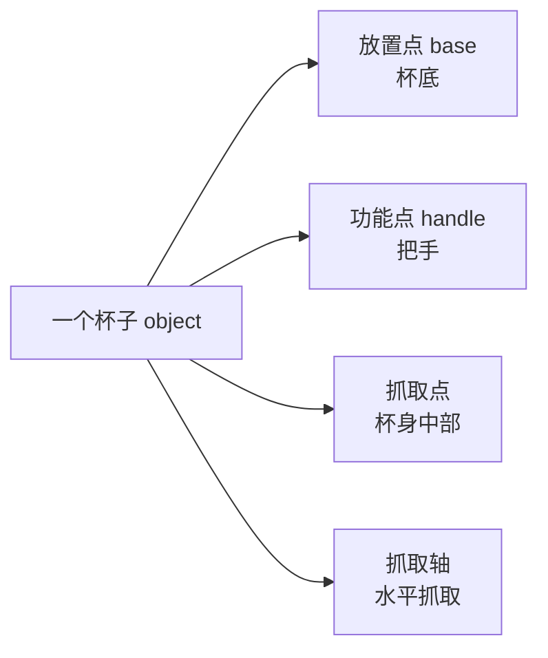

# 第 5 章：RoboTwin-OD 数据集与 50 任务基准

> 本章目标：理解 RoboTwin 2.0 的两大"实体资产"——对象库 RoboTwin-OD 和 50 任务基准，以及它们如何支撑数据生成与评测。

---

## 5.1 为什么要先建"对象库"？

想造"把物体从 A 放到 B"的数据，前提是仿真里**有物体**，而且物体要**足够真实、足够多、足够多样**。

RoboTwin-OD（RoboTwin Object Dataset）就是这样一个**3D 物体资产库**：
- **731 个物体实例**
- **147 个类别**（瓶子、碗、鞋、杯子、遥控器、电子产品、食物……）
- 全部带**语义标注**和**操作标注**

```mermaid
flowchart LR
    subgraph RoboTwin-OD (731 objects)
        A[自建物体 534个/111类]
        B[Objaverse 153个/27类]
        C[PartNet-Mobility 44个/9类]
    end
    A --> D[仿真场景]
    B --> D
    C --> D
```

---

## 5.2 RoboTwin-OD 的三部分构成

| 来源 | 数量 | 生成方式 | 用途 |
|------|------|---------|------|
| **自建物体** | 534 个 / 111 类 | Rodin 平台做 **RGB→3D 重建**，再**凸分解** + **网格合并**保证物理碰撞模型准确 | 主要操作物体 |
| **Objaverse** | 153 个 / 27 类 | 开源 3D 资产库 | 主要用于杂乱场景，增强**视觉与语义多样性** |
| **PartNet-Mobility** | 44 个 / 9 类 | SAPIEN 自带可活动物体 | **铰接/活动物体**（门、抽屉等）操作 |

> 💡 **为什么自建物体要做"凸分解"？**
> 3D 重建得到的网格往往形状复杂，物理引擎计算碰撞慢且不准。**凸分解（Convex Decomposition）** 把复杂形状拆成多个凸多面体，物理仿真又快又稳。

---

## 5.3 每个物体的两类标注（论文的匠心之处）

### 5.3.1 语言标注（Language Annotation）

每个物体有 **15 条**自然语言描述，从不同角度描述同一个物体。以 `041_shoe`（鞋子）为例：

> "green shoe"（绿鞋）
> "teal sneaker"（青绿运动鞋）
> "rubber sole running shoe"（橡胶底跑鞋）
> "blue and green running shoe"（蓝绿跑鞋）
> "teal running shoe with thick beige sole"（厚米色底青绿跑鞋）
> ……

**为什么需要 15 条？**
- 真实世界里同一物体有无数种叫法
- 训练时随机抽取描述 → 模型学会"无论怎么说都能理解"
- 这是"语言域随机化"的数据基础

### 5.3.2 操作标注（Manipulation Annotation / Affordance）

每个物体标出**关键点-轴**信息，告诉机器人"这个物体哪里能抓、哪里能放、哪里能按"：

| 标注 | 含义 | 例子 |
|------|------|------|
| **放置点** Placement Point | 物体平放时的支撑位置 | 瓶子底部 |
| **功能点** Functional Point | 物体的"功能位置"，用于交互 | 杯子把手、开关按钮 |
| **抓取点** Grasp Point | 夹爪应该夹的位置 | 瓶子中部 |
| **抓取轴** Grasp Axis | 夹爪的抓取方向 | 竖直 / 水平 |



**这些标注如何用？**
- 放置任务：`target_block.get_functional_point(1, "pose")` 获取目标功能点位姿
- 抓取任务：用抓取点和抓取轴规划夹爪位姿

> 🔑 **这些标注是"体态感知抓取"（第 4 章）的数据基石**——有了多轴多点的标注，才能为不同机器人生成不同抓法。

---

## 5.4 纹理库（支持背景域随机化）

- 来源：LLM 生成 + 网页爬取 → **1000 条**表面描述
- 生成：Stable Diffusion v2，每条描述 20 张 → **20000 张**
- 筛选：人工参与（human-in-the-loop）→ **11000 张**高质量纹理

纹理用于：桌面材质、背景墙面，让仿真场景视觉丰富、避免过拟合"干净仿真"。

---

## 5.5 50 任务基准（Benchmark）

### 5.5.1 任务从哪来？

任务 = **自动化任务生成框架（MLLM 代码生成闭环）** 的产物。也就是说：RoboTwin 2.0 不仅能自动生成单个任务的代码，还能**系统性地构建一大批任务**。

### 5.5.2 任务类别一览（理解多样性）

50+ 任务覆盖多种双臂协作模式：

| 类别 | 例子 |
|------|------|
| 抓取放置 | Place Shoe、Place Empty Cup、Pick Dual Bottles |
| 交接 | Handover Block、Handover Mic |
| 叠放 | Stack Bowls Two/Three、Stack Blocks Two/Three |
| 开合操作 | Open Laptop、Open Microwave |
| 按压/点击 | Press Stapler、Click Bell、Turn Switch |
| 倾倒 | Dump Bin Bigbin |
| 摇晃 | Shake Bottle、Shake Bottle Horizontally |
| 移动 | Move Can Pot、Move Playingcard Away |
| 复杂组装 | Place Burger Fries、Place Container Plate |

### 5.5.3 5 种机器人平台（Embodiment）

| 平台 | DoF | 特点 |
|------|-----|------|
| Aloha-AgileX | 6 | 低成本双臂，遥操作友好 |
| ARX-X5 | 6 | 低成本六轴 |
| Piper | 6 | 受限平台（论文重点提升对象） |
| Franka | 7 | 高灵活性，顶抓 |
| UR5 | 7 | 工业级，大工作空间 |

**还支持异构双臂组合**（附录 E）：
- 例如"左手 Franka + 右手 UR5"
- 通过**物体中心、与机器人无关（object-centric, embodiment-agnostic）**的数据生成框架实现
- 用 CuRobo 做 GPU 加速运动规划，支持各种运动学约束

> 💡 **创新点**：多数数据集只支持单一固定平台。RoboTwin 2.0 支持"任意组合双臂"，为跨平台研究铺路。

### 5.5.4 数据集规模

- **10 万+ 条**预采集双臂轨迹
- 每条轨迹包含：多视角图像、关节动作、语言指令
- 公开下载：HuggingFace `TianxingChen/RoboTwin2.0`

---

## 5.6 评测协议（怎么用这些数据做基准）

RoboTwin 2.0 作为基准，定义了标准化的评测方式（详见第 8 章实操）：

| 设置 | 训练数据 | 评测环境 | 目的 |
|------|---------|---------|------|
| **Easy（干净）** | 每任务 50 条干净演示 | 干净环境 | 测"基本能力" |
| **Hard（随机化）** | 同上（训练不变） | 杂乱 + 随机光照/纹理/高度 | 测"鲁棒性" |

**评测流程**：
- 每任务 50 条干净演示训练
- 100 次 rollout（rollout = 让模型执行一次任务）测试
- 报告成功率

**支持评测的策略**：ACT、DP、RDT、Pi0、DP3 等 5+ 种（详见第 8 章）。

---

## 5.7 与现有基准的对比（论文附录 B，帮你看清定位）

| 基准 | 任务数 | 域随机化 | 自动数据生成 | VLA 训练评测 |
|------|-------|---------|-------------|-------------|
| Meta-World | 50 | ✕ | ✓ | ✕ |
| Robosuite | 9 | ✕ | ✕ | ✕ |
| RoboCasa | 25 | ✓ | ✕ | ✕ |
| ManiSkill2 | 20 | ✕ | ✓ | ✕ |
| AutoBio | 16 | ✕ | ✓ | ✓ |
| RoboTwin 1.0 | 14 | ✕ | ✓ | ✓ |
| **RoboTwin 2.0** | **50** | **✓** | **✓** | **✓** |

**RoboTwin 2.0 的差异化**：**同时**满足"任务多 + 有域随机化 + 自动数据生成 + 支持 VLA 训练评测"——四项全占。

---

## 5.8 本章小结（自测清单）

1. RoboTwin-OD 由哪三部分构成？各自来源和用途？
2. 每个物体的"语言标注"和"操作标注"分别是什么？为什么重要？
3. 纹理库怎么来的？有多少张？
4. 50 任务覆盖哪些协作模式？请举例。
5. 5 种平台各自特点？为什么支持异构双臂组合？
6. Easy/Hard 评测协议有何区别？
7. 相比其他基准，RoboTwin 2.0 的差异化优势是什么？

> **动手练习**：访问 RoboTwin 对象文档（https://robotwin-platform.github.io/doc/objects/），挑 3 个你感兴趣的物体，观察它们的语言描述和功能点标注；再访问任务文档（https://robotwin-platform.github.io/doc/tasks/），给 3 个任务标注"属于哪类协作模式"。
