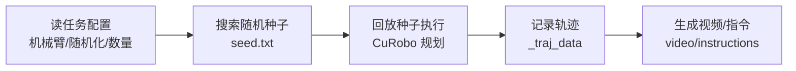

# 第 7 章：环境搭建与实战（安装 + 数据采集）

> 本章目标：从零开始在 Linux 机器上安装 RoboTwin 2.0，下载资源，并跑通第一条"数据采集"命令。
>
> ⚠️ **重要声明**：本章命令基于官方文档（https://robotwin-platform.github.io/doc/usage/）编写。由于软件持续更新，如遇命令失效，**请以官方最新文档为准**。所有命令请在自己的环境里逐步执行、理解每一步。

---

## 7.0 先做硬件自检（不要跳过！）

RoboTwin 2.0 依赖 GPU 渲染和物理仿真，硬件要求较严：

| 项目 | 要求 | 说明 |
|------|------|------|
| 操作系统 | **Linux 优先** | Windows 部分支持、MacOS 不支持（SAPIEN 限制） |
| Python | **3.10** | 官方指定版本 |
| CUDA | **12.1（推荐）** | 显卡驱动需支持 |
| 渲染 | NVIDIA / AMD GPU | 必须 |
| 光线追踪 | NVIDIA RTX 或 AMD 同级 | 可选但影响画质 |
| GPU 仿真 | NVIDIA GPU | 物理仿真加速 |

> 💡 **避坑提醒**：官方建议**避免使用 A/H/V 系列 GPU**（数据采集/评测可能卡住，见官方 common-issue #3）。

---

## 7.1 环境搭建四步走

### 第 1 步：安装 Vulkan（Linux 渲染依赖）

```bash
# 若未安装 Vulkan，执行：
sudo apt install libvulkan1 mesa-vulkan-drivers vulkan-tools

# 验证：
vulkaninfo
```

### 第 2 步：创建 conda 环境

```bash
conda create -n RoboTwin python=3.10 -y
conda activate RoboTwin
```

### 第 3 步：克隆代码并安装基础环境

```bash
git clone https://github.com/RoboTwin-Platform/RoboTwin.git
cd RoboTwin

# 一键安装基础环境和 CuRobo 运动规划器
bash script/_install.sh

# 若遇到 curobo 配置路径问题：
python script/update_embodiment_config_path.py
```

> 💡 如果 `_install.sh` 失败，参考"手动安装"（见 7.2 节）。**pytorch3d 安装失败不影响功能**（只用于 3D 数据）。ffmpeg 需另行安装（`ffmpeg -version` 验证）。

### 第 4 步：下载资源（RoboTwin-OD、纹理库、机械臂模型）

```bash
bash script/_download_assets.sh
```

若遇到 HuggingFace 限流，先登录：
```bash
huggingface-cli login
```

下载完成后 `assets/` 目录结构应如下：

```text
assets/
├── background_texture   # 11000 张纹理
├── embodiments          # 各机械臂模型
│   ├── embodiment_1
│   │   ├── config.yml
│   │   └── ...
│   └── ...
├── objects              # RoboTwin-OD 731 物体
└── ...
```

> 🕐 **官方提示**：完整安装约 **20 分钟**。

---

## 7.2 手动安装（仅当一键安装失败时）

```bash
# 1. 安装 requirements
pip install -r requirements.txt

# 2. 安装 pytorch3d（失败可跳过，仅 3D 数据需要）
pip install "git+https://github.com/facebookresearch/pytorch3d.git@stable"

# 3. 安装 CuRobo
cd envs
git clone https://github.com/NVlabs/curobo.git
cd curobo
pip install -e . --no-build-isolation
cd ../..

# 4. 修改 mplib（重要！）
# 找到 mplib 安装位置：pip show mplib
# 编辑 mplib/planner.py 第 807 行附近，删除 `or collide`：
#   修改前：
#   if np.linalg.norm(delta_twist) < 1e-4 or collide or not within_joint_limit:
#       return {"status": "screw plan failed"}
#   修改后：
#   if np.linalg.norm(delta_twist) < 1e-4 or not within_joint_limit:
#       return {"status": "screw plan failed"}
```

---

## 7.3 理解代码仓库结构（很重要！）

```text
RoboTwin/
├── assets/            # 下载的资源（物体、纹理、机械臂）
├── code_gen/          # 自动代码生成相关
├── data/              # 采集的数据输出目录
├── description/       # 任务/物体描述生成
├── envs/              # 仿真环境与任务脚本（核心！）
│   └── curobo/        # 手动安装的规划器
├── policy/            # 策略训练代码（ACT/DP/RDT/Pi0...）
├── script/            # 脚本（安装、下载、启动）
├── task_config/       # 任务配置文件
├── collect_data.sh    # ★ 数据采集入口
└── README.md
```

---

## 7.4 数据采集实战

### 7.4.1 官方推荐：自己采集数据

官方**强烈建议自己采集**而不是直接下载预采集数据，因为任务和平台的可配置性高、多样性大。

### 7.4.2 一条命令跑通数据采集

```bash
bash collect_data.sh ${task_name} ${task_config} ${gpu_id}
```

**示例**（采集 `beat_block_hammer` 任务的随机化演示，用 0 号 GPU）：

```bash
bash collect_data.sh beat_block_hammer demo_randomized 0
```

**参数说明**：
- `${task_name}`：任务名，如 `beat_block_hammer`、`handover_block`、`stack_bowls_two`（全部任务见官方文档）
- `${task_config}`：配置名，`demo_clean`（干净）/ `demo_randomized`（域随机化）
- `${gpu_id}`：GPU 编号，从 0 到 N-1

### 7.4.3 这条命令背后发生了什么？（理解比跑通更重要）



官方原话要点：
- 先**搜索随机种子**（找出能成功采集的随机场景）
- 再**回放种子**采集数据
- 全流程**全自动**，一条命令搞定

### 7.4.4 采集结果存哪里？

```text
data/${task_name}/${task_config}/
├── *.h5              # 每条轨迹一个 HDF5（观测+动作）
├── instructions/     # 语言指令
├── video/            # 头戴相机视频
├── seed.txt          # 随机种子（可复现）
└── scene_info.json   # 场景信息
```

**图像位流还原**：
```python
import cv2, numpy as np
image = cv2.imdecode(np.frombuffer(image_bit, np.uint8), cv2.IMREAD_COLOR)
```

### 7.4.5 修改任务配置（进阶）

- 想换机械臂、改随机化开关、改采集数量？
- 修改 `task_config/` 下的任务配置文件
- 详见官方 [Configurations 文档](https://robotwin-platform.github.io/doc/usage/configurations.html)

---

## 7.5 也可以直接用预采集数据

不想自己采集？官方在 HuggingFace 提供了 **10 万+ 条**预采集轨迹：

- 数据集地址：https://huggingface.co/datasets/TianxingChen/RoboTwin2.0
- 对象库：`objects.zip`
- 用法：下载后放入对应目录

> 💡 **建议**：第一次跑通流程，直接用小批量自己采集（几十条），理解数据格式后再决定是否用全量预采集数据。

---

## 7.6 常见问题速查（详见官方 common-issue）

| 症状 | 可能原因 | 排查方向 |
|------|---------|---------|
| 卡住不动 | 使用了 A/H/V 系列 GPU | 换 GPU 或看官方 issue #83 |
| Vulkan 报错/段错误 | 缺 graphics 能力（尤其 Docker） | 设置 `NVIDIA_DRIVER_CAPABILITIES=compute,utility,graphics` |
| curobo 路径问题 | 配置路径未更新 | 运行 `python script/update_embodiment_config_path.py` |
| HF 下载限流 | 未登录 | `huggingface-cli login` |
| pytorch3d 警告 | 未安装 | 忽略即可（除非用 3D 数据） |

---

## 7.7 本章小结（自检清单）

1. 搭建环境需要满足哪些硬件/软件要求？
2. 安装四步分别是哪四步？
3. `assets/` 目录下应该有哪几类文件？
4. `collect_data.sh` 的三个参数分别是什么？
5. 采集后的数据存在哪里？格式是什么？
6. 如果安装失败，手动安装的关键步骤是什么（尤其 mplib 修改）？

> **动手练习**：如果你有 GPU 机器，完成环境搭建并用 `bash collect_data.sh beat_block_hammer demo_clean 0` 采集 1 条数据，然后用 7.4.4 的代码读取一张图，验证流程跑通。若没有 GPU，请通读并写出每一步的"目的"。
