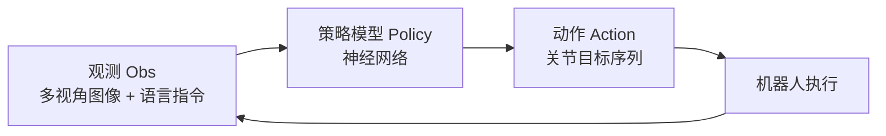
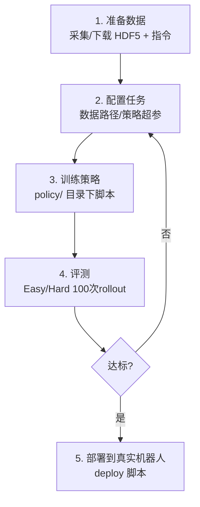

# 第 8 章：策略训练与部署

> 本章目标：理解"什么是策略模型"，学会用 RoboTwin 2.0 数据训练 5 种主流策略（ACT、DP、DP3、RDT、Pi0），并进行评测与部署。
>
> 本章是"实战进阶"章节。命令细节以官方文档为准（页面：https://robotwin-platform.github.io/doc/usage/）。

---

## 8.1 什么是"策略"（Policy）？

**策略（Policy）** = 机器人的"大脑"。它接收**观测**（摄像头画面、语言指令），输出**动作**（关节角度、夹爪开合）。



**训练方式**：给策略看"专家怎么做"（来自 RoboTwin 2.0 的演示数据），让它学会"看到什么场景就做什么动作"——这就是**模仿学习**。

---

## 8.2 论文中用到的 5 种策略（先认识它们）

| 策略 | 全称 | 核心思想 | 是否预训练 | 输入类型 | 特点 |
|------|------|---------|-----------|---------|------|
| **ACT** | Action Chunking with Transformers | 一次预测一段动作序列，减少累积误差 | 否 | RGB 图像 | 简单、易训练 |
| **DP** | Diffusion Policy | 用扩散模型生成动作（从噪声迭代去噪） | 否 | RGB 图像 | 表达能力强 |
| **DP3** | 3D Diffusion Policy | 用 3D 点云 + 扩散生成动作 | 否 | **点云** | 3D 信息强，样本高效 |
| **RDT** | Robotic Diffusion Transformer | 扩散 + Transformer 的双臂基础模型 | **是（1B）** | 图像+语言 | 大规模预训练 |
| **Pi0 (π0)** | Vision-Language-Action Flow Model | 流匹配生成动作的 VLA 基础模型 | **是** | 图像+语言 | 通用性强 |

> 🔑 **理解两种类型**：
> - **非预训练（ACT/DP/DP3）**：从随机初始化学，像"没上过学的新兵"
> - **预训练（RDT/Pi0）**：已在百万级数据上学过，像"老练的转业军人"，微调即可上手

---

## 8.3 训练细节（来自论文附录 D，可复现的配置）

| 策略 | 训练细节 |
|------|---------|
| **ACT** | chunk size=50、batch size=8、单卡、6000 epoch、部署时用 temporal_agg 时间聚合 |
| **DP** | 600 epoch、batch size=128、规划视野 horizon=8 |
| **DP3** | 3000 epoch、batch size=256、horizon=8、点云分辨率 1024、精确背景/桌面分割 |
| **RDT** | 预训练 10 万步、batch size=16/卡、8 卡；单任务微调 1 万步、4 卡 |
| **Pi0** | 预训练 10 万步、batch size=32；微调 3 万步 |

> 💡 **术语解释**：
> - **chunk size（动作块大小）**：一次预测多少步动作
> - **horizon（规划视野）**：预测未来多长一段动作
> - **epoch（轮次）**：把全部训练数据过一遍 = 1 个 epoch

---

## 8.4 典型训练流程（以 RoboTwin 2.0 数据为例）



**关键配置项**（RoboTwin 官方 Policy Baselines 页面）：
- 数据目录：`data/${task_name}/${task_config}`
- 任务配置：`task_config/`
- 训练脚本：`policy/` 下各策略目录

> ⚠️ 具体训练命令以官方各策略文档为准（ACT.html、DP.html、DP3.html、RDT.html、Pi0.html）。教程不照搬易过时的命令，教你"读文档的方法"。

---

## 8.5 如何"读懂"一份策略训练文档（重要技能）

面对官方策略文档，抓住这 5 个要素即可上手：

1. **安装**：需要哪些依赖（如 PyTorch、点云库）
2. **数据**：数据放哪、格式要求（是否要 point cloud、深度图）
3. **训练命令**：照抄、改路径/GPU
4. **评测命令**：Easy/Hard 设置如何配置
5. **部署**：真机需要哪些额外配置（相机、标定）

> 💡 以 DP3 为例：它需要**点云输入**，因此 RoboTwin 数据必须包含深度/点云信息——这就是为什么论文说 DP3 的强结果部分来自"仿真里完美的点云与背景分割"。

---

## 8.6 评测（Evaluation）怎么做？

RoboTwin 2.0 作为基准，标准评测协议（对应论文 4.5 节）：

| 设置 | 训练数据 | 评测环境 | 目的 |
|------|---------|---------|------|
| **Easy（干净）** | 每任务 50 条干净演示 | 干净环境 | 测基本任务能力 |
| **Hard（随机化）** | 同上（**训练完全一致**） | 杂乱+随机光照/纹理/高度 | 测鲁棒性 |

**执行方式**：
- 每个任务 100 次 rollout（让策略从头执行 100 遍）
- 统计成功率
- 结果可提交到官方 Leaderboard：https://robotwin-platform.github.io/leaderboard

> 🔑 **Easy 与 Hard 的区别只在"评测环境"**，训练数据相同。这确保了公平对比"谁的策略更能抗干扰"。

---

## 8.7 部署到真实机器人（Deployment）

论文真机实验用的是 **COBOT-Magic 双臂平台**。部署通常包含：

```text
真实机器人部署清单
├── 机器人本体（COBOT-Magic / Aloha 等）
├── 摄像头 + 标定（相机外参内参）
├── 遥操作/演示采集设备（采集真机演示）
├── 推理服务器（GPU 加载策略模型）
└── 部署脚本（接收观测→输出动作→下发执行）
```

**关键点**：
- 部署前务必做**相机标定**（论文提到对相机位姿加随机扰动来模拟标定误差，提升鲁棒性）
- RoboTwin 支持"部署你自己的策略"：https://robotwin-platform.github.io/doc/usage/deploy-your-policy.html

---

## 8.8 从论文实验得到的"实战经验"

1. **小数据量任务**：优先考虑 DP3（点云）或预训练 VLA（RDT/Pi0），样本效率高
2. **要鲁棒性**：训练时务必用**域随机化数据**（第 6 章实验三证明）
3. **要通用性**：用预训练 VLA（RDT/Pi0），在 Hard 下抗跌
4. **低成本入门**：先跑通 ACT/DP（训练快、资源少），再进阶 VLA
5. **对比要公平**：用统一 Easy/Hard 协议，才可与其他方法比较

---

## 8.9 本章小结（自检清单）

1. 什么是策略？它接收什么、输出什么？
2. 5 种策略各用什么输入？哪些是预训练的？
3. ACT 和 DP 的核心思想差异是什么？
4. Easy/Hard 评测协议的关键设计（训练相同、评测不同）是什么？
5. DP3 为什么 Easy 强、Hard 弱？
6. 部署真实机器人需要哪些准备工作？

> **动手练习**：任选一个策略（建议从 ACT 或 DP 开始），按官方文档在你的数据上跑通"训练 → Easy/Hard 评测"全流程，记录成功率，并尝试回答："如果换成域随机化数据，成功率会怎么变？"
