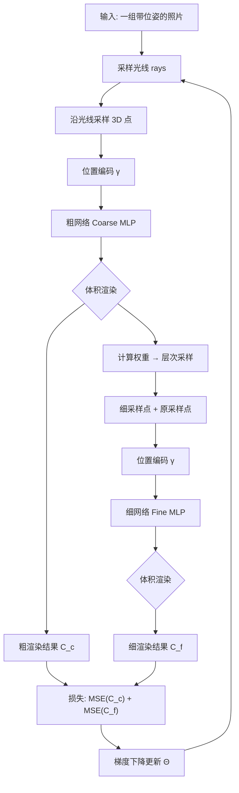

# 第 1 章 论文速览与背景

> 本章是全教程的入口：1.2–1.3 先按 CONSTRAINTS §3.4 的"问题导向五步法"把**问题本身**与**核心表示**各展开一个概览级五步块；1.5 对论文三大贡献中的三大关键技术（体积渲染 / 层次采样 / 位置编码）各给一个**概览级**五步块——⑤ 只给推导路线图，完整推导分别指向第 3、4、5 章。

## 1.1 论文基本信息

| 项目 | 内容 |
|------|------|
| **标题** | NeRF: Representing Scenes as Neural Radiance Fields for View Synthesis |
| **作者** | Ben Mildenhall, Pratul P. Srinivasan, Matthew Tancik（UC Berkeley）+ Jonathan T. Barron（Google Research）+ Ravi Ramamoorthi（UC San Diego）+ Ren Ng（UC Berkeley） |
| **发表** | ECCV 2020（欧洲计算机视觉会议） |
| **单位** | UC Berkeley / Google Research / UC San Diego |
| **任务** | **新视角合成（Novel View Synthesis）**：给定一组带相机位姿的照片，渲染出任意新视角的图像 |
| **核心创新** | 把场景表示为连续的 **5D 神经辐射场**，用可微体积渲染优化 |

> 📄 论文 LaTeX 源码位于 [papers/nerf/latex/arxiv_submission.tex](../../papers/nerf/latex/arxiv_submission.tex)，配套参考实现位于 [projects/nerf/](../../projects/nerf/README.md)。

---

## 1.2 要解决的问题

**新视角合成**是计算机视觉/图形学的经典问题：

> 给你一个场景的若干张照片（已知每张照片的相机位置和朝向），能否"脑补"出从没拍过的角度看到的画面？

传统方法有两大流派：

1. **网格（Mesh）类**：先重建 3D 几何（如三角网格），再贴纹理。但复杂真实场景（毛发、半透明、反射）很难用网格表达，且基于梯度优化网格容易陷入局部最优。
2. **体素（Voxel）类**：用离散的三维体素格存储颜色/密度。简单直接、适合梯度优化，但**分辨率受限于存储**——想要高清就得把体素格切得极细，存储和计算开销爆炸。

**① 问题场景** 手头：一个场景的若干张照片，每张都带相机位姿（位置 + 朝向；合成数据由渲染器直接给出真值位姿，真实数据由 COLMAP 等 SfM 工具标定）。缺的：没拍过的角度的画面——不可能为每个视角都去现场补拍；也不存在该场景的任何 3D 几何模型、深度图或材质数据。想要的：一个只凭这组照片学出的场景表示，能渲染**任意新视角**，且细节（高频纹理、锐利边缘、高光）不糊。难点：监督信号只有 2D 像素，从"2D 照片"到"3D 表示"的桥在哪里？

**② 解决方法** NeRF 的总路线分四步（概览；逐项完整展开见第 2–5 章）：(1) 把场景表示为**连续 5D 神经辐射场** $F_\Theta: (\mathbf{x}, \mathbf{d}) \mapsto (\mathbf{c}, \sigma)$（第 2 章）；(2) 沿相机光线对辐射场做**可微体积渲染**得到像素颜色，以"渲染像素 ≈ 真实照片"的光度误差端到端优化（论文 Eq.1–Eq.3，第 3 章）；(3) **位置编码**补齐 MLP 拟合高频的能力（论文 Eq.4，第 4 章）；(4) **层次采样**把有限的采样预算集中到可见内容上（论文 Eq.5–Eq.6，第 5 章）。

**③ 选型理由** 候选方案逐一对比（背景表见 1.4）：

- **(a) 网格（mesh）+ 纹理**：先重建显式几何再渲染。优点：渲染快、可复用成熟光栅化管线。代价：毛发、半透明、反射类结构难以网格化；且网格优化难以直接用光度损失——可见性与光栅化对顶点位置不可微，梯度链断裂，易陷局部最优。
- **(b) 体素 / 多平面图（MPI）类离散体积**（Neural Volumes、LLFF）：用 CNN 预测离散化的 RGBα 网格。优点：可微、好优化。代价：**分辨率被存储锁死**——"渲染更高分辨率图像需要更精细的 3D 采样"（论文 §2），内存与计算随分辨率立方增长（LLFF 单场景 >15 GB）；LLFF 还要求输入视角视差不超过 64 像素，大基线时几何估错（论文 §6.3）。
- **(c) 隐式曲面 + 每光线单深度单颜色**（SRN、DVR 等可微渲染路线）：把场景压成一张隐式表面，每条光线只取一个交点颜色。优点：渲染快。代价："受限於简单形状、输出过度平滑"（论文 §6.3 对 SRN 的批评）——单深度单颜色天然表达不了半透明与多层遮挡。
- **NeRF（本文）**：把"连续"藏进 MLP 权重——查询点是连续的，**无分辨率上限**；权重仅 5 MB（约为 LLFF 的 1/3000）；整条渲染链可微，直接以照片为监督。代价：每像素要积分数十至数百次网络查询，训练 1–2 天/场景。本文的设定是**离线逐场景优化、精度优先于速度**——值得。

**④ 理论依据** 问题的两条既有路线及其瓶颈的完整综述见论文 §2；NeRF 的表示论继承隐式神经表示（DeepSDF, Park et al., CVPR 2019；SRN, Sitzmann et al., NeurIPS 2019）与可微渲染（DVR, Niemeyer et al., CVPR 2020）；渲染论继承体积渲染（Max, *"Optical Models for Direct Volume Rendering"*, IEEE TVCG 1995）。

**⑤ 完整推导（概览级路线图）** 本章不展开推导，只给路线图与去向：

| 推导环节 | 完整版去向 |
|----------|-----------|
| 为什么 5D 够、全光函数如何降维 | 第 2 章 (2.1)–(2.2) |
| 光度监督如何驱动 3D 结构（多视图一致性） | 第 2 章 (2.3) |
| 体积渲染：σ 的概率解读 → 透射率 ODE → Eq.1 → 离散 alpha 合成 Eq.3 | 第 3 章 §3.1–3.5，(3.1)–(3.16) |
| 位置编码：谱偏置 → γ 的构造与频谱论证 Eq.4 | 第 4 章 §4.1–4.2，(4.1)–(4.2) |
| 层次采样：权重 → PDF → 逆变换采样 Eq.5，联合损失 Eq.6 | 第 5 章 §5.1–5.4，(5.1)–(5.5) |

**NeRF 的关键洞察**：既然问题在于"离散表示的分辨率瓶颈"，那干脆**放弃离散格，直接用神经网络编码一个连续的 3D 函数**。

---

## 1.3 核心思想：什么是"辐射场"？

**① 问题场景** 手头：1.2 的照片 + 位姿。缺的：一个"可查询"的场景函数——给定空间**任意**点与观察方向，它要回答两件事：光从这里朝该方向发出是什么颜色（外观），以及光走到这里有多容易被挡住（几何）。想要的：这个函数必须连续（任意实数坐标可查）、可微（能被梯度下降优化）、并且**不需要 3D 真值**，仅凭照片即可学出。

**② 解决方法** NeRF 把场景表示为一个**连续的 5D 函数**：

$$
F_\Theta: (\mathbf{x}, \mathbf{d}) \mapsto (\mathbf{c}, \sigma)
$$

- 输入：
  - 3D 空间位置 $\mathbf{x} = (x, y, z)$
  - 2D 观察方向 $(\theta, \phi)$（实际用单位向量 $\mathbf{d}$ 表示）
- 输出：
  - 体密度 $\sigma$（该点"阻挡光线的程度"，类似不透明度）
  - 视角相关的颜色 $\mathbf{c} = (r, g, b)$

**直觉理解**：整个三维场景 = 一个"雾"的空间。每一点的密度决定这里有多"实"，颜色决定从这里发向某个方向的光是什么颜色。渲染时沿一条光线"穿过雾"，把沿途的颜色按透明度叠加，就得到照片上那个像素的颜色。

一个关键设计：**密度只依赖位置 $\mathbf{x}$，颜色才依赖位置 + 方向**。这保证了多视图一致性（同一个物理点在任意视角下密度相同），同时又能表达高光、镜面等视角相关的外观（同一个点从不同角度看颜色不同）。

**③ 选型理由** 显式几何三候选 vs 连续隐式场：

| 表示 | 存什么 | 优点 | 代价 |
|------|--------|------|------|
| 网格（mesh） | 顶点 + 面片 + 纹理 | 渲染快；锐利硬表面友好 | 拓扑/重建难；软边缘与半透明难表达；对顶点不可微 |
| 点云（point cloud） | 离散点 + 属性 | 采集直接 | 无连续表面，渲染需重建（泊松）或 splatting；密度语义弱 |
| 体素（voxel grid） | $N^3$ 网格上的颜色/密度 | 结构规则、易卷积 | 存储 $\propto N^3$，分辨率被内存锁死；边界量化伪影 |
| **连续隐式场（NeRF）** | MLP 权重（5 MB） | 查询点连续、无分辨率上限、可微、紧凑 | 每次查询一次网络前向，渲染需上百次查询 |

对比可见：本场景（精度优先、需要半透明与软边缘、监督只有照片）下，"查询贵"的代价换来"连续 + 可微 + 紧凑"，值得（与 1.2 ③ 同一逻辑在表示层的落地）。

**④ 理论依据** 全光函数（plenoptic function, Adelson & Bergen, 1991）与光场（light field, Levoy & Hanrahan, SIGGRAPH 1996）——"拍照 = 对光场切片"的表示论源头；辐射度量学中辐射度（radiance）的概念；隐式神经表示的工程形态（DeepSDF / SRN，见 1.2 ④）。

**⑤ 完整推导（概览级路线图）** 该表示有两处需要论证，均指向后续章节：

1. **为什么 5D 够用**：从 7D 全光函数 $(x,y,z,\theta,\phi,\lambda,t)$ 出发——静态场景去掉时间 $t$、RGB 三通道离散化去掉波长 $\lambda$，得到 5D；NeRF 不再假设"发光点都在表面上"（表面光场可再降一维），因为有半透明介质，保留位置自由度。逐步推导见第 2 章 (2.1)–(2.2)。
2. **这个函数如何被照片优化**：需要"沿光线积分"的渲染规则把 3D 场变成 2D 像素，再证明多视图一致性成立——分别见第 3 章 Eq.1–Eq.3 与第 2 章 (2.3)。

---

## 1.4 为什么之前的方法做不到？

> 本节是上文 ③ 选型理由的展开材料（前作对比表），不含独立知识点；各方法的推导级对比见其引用章节。

| 方法 | 表示方式 | 瓶颈 |
|------|---------|------|
| DeepSDF / OccupancyNet | MLP 编码 SDF/占用场 | 需要真实 3D 几何监督（ShapeNet 等） |
| Scene Representation Networks (SRN) | 隐式曲面 + RNN 步进 | 每光线只取一个深度一个颜色，无法表达复杂场景 |
| Neural Volumes (NV) | CNN 预测 $128^3$ 体素格 | 显式离散格，分辨率受限 |
| Local Light Field Fusion (LLFF) | CNN 预测多平面图(MPI) | 存储巨大（单场景 15GB+），大基线时几何不准 |
| **NeRF（本文）** | **MLP 编码连续 5D 函数** | **权重仅 5MB，连续无分辨率上限** ✅ |

NeRF 用"参数"换"分辨率"：网络权重本身就是场景表示，**连续、可微、紧凑**。

---

## 1.5 论文的三大贡献

> 原文在 Introduction 末尾以 `compactenum` 列出，是论文的"卖点清单"：

1. **把复杂场景表示为 5D 神经辐射场**（参数化为基本 MLP 网络）——五步展开见 1.3；
2. **基于经典体积渲染的可微渲染流程**，并配套**层次采样策略**（hierarchical sampling），把 MLP 的容量分配给真正有可见内容的区域——下面给两个概览级五步块；
3. **位置编码（positional encoding）**：把输入 5D 坐标映射到高维空间，使 MLP 能表达高频内容——下面给一个概览级五步块。

这三个贡献对应论文第 3、4、5 章，也是本教程后续 4 章的核心内容。

### 贡献 2a｜体积渲染（概览级五步块）

**① 问题场景** 手头：1.3 的 5D 连续场（任意点可查 $\mathbf{c}, \sigma$）与一条相机光线 $\mathbf{r}(t) = \mathbf{o} + t\mathbf{d}$。缺的：把 3D 场"投影"成 2D 像素颜色的规则——场本身不是图像，每个像素对应的是**一整条光线**沿途的无数点。想要的：一个物理正确、可微的投影积分，使"渲染像素 ≈ 照片像素"可成为训练目标。

**② 解决方法** 沿光线做**期望颜色**积分：把介质抽象为"吸收粒子雾"，逐段按"到达概率 × 终止概率 × 颜色"累加——连续形式即论文 Eq.1，离散化为 alpha 合成即论文 Eq.3（实现见 `projects/nerf/nerf/render.py::volume_render`）。

**③ 选型理由** 候选投影规则：(a) 表面求交（每光线取首个命中点，SRN/DVR 路线）——单深度单颜色，表达不了半透明、烟、多层遮挡，且 MLP 只给密度不给表面、求交不可微；(b) 屏幕空间 warp/混合（LLFF 的 MPI）——逐输入视角存表示、视角间混合不一致；(c) 体积积分——半透明与软边缘天然支持、全链初等函数可微。代价：每光线 $N$ 次网络查询（开销大头，引出层次采样）。精度优先场景下取 (c)。

**④ 理论依据** 体积渲染方程（Max, *"Optical Models for Direct Volume Rendering"*, IEEE TVCG 1995）；辐射传输方程只取吸收-发射项的特例（Chandrasekhar, *Radiative Transfer*, 1950）；$\sigma$ 的概率解读（Kajiya & von Herzen, SIGGRAPH 1984）。

**⑤ 完整推导（概览级路线图）** 推导链条：$\sigma\,\mathrm{d}t$ 的微分概率（第 3 章 (3.1)）→ 透射率微分方程 (3.2)–(3.3) → 分离变量解 $T(t)$ (3.4) → 首撞概率密度 (3.5) → 连续渲染积分 Eq.1 → 分段常数离散化 (3.12)–(3.14) → alpha 合成 Eq.3，每步注明依据；完整推导见第 3 章 §3.1–3.5。

### 贡献 2b｜层次采样（概览级五步块）

**① 问题场景** 手头：Eq.1 的连续积分需要数值化，每条光线的查询预算 $N$ 有限（速度约束）。缺的：观察——可见表面只占光线区间的窄段，均匀采样把预算撒在 $\sigma\approx 0$ 的自由空间与表面背后的被遮挡区，"白查"。想要的：把查询集中到**对渲染有贡献**的区域，且不需要任何外部几何信息。

**② 解决方法** coarse/fine 双网络（论文 Eq.5–Eq.6）：coarse 网络均匀分层采 $N_c=64$ 点渲染 $\hat C_c$，其权重 $w_i$ 归一化后成为沿光线的分段常数 PDF；按此 PDF 逆变换采样 $N_f=128$ 细点，与粗点合并后送 fine 网络重渲染 $\hat C_f$（最终输出）；两项渲染同时监督。

**③ 选型理由** 候选：(a) 直接加大 $N$——开销线性涨，自由空间照旧白查（消融 no-hier 256：256 个均匀点比 64+128 层次点还差 0.95 dB 且更贵，第 7 章）； (b) 先估表面再采样——表面信息恰是未知的，鸡生蛋； (c) 用 coarse 渲染的权重当"免费的重要性分布"——一次粗渲染同时产出粗颜色与采样 PDF。代价：双网络参数与显存翻倍。消融支持，值得。

**④ 理论依据** 重要性采样与分层采样的方差缩减（蒙特卡洛方法标准结论，如 Owen, *Monte Carlo theory, methods and examples*）；体渲染中按贡献采样的思想源头（Levoy, *"Efficient Ray Tracing of Volume Data"*, ACM TOG 1990）；逆变换采样（概率论标准定理）。

**⑤ 完整推导（概览级路线图）** 推导链条：权重 $w_i$ = 第 $i$ 段首撞概率（第 3 章 (3.14)–(3.16)）→ 归一化成分段常数 PDF（第 5 章 (5.2)）→ CDF 构造 (5.3) → 逆变换采样的正确性证明 (5.4)；联合损失 Eq.6 的极大似然解读见第 5 章 (5.5)。完整推导见第 5 章 §5.1–5.4。

### 贡献 3｜位置编码（概览级五步块）

**① 问题场景** 手头：MLP——理论上的通用函数逼近器——直接以低维坐标 $(\mathbf{x}, \mathbf{d})$ 为输入。缺的：实践中渲染图过糊，高频纹理与锐利边缘学不出来（论文 §5.1：直接回归"难以表达颜色与几何的高频变化"）。想要的：**不增加可学习参数**的前提下，让网络获得拟合高频的能力。

**② 解决方法** 在网络前加一个**固定、不可学习**的高频映射 $\gamma$（论文 Eq.4）：$\gamma(p) = (\sin 2^k\pi p, \cos 2^k\pi p)_{k=0}^{L-1}$，位置各分量取 $L=10$（60 维）、方向各分量取 $L=4$（24 维），网络改为学习 $F_\Theta' \circ \gamma$。

**③ 选型理由** 候选：(a) 加深/加宽网络——谱偏置随复合深度**加剧**（Rahaman et al. 2019 的核心刻画），加深反而更糟； (b) 可学习频率编码——能学但引入优化不稳定，且固定基在本任务已饱和（消融 $L=10$ 与 $L=15$ 相当）； (c) 固定傅里叶升维——零参数、把高频"现成"交给网络第一层做线性组合。取 (c)，代价仅是输入维度变大（60+24 维）。

**④ 理论依据** 谱偏置（Rahaman et al., *"On the Spectral Bias of Neural Networks"*, ICML 2019）；傅里叶特征（Tancik et al., *"Fourier Features Let Networks Learn High Frequency Functions in Low Dimensional Domains"*, NeurIPS 2021）。

**⑤ 完整推导（概览级路线图）** 推导链条：直接回归为何学不动高频（谱偏置，第 4 章 §4.1）→ $\gamma(p)$ 的构造与"线性读出即达全频率组合"的论证（第 4 章 (4.1)–(4.2)，论文 Eq.4）。完整推导见第 4 章 §4.1–4.2。

---

## 1.6 技术路线图（读完论文后你应该能画出）

---

## 1.7 动手练习

1. 用一句话向朋友解释"什么是神经辐射场"（要求不用任何专业术语）。
2. 在本教程纸上画出上面的流程图，并标注每个方框对应论文的哪个章节。
3. 打开 [papers/nerf/latex/arxiv_submission.tex](../../papers/nerf/latex/arxiv_submission.tex)，找到"Three technical contributions"对应的原文段落。

---

**下一章**：[02_核心思想与表示方法.md](02_核心思想与表示方法.md) — 深入 5D 神经辐射场表示
