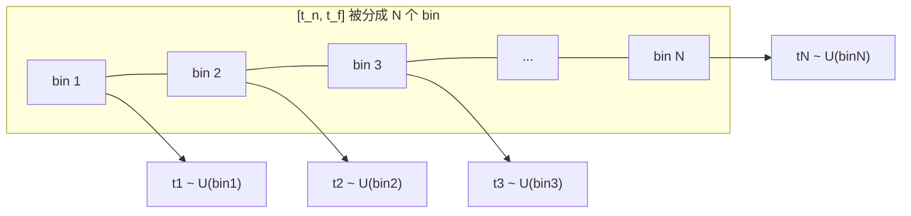

# 第 3 章 数学原理与体积渲染方程

> 本章是全文的数学核心。我们将从**连续积分**出发，推导出**离散化后的 alpha 合成**公式，并解释论文的分层（stratified）采样策略。请准备纸笔，跟着推导一遍。全章推导链：σ 的概率解读（3.1）→ 透射率微分方程与求解（3.2）→ 可微性的梯度结构（3.3）→ 数值积分两种方式（3.4）→ 离散 alpha 合成与误差来源（3.5）。章内中间式编号 (3.1)–(3.16)，论文式号沿用 Eq.1–Eq.3，供第 4、5 章与 `projects/nerf` 代码回引。

---

## 3.1 物理模型：光沿直线穿过"雾"

**① 问题场景** 手头：第 2 章的连续辐射场——任意点可查密度 $\sigma(\mathbf{x})$ 与颜色 $\mathbf{c}(\mathbf{x},\mathbf{d})$，以及一条相机光线。缺的：把"场"变成"像素颜色"的规则——场不是图像，一个像素对应**一整条光线**沿途无穷多个点，每个点都贡献一点颜色。想要的：一个物理上站得住、数学上可计算的模型，规定"光线沿途各点以多大权重把颜色计入像素"。

**② 解决方法** 把介质抽象为**吸收粒子雾**：光线沿直线前进，沿途按概率被粒子"截住"，截住的位置记下该处颜色。做法分三步： 参数化光线； 给 $\sigma$ 一个概率解读（下文"核心物理假设"）； 在该模型上对"截住位置"求期望——这就是 3.2 的推导起点。

一条相机光线参数化为：

$$
\mathbf{r}(t) = \mathbf{o} + t\,\mathbf{d}, \quad t \in [t_n, t_f]
$$

- $\mathbf{o}$：相机位置（ray origin）
- $\mathbf{d}$：单位方向（ray direction）
- $t$：沿光线的深度参数
- $t_n, t_f$：近/远界（near/far bounds）

**核心物理假设**（来自经典体积渲染，Kajiya & Herzen 1984）：
> 体密度 $\sigma(\mathbf{x})$ 解释为光线在 $\mathbf{x}$ 处**终止于一个无穷小粒子的微分概率**。

也就是说，$\sigma$ 越大，光线在这里"被挡住并停下"的概率越大。

**③ 选型理由** 候选模型：(a) **表面模型**——光线与第一个表面求交，一次命中即结束。优点：快、锐利。代价：表达不了半透明、烟尘、多层遮挡；且 MLP 输出的是密度而非表面，"求交"在密度场上没有定义（要表面就得上 SDF 并特殊设计权重——那是后来 NeuS 的路线，见 [3d_reconstruction/精读/NeuS](../3d_reconstruction/精读/NeuS_NeurIPS2021.md)）。 (b) **体积概率模型（本文）**——每段都可能截住，半透明与软边缘天然支持；概率语言使整条渲染链都是初等微积分（指数、乘积、求和），可微。代价：得不到解析的一次命中，必须数值积分（3.4–3.5）。本场景照片含大量软边缘与复杂遮挡，取 (b)。

**④ 理论依据** 辐射传输理论（radiative transfer：光在吸收/散射介质中传播的唯象理论，Chandrasekhar, *Radiative Transfer*, 1950）——本文只取**吸收**项；$\sigma$ 的微分概率解读（Kajiya & von Herzen, *"Ray Tracing Volume Densities"*, SIGGRAPH 1984）；求积规则（Max, *"Optical Models for Direct Volume Rendering"*, IEEE TVCG 1995）。

**⑤ 完整推导（σ dt 的微分概率从何而来）**

**第一步（粒子计数的统计模型）。** 考察光线在 $[t, t+\mathrm{d}t]$ 段遇到的粒子数 $N_{[t,t+\mathrm{d}t]}$。把粒子出现建模为**泊松过程**：大量相互独立、各自出现概率极小的粒子，其计数趋于泊松分布（依据：概率论的泊松极限定理——独立稀有事件之和的极限是泊松分布）。泊松过程的强度（单位长度期望事件数）记为 $\sigma(\mathbf{r}(t))$——这就是"密度"的定义。故切片内粒子数的期望为

$$
E\big[N_{[t,t+\mathrm{d}t]}\big] = \sigma(\mathbf{r}(t))\,\mathrm{d}t
$$

（依据：泊松过程在长度 $\mathrm{d}t$ 区间上的期望 = 强度 × 区间长。）

**第二步（切片内终止的概率）。** 泊松分布 $P(N=k) = \mathrm{e}^{-\mu}\mu^k/k!$（$\mu$ 为期望，依据：泊松分布定义）取 $k=0$：$P(N=0) = \mathrm{e}^{-\sigma\mathrm{d}t}$。于是"至少撞上一个粒子"的概率

$$
P\big(N \ge 1\big) = 1 - \mathrm{e}^{-\sigma(\mathbf{r}(t))\mathrm{d}t} = \sigma(\mathbf{r}(t))\,\mathrm{d}t + O(\mathrm{d}t^2)
$$

（依据：泰勒展开 $\mathrm{e}^{-x} = 1 - x + O(x^2)$，取 $x = \sigma\mathrm{d}t \to 0$，舍去二阶小量。）忽略高阶项即得论文 §4 的原话形式：

$$
P\big(\text{终止于}[t, t+\mathrm{d}t] \mid \text{到达 } t\big) = \sigma(\mathbf{r}(t))\,\mathrm{d}t \qquad (\mathrm{d}t \to 0). \tag{3.1}
$$

**第三步（σ 只依赖位置，故沿光线是一元函数）。** 第 2 章 (2.3) 的多视图一致性约束 $\sigma = \sigma(\mathbf{x})$ 代入光线参数化（依据：复合），$\sigma(\mathbf{r}(t))$ 只是 $t$ 的一元函数，后文简记 $\sigma(t)$；同理 $\mathbf{c}(\mathbf{r}(t), \mathbf{d})$ 沿固定光线也只依赖 $t$。

---

## 3.2 期望颜色：体积渲染积分

**① 问题场景** 手头：(3.1) 的概率模型——知道光线在每个微段被截住的概率 $\sigma\,\mathrm{d}t$。缺的：一个**像素**（一条光线）最终显示的颜色如何由"沿途所有可能的截住位置"共同决定——截住位置是随机变量，颜色随位置变化。想要的：从概率模型出发推出一个可计算的积分式（论文 Eq.1），并说明每一项的含义。

**② 解决方法** 取**期望颜色**：对"首次截住位置"这个随机变量的分布，求颜色函数的期望。可操作做法： 定义透射率（生存概率）； 推出透射率的微分方程； 分离变量解出 $T(t)$； 求首撞位置的密度； 按全期望公式积分。

**③ 选型理由** 候选聚合规则：(a) **期望（本文）**——统计意义干净（无偏的"平均颜色"），支持软介质；且与训练目标匹配：光度 MSE 的最优预测恰是条件期望（第 5 章 (5.5) 的极大似然解读），"渲染 = 期望"与"MSE 监督"是天作之合。 (b) **最可能撞点/中位数渲染**——更锐利，但对撞点分布的微扰不连续（分布众数可跳变），不可微，丢半透明。 (c) 首表面命中（3.1 ③ 已排除）。取 (a)；代价：渲染结果偏"加权和"的柔和感，对比度依赖采样充分性（3.5 的误差分析）。

**④ 理论依据** 条件概率乘法公式与全期望公式（概率论标准工具，如 Ross, *A First Course in Probability* 第 3 章）；一阶线性常微分方程的分离变量法（任何微积分教材）；体积渲染方程（Max, IEEE TVCG 1995——论文 Eq.1/Eq.3 求积规则的出处）；辐射传输方程只保留吸收-发射项的特例（Chandrasekhar 1950；Kajiya & von Herzen 1984）。

**⑤ 完整推导**

**第一步（透射率的定义与初值）。** 定义**累积透射率**（accumulated transmittance）为光线从近界存活到 $t$ 的概率：

$$
T(t) := P\big(\text{从 } t_n \text{ 存活到 } t\big), \qquad T(t_n) = 1
$$

（依据：定义；初值来自 $[t_n, t_n]$ 是零长区间、无粒子，存活概率为 1。）

**第二步（生存事件分解 → 差分方程）。** "存活到 $t + \mathrm{d}t$" = "存活到 $t$" **且** "在 $[t, t+\mathrm{d}t]$ 内未终止"。两个事件分别只涉及 $[t_n, t]$ 与 $[t, t+\mathrm{d}t]$ 两段粒子，相互独立（依据：泊松过程的独立增量——不相交区间上的计数独立）。由概率乘法公式与 (3.1) 的补事件：

$$
T(t + \mathrm{d}t) = T(t)\,\big(1 - \sigma(t)\,\mathrm{d}t\big). \tag{3.2}
$$

**第三步（差分 → 微分方程）。** 对 (3.2) 左边泰勒展开到一阶：$T(t+\mathrm{d}t) = T(t) + T'(t)\,\mathrm{d}t + o(\mathrm{d}t)$（依据：$T$ 可微——它是 $\sigma$ 的积分的指数函数，3.4 将反推确认；此处按题设光滑性展开）；右边界 $1 - \sigma\mathrm{d}t$ 已保留一阶。代入 (3.2)，两边减去 $T(t)$、除以 $\mathrm{d}t$、令 $\mathrm{d}t \to 0$（依据：导数定义），对比 $\mathrm{d}t$ 的系数：

$$
\frac{\mathrm{d}T}{\mathrm{d}t} = -\sigma(t)\,T(t), \qquad T(t_n) = 1. \tag{3.3}
$$

**第四步（分离变量求解）。** (3.3) 是一阶线性齐次 ODE。分离变量：$\dfrac{\mathrm{d}T}{T} = -\sigma(t)\,\mathrm{d}t$（依据：$T > 0$——概率为正，两边除以 $T$ 合法）；两边从 $t_n$ 积分到 $t$（依据：变限积分；牛顿-莱布尼茨公式）：

$$
\ln T(t) - \underbrace{\ln T(t_n)}_{=\,0} = -\int_{t_n}^{t} \sigma(\mathbf{r}(s))\,\mathrm{d}s
\;\;\Longrightarrow\;\;
T(t) = \exp\!\left(-\int_{t_n}^{t} \sigma(\mathbf{r}(s))\,\mathrm{d}s\right). \tag{3.4}
$$

（依据：$\ln$ 与 $\exp$ 互为反函数；初值 $T(t_n)=1$ 定出积分常数为零。）性质核对：$\sigma \ge 0$（第 2 章 ReLU 保证）⟹ 积分单调增 ⟹ $T(t)$ 单调不增且 $\le 1$（依据：指数函数单调性）——前面越"密"，能到达 $t$ 的概率越小。

**第五步（首撞位置的密度）。** "恰在 $[t, t+\mathrm{d}t]$ **首次**撞上粒子" = "存活到 $t$" 且 "在该段终止"（依据：首撞的事件分解）。由条件概率乘法公式与 (3.1)：

$$
p(t)\,\mathrm{d}t = T(t)\,\sigma(t)\,\mathrm{d}t
\qquad\Longrightarrow\qquad
p(t) = T(t)\,\sigma(t). \tag{3.5}
$$

$p(t)$ 是首撞位置的密度。它的总质量 $\int p(t)\,\mathrm{d}t = 1 - T(t_f) \le 1$（依据：把 (3.3) 改写为 $\frac{\mathrm{d}}{\mathrm{d}t}[1 - T(t)] = p(t)$ 后积分；差额 $T(t_f)$ 是"穿过整个区间未撞"的概率，3.5 (3.16) 会再用到）。

**第六步（期望颜色 → 论文 Eq.1）。** 撞在 $t$ 处就记下该点颜色 $\mathbf{c}(\mathbf{r}(t), \mathbf{d})$（模型假设：粒子吸收来光并按自身辐射重新发出——辐射传输方程只保留**吸收-发射**项、忽略向内散射；此抽象对"这条光线看起来什么颜色"恰是所需）。对首撞位置求期望（依据：全期望公式 $E[\mathbf{c}] = \int \mathbf{c}(t)\,p(t)\,\mathrm{d}t$，以 (3.5) 代入）：

$$
C(\mathbf{r}) = \int_{t_n}^{t_f} T(t)\; \sigma(\mathbf{r}(t))\; \mathbf{c}(\mathbf{r}(t), \mathbf{d})\; \mathrm{d}t. \tag{Eq.1}
$$

### 逐项理解这个积分

| 符号 | 含义 | 直觉 |
|------|------|------|
| $\sigma(\mathbf{r}(t))\,dt$ | 光线在小区间 $dt$ 内"碰到粒子"的概率 | 决定这里对像素的贡献权重 |
| $\mathbf{c}(\mathbf{r}(t), \mathbf{d})$ | 该点的视角相关颜色 | 被"挡下来"的光的颜色 |
| $T(t)$ | 光线从 $t_n$ 到 $t$ **没被任何粒子挡住**的概率 | 前面越"透明"，后面贡献越大 |

**整体直觉**：把 $[t_n, t_f]$ 切成无数小段，每段对最终像素颜色的贡献 = "能到达这里 $(T)$ × 在这里被挡住 $(\sigma dt)$ × 挡下来的颜色 $(\mathbf{c})$"。

注意：$T(t)$ 是单调递减的——走得越深，前面挡住的概率越大，能到达的概率越小。

---

## 3.3 关键性质：可微性

> 因为体积渲染**天然可微**（trivially differentiable），优化表示唯一需要的输入就是**一组已知位姿的图像**（论文 §1）。

这正是 NeRF 能用梯度下降训练的前提。我们不需要任何 3D 几何真值，只需"渲染出来的像素 ≈ 照片像素"。

**① 问题场景** 手头：Eq.1（及其即将给出的离散版 Eq.3）把像素颜色写成了 $\{\sigma_i\}, \{\mathbf{c}_i\}$ 的函数。缺的：监督只有照片像素，**没有任何 3D 真值**——要优化就必须回答"像素误差如何反推每个 $\sigma_i, \mathbf{c}_i$ 该变大还是变小"。想要的：确认整条渲染链对参数处处可微，并看清梯度的结构（谁在推 $\sigma_i$ 上升、谁在拉它下降）。

**② 解决方法** 离散化后（3.5）渲染式只含 $\exp$、乘积、求和三类初等运算，处处光滑；用自动微分逐项回传。关键结构：$\sigma_i$ 同时出现在自己的权重 $T_i\alpha_i$ 与**后续所有点**的透射率 $T_j\ (j>i)$ 中——梯度自然形成"自我抬升 vs 被下游抑制"的竞争。

**③ 选型理由** 候选优化通路：(a) 显式几何 + 近似可微化（光栅化的代理梯度等）——引入偏差且实现复杂； (b) 表面求交类可微渲染（DVR/SRN）——交点对参数的梯度经过"表面法向"等几何量，不稳定且表达受限（第 1 章 ③）； (c) 体积求和（本文）——无偏差、直接链式法则。代价：反传需保存全部 $N$ 个中间量（显存 $O(N)$），且每像素 $N$ 次前向。取 (c)。

**④ 理论依据** 多元链式法则（微积分标准内容）；自动微分的反向模式（Griewank & Walther, *Evaluating Derivatives*, SIAM 2008）；论文 §1 "trivially differentiable" 的含义即"全链初等函数复合"。

**⑤ 完整推导（梯度结构）**

**第一步（先写出离散渲染式）。** 预告 3.5 的结果 Eq.3：$\hat C(\mathbf{r}) = \sum_{i=1}^{N} w_i\,\mathbf{c}_i$，其中 $w_i = T_i\alpha_i$、$\alpha_i = 1 - \mathrm{e}^{-\sigma_i\delta_i}$（(3.14)）、$T_i = \exp(-\sum_{j<i}\sigma_j\delta_j)$（(3.13)）。本步承认该式，完整推导在 3.5 ⑤。

**第二步（对 $\alpha_i$ 的依赖路径）。** $w_i = T_i\alpha_i$ 中 $\alpha_i$ 只出现在第 $i$ 项；但 $T_j\ (j > i) = T_i \prod_{k=i}^{j-1}(1-\alpha_k)$（依据：(3.15) 递推展开），故 $\alpha_i$ 还出现在所有后续项。逐段求导（依据：乘积求导 / 指数函数求导）：

$$
\frac{\partial \hat C}{\partial \alpha_i} = T_i\,\mathbf{c}_i \;-\; \frac{T_{i+1}}{1-\alpha_i}\sum_{j>i} w_j\,\mathbf{c}_j,
\qquad\text{由递推 } T_j = T_i \prod_{k=i}^{j-1}(1-\alpha_k),\ \frac{\partial T_j}{\partial \alpha_i} = -\frac{T_j}{1-\alpha_i}.
$$

**第三步（换元到 $\sigma_i$）。** 由 (3.14) 对 $\sigma_i$ 求导（依据：复合函数链式法则，$\delta_i$ 与 $t$ 无关）：

$$
\frac{\partial \alpha_i}{\partial \sigma_i} = \delta_i\,\mathrm{e}^{-\sigma_i\delta_i} \;>\; 0. \tag{3.6}
$$

由 (3.13) 对 $\sigma_i\ (i < j)$ 求导（依据：$\exp(-\sum_j \sigma_j\delta_j)$ 对第 $i$ 项求导）：

$$
\frac{\partial T_j}{\partial \sigma_i} = -\delta_i\,T_j \;<\; 0 \qquad (j > i). \tag{3.7}
$$

**第四步（竞争结构的解释）。** (3.6) 为正：增大 $\sigma_i$ 提高第 $i$ 点自身权重——若该点颜色能解释像素，梯度推它更"实"；(3.7) 为负：增大 $\sigma_i$ 同时压低所有后续点的透射率——下游"多余的雾"被抑制。二者竞争的结果是：能解释照片的表面处 $\sigma$ 长起来，其背后的密度被压下去，**几何从光度监督中自发分离**。代码中这些导数由自动微分逐项计算（[09 章 `volume_render`](09_代码逐行精读.md) 与 Eq.3 逐项对应），无需手写。

---

## 3.4 数值积分：两种采样方式

**① 问题场景** 手头：Eq.1 的连续积分——被积函数里的 $\sigma, \mathbf{c}$ 由神经网络给出，**没有解析原函数**；且每查询一次网络就是一次前向开销。缺的：有限预算（每光线 $N$ 次查询）下计算 $C(\mathbf{r})$ 的数值方案。想要的：一个无偏（或低偏差）、低方差、并且**不把场景表示锁死在固定网格上**的近似。

**② 解决方法** 论文对比了两种方式：

### 方式 A：确定性积分（deterministic quadrature）

固定一组采样位置。问题：**分辨率受限于采样密度**——MLP 永远只在固定离散点被查询，无法表达更细的内容。

### 方式 B：分层采样（stratified sampling）⭐ 论文采用

把 $[t_n, t_f]$ 分成 $N$ 个等宽 bin，在每个 bin 内**均匀随机**取一个点（论文 Eq. 2）：

$$
t_i \sim \mathcal{U}\!\left[t_n + \frac{i-1}{N}(t_f - t_n),\; t_n + \frac{i}{N}(t_f - t_n)\right], \quad i = 1, \dots, N \tag{Eq.2}
$$

**③ 选型理由** 两方式逐条对比： 方式 A 的节点固定——训练中网络只需把节点上的值调对即可降损失，**节点之间的行为不受任何约束**（依据：损失只依赖节点处取值），表示的有效分辨率被 $N$ 锁死，与体素同病；且固定节点对特定频率的内容可能系统性错位（偏差）。 方式 B 的查询位置随迭代随机化——每次迭代在连续位置上评估损失，极小化的是"随机位置的期望损失"，其最优解是**连续函数**（论文原话："stratified sampling enables us to represent a continuous scene representation"）；且 ⑤ 将证明：等预算下方差不超过朴素蒙特卡洛。 代价：单次估计带 MC 噪声（靠光线 batch 平均与第 5 章的 fine 阶段压制）。取 B。

**④ 理论依据** 蒙特卡洛积分与分层采样的方差缩减（标准结论，如 Owen, *Monte Carlo theory, methods and examples*, §"Stratified sampling"；Robert & Casella, *Monte Carlo Statistical Methods*）；全方差分解公式（law of total variance，概率论标准定理）；论文 Eq.2。

**⑤ 完整推导（分层采样为何不输朴素蒙特卡洛）**

**第一步（朴素蒙特卡洛估计量与方差）。** 记一般积分 $I = \int_{a}^{b} f(t)\,\mathrm{d}t$（对 Eq.1 即 $f = T\sigma\mathbf{c}$，向量值逐分量同理），均匀抽样 $\xi_k \overset{\text{iid}}{\sim} \mathcal{U}(a,b)$：

$$
\hat I_N = \frac{b-a}{N}\sum_{k=1}^{N} f(\xi_k). \tag{3.8}
$$

无偏性：$E[\hat I_N] = \frac{b-a}{N}\sum_k E[f(\xi_k)] = \frac{b-a}{N}\cdot N \cdot \frac{1}{b-a}\int_a^b f\,\mathrm{d}t = I$（依据：均匀分布的期望定义 $E[f(\xi)] = \frac{1}{b-a}\int f$；期望线性）。方差（样本独立，依据：独立随机变量和的方差 = 方差之和；常数提出按平方）：

$$
\mathrm{Var}[\hat I_N] = \frac{(b-a)^2}{N}\,\mathrm{Var}[f]. \tag{3.9}
$$

**第二步（分层估计量与方差）。** 等宽 $N$ 个 bin，宽 $\Delta = (b-a)/N$；每个 bin 独立取一个样本 $\xi_k \sim \mathcal{U}(\text{bin } k)$，估计量与方差：

$$
\hat I_{\mathrm{strat}} = \Delta \sum_{k=1}^{N} f(\xi_k), \qquad
\mathrm{Var}[\hat I_{\mathrm{strat}}] = \Delta^2 \sum_{k=1}^{N} \mathrm{Var}[f(\xi_k)] \;=\; \Delta^2 \sum_{k=1}^{N} \sigma_k^2. \tag{3.10}
$$

（依据：bin 之间取值独立 ⟹ 和的方差相加；bin 内均匀抽样的方差按第一步同法计算，记 $\sigma_k^2 := \mathrm{Var}[f(\xi_k)]$。）无偏性同第一步（每 bin 期望 $= \frac{1}{\Delta}\int_{\text{bin }k} f$，乘 $\Delta$ 相加恰为 $I$）。

**第三步（全方差分解）。** 记 $\mu_k = E[f(\xi_k)]$（bin $k$ 内均值）、$\mu = E[f]$（全区间的均值 $= \frac{1}{N}\sum_k \mu_k$，依据：区间等宽时总均值是 bin 均值的算术平均）。由**全方差分解**（law of total variance，依据：以"落在哪个 bin"为条件事件的标准分解）：

$$
\mathrm{Var}[f] = \underbrace{\frac{1}{N}\sum_{k=1}^{N} \sigma_k^2}_{\text{层内平均方差}} \;+\; \underbrace{\frac{1}{N}\sum_{k=1}^{N} (\mu_k - \mu)^2}_{\text{层间方差}} \;\ge\; \frac{1}{N}\sum_{k=1}^{N} \sigma_k^2. \tag{3.11}
$$

**第四步（比较）。** 用 $(b-a) = N\Delta$ 把 (3.9) 改写（依据：代入平方）：$\mathrm{Var}[\hat I_N] = N^2\Delta^2 \cdot \mathrm{Var}[f] / N = N\Delta^2\,\mathrm{Var}[f]$。再以 (3.11) 代入：

$$
\mathrm{Var}[\hat I_N] = N\Delta^2\,\mathrm{Var}[f] = \Delta^2\sum_{k}\sigma_k^2 \;+\; \Delta^2\sum_{k}(\mu_k-\mu)^2 \;\ge\; \Delta^2\sum_k \sigma_k^2 = \mathrm{Var}[\hat I_{\mathrm{strat}}].
$$

（依据：逐步代换 (3.9)–(3.11)；最后一项层间方差 $\ge 0$。）**结论：等预算下，分层采样的方差严格不超过朴素蒙特卡洛**；等号当且仅当所有 $\mu_k$ 相等（函数均值在全区间"平稳"，分层无信息增益）。这就是"每个 bin 都有人代言"的数学内容。

**第五步（与 Eq.2 的衔接）。** Eq.2 正是 (3.10) 的抽样方案；用它估计 Eq.1 时还有 ③ 所述的"连续表示"收益——查询位置是连续随机变量，损失对位置取期望（依据：训练迭代中每条光线的 $t_i$ 每次重新抽取），网络被推向拟合整段函数而非节点值表。

**为什么随机**？虽然用的是离散样本估计积分，但**随机化使 MLP 在整个优化过程中被连续位置查询**，从而表示一个"连续"的场景而非固定分辨率网格。这正是 NeRF 与"离散体素"的本质区别。

---

## 3.5 离散化渲染公式（alpha 合成）

**① 问题场景** 手头：Eq.1 的连续积分 + Eq.2 选出的 $N$ 个采样位置 $\{t_i\}$——网络只在采样点上有取值，**两点之间 $\sigma$ 未知**。缺的：只用采样点上数值就能计算积分的求积规则。想要的：一个对任意 $\sigma$ 一致成立、保持概率解释（权重非负、总和 $\le 1$）、且与 Eq.2 的 bin 结构配套的离散公式。

**② 解决方法** 论文用 Max (1995) 的求积规则离散化：把每个 bin $[t_i, t_{i+1}]$ 内的 $\sigma$ 视为常数（分段常数近似），透射率按段指数累加、颜色按段取值，得论文 Eq.3。可操作做法：记段长 $\delta_i = t_{i+1} - t_i$、$\sigma_i = \sigma(\mathbf{r}(t_i))$、$\mathbf{c}_i = \mathbf{c}(\mathbf{r}(t_i), \mathbf{d})$，逐段算 $\alpha_i$ 并累加。

**③ 选型理由** 候选求积规则：(a) **梯形/辛普森**——假设段内光滑（用两端点值的线性/抛物线组合），但真实 $\sigma$ 在表面处近乎跳跃（自由空间 $\approx 0$ ↔ 表面处大），光滑假设系统性失真（偏差集中在权重过渡带）；某些规则还会给出负权重，破坏概率解释。 (b) **分段常数（本文）**——不假设段内光滑；每段贡献 $T_i\alpha_i$ 仍是合法概率；bin 与段一一对应，与 Eq.2 天然配套；代价：段内变化被压平，误差一阶 $O(\delta)$（本节末误差分析）。取 (b)。

**④ 理论依据** Max, *"Optical Models for Direct Volume Rendering"*, IEEE TVCG 1995（求积规则，论文原文引用）；Porter & Duff, *"Compositing Digital Images"*, SIGGRAPH 1984（alpha 合成，(3.15) 的图形学对应）；零阶保持近似与黎曼和（数值积分标准内容，如 Atkinson, *An Introduction to Numerical Analysis*）。

**⑤ 完整推导**

**第一步（分段常数近似）。** 在每个 bin 上取常数代表值（依据：零阶保持——只有采样点信息时的一致选择）：

$$
\sigma(\mathbf{r}(s)) \approx \sigma_i, \qquad \mathbf{c}(\mathbf{r}(s), \mathbf{d}) \approx \mathbf{c}_i \qquad s \in [t_i, t_{i+1}), \qquad \delta_i = t_{i+1} - t_i. \tag{3.12}
$$

**第二步（透射率离散化）。** (3.4) 的积分按分段常数函数逐段求值（依据：常数函数的积分 = 取值 × 段长；积分区间可加性）：

$$
\int_{t_n}^{t_i} \sigma(\mathbf{r}(s))\,\mathrm{d}s = \sum_{j=1}^{i-1} \sigma_j\,\delta_j
\;\;\Longrightarrow\;\;
T_i := T(t_i) = \exp\!\left(-\sum_{j=1}^{i-1} \sigma_j\,\delta_j\right). \tag{3.13}
$$

（$T_1$ 的和为空、值为 $\mathrm{e}^0 = 1$，与 (3.3) 初值一致。）

**第三步（段内终止概率与 $\alpha_i$）。** 第 $i$ 段的终止概率 = $T(t_i) - T(t_{i+1})$（依据：(3.5) 在段上积分，或直接用 $T$ 的概率含义——"存活到 $t_i$"减"存活到 $t_{i+1}$"，二者之差就是在这段里撞上的概率）。把 (3.12) 代入该段积分：$\int_{t_i}^{t_{i+1}} \sigma\,\mathrm{d}s = \sigma_i\delta_i$，故 $T(t_{i+1}) = T_i\,\mathrm{e}^{-\sigma_i\delta_i}$（依据：(3.4) 取上限 $t_{i+1}$，多累积一段）。代入分配律展开：

$$
T_i - T_{i+1} = T_i - T_i\,\mathrm{e}^{-\sigma_i\delta_i} = T_i\big(1 - \mathrm{e}^{-\sigma_i\delta_i}\big) =: T_i\,\alpha_i,
\qquad\Longrightarrow\qquad
\boxed{\;\alpha_i = 1 - \mathrm{e}^{-\sigma_i\delta_i}\;} \tag{3.14}
$$

$\alpha_i$ 的性质（依据：$\mathrm{e}^{-x} = 1 - x + O(x^2)$ 与指数函数值域 $(0,1]$）：$\sigma_i\delta_i \to 0$ 时 $\alpha_i \approx \sigma_i\delta_i$（稀薄介质）；$\sigma_i\delta_i \to \infty$ 时 $\alpha_i \to 1$（近不透明）；$\sigma_i \ge 0 \Rightarrow \alpha_i \in [0, 1)$——合法概率。

**第四步（求和 → 论文 Eq.3）。** 首撞位置只有 $N$ 个候选 bin；全期望公式（3.2 ⑤ 第六步）离散化为加权和（依据：(3.5) 的离散版本 $P(\text{首撞在 bin } i) = T_i\alpha_i$，再乘各 bin 颜色）：

$$
\hat{C}(\mathbf{r}) = \sum_{i=1}^{N} T_i\, (1 - e^{-\sigma_i \delta_i})\, \mathbf{c}_i
\qquad\text{其中}\qquad
T_i = \exp\!\left(-\sum_{j=1}^{i-1} \sigma_j \delta_j\right). \tag{Eq.3}
$$

### 等价于经典 alpha 合成

把 (3.13) 的指数和改写为乘积（依据：$\exp(\sum_j x_j) = \prod_j \mathrm{e}^{x_j}$，指数运算法则），并结合 (3.14)：

$$
T_i = \prod_{j=1}^{i-1} (1 - \alpha_j), \qquad T_{i+1} = T_i\,(1 - \alpha_i). \tag{3.15}
$$

则 $\alpha_i$ 就是第 $i$ 个采样点的 **alpha 值（不透明度）**，公式变成：

$$
\hat{C}(\mathbf{r}) = \sum_{i=1}^{N} T_i\, \alpha_i\, \mathbf{c}_i, \qquad
T_i = \prod_{j=1}^{i-1} (1 - \alpha_j)
$$

这是图形学中**从后到前的 alpha 合成**（Porter–Duff 1984）：从近到远累加，$T_i$ 是到第 $i$ 点为止"剩余透明度"（递推 (3.15) 正是该合成的逐层形式）。

### 权重守恒与残余透射率

$$
\sum_{i=1}^{N} T_i\,\alpha_i = \sum_{i=1}^{N} (T_i - T_{i+1}) = T_1 - T_{N+1} = 1 - T_{N+1} \;\le\; 1. \tag{3.16}
$$

（依据：第一个等号用 (3.14) 的 $T_i\alpha_i = T_i - T_{i+1}$；第二个等号**裂项相消**——中间项逐一抵消；$T_1 = 1$ 来自 (3.13) 的空和。）差额 $T_{N+1}$ 是"穿过整个场景没撞任何东西"的概率——实现里把末段 $\delta$ 补成大数（$\delta_N \to \infty \Rightarrow T_{N+1} \to 0$）正是为了把这份残余权重吸收掉（见 [09 章 `volume_render`](09_代码逐行精读.md)）。

### 一个直白的例子

假设 3 个采样点：$\alpha = [0.2, 0.5, 0.3]$，颜色 $\mathbf{c} = [红, 绿, 蓝]$：

| i | $T_i$ | $T_i \alpha_i$ | 加权颜色 |
|---|-------|----------------|----------|
| 1 | 1.0 | 0.2 | 0.2 × 红 |
| 2 | 1 - 0.2 = 0.8 | 0.4 | 0.4 × 绿 |
| 3 | 0.8 × (1-0.5) = 0.4 | 0.12 | 0.12 × 蓝 |

最终颜色 $= 0.2\text{红} + 0.4\text{绿} + 0.12\text{蓝} + (1-0.2-0.4-0.12)\times\text{背景}$（末项即 (3.16) 的残余 $T_{N+1}$）。

### 数值近似误差的来源

从连续 Eq.1 到离散 Eq.3，误差来自四处（均为 ②/③ 选择的直接后果）：

1. **零阶保持误差**：(3.12) 把段内 $\sigma$ 压平——若 $\sigma$ 段内线性变化，梯形规则才是二阶精度，分段常数是一阶 $O(\delta)$（依据：数值求积的阶的定义，Atkinson 第 5 章）；表面附近 $\sigma$ 跨数量级变化，误差集中在权重过渡带，表现为几何边界随采样密度移动。
2. **蒙特卡洛噪声**：Eq.2 的随机 $t_i$ 使 $\hat C$ 本身是随机变量，方差由 (3.10) 给出；单条光线噪声不可忽略，靠每 batch 4096 条光线的平均压制（第 5 章 5.5 表）。
3. **残余透射率 $T_{N+1}$**：(3.16) 显示权重总和 $= 1 - T_{N+1}$——这段"没人在管"的概率质量若对应真实背景，颜色会系统性偏暗/偏亮（偏差）；实现以加长末段 $\delta$ 把它推向 0（09 章）。
4. **采样不足的走样**：$\delta_i$ 大于内容尺度时，更细的结构根本未被查询——这不是任何公式的误差而是预算约束，靠第 5 章层次采样把预算挪到可见内容上缓解。

---

## 3.6 数学性质小结

| 性质 | 内容 |
|------|------|
| 连续形式 | $C(\mathbf{r}) = \int T(t)\sigma(t)\mathbf{c}(t)\,dt$ |
| 离散形式 | $\hat C = \sum T_i \alpha_i \mathbf{c}_i$ |
| alpha | $\alpha_i = 1-e^{-\sigma_i\delta_i}$（单调：$\sigma,\delta$ 越大越不透明） |
| 透射率 | $T_i = \prod_{j<i}(1-\alpha_j)$（单调递减） |
| 可微性 | 全式对 $\sigma_i, \mathbf{c}_i$ 可微 → 可反传 |
| 复杂度 | 一条光线 $N$ 个采样点 → $N$ 次网络查询 |

**$N$ 次网络查询是最大的计算开销**——单张图 $800\times800=640\text{k}$ 条光线 × 256 点 ≈ 1.5~2 亿次查询（论文附录"Rendering Details"）。这就是第 5 章层次采样要解决的效率问题。

---

## 3.7 动手练习

1. 手推一遍：从连续积分公式出发，说明离散化后 $T_i$ 为什么是指数累加的形式。
2. 若某光线沿途 $\sigma$ 全为 0，$\hat C$ 应该等于什么？用公式验证。
3. 解释：为什么"固定网格确定性采样"会限制分辨率，而"分层随机采样"不会？

---

**下一章**：[04_网络架构与位置编码.md](04_网络架构与位置编码.md) — MLP 结构详解
