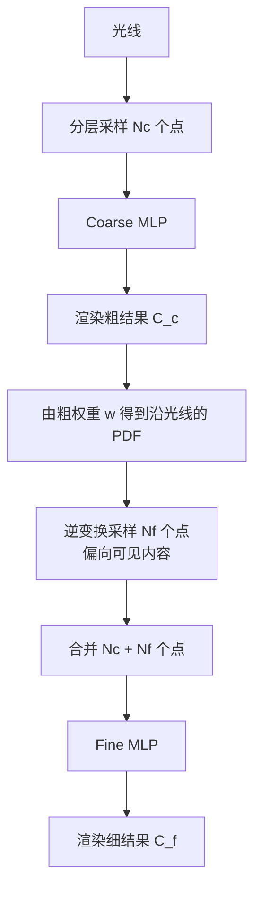
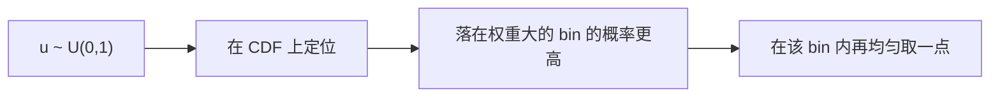

# 第 5 章 层次采样与训练细节

> 本章解决一个问题：**一条光线要查很多点，但大部分点（空白/被遮挡区域）对最终渲染毫无贡献**，纯属浪费。NeRF 用"coarse 先探路、fine 再细化"的双网络层次采样解决。全章按 CONSTRAINTS §3.4 五步法展开：5.1（为什么均匀采样不行）、5.2（coarse/fine 架构与权重→PDF）、5.3（逆变换采样完整推导）、5.4（联合损失 Eq.6）、5.5（激活函数与 σ 噪声正则两个设计决策 + 超参数速查表）。章内式号 (5.1)–(5.7)，论文式号沿用 Eq.5–Eq.6；第 3 章的 (3.13)–(3.16) 被直接回引。

---

## 5.1 问题：均匀采样浪费严重

**① 问题场景** 手头：第 3 章的渲染链——Eq.2 分层均匀采样 $N$ 点 + Eq.3 渲染，每光线的 $N$ 次网络查询是主要开销（3.6 末段）。缺的：观察——可见表面只占光线区间 $[t_n, t_f]$ 的窄段，均匀采样把预算撒在 $\sigma\approx 0$ 的自由空间与表面背后的**被遮挡**区域：前者的权重 $\approx 0$，后者被前景挡住权重也 $\approx 0$，查了等于白查。想要的：同预算下，把查询集中到**对渲染有贡献**的区域——而且不能依赖任何外部几何信息（几何正是要学的东西）。

**② 解决方法** 重要性采样思想（论文 §5.2，灵感引 Levoy 1990）：**按样本对最终渲染的"预期贡献"分配采样密度**。NeRF 的具体实现 = coarse 网络的渲染权重（Eq.5）归一化成沿光线的 PDF，再逆变换采样出 fine 的查询点——完整机制见 5.2–5.3。

**③ 选型理由** 候选方案对比：

- **(a) 直接加大 $N$**：开销线性上涨，自由空间照旧白查——预算利用率不变。消融实验"no hier 256"：256 个均匀点（4 倍预算）仍比 64+128 层次点低 0.95 dB（第 7 章），且查询次数更多。
- **(b) 先估表面、再在表面附近采样**：需要表面信息，而表面恰是待学量——鸡生蛋。
- **(c) coarse 渲染权重当"免费的重要性分布"（本文）**：一次粗渲染同时产出粗颜色与采样 PDF，零外部标注、零额外前向。代价：双网络参数/显存翻倍 + 训练目标多一项（5.4）。

取 (c)，消融支持。

**④ 理论依据** 重要性采样（importance sampling：以正比于被积函数的密度抽样以降低方差的蒙特卡洛标准方法，见 Owen, *Monte Carlo theory, methods and examples*；Robert & Casella, *Monte Carlo Statistical Methods*）；体渲染中按贡献采样的思想源头（Levoy, *"Efficient Ray Tracing of Volume Data"*, ACM TOG 1990，论文原文引用）；论文 §5.2。

- 一条光线均匀采样 $N$ 个点，但**只有少数点落在可见物体表面**上
- 空白区域（$\sigma\approx 0$）和物体背后被遮挡的区域，查了也是白查
- 论文 §5.2（`sec:hierarchical`）明确说：均匀稠密采样在**自由空间和被遮挡区域反复采样**，效率低下

灵感来自早期体积渲染工作（Levoy 1990）：**按样本对最终渲染的"预期贡献"分配采样密度**——这就是重要性采样思想。

**⑤ 完整推导（重要性采样为什么能降方差）**

**第一步（一般 IS 估计量与无偏性）。** 估计 $I = \int_{t_n}^{t_f} f(t)\,\mathrm{d}t$（Eq.1 中 $f = T\sigma\mathbf{c}$），改取任意满足 $p(t) > 0$（在 $f \ne 0$ 处）的密度抽样 $\xi \sim p$：

$$
\hat I = \frac{f(\xi)}{p(\xi)}, \qquad
E[\hat I] = \int \frac{f(t)}{p(t)}\,p(t)\,\mathrm{d}t = \int f(t)\,\mathrm{d}t = I. \tag{5.1}
$$

（无偏，依据：期望的定义；分子分母的 $p$ 相消。）对比第 3 章 (3.8)：均匀采样只是 $p \equiv \frac{1}{t_f - t_n}$ 的特例。

**第二步（方差表达式）。** $\mathrm{Var}[\hat I] = E[\hat I^2] - I^2 = \int \dfrac{f(t)^2}{p(t)}\,\mathrm{d}t - I^2$（依据：$\hat I^2$ 的期望按 $p$ 分布求；方差定义）。

**第三步（最优提案分布）。** 渲染权重非负（$w_i = T_i\alpha_i \ge 0$，第 3 章 (3.14)–(3.15)），故可取 $p^*(t) = f(t)/I$：它是合法密度（依据：$f \ge 0$ 且 $\int p^* = I/I = 1$）。此时 $f(\xi)/p^*(\xi) = I$ 对每个样本都是常数（依据：代入），常数的方差为 0（依据：方差定义）——**零方差估计**。一般密度下由柯西–施瓦茨不等式给出下界（依据：$(\int |f|)^2 = \big(\int \frac{|f|}{\sqrt p}\sqrt p\,\mathrm{d}t\big)^2 \le \int \frac{f^2}{p}\,\mathrm{d}t \cdot \int p\,\mathrm{d}t$）：$\mathrm{Var}[\hat I] \ge (\int|f|)^2 - I^2$，等号在 $p \propto |f|$ 处取得——**提案分布越贴近"贡献分布"，方差越小**。这就是"按贡献分配采样密度"的数学内容。

**第四步（NeRF 用法的辨析）。** NeRF 并未按 (5.1) 做独立随机估计：$N_f$ 个细样本被当作**整个积分域的非均匀离散化**重新渲染（论文 §5.2 末的原话辨析；第 1 章 ⑤ 路线图同此）。但选布逻辑同源——第三步告诉我们采样密度应正比于贡献 $w$，5.2–5.3 把这个密度具体构造出来。

---

## 5.2 双网络架构：Coarse + Fine

**① 问题场景** 手头：5.1 的重要性采样原理——"采样密度 ∝ 贡献"。缺的：贡献分布 $w$ 依赖密度 $\sigma$，而 $\sigma$ 正是要学的网络输出——**先有鸡还是先有蛋**：采样需要 $\sigma$，学 $\sigma$ 需要采样。想要的：一个训练过程中随时可得的"贡献"代理。

**② 解决方法** 不搞花哨，直接**同时优化两个 MLP**（独立参数、同构结构）：

### Step 1：粗采样 + 粗渲染

先用分层采样（第 3 章）取 $N_c = 64$ 个点，过粗网络，用体积渲染得到 $\hat C_c$。

### Step 2：从粗权重构造分布

把粗渲染公式（论文 Eq. 5）改写为加权和：

$$
\hat C_c(\mathbf{r}) = \sum_{i=1}^{N_c} w_i\, \mathbf{c}_i, \qquad
w_i = T_i\, (1 - e^{-\sigma_i \delta_i}) \tag{Eq.5}
$$

$w_i$ 就是第 $i$ 个采样点对最终颜色的**贡献权重**。归一化得到沿光线的**分段常数 PDF**：

$$
\hat w_i = \frac{w_i}{\sum_{j=1}^{N_c} w_j} \tag{5.2}
$$

### Step 3：按 PDF 细采样

用**逆变换采样（inverse transform sampling）**从该 PDF 中抽取 $N_f = 128$ 个新位置——**权重大的区域（即物体表面附近）被采得更多**（完整推导见 5.3）。

### Step 4：合并渲染

把 $N_c + N_f = 192$ 个点**合并**（并排序）后一起送进 fine 网络，用第 3 章的公式渲染出最终颜色 $\hat C_f$。

> ⚠️ 注意：fine 网络不是只在细采样的点上工作，而是对"粗+细"全部 192 个点一起渲染。粗点提供覆盖，细点提供精度。

**③ 选型理由** 候选对比：

- **(a) 单网络自我迭代**（用上一轮权重采样、再训同一网络）：训练初期权重是垃圾，分布失准且自我强化；coarse 的"看错"直接污染同一份参数。
- **(b) 单网络两次前向、共享参数**：比 (a) 稍好，但 coarse 误差仍通过"共享权重"污染 fine 输入分布；两份输出的梯度也会互相牵制。
- **(c) 独立 coarse/fine 双网络（本文）**：coarse 的岗位职责就是"探路"，其误差只影响采样位置不影响最终渲染；fine 在 coarse 打理过的采样域上专注精度。代价：参数与显存 ×2。消融支持（(a) 路线的均匀 256 点差 0.95 dB，见 5.1 ③）。

取 (c)。

**④ 理论依据** 论文 §5.2；体渲染的重要性采样（Levoy 1990）；Eq.5 权重的概率解释由第 3 章 (3.13)–(3.16) 给出。

**⑤ 完整推导（粗权重 → 合法 PDF）**

**第一步（权重的概率含义）。** $w_i = T_i\,(1 - \mathrm{e}^{-\sigma_i\delta_i}) = T_i\,\alpha_i = T_i - T_{i+1}$（依据：第一个等号是 Eq.5 的定义；第二个用第 3 章 (3.14) 的 $\alpha_i$；第三个用 (3.14) 的恒等式 $T_i\alpha_i = T_i - T_{i+1}$）。$T_i - T_{i+1}$ 正是"光线在第 $i$ 段**首次**撞上粒子"的概率（依据：3.2 ⑤ 第五步——首撞事件 = 存活到 $t_i$ 且在段内终止）。

**第二步（非负性）。** $T_i = \exp(-\sum_{j<i}\sigma_j\delta_j) \in (0, 1]$（依据：第 3 章 (3.13)，指数值域）、$\alpha_i \in [0,1)$（依据：(3.14) 及 $\sigma \ge 0$，见 4.3 ⑤ 第一步）⟹ $w_i = T_i\alpha_i \ge 0$。

**第三步（总质量）。** 由第 3 章 (3.16) 的裂项相消：$\sum_{i=1}^{N_c} w_i = 1 - T_{N_c+1} \le 1$——$\{w_i\}$ 是一个"次概率分布"（差额 $T_{N_c+1}$ 是全程未撞的质量）。

**第四步（归一化）。** 只要 $W := \sum_j w_j > 0$（即光线上存在非零密度——全程空白的光线无需细采样，实现中按 $W$ 阈值跳过）：

$$
\hat w_i = \frac{w_i}{W} \;\Longrightarrow\; \hat w_i \ge 0 \ \text{且}\ \sum_{i=1}^{N_c} \hat w_i = 1,
$$

（依据：正数除法保持非负；$\sum_i w_i/W = W/W = 1$。）(5.2) 由此把 $\{\hat w_i\}$ 变成 bin 上的合法**概率质量函数**——沿光线的分段常数 PDF：bin $i$ 内密度恒为 $\hat w_i / \delta_i$，bin 间跳变。

**第五步（交接给 5.3）。** 有了 PDF，问题化为"如何从离散分布抽样本"——这正是下一步。

---

## 5.3 逆变换采样（Inverse Transform Sampling）

**① 问题场景** 手头：5.2 造出的分段常数 PDF $\{\hat w_i\}$（bin 概率质量）。缺的：从**任意**分布抽随机样本的算法——随机数硬件/库只给均匀分布 $u \sim \mathcal{U}(0,1)$；"按概率抽"没有直接指令。想要的：只消费均匀随机数、**精确**匹配 $\{\hat w_i\}$、且可 GPU 批量执行的采样器。

**② 解决方法** 逆变换采样：先建累积分布（CDF）——bin 概率累加（bin 内线性插值）；再抽 $u \sim \mathcal{U}(0,1)$，用 $\sum_{i=1}^{k}\hat w_i \ge u$ 定位 bin $k$，最后在该 bin 内均匀取一点。

给定离散分布 $\{\hat w_i\}$（累计分布 CDF），生成均匀随机数 $u \sim \mathcal{U}(0,1)$，找到最小的 $k$ 使得 $\sum_{i=1}^{k}\hat w_i \ge u$，取第 $k$ 个 bin 内的一个随机点。

**③ 选型理由** 候选采样器对比：

- **(a) 拒绝采样（rejection sampling）**：需要密度上界 $M$（提议 $q$ 下 $\hat w/M \le 1$）；$w$ 沿光线跨度极大（近处不透明处 $w_i$ 接近 1，空白处 $\approx 0$），$M$ 由峰值决定 ⟹ 期望拒绝次数 $\propto M/\text{均值}$ 巨大，浪费均匀随机数与循环控制流。
- **(b) MCMC**：样本相关、天然串行，与 GPU 批量（4096 条光线并行）相性差；且平稳分布的烧入期对"每步换一批光线"的训练模式不友好。
- **(c) 逆变换采样（本文）**：一次 `cumsum` 建前缀和（$O(N_c)$）+ 一次 `searchsorted` 二分定位（$O(\log N_c)$），全批量并行、无拒绝、精确匹配目标分布（⑤ 证明）。实现见 [09 章 `hierarchical_sample`](09_代码逐行精读.md)。

取 (c)。

**④ 理论依据** 逆变换采样定理（概率论/随机模拟的标准定理，见 Ross, *Simulation*；Casella & Berger, *Statistical Inference* §2.1）；均匀分布的分布函数即恒等函数；论文 §5.2。

**⑤ 完整推导**

**第一步（构造连续 CDF）。** 在离散 bin 上累加：

$$
F_i = \sum_{j \le i} \hat w_j, \qquad F_0 = 0,\quad F_{N_c} = 1, \tag{5.3}
$$

（末点为 1 的依据：5.2 ⑤ 第四步的归一化。）bin 内部线性插值后，$F$ 成为 $[t_n, t_f]$ 上**连续、单调不减、满值域 $[0,1]$** 的分布函数（依据：每段增量 $\hat w_i \ge 0$、总和为 1）。

**第二步（反演规则）。** 抽 $u \sim \mathcal{U}(0,1)$，取满足 $F_{k-1} \le u < F_k$ 的 bin $k$，在 $[t_k, t_{k+1}]$ 内均匀取一点（bin 内再均匀，与线性插值反解两种实现等价——都给出 ⑤ 第三步的 bin 级概率；论文/代码采用前者）。

**第三步（正确性：bin 级概率）。** 样本落入 bin $i$ 的概率：

$$
P(t \in \text{bin } i) = P\big(F_{i-1} \le u < F_i\big) = F_i - F_{i-1} = \hat w_i. \tag{5.4}
$$

（依据：均匀分布落在区间 $(a,b) \subset (0,1)$ 的概率 = 区间长度 $b - a$——均匀分布的定义；再由 (5.3) 的差分即 $\hat w_i$。）所以采样分布**恰好**是 $\hat w$——表面附近（$w_i$ 大）被采得密，5.1 的目标落实。

**第四步（一般定理补全）。** 对任意连续单调 $F$，$X = F^{-1}(u)$（广义反函数）的分布函数就是 $F$：当 $F$ 严格增时，$P(X \le x) = P\big(F^{-1}(u) \le x\big) = P\big(u \le F(x)\big) = F(x)$（依据：第一步用 $F^{-1}$ 的单调性把不等式等价变形，末步用"$u \sim \mathcal{U}(0,1)$ 的分布函数是恒等函数"）；$F$ 有平坦段（对应 $\hat w_i = 0$ 的空 bin）时，平坦段映射到单一 $u$ 值、其概率为 0，结论仍成立（依据：广义反函数的标准性质，Ross, *Simulation* §1；此处按"明确引用出处"处理）。逆变换采样由此对**任意** PDF 成立，不限于本文的分段常数情形。

**第五步（数值例）。** 取 $\hat w = [0.1,\ 0.1,\ 0.7,\ 0.1]$（权重集中在第 3 个 bin 的"表面"）：CDF 为 $F = [0.1,\ 0.2,\ 0.9,\ 1.0]$。抽 $u = 0.85$：$F_2 = 0.2 < 0.85 \le 0.9 = F_3$（依据：第二步规则）⟹ 落入 bin 3——单次抽样即以 0.7 的长期频率命中权重最大的 bin（依据：(5.4)）。

**效果**：表面附近（$w_i$ 大）的 bin 更容易被抽中 → 细采样集中在"看得见"的区域。

---

## 5.4 损失函数

**① 问题场景** 手头：两套渲染——$\hat C_c$（coarse，顺带产出采样 PDF）与 $\hat C_f$（fine，**最终输出**），以及真值像素 $C(\mathbf{r})$。缺的：训练目标的选择有一个陷阱——若只监督 $\hat C_f$，coarse 网络的 $\sigma$ 没有直接的梯度约束，其权重分布 $\hat w$ 会漂移失准，细采样随之失效（采样 PDF 是垃圾 ⟹ fine 的查询点全落在没用的地方）。想要的：一个同时保住**渲染质量**（fine）与**采样质量**（coarse 权重）的目标。

**② 解决方法** 论文 Eq. 6（`\Ltrain`，photometric loss；勘误：主文仅 6 个编号式，此前误写 Eq. 7）：

$$
\mathcal{L} = \sum_{\mathbf{r}\in\mathcal{R}} \left[\, \|\hat C_c(\mathbf{r}) - C(\mathbf{r})\|_2^2 + \|\hat C_f(\mathbf{r}) - C(\mathbf{r})\|_2^2 \,\right] \tag{Eq.6}
$$

- $\mathcal{R}$：每批随机采样的**光线集合**（从数据集所有像素中随机抽，通常 4096 条）
- 同时惩罚粗、细两个渲染结果与真值 $C(\mathbf{r})$ 的平方误差
- **为什么也监督 coarse？** 论文原文：即使最终渲染来自 $\hat C_f$，也要让粗网络的权重分布 $w_i$ 是"有用"的，否则第 2 步的 PDF 就是垃圾，细采样会采样到无意义的地方。

**③ 选型理由** 候选目标对比：

- **(a) 只监督 fine**：coarse 权重失去直接梯度（⑤ 第二步分析梯度流向），采样分布漂移——正是 ① 的陷阱。
- **(b) 光度损失 + 对 $\hat w$ 加 KL/熵正则**：引入权衡超参；且光度项已隐式约束权重——权重错则渲染颜色必错（Eq.3 是权重的加权和），KL 项基本冗余。
- **(c) 双项光度 MSE（本文）**：coarse 从第一项拿到"把权重摆对"的直接梯度；fine 从第二项拿精度梯度。代价：coarse 分支训练期永远参与（推理时也先跑 coarse——256 = 64 + 192 次查询/光线，见 5.5 表）。取 (c)。

**④ 理论依据** 经验风险最小化（ERM，统计学习标准框架，Vapnik）；高斯噪声假设下最小化 MSE 等价于极大似然估计（高斯 Markov / MLE 标准结论，Casella & Berger, *Statistical Inference* §7.3）；论文 Eq.6（LaTeX 源码第 6 个 `equation`，见[精读 §4.6](精读/NeRF_ECCV2020.md) 勘误注）。

**⑤ 完整推导**

**第一步（MSE 的概率来源）。** 设像素观测 = 渲染值 + 独立同分布高斯噪声：$C(\mathbf{r}) = \hat C_\Theta(\mathbf{r}) + \boldsymbol\epsilon$，$\boldsymbol\epsilon \sim \mathcal{N}(0, s^2 I)$（依据：传感器/渲染噪声的最常用模型，各分量独立同方差）。似然 $p(\{C\} \mid \Theta) = \prod_{\mathbf{r}} (2\pi s^2)^{-3/2} \exp\big(-\lVert C(\mathbf{r}) - \hat C_\Theta(\mathbf{r})\rVert_2^2 / 2s^2\big)$（依据：多维高斯密度定义，RGB 三维、协方差 $s^2I$）。取对数、展开：

$$
-\ln p = \sum_{\mathbf{r}} \frac{\lVert C(\mathbf{r}) - \hat C_\Theta(\mathbf{r})\rVert_2^2}{2s^2} \;+\; \underbrace{\tfrac{3|\mathcal{R}|}{2}\ln(2\pi s^2)}_{\text{与 }\Theta\text{ 无关}} \tag{5.5}
$$

（依据：对数把乘积变求和、指数落下；第二项不含 $\Theta$，不影响 $\arg\min$。）故**最小化 Eq.6 ⟺ 高斯噪声模型下的极大似然估计**——"photometric loss"的概率含义，也是 3.2 ③"渲染 = 期望"与 MSE 天作之合的正式说法（期望是 MSE 的最优预测，依据：$E[C \mid \hat C] = \hat C$ 使 $E\lVert C - f(\hat C)\rVert^2$ 在 $f = \mathrm{id}$ 处最小——标准结论）。

**第二步（双项的梯度流向）。** 第一项 $\lVert \hat C_c - C\rVert^2$ 的梯度只流入 coarse 网络（依据：Eq.3 对 coarse 的 $\sigma_i, \mathbf{c}_i$ 可微，第 3 章 3.3）。第二项的梯度流经合并后的 192 点——**coarse 点也在内**，故 coarse 网络实际从两项都拿梯度；fine 网络只从第二项拿。中间的"按 PDF 抽样"步骤不可导：均匀随机数 $u$ 是外生输入、梯度不穿过样本选择（依据：采样算子对网络参数无定义导数——reparameterization 视角下噪声项与参数独立）。

**第三步（为什么双项缺一不可）。** 去掉第一项 ⟹ coarse 只剩经 fine 渲染的间接梯度（被 192 点稀释、且只奖励"被采到的点"），$\hat w$ 的准确度失守 ⟹ (5.2) 的 PDF 漂移 ⟹ fine 的分辨率收益消失（论文原文回答，② 已引）。去掉第二项 ⟹ 最终输出 $\hat C_f$ 无人优化，训练目标与交付物脱节。两项各守一职，缺一即塌。

---

## 5.5 训练超参数（论文 §5.3 Implementation Details）

本节先给两个设计决策的五步块（激活函数、σ 噪声正则），末尾是超参数速查表。

### 设计决策 3｜激活函数：密度 ReLU、颜色 sigmoid

**① 问题场景** 手头：两个读出头的原始输出（FC 的线性响应），取值 $\mathbb{R}$ 无界。缺的：渲染链的硬约束——$\sigma \ge 0$（否则 (3.14) 的 $\alpha_i$ 不再是概率，4.3 ⑤ 第一步的反推）、颜色 $\in [0,1]$（显示域与目标域）。想要的：把两个输出压进各自合法域的映射，要求无额外参数、几乎处处可微（反传不能断）。

**② 解决方法** 密度头用 **ReLU**，颜色头用 **sigmoid**（`model.py`：`sigma_head` ReLU / `rgb_head` sigmoid）。

**③ 选型理由** 候选对比：

- **(a) $\sigma$ 用 softplus** $\ln(1+\mathrm{e}^z)$：处处可微、$z=0$ 处无折点（后续部分工作采用）；论文取 ReLU——实现最简、$\sigma=0$ 处的次梯度在实践中足够（训练未现异常）。
- **(b) $\sigma$ 用 clamp/截断**：截断区梯度恒 0，死区内密度无法恢复——反向不可训练。
- **(c) 颜色用 $\tanh$ 重标定** $\tfrac12(1+\tanh z)$：值域等价 $(0,1)$，sigmoid 更直接且梯度公式 $\mathrm{sigmoid}' = s(1-s)$ 简单。

取 ReLU + sigmoid：以最小的实现复杂度满足两条硬约束（⑤）。

**④ 理论依据** 概率合法性（第 3 章 (3.14)；第 4 章 (4.3)）；ReLU / sigmoid 的标准性质（Goodfellow et al., *Deep Learning* §6.2–6.3）。

**⑤ 完整推导**

**第一步（σ：ReLU ⟹ 概率链闭合）。** ReLU 输出 $\sigma_i \ge 0$（依据：$\max(0,z) \ge 0$）。代入 (3.14)：$\sigma_i\delta_i \ge 0 \Rightarrow \mathrm{e}^{-\sigma_i\delta_i} \in (0,1] \Rightarrow \alpha_i = 1 - \mathrm{e}^{-\sigma_i\delta_i} \in [0,1)$（依据：指数单调性）；再由 (3.15)：$T_i = \prod_{j<i}(1-\alpha_j) \in (0,1]$；权重 $w_i = T_i\alpha_i \ge 0$、$\sum_i w_i \le 1$（依据：(3.16)）——渲染权重整条概率解释**由这一个激活选择闭合**。

**第二步（颜色：sigmoid ⟹ 目标域匹配）。** $\mathrm{sigmoid}(z) \in (0,1)$（依据：定义与极限），与 MSE 目标 $[0,1]$（5.4 ⑤ 第一步的噪声模型要求 $\hat{\mathbf{c}}$ 与真值同域，否则高斯假设不成立）严格匹配；其导数 $\mathrm{sigmoid}'(z) = s(1-s)$（依据：求导），在两端饱和但目标端点处本就无需再动（5.4 ⑤ 第一步：MSE 最优在真值处）——饱和不构成收敛障碍。

### 设计决策 4｜真实数据的 σ 噪声正则

**① 问题场景** 手头：真实照片带传感器噪声、位姿带估计误差；逐场景优化极易把这些噪声"烤"成**雾状几何**（大量半信半疑的低密度 $\sigma$ 漂浮在空间里）。缺的：一种抑制过拟合的手段，且不能动主损失、不能拖慢收敛。想要的：低成本的"去雾"正则。

**② 解决方法** 论文 §5.3：训练时对 coarse/fine 网络的 $\sigma$ 输出加 $\mathcal{N}(0,1)$ 高斯噪声（仅真实数据集启用）。

**③ 选型理由** 候选正则：(a) 对 $\sigma$ 的空间平滑/TV 正则——真实表面本就高频（细结构），平滑伤细节； (b) 早停——伤收敛且阈值难定； (c) **噪声注入（本文）**——零参数、零额外前向、只在训练期生效；机制上把"低置信度密度"推向透明（⑤）。取 (c)。代价：单步梯度带噪（Adam 的矩估计恰好吸收一部分，见 5.5 表的优化器行）。

**④ 理论依据** 噪声注入作为正则（目标平滑/一致化，如 Bishop, *"Training with Noise is Equivalent to Tikhonov Regularization"*, Neural Computation 1995——输入噪声等价于正则项的经典结果，此处为输出噪声的同族应用）；高斯矩生成函数；Jensen 不等式（凸函数期望 ≥ 期望的函数，标准不等式）。

**⑤ 完整推导（噪声如何"去雾"）**

**第一步（带噪 $\alpha$ 的期望）。** 训练时渲染用 $\tilde\sigma = \sigma + \eta$，$\eta \sim \mathcal{N}(0, \kappa^2)$（论文取 $\kappa = 1$）。代入 (3.14)：$\tilde\alpha_i = 1 - \mathrm{e}^{-\sigma_i\delta_i}\,\mathrm{e}^{-\eta\delta_i}$。对噪声取期望（依据：$\sigma_i, \delta_i$ 给定下 $\eta$ 独立，期望可逐因子分配）：

$$
E_\eta\big[\mathrm{e}^{-\eta\delta_i}\big] = \mathrm{e}^{\kappa^2\delta_i^2/2}
\;\;\Longrightarrow\;\;
E[\tilde\alpha_i] = 1 - \mathrm{e}^{-\sigma_i\delta_i}\,\mathrm{e}^{\kappa^2\delta_i^2/2} \;\le\; \alpha_i. \tag{5.6}
$$

（第一个等号是高斯**矩生成函数** $E[\mathrm{e}^{t\eta}] = \mathrm{e}^{\kappa^2 t^2/2}$ 取 $t = -\delta_i$；不等号因 $\mathrm{e}^{\kappa^2\delta_i^2/2} > 1$。）**期望意义上，噪声使每段不透明度变低**。

**第二步（低置信度雾被推向 0）。** 对"半信半疑"的小密度（$\sigma\delta \ll 1$），一阶展开给出 $E[\tilde\alpha] \approx \sigma\delta - \tfrac{1}{2}\kappa^2\delta^2 \cdot 1 \cdot (\text{修正项})$：当 $\sigma\delta$ 与 $\tfrac12\kappa^2\delta^2$ 同量级时期望值被压到 0 附近（依据：对 (5.6) 做 $\mathrm{e}^{-x} \approx 1 - x$ 展开、合并同阶项）——**没有多视角照片反复确认的密度撑不过噪声**；确凿的表面（$\sigma\delta \gg \kappa^2\delta^2$）只被轻微削低，且其对真实颜色的贡献由颜色项保住。这正是论文观察到的"略提升新视角视觉质量"的机制：雾没了，真表面还在。

**第三步（梯度视角的补充）。** 噪声也使单步损失带随机扰动——相当于对损失面做随机平滑（④ 的 Bishop 结果同族），经验上压制对单张照片噪声的精确拟合。

### 超参数速查表

> 下表为训练配置速查（**操作步骤，不含理论**；各项的设计依据见上文五步块与第 3、4 章）。

| 超参数 | 值 | 说明 |
|--------|-----|------|
| Batch size | 4096 条光线 | 每步随机抽样 |
| $N_c$ | 64 | 粗采样数 |
| $N_f$ | 128 | 细采样数 |
| 优化器 | Adam | $\beta_1=0.9,\ \beta_2=0.999,\ \epsilon=10^{-7}$ |
| 学习率 | $5\times10^{-4} \to 5\times10^{-5}$ | 指数衰减 |
| 迭代数 | 100k~300k | 单场景，V100 约 1~2 天 |
| 渲染点数（推理） | 64 + (64+128) = 256/光线 | 测试时 |
| 正则化（真实数据） | 对 $\sigma$ 输出加高斯噪声 $\mathcal{N}(0,1)$ | 略提升新视角视觉质量（机制见上文设计决策 4） |

---

## 5.6 三个"为什么"（论文结论前必答）

> 速答索引——完整五步推导：问题 1 → 5.2 ③；问题 2 → 5.4 ②③⑤；问题 3 → 5.5 表与第 6 章实验口径。

1. **为什么要 coarse + fine 两个网络而不是一个？** 单一网络无法既保证覆盖又保证精度；两个网络各司其职，且 coarse 免费提供重要性分布。
2. **为什么监督 coarse？** 让粗网络的权重分布准确，细采样才有效（见 §5.4）。
3. **为什么测试时渲染 256 点/光线而训练时最多 192？** 推理可以更稠密采样提高质量；训练要控制每步开销。

---

## 5.7 动手练习

1. 给定一条光线的粗权重 $w=[0.1,0.1,0.7,0.1]$，画出 CDF，并用逆变换采样说明 $u=0.85$ 会落在哪个 bin。（答案核对：5.3 ⑤ 第五步）
2. 解释"粗网络免费提供重要性分布"这句话。
3. 思考：如果只训练一个网络（无层次采样），为了达到同等质量需要多少均匀采样点？（消融实验"no hier 256"给的是 256 点——见第 7 章）

---

**下一章**：[06_数据集与实验结果.md](06_数据集与实验结果.md) — 数据集与结果解读
