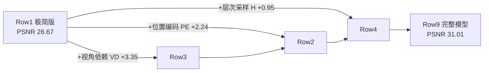

# 第 7 章 消融实验解读

> 消融实验（ablation study）回答"**去掉某个组件会怎样**"。论文 Table 2（[papers/nerf/latex/ablationstable.tex](../../papers/nerf/latex/ablationstable.tex)）在 Realistic Synthetic 360° 的 8 个场景上做了 9 行实验。逐行读懂它，你就真正理解了每个设计决策的价值。

> **§3.4 处理说明**：本章为解读章——每个被消融组件的**设计决策**按 CONSTRAINTS.md §3.4"问题导向五步法"（①–⑤）展开（§3.4 明文要求设计决策也用五步）；消融表本体为实验数据转录，按下注豁免。理论依据回引第 3–5 章的推导与论文 Eq. 1–Eq. 6。

---

## 7.1 消融表（论文 Table 2）

> 实验数据转录，不含理论推导（§3.4 豁免）：下表为论文 `ablationstable.tex` 的忠实转录；每个组件的"去掉为什么变差"在 §7.2 按五步法逐行推导。

| # | 配置 | 输入 | #图 | $L$ | (Nc, Nf) | PSNR↑ | SSIM↑ | LPIPS↓ |
|---|------|------|-----|-----|----------|-------|-------|--------|
| 1 | 无 PE、无 VD、无 H | xyz | 100 | – | (256,–) | 26.67 | 0.906 | 0.136 |
| 2 | 无位置编码 PE | xyz+dir | 100 | – | (64,128) | 28.77 | 0.924 | 0.108 |
| 3 | 无视角依赖 VD | xyz | 100 | 10 | (64,128) | 27.66 | 0.925 | 0.117 |
| 4 | 无层次采样 H | xyz+dir | 100 | 10 | (256,–) | 30.06 | 0.938 | 0.109 |
| 5 | 更少图像 | xyz+dir | 25 | 10 | (64,128) | 27.78 | 0.925 | 0.107 |
| 6 | 较少图像 | xyz+dir | 50 | 10 | (64,128) | 29.79 | 0.940 | 0.096 |
| 7 | 更少频率 | xyz+dir | 100 | 5 | (64,128) | 30.59 | 0.944 | 0.088 |
| 8 | 更多频率 | xyz+dir | 100 | 15 | (64,128) | 30.81 | 0.946 | 0.096 |
| **9** | **完整模型** | **xyz+dir** | **100** | **10** | **(64,128)** | **31.01** | **0.947** | **0.081** |

（表头含义：PE=位置编码，VD=视角依赖，H=层次采样，$L$=位置编码最大频率，Nc/Nf=粗/细采样数）

---

## 7.2 逐行解读

### Row 1：极简版（无 PE / VD / H）— PSNR 26.67

只用 3D 位置 + 均匀 256 采样。这是"朴素隐式表示"的水平：低频、过度平滑、无高光。作为**基准下限**。

**知识点｜为什么下限行要用"无 PE/VD/H + 均匀 256"——消融对照的公平性设计**

**① 问题场景** 手头：完整模型（Row 9，31.01 dB）与若干"去掉一个组件"的变体。缺的：一个**全部组件都去掉**的下限——没有它，"31.01 dB"没有参照系，单个变体的 −2.24 dB 是大是小也无从判断；同时下限若与完整模型采样预算不同，比较还混入混淆变量。想要的：一个公平、可作全部行分母的基准配置。

**② 解决方法** Row 1 三者全去：不吃方向（无 VD）、坐标不编码（无 PE）、均匀采样（无 H）；并把采样数设为 256 而非 64——完整模型测试时每光线查询 $64+(64+128)=256$ 次，Row 1 均匀 256 点，**两者每光线的网络查询预算相同**。

**③ 选型理由** 替代方案对比： 下限用 (64,–)——省算力，但 Row 1 与 Row 9 的差距将同时包含"组件差异"与"64 vs 256 采样数差异"两个因子，无法归因（违反 §7.4 的单因子原则）； 下限用 (256,–)——多花一倍训练开销，换到"预算对齐、唯一变量是三个组件"的干净归因，值得。

**④ 理论依据** 消融实验的控制变量方法论（同 §7.4 知识点）；"朴素 MLP 直接回归坐标"即第 4 章 §4.1 谱偏置问题的原始形态（Rahaman et al. 2018）。

**⑤ 完整推导**（为什么 26.67 dB 是三重压制的必然下限）

**第一步（无 PE 压低高频）。** MLP 直吃 $[-1,1]^3$ 低维坐标，谱偏置使网络先拟合低频 → 纹理与锐边缺失（依据：第 4 章 §4.1 的谱偏置结论；机制推导见下文 Row 2 的 ⑤）。

**第二步（无 VD 抹掉高光）。** 颜色只能依赖位置，非朗伯表面各视角观测颜色的差异被迫平均 → 高光消失（依据：第 2 章非朗伯表面的方向性出射；机制推导见下文 Row 3 的 ⑤）。

**第三步（均匀采样浪费预算）。** 自由空间与被遮挡区域对渲染贡献为零，却与表面附近分到同等采样密度 → 同等预算下有效密度更低（依据：第 5 章 §5.1 的问题分析；机制推导见下文 Row 4 的 ⑤）。

**第四步（叠加）。** 三步各自独立地压低同一指标（分别改变函数族的高频能力、方向颜色、采样效率，互不替代），26.67 dB = 三重压制的叠加值（依据：Row 1 同时去掉三者）；后续 Row 2–4 逐个加回，即可分离各自贡献（依据：下文各行 ⑤ 的差值分解）。

### Row 2：去掉位置编码 — PSNR 28.77（-2.24）

保留方向、层次采样，但**不加 $\gamma$**。网络直接吃原始坐标 → 高频细节（纹理、锐边）无法表达。**PE 贡献第 2 大**。

**知识点｜位置编码的设计决策：为什么"固定三角函数升维"能换回 2.24 dB**

**① 问题场景** 手头：8 层 ReLU-MLP（256 通道），输入是归一化坐标 $p\in[-1,1]^3$；渲染出的 Lego 齿轮、Ship 缆绳等高频结构糊成一片。缺的：网络表达"输入坐标的高频变化"的能力——加宽加深都试过仍不行（谱偏置），问题出在输入形式而非网络容量。想要的：不换损失、不加监督，让同一 MLP 能拟合高频函数的改造。

**② 解决方法** 位置编码（论文 Eq. 4）：每个坐标分量先过**固定的、不可学习**的映射 $\gamma(p)=\big(\sin 2^0\pi p,\cos 2^0\pi p,\dots,\sin 2^{L-1}\pi p,\cos 2^{L-1}\pi p\big)$ 再进网络，即 $F_\Theta=F_\Theta'\circ\gamma$；位置取 $L=10$（$3\times2\times10=60$ 维）、方向取 $L=4$。

**③ 选型理由** 替代方案对比： 加深/加宽 MLP——谱偏置源于复合函数的频率衰减，层数加深反而更偏低频，容量换不来高频（Rahaman et al. 2018 的结论）； 让 $\gamma$ 可学习——引入待学频率，易与具体场景过耦合且增加优化难度，论文还实测固定频率已饱和（Row 7/8）； 换升维基（随机傅里叶特征、可学习哈希——后者是 Instant-NGP 的路线）——可行，但固定多频三角基零超参搜索、实现仅几行、且其机理后被 Tancik et al. 2020 系统化为"傅里叶特征"。代价：输入维度 3→60，第一层参数量 ×20；换回 2.24 dB（Row 9 vs Row 2），值得。

**④ 理论依据** 谱偏置：Rahaman et al., *"On the spectral bias of neural networks"*, ICML 2018（深度网络偏向低频，且高频输入映射能缓解）；傅里叶特征：Tancik et al., *"Fourier Features Let Networks Learn High Frequency Functions in Low Dimensional Domains"*, NeurIPS 2020；论文 §5.1 与 Fig. 4（去掉 PE 的定性列）。

**⑤ 完整推导**（从机制推出"去掉 PE 掉约 2 dB"为何符合预期）

**第一步（识别基）。** $\gamma(p)$ 恰是 $p$ 的截断傅里叶基：从 $2^0\pi$ 到 $2^{L-1}\pi$ 的倍频 sin/cos（依据：Eq. 4 的定义逐项读出）。

**第二步（线性读出 = 频率搬用）。** 网络第一层对 $\gamma(p)$ 是线性变换，故一切只经一层线性读出的函数 $g(p)=\sum_k a_k\sin(2^k\pi p)+b_k\cos(2^k\pi p)$ 都是各倍频的线性组合（依据：线性组合的封闭性）。网络只需给高频通道配大权重即可"搬用"现成高频基。

**第三步（对偶面：无 $\gamma$ 时高频必须自产）。** 去掉 $\gamma$，网络须靠 ReLU 复合从低维输入自行产生高频，而复合使频谱能量向低频集中（依据：Rahaman 2018 的谱偏置刻画）→ 齿轮、缆绳类高频内容拟合不到，渲染过平滑。

**第四步（定量核对）。** Row 2 的 28.77 vs 完整 31.01，差 −2.24 dB；定性上 Fig. 4"无 PE"列整体过平滑——量级与形态均落在第二、三步的预测内（依据：消融表数字 + 论文 Fig. 4）。

### Row 3：去掉视角依赖 — PSNR 27.66（-3.35）

去掉方向输入 → 颜色只能依赖位置 → **镜面高光完全消失**（论文 Fig. 4：铲车履带的反射重建不出来）。**VD 贡献第 1 大**（从 26.67 直接建模视角的收益，加上它本身是第二大单项差距）。

**知识点｜视角依赖的设计决策：方向为何只进颜色分支、不进密度分支**

**① 问题场景** 手头：Materials/Mic 类金属场景，同一位置的表面从不同方向看颜色不同（镜面反射）。缺的：让"同一位置输出不同颜色"的机制——但密度 $\sigma$ 又**必须**与方向无关，否则同一位置的"挡光程度"随视角漂移，物体轮廓会变。想要的：位置定"形"、方向定"色"的解耦表示。

**② 解决方法** 论文 §3 的双分支结构：主干 8 层只吃 $\gamma(\mathbf{x})$，输出 $\sigma$（ReLU 保证非负）与 256 维特征；特征再拼上 $\gamma(\mathbf{d})$ 过一层 128 通道 + sigmoid 输出 $\mathbf{c}$。方向在 $\sigma$ 分叉**之后**才注入（第 4 章 §4.3，论文附录 Fig. 7）。

**③ 选型理由** 替代方案对比： 方向也进主干（$\sigma(\mathbf{x},\mathbf{d})$）——破坏多视图一致性：同一位置不同视角密度不同，几何随视角漂移（论文 §3 明确 $\sigma$ 只准看位置）； $(\mathbf{x},\mathbf{d})$ 直接拼接不编码——方向信号同样遭谱偏置，故 $\mathbf{d}$ 也过 $\gamma$（$L=4$：方向颜色变化频率本就低于几何纹理）； 输出显式 BRDF 参数再按渲染方程积分——更物理，但需估计入射光照，破坏"仅 RGB+位姿、端到端光度监督"的简洁设定。本文方案的代价：颜色分支多一层、且只建模直接可见的方向色（不含多次弹射）——但 +3.35 dB 为全部单项最大，值得。

**④ 理论依据** 辐射度量学：非朗伯表面的出射辐射 $L_o(\mathbf{x},\mathbf{d})$ 依赖出射方向（BRDF 的方向性，如 Phong/Cook-Torrance 模型的镜面瓣）；体渲染传统中辐射可依赖方向（Kajiya & Von Herzen 1984）；论文 §3 与 Fig. 3（固定点方向色分布）、Fig. 4（铲车履带消融对照）。

**⑤ 完整推导**（为什么去掉 VD 恰掉 3.35 dB、高光必然消失）

**第一步（结构决定函数族）。** 主干不接触 $\mathbf{d}$，故 $\sigma=\sigma(\mathbf{x})$（多视图一致）；颜色分支 $\mathbf{c}=f\big(\text{feature}(\mathbf{x}),\,\gamma(\mathbf{d})\big)$。完整模型因此能表达"位置定形、方向定色"（依据：②的网络结构，第 4 章 §4.3）。

**第二步（去掉 VD 后的最优解是"视角平均色"）。** 去掉方向输入后 $\mathbf{c}=f(\text{feature}(\mathbf{x}))$ 与 $\mathbf{d}$ 无关；对固定 $\mathbf{x}$，Eq. 6 光度损失中同一位置所有视角的像素残差共享同一个预测 $\mathbf{c}$，最小化 $\sum_{\mathbf{d}}\|\hat{\mathbf{c}}-\mathbf{c}(\mathbf{x},\mathbf{d})\|_2^2$ 的解趋近视角均值 $\mathbb{E}_{\mathbf{d}}[\mathbf{c}]$（依据：平方误差的最小元是均值——对 $\hat{\mathbf{c}}$ 求导置零即得）。

**第三步（高光在平均中湮灭）。** 镜面高光只在窄角度范围出现（BRDF 镜面瓣尖锐），能量集中在少数视角；平均后这份能量被摊到所有视角、幅值骤降 → 高光从渲染中消失（依据：第二步均值 + 第四步 ④ 的镜面瓣形状；论文 Fig. 4 铲车履带验证）。

**第四步（量级核对）。** Row 3 的 27.66 vs 31.01，差 −3.35 dB，为全部单项最大——与数据集构造一致：Realistic Synthetic 8 场景普遍含金属/光泽材质，视角相关成分占比高，去掉 VD 伤得最重（依据：消融表数字 + 第 6 章 §6.1 数据集知识点的材质维度分析）。

> 💡 论文原文说"PE 和 VD 提供最大的定量收益，其次是层次采样"——注意 Row 2（-2.24）与 Row 3（-3.35）都比较显著。

### Row 4：去掉层次采样 — PSNR 30.06（-0.95）

改用均匀 256 采样但保留 PE+VD。损失最小但仍明显 → **H 贡献第 3**，主要体现为**效率**收益（同样的采样预算，层次采样质量更高）。

**知识点｜层次采样（H）的设计决策：为什么"粗网络给 PDF、细采样集中到表面"同预算更优**

**① 问题场景** 手头：Eq. 2 的均匀分层采样，每条光线在 $[t_n,t_f]$ 均匀撒点。缺的：采样效率——光线穿过的大段自由空间与物体背后的被遮挡区域对渲染贡献为零，却与表面附近分到同样的采样密度；想提高表面处密度就得整体加采样数。想要的：把固定预算集中到"看得见"的区域，且不引入偏差。

**② 解决方法** 层次采样（论文 §5.2）：coarse 网络 64 点粗渲染 → Eq. 5 把渲染改写为加权和、权重 $w_i$ 归一化成分段常数 PDF → 逆变换采样 128 个新点 → 与 coarse 点取并集，fine 网络在全部 $N_c+N_f$ 点上重渲染（完整推导见第 5 章 §5.2–5.3）。

**③ 选型理由** 替代方案对比： 均匀 256 点（Row 4 的对照配置）——实现最简单，但第 ⑤ 步将证明其对"零贡献区间"仍投入正比于区间长度的样本； 手工先验引导采样（深度图等）——需额外输入，破坏"仅 RGB+位姿"设定； 经典重要性采样（对积分做独立概率估计）——论文 §5.2 末特意辨析：这里样本被当作**积分域的非均匀离散化**而非独立估计，避免对每样本加权的复杂性。代价：两个 MLP、coarse 渲染占一份额外算力、管线多两步；换来同预算下表面附近更细的积分离散化（−0.95 dB 的差距来源），值得。

**④ 理论依据** 逆变换采样（概率论标准方法：CDF 反演，第 5 章 §5.3 的完整推导）；分层采样的方差性质（第 3 章 §3.4）；"由粗到细"的体渲染采样思想承自 Levoy 1990（论文 §5.2 引）；Eq. 3/5 的权重概率解读（第 3 章 §3.5）。

**⑤ 完整推导**（为什么 −0.95 dB 是"效率型"损失、量级必然最小）

**第一步（权重是合法分布）。** $w_i=T_i\alpha_i=T_i-T_{i+1}$（裂项相消），非负、$\sum_i w_i=1-T_{N+1}\le 1$——它天然是"光线终止在第 $i$ 段"的概率分布（依据：第 3 章 §3.5 的透射率递推 $T_{i+1}=T_i(1-\alpha_i)$ 与裂项结论）。

**第二步（采样密度正比于贡献）。** 归一化 $\hat{w}_i=w_i/\sum_j w_j$ 后做逆变换采样，样本落入 bin $i$ 的概率恰为 $\hat{w}_i$（依据：均匀随机数落在 $[F_{i-1},F_i)$ 的概率 = $F_i-F_{i-1}$，第 5 章 §5.3 第三步）→ 表面附近（$w_i$ 大）自动加密。

**第三步（与均匀 256 对照）。** 均匀方案把预算按**区间长度**分配，层次采样按**渲染贡献**分配；两者的差 = 浪费在零贡献区间上的样本份额。同预算 256 下，H 等价于对表面附近做了更细的积分离散化，Eq. 1 数值积分误差更小（依据：第一步、第二步 + 分段常数近似的误差随局部段长减小而减小，第 3 章 §3.5）。

**第四步（量级解释）。** H 只改"采样点放哪"，不改网络能表达的函数族；PE/VD 改函数族。改变函数族的收益上界远高于优化积分误差 → H 的贡献必然小于 PE/VD → −0.95 dB 最小、论文称"其次收益"，符合机制分层（依据：第三步 + Row 2/3 的对比 + 论文 §5.2 的定位）。

### Row 5 / 6：减少输入图像数（25 / 50 张）— PSNR 27.78 / 29.79

- 25 张 → 27.78，**仍超过所有基线用 100 张**的成绩（NV 26.05 / SRN 22.26 / LLFF 24.88）
- 50 张 → 29.79，接近完整 100 张的 31.01
- 说明 NeRF 对稀疏视角相当鲁棒——这是它重要的实用价值

**知识点｜稀疏视角鲁棒性的设计决策：为什么"25 张仍能赢基线 100 张"**

**① 问题场景** 手头：采集真实场景的固定成本——每张图都要过 COLMAP 估位姿、规划覆盖；视角越稀疏采集越便宜。缺的：能用输入图像数的下界——基线在稀疏视角下崩溃（LLFF 明文要求输入视差 ≤64 像素的密集采集）。想要的：稀疏视角鲁棒性的定量证据，以及它从哪个机制来。

**② 解决方法** 控制变量地砍输入：100→50→25 张，网络结构、采样、超参全同，报 Row 5/6 的 27.78/29.79 dB，并与基线**用满 100 张**的成绩对比（最严苛的自我限制读法）。

**③ 选型理由** 替代方案对比： 只比"NeRF 25 vs NeRF 100 张"——只得到自身退化曲线，得不到相对优势的结论； 与基线各自的最佳输入数比——方法与输入数绑定，混淆变量； "25 张 NeRF vs 100 张基线"——输入数劣势下仍胜出，结论最硬。代价：25/50 两档粒度粗、不给完整"数据量–性能"曲线——对"相当鲁棒"这一定性结论足够。

**④ 理论依据** 多视图光度约束的可观性：每条像素光线是 Eq. 6 求和中的一个残差项，约束其射线上的场景颜色；输入图像数 × 每图像素数决定约束总量（论文 §1 的端到端光度优化设定）；对照基线的输入要求（LLFF 的视差 guideline，论文 §6.3）。

**⑤ 完整推导**（为什么 25 张的约束仍够、错误仍被压制）

**第一步（约束总量）。** NeRF 的监督 = 每张图的像素光线都成为 Eq. 6 中的残差 $\|\hat{C}(\mathbf{r})-C(\mathbf{r})\|_2^2$；训练以每次 4096 条光线抽样迭代，25 张 × $800\times800$ 像素 ≈ $1.6\times10^7$ 条不同光线，约束总量仍远大于网络待估参数所要求的有效样本量（依据：Eq. 6 对光线批 $\mathcal{R}$ 求和的定义 + 第 5 章 §5.5 的 batch 设定）。

**第二步（跨视角一致性是自带正则）。** 场景是全局共享的一个 5D 函数：一个高频幻觉要存活，必须与 25 个视角打过来的**所有**光线残差同时相容，否则被其他视角的光度损失压掉（依据：Eq. 6 的求和范围跨视角 + 表示不逐视角独立）。

**第三步（基线缺这个机制）。** NV/SRN 的视角合成误差随输入稀疏而放大（可参考的相邻视角更少）；LLFF 逐视角存一套 MPI，输入少则每视角的重建负担更重、误差累积（依据：第 6 章 §6.2 第一步的基线机制 + 精读 §4.7）。

**第四步（数字核对）。** 25 张 NeRF 27.78 > 基线 100 张的最好成绩 NV 26.05；50 张 29.79 已达完整版的 96%（29.79/31.01，按 dB 线性读数）——退化平缓，与第一、二步"约束总量仍大、跨视角正则仍在"的预测一致（依据：Row 5/6 与第 6 章转录表的数字）。注意边界：该结论在"物体级、360° 覆盖"的数据分布内成立（练习 2 的前提）。

### Row 7 / 8：改变位置编码频率 $L$（5 / 15）— PSNR 30.59 / 30.81

- $L=5$（从 10 降到 5）→ 明显退化（30.59）
- $L=15$（从 10 升到 15）→ 几乎无提升（30.81）
- 结论：**$L=10$ 已够用**。因为一旦 $2^L$ 超过输入图像的最高频率（约 1024），再加无益（论文 §6.4 原文解释）

**知识点｜频率数 $L$ 的选择：为什么 $L=10$ 饱和、再大无益**

**① 问题场景** 手头：Eq. 4 中 $L$ 是位置编码唯一的表达力旋钮。缺的：选多大——太小压不住高频（Row 2 已证无 PE 掉 2.24 dB），太大徒增输入维度（$3\times2L$），甚至可能引入训练难度。想要的：$L$ 的定量选择依据，而不是网格搜索或拍脑袋。

**② 解决方法** 两端探测：$L=5$（砍半）与 $L=15$（加半）各跑一遍，与完整 $L=10$（31.01）夹逼：30.59 / 30.81。

**③ 选型理由** 替代方案对比： 网格搜索全部 $L$ 值——多花数倍训练算力，而曲线中段（Row 7/8 与 Row 9 差 ≤0.42 dB）近乎平坦，多出来的信息极少； 推"理论最优 $L$"公式——需要场景最高频率的先验，而它恰是要测的量。两端探测 + 机理推导（第 ⑤ 步）即可给出"$L=10$ 饱和"的结论并转化为使用指南。代价：10 与 15 之间未细分——因曲线已平，细分无信息。

**④ 理论依据** 采样定理（Nyquist–Shannon）：离散信号能承载的最高频率由采样密度决定——图像的像素网格限制了输入中存在的最高频率；论文 §6.4 原文："一旦 $2^L$ 超过输入图像中出现的最高频率（我们的数据中约为 1024），增加 $L$ 的收益就有限"。编码频率几何级数（Eq. 4）。

**⑤ 完整推导**（从"编码频率须覆盖图像最高频率"推出 $L=10$ 饱和）

**第一步（编码的频率清单）。** $\gamma$ 含频率 $2^k\pi\ (k=0,\dots,L-1)$（弧度/单位），换算成周期/单位即 $2^{k-1}$（依据：周期 $=2\pi/\text{频率}$，Eq. 4 定义）。

**第二步（图像的频率上限）。** 输入图像 $800\times800$ 像素，坐标归一化到 $[-1,1]$：像素间距 $2/800$，按采样定理图像中可存在的最高频率约为像素级高频，量级对应 $2^L\approx800\sim1024$（依据：采样定理 + 论文 §6.4 原文的"roughly 1024"口径）。

**第三步（$L=5$ 不够覆盖）。** $L=5$ 的最高编码频率对应 $2^4=16\ll800\sim1024$——图像中大量高频纹理在编码中**没有对应基**，网络再强也表达不出 → 30.59 dB 的退化（依据：第一步清单 vs 第二步上限的对照；Row 2 已证"缺高频基"直接掉分）。

**第四步（$L=15$ 超出无增益）。** $L=15$ 的最高编码频率对应 $2^{14}=16384$，远超图像频率上限——超出的基没有信号可拟合，白白增大输入维度且不参与有效表达 → 30.81 ≈ 31.01，无提升（依据：第一步 vs 第二步 + 论文原文"increasing from 10 to 15 does not improve performance"）。

**第五步（结论）。** 最低编码频率须 $\ge$ 图像最高频率（第三步）、超出则无益（第四步），故 $L=10$ 恰在饱和点附近——这就是 §7.4"结论与机制对齐"的一例：饱和结论由图像频率的物理上限支撑，而非曲线平滑的表象（依据：三、四步合并）。

### Row 9：完整模型 — PSNR 31.01 🏆

三个组件全上，是质量上限。

（Row 9 本身是"三个组件同时在场"的配置行，其各组件的必要性已由 Row 2/3/4 的五步法逐行推导；Row 1 的下限与 Row 9 的上限合围出改进总空间 26.67→31.01，共 +4.34 dB——归因分解见下节。）

---

## 7.3 一张图看懂各组件贡献

**贡献排序（PSNR 提升）**：视角依赖（3.35）> 位置编码（2.24）> 层次采样（0.95）

---

## 7.4 消融实验的设计方法论（可迁移）

**知识点｜消融表自身的设计决策：为什么这样编排 9 行实验**

**① 问题场景** 手头：一个含多个组件（PE/VD/H）与超参（$L$、#图）的完整系统，Row 9 显示它好。缺的：把"整体好"拆成"每个组件各值多少"的归因——一次改多个因子就说不清谁贡献了什么。想要的：一套行数最少、每行结论最硬的实验编排。

**② 解决方法** 论文的编排四原则：单因子变量（每行只改一处）；有下限（Row 1）有上限（Row 9）夹出总空间 +4.34 dB；覆盖超参数（#图两档、$L$ 两端）；结论与机制对齐（饱和结论给物理解释）。

**③ 选型理由** 替代方案对比： 只报完整模型——无归因，读者只能全盘照搬整套配置； 全因子网格（$2^3\times$超参档数行）——行数爆炸，而交叉项信息少（Row 2/3/4 的单项差已够指南使用）； 单因子阶梯（本文选择）——行数线性、每行可归因，代价是无法读出组件间**交互项**（如"PE 是否放大 H 的收益"），论文以"PE/VD 提供最大定量收益"的定性排序兜住这一简化。

**④ 理论依据** 实验设计方法论的控制变量原则（单因子实验设计）；消融研究（ablation study）的报告惯例：每个组件配"去掉/替换"对照、并报告完整模型作为参考（机器学习实证方法论的标准做法，论文 Table 2 即此惯例的范例；参见 Meyes et al., *"Ablation Studies in Artificial Neural Networks"*, arXiv 2019 对该方法的综述）。

**⑤ 完整推导**（为什么单因子编排能把 +4.34 dB 归因到三个组件）

**第一步（差值的可分解性）。** Row 9 − Row 1 = 31.01 − 26.67 = 4.34 dB 是"三组件全去 vs 全有"的总效应（依据：转录表两行相减）。

**第二步（单因子分离）。** Row 2/3/4 各与 Row 9 恰差一个组件（对照其余配置全同），故 2.24/3.35/0.95 dB 分别是该组件的**边际贡献**（依据：控制变量原则——其余因子固定时差值归因于唯一变量）。

**第三步（为何允许不重参）。** 严格说 4.34 ≠ 2.24+3.35+0.95=6.54：单因子差从"完整模型"出发测量，含组件间交互；论文不做全因子分解，因各组件作用于不同维度（函数族/方向色/采样，Row 1 五步的第一至三步），交互弱，一阶归因足够指导实践（依据：Row 1 五步的机制分层 + 第二步数字）。

**第四步（可迁移性）。** 四原则中"覆盖超参数"把必要性实验升级为使用指南（多少张图够、$L$ 取多大），"结论与机制对齐"把相关性升级为因果解释——读者把这套编排套到任何新系统上都成立（依据：①–③步的归纳）。

---

## 7.5 动手练习

1. 为什么 Row 1 用 (256,–) 而不是 (64,128)？提示：无 H 时没有细采样，为了采样公平需用同等预算。
2. 基于 Row 5 的结论，"25 张图就够"这句话严格吗？有什么前提？（提示：物体复杂度、场景类型）
3. 如果某新方法自称"无需位置编码也能高清重建"，对照 Row 2，你该提出什么验证方案？

---

**下一章**：[08_参考实现与实战.md](08_参考实现与实战.md) — 环境搭建与实战
