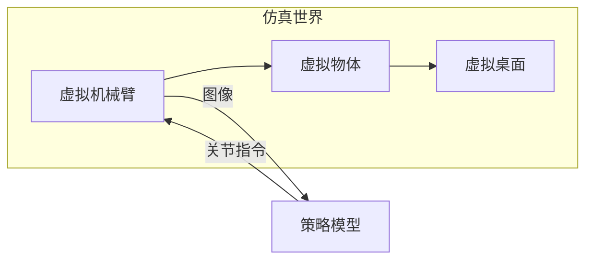
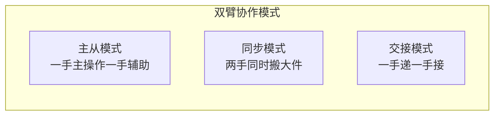

# 第 1 章：具身智能入门

> 本章目标：让完全没有背景的你，建立关于「具身智能」的整体地图，理解 RoboTwin 2.0 所处的坐标位置。
>
> **论述规范说明**：本章核心知识点均按 CONSTRAINTS.md §3.4 的「问题导向五步法」展开——**① 问题场景 → ② 解决方法 → ③ 选型理由 → ④ 理论依据 → ⑤ 完整推导**（设计决策类知识点的 ⑤ 是逐步注明依据的完整推理链）；纯操作性内容在其小节开头注明"操作步骤，不含理论"。论文精读笔记总索引见 [精读/README.md](精读/README.md)。

---

## 1.1 什么是具身智能（Embodied AI）？

**具身智能** = 拥有**身体**（embodiment）的人工智能。

传统 AI（如 ChatGPT）只处理**文字**，它没有眼睛、没有手、没有身体，只能"想"不能"做"。

具身智能强调 **智能必须通过身体与世界互动才能产生**。一个具身智能体（embodied agent）通常包含：

典型例子：
- **人形机器人**：在工厂搬运、在家庭做家务
- **机械臂**：抓取物体、组装零件、倒水
- **自动驾驶**：感知路况、规划路径、控制方向盘

**RoboTwin 2.0** 属于**桌面双臂机械臂操作（bimanual robotic manipulation）**这一子方向——让两台机械臂像人的左右手一样协作完成任务。

下面按五步法回答一个奠基问题：为什么"具身"是这类智能的**必要条件**，而不是锦上添花？

**① 问题场景** 手头：一个在互联网文本与图片上训练出的大模型（如 ChatGPT），它能写文章、写代码。缺的：它看不到桌子，也不能让任何东西动起来——给它一句"把桌上的碗收进柜子"，任务根本无法开始。想要的：一个能**看真实世界、并对真实世界施加物理动作**的智能体。难点：为什么不把"云端大脑 + 摄像头 + 机械臂"拼起来就行，而非要强调"具身"？

**② 解决方法** 把"感知 → 决策 → 动作 → 世界 → 感知"做成一个**闭环**（上方流程图）：智能体的每一步决策都依赖它刚对世界施加动作之后的反馈。具身智能体（embodied agent）就是这个闭环的整体，而不是"大脑"一个部件。

**③ 选型理由** 替代方案："智能留在云端、身体当外设"——感知、规划、控制各自独立建模再拼接。问题：物理世界的每一步动作都会产生预料之外的状态（物体滑移、碰撞反弹），开环拼接没有"从后果中修正"的通道；闭环具身路线让反馈参与纠错与学习。代价：必须面对真实物理的高维与噪声，训练远比纯文本难。但对"操作物体"这一类任务，没有身体就根本没有任务可言——值得。

**④ 理论依据** 具身假说（embodiment hypothesis）：Brooks, *"Intelligence without representation"*, Artificial Intelligence 47 (1991)——智能的核心是与环境的实时交互，而非脱离身体的抽象符号推理；工程侧的印证是莫拉维克悖论（Moravec, *Mind Children*, 1988）：对计算机而言，推理容易、感知-运动困难。

**⑤ 完整推理链**

**第一步（操作任务的输入与输出都落在身体上）。** "把碗收进柜子"至少需要碗位置的视觉感知与抓握的力控制；连续视觉流与力矩信号都不在互联网文本数据的分布内（依据：文本语料不含传感与力矩信息），所以纯语言模型天然缺这两样。

**第二步（交互闭环不可省）。** 感知有误差、执行有噪声（依据：真实传感器与执行器的物理特性），动作执行后的真实状态 ≠ 预期状态；只有读取动作后的新观测并修正后续动作，任务才能继续（依据：反馈控制的基本原理——用输出端的观测修正误差）。

**第三步（结论）。** 由第一、二步：操作任务的输入与输出都必须经由身体，且必须以闭环方式处理（依据：第一步 + 第二步）——"智能必须通过身体与世界互动才能产生"是任务结构的推论，这就是具身智能的定义动机。

---

## 1.2 具身智能的三大学问

| 学问 | 英文 | 做什么 | 类比 |
|------|------|--------|------|
| **感知** | Perception | 看懂世界：物体在哪、是什么、什么状态 | 人的眼睛+大脑视觉区 |
| **决策** | Policy / Decision | 决定下一步动作：抓哪里、怎么抓、往哪放 | 人的"计划能力" |
| **控制** | Control | 把决策变成电机指令：关节转多少度 | 人的肌肉和神经 |

RoboTwin 2.0 主要关注**决策与数据**：它自己不做感知算法，而是**生成训练决策模型所需要的数据**。这种"三学问分工建模 + 模块串联"的传统做法，与端到端 VLA 路线的对比见 §1.3 的五步分析。

---

## 1.3 机器人怎么"学会"做事？（三大范式）

让机器人学会操作，目前有三条主流路线：

### 路线一：强化学习（Reinforcement Learning, RL）
机器人自己"瞎试"，做对了给奖励，做错了给惩罚，靠试错学出策略。

- 优点：能探索出人类想不到的解法
- 缺点：在真实世界试错太危险、太慢（摔坏机器人）

### 路线二：模仿学习 / 行为克隆（Imitation Learning / Behavior Cloning）
让人类（或专家系统）先做一遍演示，机器人**照着学**。

- 优点：安全、直接、像"看师傅做菜"
- 缺点：数据从哪里来？—— 这是 RoboTwin 的核心问题

### 路线三：大模型直接生成动作（VLA，Vision-Language-Action）
用海量数据预训练一个"看见图+听懂话→直接输出动作"的大模型。

- 优点：通用性强，一个模型做很多任务
- 缺点：极度依赖大规模高质量数据

**五步分析：为什么 RoboTwin 2.0 站在"模仿学习 + VLA"的数据侧**（顺带回答"VLA 与传统感知-规划流水线孰优"）

**① 问题场景** 手头：一台双臂机器人与一批任务（递积木、叠碗、开抽屉）。缺的：让机器人获得完成任务的**策略**（policy：从观测到动作的映射）的方法。想要的：一条安全、可规模化、最终能泛化到新任务、新环境的学习路线。

**② 解决方法** 上面列出的三条候选路线：强化学习（RL）、模仿学习/行为克隆、大模型直接生成动作（VLA），逐一带入本场景检验。

**③ 选型理由**

- **RL vs 模仿学习**：RL 的根本代价是试错——真机试错会损坏硬件，只能搬进仿真，而仿真到现实又有差距（§1.6）。模仿学习用人类演示直接监督，安全且样本效率高（ACT/ALOHA 用每任务 50 条遥操作演示即训出双臂策略，arXiv:2304.13705）；代价是需要演示数据——这个"缺数据"的缺口恰好由 RoboTwin 这类数据工厂来补。
- **VLA vs 传统"感知-规划-控制"流水线**（即 §1.2 三大学问各建一个模块再串联）：流水线可解释、可分模块调试，但模块误差逐级累积、模块间接口靠人工设计，换一个任务常要重做上游模块；VLA 端到端把"图像 + 语言 → 动作"压进一个模型，用数据规模换泛化能力（RT-1 用 13 万+ 条真机演示支撑 700+ 任务）。代价：数据需求极大——又回到数据问题。
- **结论**：无论选模仿学习还是 VLA，瓶颈都汇聚在"大规模、多样、高质量的演示数据"上；RoboTwin 2.0 因此不做"又一个策略模型"，而做两条路线共同的数据供给方。

**④ 理论依据**

- RL：Sutton & Barto, *Reinforcement Learning: An Introduction* (2nd ed., MIT Press 2018)。
- 模仿学习/行为克隆：Pomerleau, *"ALVINN: An Autonomous Land Vehicle in a Neural Network"*, NeurIPS 1989（行为克隆原型）；现代低成本双臂形态：ACT/ALOHA（arXiv:2304.13705，[精读：ACT/ALOHA](精读/ACT_ALOHA_RSS2023.md)）。
- VLA 与数据规模证据：RT-1（arXiv:2212.06817，[精读：RT-1](精读/RT1_arXiv2022.md)）、RT-2（arXiv:2307.15818，[精读：RT-2](精读/RT2_arXiv2023.md)）、Open X-Embodiment（arXiv:2310.08864，[精读：Open X-Embodiment](精读/OpenXEmbodiment_ICRA2024.md)）。

**⑤ 完整推理链**（为什么数据是两条主力路线的共同瓶颈）

**第一步（真机 RL 不可行）。** RL 的学习信号来自与环境交互的奖励，需要海量试错；在真机上试错有硬件损坏与安全代价（依据：Sutton & Barto 第 1 章——RL 的核心矛盾即"探索（试错）与利用"的平衡，而操作任务的试错直接作用于物理世界）。

**第二步（仿真 RL 有迁移缺口）。** 把 RL 放进仿真可免去试错代价，但仿真-现实存在分布差距，接触丰富的双臂操作对差距尤其敏感（依据：§1.6 的差距分析；Tobin et al. 2017 的动机部分）。

**第三步（模仿学习依赖演示数据）。** 行为克隆以演示数据集为唯一学习信号，不在线试错（依据：Pomerleau 1989 范式；ACT 每任务 50 条演示即训出策略）——但策略的上限被数据的规模与多样性卡死。

**第四步（VLA 的数据依赖更强）。** VLA 继承互联网级视觉-语言预训练，但操作能力由机器人动作数据决定：RT-1 以 130k+ episodes 支撑 700+ 任务、Open X-Embodiment 汇集 22 种本体 1M+ 条轨迹以图跨本体泛化（依据：RT-1、OXE 论文公开的"数据规模-能力"设计口径）。

**第五步（结论）。** 第三、四步表明两条主力路线的瓶颈同为数据，于是"造数据"成为具身智能操作方向的杠杆点（依据：第三、四步的对比）——这正是 RoboTwin 2.0 的定位（下方 🔑）。

> 🔑 **记住**：RoboTwin 2.0 = **模仿学习 + 大模型（VLA）的数据工厂**。它不直接训练最终策略，而是用自动化方式**造出海量高质量演示数据**，供模仿学习和 VLA 使用。

---

## 1.4 为什么"数据"是当前最大的瓶颈？

你可能疑惑：让机器人学"把碗放好"，需要多少条演示？

- 人类看 1~2 次就能学会
- 而现代机器人策略模型，通常需要 **数千到数百万条**演示

**在真实世界采集数据**的三大痛点：
1. **贵**：需要真人操控（遥操作 teleoperation）、昂贵的机器人
2. **慢**：一条演示几十秒，采集 10 万条要数月
3. **脏**：很难覆盖各种光线、背景、杂乱场景

于是人们想到：**能不能在"仿真世界"里用"数字人"自动表演？**

这就是 **仿真数据合成（Simulation-based Data Synthesis）** 的由来，也是 RoboTwin 2.0 的立足点。

**五步分析：数据瓶颈为什么逼出"仿真数据合成"**

**① 问题场景** 手头：已选定模仿学习/VLA 路线（§1.3 ⑤ 的结论），有一台真机双臂平台。缺的：数千到数百万条、覆盖各种物体/光照/背景/指令的演示——人类看一两次就会的事，策略模型需要海量样本（依据：§1.3 ⑤ 第三、四步的数据依赖）。想要的：一条能规模化的高质量演示获取途径。

**② 解决方法** 两条候选：(a) 真实世界采集——真人遥操作（teleoperation：操作员远程控制真机）逐条录制；(b) 仿真数据合成——在仿真器里让自动化的"数字专家"表演并录制。

**③ 选型理由** (a) 的三大痛点即上方清单：贵（遥操作人力 + 真机折旧）、慢（单条几十秒且串行采集，10 万条即数月量级）、脏（难以系统性覆盖光线/背景/杂乱变化）。量化锚点：RT-1 的 13 万条真机演示由 13 台机器人历时 17 个月采集（arXiv:2212.06817）。(b) 的优点：边际成本趋近 GPU 电费、时间可加速、环境参数可控可枚举；代价：引入仿真-现实差距（§1.6），需配套域随机化等手段。在"数据规模"是第一瓶颈的前提下（§1.3 ⑤），取 (b)，差距另行治理。

**④ 理论依据** 真实采集成本的量化出处：RT-1（Brohan et al., arXiv:2212.06817）；仿真合成范式的代表作：RoboTwin 1.0 的生成式数字孪生（arXiv:2409.02920，[精读：RoboTwin 1.0](精读/RoboTwin1.0_ECCVW2024.md)）与 RoboTwin 2.0（arXiv:2506.18088，[精读：RoboTwin 2.0](精读/RoboTwin2.0_arXiv2025.md)）；"数据越多越好"的 scaling 证据：RoboTwin 1.0 Table 1（专家数据 10→20→50 条，6 个任务成功率全部单调上升，见 [精读：RoboTwin 1.0](精读/RoboTwin1.0_ECCVW2024.md) §5）。

**⑤ 完整推理链**（从"采集速率上限"推出"必须进仿真"）

**第一步（单条演示的时长下界）。** 一条演示的时长由任务自身的物理执行时间决定，压不到零（依据：演示 = 任务在物理时间中的完整执行记录）。

**第二步（真机采集的速率上限）。** 采集速率 ≤（机器人数 × 遥操作员数）÷ 单条时长，且人力与硬件成本随规模线性增长（依据：遥操作是串行的人工过程；第一步的时长下界进入分母）。

**第三步（需求侧量级）。** 策略模型的参数规模（亿级以上）与任务多样性要求的数据量在 10⁴–10⁶ 条级（依据：RT-1 的 130k episodes、RoboTwin 2.0 预收集 10 万+ 条的公开口径）。

**第四步（仿真的边际成本）。** 仿真环境是软件进程，复制与并行的边际成本趋近于零，环境参数（光照/纹理/摆放）可程序化枚举（依据：仿真器的软件本质；SAPIEN 支持并行仿真，Xiang et al., CVPR 2020）。

**第五步（结论）。** 第二步的供给上限与第三步的需求量级相差数个数量级，只有第四步的仿真路线能填平（依据：第二、三、四步的量级对比）；其代价（分布差距）由 §1.6 的手段单独治理——这就是仿真数据合成的必然性论证。

---

## 1.5 什么是"仿真"（Simulation）？

**仿真** = 用计算机程序模拟真实世界。

RoboTwin 2.0 用的仿真器叫 **SAPIEN**，它提供了：
- **物理引擎**：重力、碰撞、摩擦
- **渲染引擎**：光线、阴影、材质（看起来像真的）
- **可交互物体**：能打开的门、能按的开关

**为什么要在仿真里训练？**
- ✅ 无限次试错不损坏硬件
- ✅ 时间可以加速
- ✅ 可以任意改变光线、背景（真实世界很难做到）
- ✅ 成本趋近于零（只需 GPU 电费）

**五步分析：为什么"仿真、数据生成、策略学习"三大支柱缺一不可**

**① 问题场景** 手头：§1.4 的结论——用仿真造数据；一个仿真器（SAPIEN）提供了物理与渲染能力。缺的：仿真器里只有"环境"，没有"会做事的演示者"，也没有"把演示变成技能"的学习环节。想要的：一条从"虚拟世界"到"真机技能"的完整通路。

**② 解决方法** 三大支柱：（1）**仿真环境**——物理引擎（重力/碰撞/摩擦）+ 渲染引擎 + 可交互物体（上方流程图与清单）；（2）**数据生成**——自动化的专家程序（RoboTwin 2.0 中是 MLLM 写的技能代码）在环境里执行并录制轨迹；（3）**策略学习**——用轨迹数据训练策略模型，把"演示"固化成网络权重。

**③ 选型理由** 逐一检验"能不能砍掉一根支柱"：砍掉仿真 → 回到 §1.4 ⑤ 的真机采集死局；砍掉数据生成 → 只有一个空场景，无数据可录；砍掉策略学习 → 录下的轨迹只是"录像"，不能对新物体、新指令泛化。替代组合"真机遥操作 + 学习"（ACT/ALOHA 路线）可行但规模上限低（§1.4 ⑤ 第二步的速率上限）；"仿真 + 手工脚本"质量可控但每任务要数小时人工，到不了 50 任务 × 5 平台的规模（这正是 RoboTwin 1.0 的局限，第 3 章 §3.3.3 缺陷①）。三支柱是串联关系，缺一不可。

**④ 理论依据** 物理仿真器：SAPIEN（Xiang et al., *"SAPIEN: A SimulAted Part-based Interactive ENvironment"*, CVPR 2020, arXiv:1911.10330，其 PartNet-Mobility 提供 2300+ 个带关节标注的可交互物体）；"仿真训练可迁移到真机"的可行性证明：Tobin et al. 2017（arXiv:1703.06907）；RoboTwin 2.0 三大组件对三支柱的分别强化：论文 Figure 2（[精读：RoboTwin 2.0](精读/RoboTwin2.0_arXiv2025.md) §3）。

**⑤ 完整推理链**（三支柱的依赖结构）

**第一步（学习依赖数据）。** 策略学习（模仿学习/VLA 微调）的输入是 (观测, 动作) 对的数据集；没有数据生成，学习环节没有输入（依据：监督式策略学习对数据集的定义）。

**第二步（数据依赖环境）。** 数据生成产出的是"智能体与环境交互的记录"，环境必须提供物理反馈（物体会倒、门有阻尼）与传感观测（相机图像）；没有环境，数据生成无从交互（依据：数据 = 交互轨迹，轨迹 = 状态转移序列）。

**第三步（环境必须可信）。** 若物理/渲染严重失真，录制的分布与真实世界脱节，第一步学出的策略到真机就失效（依据：§1.6 的差距分析；SAPIEN 采用物理引擎与高质量渲染正是为此，Xiang et al. 2020）。

**第四步（结论）。** 三支柱构成串联链：环境 → 交互数据 → 策略，任一断裂则全链不通（依据：第一至三步的递进依赖）；RoboTwin 2.0 的三大技术正是分别加固这三根支柱（第 4 章）。

---

## 1.6 关键概念：Sim-to-Real（仿真到现实迁移）

仿真虽好，但有一个巨大的坑：**仿真和现实永远有差距（Sim-to-Real Gap）**。

- 仿真里的红色和现实里的红色不一样
- 仿真里的物理规律是近似值
- 仿真里的机器人运动比现实"理想"得多

**在仿真里学得再好的模型，一到现实世界可能立刻"失灵"**。解决这个差距，是 RoboTwin 2.0 的核心目标之一。

两大主流应对策略：

| 策略 | 英文 | 思想 | 本论文是否使用 |
|------|------|------|---------------|
| **域随机化** | Domain Randomization | 训练时故意加各种随机干扰，让模型"见过大风大浪"，到现实就不怕了 | ✅ 核心方法 |
| **数字孪生** | Digital Twin | 把真实场景 1:1 复刻到仿真里，尽量消除差距 | ✅ 承袭 RoboTwin 1.0 |

> 💡 **一句话理解域随机化**：像备考时故意做各种"超纲难题"，考试时见到正常题就不紧张了。

**五步分析：差距从哪里来、域随机化凭什么应对**

**① 问题场景** 手头：§1.5 三大支柱产出的策略，在仿真里成功率不错。缺的：一放到真实机器人上成功率往往一落千丈——渲染颜色、物理参数、执行理想度都和真实不一致，且不知道差距到底出在哪一环。想要的：一个能系统解释差距、并给出工程对策的框架。

**② 解决方法** 两大主流策略（上方表格）：**域随机化**——训练时对光照/纹理/摆放/物理参数故意随机扰动，让训练分布"罩住"真实分布；**数字孪生**——把真实场景 1:1 复刻进仿真，从源头缩小差距。RoboTwin 系列两者都用：1.0 以数字孪生为主线，2.0 以域随机化为核心。

**③ 选型理由** 域随机化优点：不需要对真实环境精确测量（只需知道"真实大概长什么样"），随机化天然产生多样性；代价：任务被扰动变难、需要调"剂量"（第 4 章 §4.2.3）。数字孪生优点：差距从源头缩小；代价：每个真实场景都要 1:1 建模，换新场景就要重建，规模受限——RoboTwin 1.0 还需要真机遥操作演示来驱动孪生，2.0 摆脱了这个依赖。两者互补：训练数据侧用随机化换规模，场景搭建侧用孪生思想保保真度。

**④ 理论依据** 域随机化的开山工作：Tobin et al., *"Domain Randomization for Transferring Deep Neural Networks from Simulation to the Real World"*, IROS 2017（arXiv:1703.06907）；动力学随机化：Peng et al., *"Sim-to-Real Transfer of Robotic Control with Dynamics Randomization"*, ICRA 2018；双臂操作上的系统性实证：RoboTwin 2.0 §4.3–4.4（Table 3/4，[精读：RoboTwin 2.0](精读/RoboTwin2.0_arXiv2025.md) §5.3–5.4）。

**⑤ 完整推理链**（差距 → 随机化 → 泛化）

**第一步（策略只认识训练分布）。** 策略是函数 $\pi(a \mid o)$，其行为取决于训练时见过的观测分布 $\mathcal{D}_{\text{sim}}$；对分布外的输入 $\mathcal{D}_{\text{real}}$，行为无保证（依据：监督学习/模仿学习的标准设定）。

**第二步（差距 = 分布偏移）。** 仿真的渲染与物理是现实的近似，故 $\mathcal{D}_{\text{sim}} \neq \mathcal{D}_{\text{real}}$（依据：仿真器对现实的建模近似本质，§1.5 ④）。

**第三步（分布偏移抬高误差上界）。** 域适应理论给出上界：目标域（真实）误差 ≤ 源域（仿真训练）误差 + 两分布散度 + 理想联合误差项（依据：Ben-David et al., *"A theory of learning from different domains"*, Machine Learning 79, 2010, Theorem 1；公式形式见第 4 章 (4.1)）。

**第四步（随机化的作用机制）。** 域随机化不缩小真实分布，而是扩大训练分布：随机扰动后 $\mathcal{D}_{\text{real}}$ 落入训练分布内部，第三步中可控的两项（源域误差、散度）被压缩（依据：Ben-David 界中两项均随分布重合度增大而减小；Tobin et al. 2017 实证——用随机化渲染的仿真图像训练的抓取网络，零微调直接在真机工作）。

**第五步（本主题的实证校验）。** RoboTwin 2.0 真机对照实验（Table 4）：仅 10 条真机演示时，"未见背景 + 杂乱环境"成功率 9.0%；加 1000 条域随机化合成数据后升至 42.0%（相对 +367%）——"随机化数据预先覆盖了环境变化"的假说得到直接验证（依据：论文 §4.4 的归因）。

**第六步（边界条件）。** 随机化范围必须覆盖测试分布、且不得引入语义冲突，否则第四步失效（依据：RoboTwin 2.0 附录 C 的剂量控制；详见第 4 章 §4.2.1 (4.2) 与 §4.2.3）。

---

## 1.7 本论文出现的核心角色（先混个脸熟）

| 缩写/名词 | 全称 | 通俗解释 | 详细位置 |
|-----------|------|---------|---------|
| **RoboTwin-OD** | RoboTwin Object Dataset | 731 个 3D 物体模型库 | 第 5 章 |
| **MLLM** | Multimodal Large Language Model | 能"看图+读文"的大模型 | 第 4 章 |
| **VLA** | Vision-Language-Action Model | 输入图+语言、输出动作的模型 | 第 8 章 |
| **VLM** | Vision-Language Model | 能"看图说话"的模型（用来看执行对不对） | 第 4 章 |
| **DoF** | Degrees of Freedom | 机器人关节的自由度数 | 第 2 章 |
| **域随机化** | Domain Randomization | 训练时随机干扰环境 | 第 4 章 |
| **Code Agent** | 代码智能体 | 用 LLM 自动写机器人执行代码 | 第 4 章 |
| **RDT / Pi0 / ACT / DP / DP3** | 各种策略模型 | 论文用来评测的 5 种策略 | 第 6、8 章 |

---

## 1.8 为什么专门研究"双臂"（Bimanual）？

人有很多事情需要**两只手配合**：
- 递东西（一只手递、一只手接）
- 拧瓶盖（一只手握瓶身、一只手拧盖）
- 端盘子、叠衣服

机器人"双臂"任务远比单臂复杂，因为要处理**两只手的协调**：

RoboTwin 2.0 专门设计了 50 个双臂协作任务（如 Handover Block 递积木、Stack Bowls 叠碗），并支持 5 种不同机器人平台，就是为了攻克双臂这一难点。

**五步分析：为什么双臂是必须专门攻克的场景**

**① 问题场景** 手头：单臂策略已经能抓、能放。缺的：人类日常任务中大量动作（递、拧、端、叠）在物理上需要两只手同时参与——单臂平台无论多强都做不了。想要的：让双臂系统完成协作任务的能力，以及训练这种能力所需的数据。

**② 解决方法** 把双臂任务显式建模为**协作模式**（上方流程图三种：主从、同步、交接），围绕模式设计任务与数据生成。

**③ 选型理由** 替代方案：把双臂任务当作"两个单臂策略的拼接"。问题：交接类任务中，右手能否抓住取决于左手递到哪、何时松——两臂动作在时间上耦合，两个独立策略之间没有协调通道（依据：本节末尾 §2.2 将展开的双臂四大难点）。专门双臂建模的代价是动作空间翻倍、策略结构更复杂，但对交接/同步类任务是唯一解。

**④ 理论依据** 低成本双臂遥操作与双臂模仿学习的代表工作：ACT/ALOHA（Zhao et al., arXiv:2304.13705，[精读：ACT/ALOHA](精读/ACT_ALOHA_RSS2023.md)，双臂平台 16 维联合动作空间）；双臂基准的系统化：RoboTwin 1.0 / 2.0（50 个双臂协作任务 × 5 平台，arXiv:2506.18088，[精读：RoboTwin 2.0](精读/RoboTwin2.0_arXiv2025.md)）。

**⑤ 完整推理链**（双臂难在哪）

**第一步（约束跨臂）。** 交接类任务中，右手抓取的成功条件由左手的动作轨迹决定（递送位姿、松手时刻）（依据：任务自身的物理结构）。

**第二步（动作空间联合）。** 因此策略的输入必须包含两臂状态、输出必须联合决定两臂动作，动作维度从单臂+夹爪的 8 维升到双臂的 14+ 维（依据：ACT 将 ALOHA 双臂 14 关节 + 2 夹爪编码为 16 维动作向量，arXiv:2304.13705）。

**第三步（学习难度随维数上升）。** 动作空间维数翻倍 ⇒ 覆盖同样行为多样性所需的演示样本增加、两臂时序协调更难学（依据：监督学习的样本复杂度随假设空间维数增长的一般规律）。

**第四步（结论）。** 双臂任务"物理上必须做、学习上更难做"——需要专门的基准与数据生成管线（依据：第一至三步；RoboTwin 2.0 的 50 任务即为此设计，第 3 章 §3.6.2）。

---

## 1.9 本章小结（自测清单）

学完本章，你应该能回答：
1. 具身智能和传统 AI 的区别是什么？
2. 机器人学习的三大范式是什么？
3. 为什么真实世界采集数据贵且慢？
4. 什么是 Sim-to-Real Gap？域随机化如何缓解它？
5. 为什么双臂任务比单臂难？
6. RoboTwin 2.0 在具身智能版图中扮演什么角色？

> **动手练习**：拿出一张纸，画出"感知→决策→动作→世界→感知"的闭环，并标注 RoboTwin 2.0 主要作用于哪个环节（提示：决策环节所需的数据）。

---

## 1.10 延伸阅读

- RoboTwin 2.0 项目主页：https://robotwin-platform.github.io/
- RoboTwin 1.0（前作）：arXiv:2409.02920，本地 PDF：[papers/robotwin/paper/arXiv-2409.02920_RoboTwin1.0.pdf](../../papers/robotwin/paper/arXiv-2409.02920_RoboTwin1.0.pdf)，[精读：RoboTwin 1.0](精读/RoboTwin1.0_ECCVW2024.md)（本章 §1.10 原记 arXiv:2504.13059 与仓库论文原文不符，已按仓库 PDF 勘正）
- 论文精读总索引：[精读/README.md](精读/README.md)（11 篇，含 RT-1/RT-2/ACT/Diffusion Policy/RoboTwin 双基准）
- 若想系统学习具身智能，推荐从斯坦福 CS330、伯克利 CS285 等公开课入门（第 9 章有详细清单）
