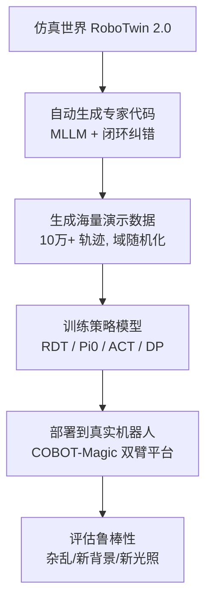

# 第 2 章：双臂操作与仿真基础

> 本章目标：让你理解"机械臂如何运动、双臂如何协作、仿真器如何工作"，为精读论文扫清障碍。
>
> **论述规范说明**：本章核心知识点均按 CONSTRAINTS.md §3.4 的「问题导向五步法」展开——**① 问题场景 → ② 解决方法 → ③ 选型理由 → ④ 理论依据 → ⑤ 完整推导**；纯操作性内容在其小节开头注明"操作步骤，不含理论"。公式 (2.1)–(2.2) 供第 4 章 §4.3 与精读笔记回引。

---

## 2.1 机械臂基础：关节、连杆与自由度

### 2.1.1 关节与连杆

机械臂像人的手臂，由**连杆（link）**和**关节（joint）**组成：
- **连杆**：手臂的"骨头"
- **关节**：骨头之间的"关节"，能让骨头的角度变化


### 2.1.2 自由度（Degrees of Freedom, DoF）

**自由度** = 一个系统可以独立运动的方向数量。

- 每个可旋转的关节 = 1 个自由度
- 一个 7 自由度（7-DoF）机械臂 = 7 个关节都可以独立转动

**为什么 DoF 重要？**
DoF 越高，机械臂越灵活，能摆出的姿势越多：
- **7-DoF（如 Franka、UR5）**：非常灵活，可以从正上方"精准下抓"（top-down grasp）
- **6-DoF（如 Piper、ARX-X5、Aloha-AgileX）**：灵活度有限，往往只能从侧面抓（lateral/side grasp）

> 🔑 **这是理解论文第 2.3 节（体态感知抓取）的关键**：同一件物体，高自由度机械臂能"从顶上抓"，低自由度机械臂只能"从旁边抓"。论文专门为此设计了适配机制。

**五步分析：为什么 DoF 决定"能从哪个方向抓"**

**① 问题场景** 手头：桌上的物体与一台机械臂，物体上已标出候选抓取位姿（标注从哪来见第 5 章）。缺的：判断哪些候选抓取位姿这台臂**够得着、摆得出**——同一个瓶子，Franka 能从正上方垂直下压去抓，Piper 未必摆得出那个姿态。想要的：只看运动学就能筛出"可行抓取"的判据，为每种平台生成它自己的抓取方案。

**② 解决方法** 用"末端位姿需求 vs 可达工作空间"的匹配来筛：把每个候选抓取写成末端目标位姿（三维位置 + 接近方向），对每个平台解**逆运动学**（inverse kinematics, IK：已知末端位姿，反求各关节角度），有解且不撞关节限位的候选才保留。

**③ 选型理由** 替代方案：(a) 不做运动学分析，把所有候选抓取丢给规划器逐个试——可行，但每个候选都要跑一次完整的碰撞检测 + 路径搜索，计算贵且"为什么失败"不可解释；(b) IK 可达性初筛——一次求解即可淘汰大量不可行候选，且失败原因（超限位/近奇异）可直接诊断。代价：需要精确的运动学模型与关节限位表——机器人产品都以 URDF 模型提供，仿真器加载的正是它。数据生成要为 5 种平台批量筛抓取，初筛必须廉价——取 (b)。

**④ 理论依据** 机器人运动学标准教材：Siciliano, Sciavicco, Villani, Oriolo, *Robotics: Modelling, Planning and Control*, Springer 2009（第 2 章：正/逆运动学、可达工作空间、奇异位形）；冗余机械臂的自运动（self-motion，末端不动时关节仍可滑动的内部自由度）：同书冗余臂章节与 Klein & Huang, *"Review of pseudoinverse control for use with kinematically redundant manipulators"*, IEEE Trans. SMC 1983；实证锚点：RoboTwin 2.0 Table 2（[精读：RoboTwin 2.0](精读/RoboTwin2.0_arXiv2025.md) §5.2）。

**⑤ 完整推导**

**第一步（末端位姿是 6 维需求）。** 夹爪相对物体的安装位姿 = 三维位置 + 三维姿态，属于特殊欧氏群 $SE(3)$，$\dim SE(3) = 6$（依据：刚体位姿的自由度数，Siciliano 2009 §2.3）。记**正运动学**（forward kinematics：已知关节角求末端位姿）为
$$\mathbf{x}_{ee} = f(\mathbf{q}), \qquad \mathbf{q} = (q_1, \dots, q_n), \tag{2.1}$$
每个转动关节贡献 1 个自由度，故 $n$ 关节臂的 $\mathbf{q} \in \mathbb{R}^n$（依据：旋转关节的 1 DoF 性质）。

**第二步（顶抓是一条姿态约束）。** "从正上方垂直下压" = 夹爪接近轴竖直向下，即目标位姿 $\mathbf{g}_{\text{top}}$ 的姿态分量被完全指定；其可行性 ⟺ IK 存在可行解：
$$\exists\, \mathbf{q}: \; f(\mathbf{q}) = \mathbf{g}_{\text{top}}, \quad \mathbf{q}_{\min} \le \mathbf{q} \le \mathbf{q}_{\max}, \tag{2.2}$$
（依据：逆运动学的定义 + 关节限位的物理约束，Siciliano 2009 §2.13。）

**第三步（n = 6：恰定，无腾挪空间）。** 目标 6 维、变量 6 维，IK 一般只有有限个孤立解，每个解还须满足限位 (2.2)。当目标位姿接近可达空间边界、或构型接近奇异位形（雅可比降秩，臂"伸直"或关节轴共线）时，解不存在或不可行（依据：Siciliano 2009 对可达工作空间与奇异位形的讨论）——这就是 6-DoF 平台对"竖直向下"这类固定姿态常常无解的根源。

**第四步（n = 7：冗余，有自运动流形）。** 变量 7 > 目标 6，IK 的解集是一条 1 维流形：末端位姿不变，关节仍可沿"自运动"方向滑动（依据：冗余机械臂的标准结论，Klein & Huang 1983）。工程意义：可以保持抓取姿态不动，沿流形寻找满足限位、避开奇异、避开碰撞的构型——顶抓的可行域因此大得多。

**第五步（连到实验证据）。** 推论：同一套以"顶抓习惯"生成的抓取候选，对 7-DoF 平台几乎无损、对 6-DoF 平台大面积失败。RoboTwin 1.0 管线（未做体态适配）的实测：Piper 自动数据采集成功率 2.4%，Franka 67.3%（RoboTwin 2.0 论文 Table 2）——失败差距与第三、四步的可行性分析一致，说明瓶颈在"摆不出抓取位姿"而非任务本身；2.0 的体态感知适配把 Piper 提到 25.1%，机制见第 4 章 §4.3。

### 2.1.3 末端执行器（End-Effector / Gripper）

机械臂末端通常装**夹爪（gripper）**来抓东西：
- **平行夹爪**：像两根手指并拢夹取
- **灵巧手**：像人手一样多指操作（本论文主要用夹爪）

论文中出现的夹爪：**Panda gripper**（Franka 标配）、**WSG gripper** 等。

---

## 2.2 双臂系统与协作模式

### 2.2.1 什么是双臂系统？

**双臂系统（bimanual system）** = 两个机械臂 + 一个固定基座（或移动底盘），共同工作。

RoboTwin 2.0 支持 **5 种机器人平台（embodiment）**：

| 平台 | DoF | 特点 | 擅长 |
|------|-----|------|------|
| **Franka** | 7 | 高灵活性，可顶抓 | 精细操作 |
| **UR5** | 7 | 工业级，工作空间大 | 通用任务 |
| **Aloha-AgileX** | 6 | 低成本，遥操作友好 | 双臂协作 |
| **ARX-X5** | 6 | 低成本六轴 | 侧抓任务 |
| **Piper** | 6 | 低自由度 | 受限场景（本论文重点提升对象） |

> 💡 **论文核心洞察**：6-DoF 平台在 RoboTwin 1.0 里成功率极低（如 Piper 仅 2.4%），因为旧数据生成方法没考虑它们"够不着、姿势受限"。RoboTwin 2.0 通过"体态感知抓取"把 Piper 提升到 25.1%（见第 6 章）。

### 2.2.2 双臂为何难？

1. **运动空间冲突**：两只手臂可能互相碰撞，需要避障
2. **抓取策略差异**：左右手分工不同
3. **任务耦合**：一个动作依赖另一个动作（如先递后接）
4. **多模态输入**：需要多视角摄像头同时观察两只手

**五步分析：为什么双臂协作必须显式建模、不能当成两个单臂**

**① 问题场景** 手头：两台单臂各自都能抓、能放（§2.1 的能力）。缺的：完成"左手递积木、右手接住放到篮子里"这类任务——难点不在单臂动作，而在两臂动作的**时序耦合**。想要的：双臂任务的建模方式与配套的任务/数据设计。

**② 解决方法** 把双臂任务显式建模为三种**协作模式**：主从模式（一手主操作、一手辅助固定）、同步模式（两手同时搬大件）、交接模式（一手递一手接）；围绕模式设计任务分解与数据生成（§2.3 的专家代码即按模式分步调用两臂 API）。

**③ 选型理由** 替代方案：把双臂任务当作"两个独立单臂策略的拼接"。问题：交接类任务中右手能否抓住取决于左手何时递到何位——两个独立策略之间没有协调通道，时序耦合无法表达（依据：本节上方第 3 条"任务耦合"）。显式双臂建模的代价：动作空间翻倍、策略与数据结构更复杂（第 1 章 §1.8 ⑤），但对交接/同步类任务是唯一能表达协调的方案。

**④ 理论依据** 低成本双臂遥操作与双臂模仿学习：ACT/ALOHA（arXiv:2304.13705，[精读：ACT/ALOHA](精读/ACT_ALOHA_RSS2023.md)，将双臂 14 关节 + 2 夹爪编码为 16 维动作向量，证明双臂联合动作空间可被行为克隆学出）；双臂协作任务的系统化基准：RoboTwin 2.0 的 50 任务（arXiv:2506.18088，[精读：RoboTwin 2.0](精读/RoboTwin2.0_arXiv2025.md)）。

**⑤ 完整推理链**（上方四条"为何难"的逐条定位）

**第一步（动作空间联合扩张）。** 双臂策略的输入含两臂状态、输出联合决定两臂动作，维度从 8 维（单臂+夹爪）升到 16 维级（依据：ACT 的 16 维动作设计，arXiv:2304.13705）——这是"任务耦合"（第 3 条）在数学上的体现。

**第二步（耦合约束跨臂）。** 交接/同步任务的约束定义在两臂动作的**乘积空间**上（右手在时刻 $t$ 的抓取条件由左手在 $t' < t$ 的轨迹决定）（依据：交接任务的物理结构）——独立策略的乘积无法表达这种跨时刻约束，故必须显式建模（对应第 3 条）。

**第三步（避障空间耦合）。** 两臂共享同一工作空间，任一臂的可行构型集因另一臂的位置而收缩（依据：第 1 条"运动空间冲突"；§2.1.2 (2.2) 的限位约束再加臂间碰撞约束）——这是数据生成阶段必须做臂间避障规划的原因（§2.4.3 CuRobo）。

**第四步（感知负担倍增）。** 两只手 + 多物体同时变化，单视角相机无法同时保证两侧观测质量（依据：第 4 条），因此基准配置多视角相机、数据里存多路图像（§2.6）。

**第五步（结论）。** 四条难点共同指向"双臂 = 一个联合问题，不是两个单臂问题"（依据：第一至四步），这决定了第 4 章三大技术都要显式处理双臂（如 API 带 `arm_tag`、代码支持双臂并行）。

### 2.2.3 双臂任务举例（来自论文 50 任务）

| 任务 | 双臂协作方式 |
|------|-------------|
| **Handover Block**（递积木） | 左手抓起积木→递到中间→右手接住→放到目标位置 |
| **Stack Bowls**（叠碗） | 一手拿碗，一手稳住，把碗叠起来 |
| **Open Microwave**（开微波炉） | 一手拉门，一手放东西 |
| **Shake Bottle**（摇瓶子） | 双手握住瓶子来回摇 |
| **Put Bottles Dustbin**（放垃圾桶） | 双手各拿一个瓶子放入垃圾桶 |

---

## 2.3 机器人如何"编程"执行任务？（两种路线）

要让机械臂完成"把积木放进篮子里"，有两条路线：

### 路线 A：手写/自动生成"技能代码"（Scripted / Code-based）

像写 Python 一样，一步步调用 API：

```python
# 伪代码：机器人执行"递积木"
left_arm.grasp(box)          # 左手抓住盒子
left_arm.move(handover_pose) # 左手移到交接点
right_arm.grasp(box)         # 右手抓住盒子
left_arm.release()           # 左手松开
right_arm.place(target)      # 右手放到目标位置
```

- 优点：可控、可复现、执行确定性高
- 缺点：要有人/模型来写这些代码

**RoboTwin 2.0 的创新之一**：让**大模型（MLLM）自动写这些代码**，写完放到仿真里跑，跑错了就让模型改（闭环迭代）。详见第 4 章。

### 路线 B：端到端学习（End-to-End Policy Learning）

不写代码，而是训练一个神经网络：
输入「当前摄像头画面 + 任务文字」→ 直接输出「关节目标角度序列」。

- 优点：无需人工编程，泛化性好
- 缺点：需要海量数据 —— 这正是 RoboTwin 2.0 造数据的用途！

> 🔑 **重要区分**：
> - 路线 A（自动写代码）= RoboTwin 2.0 的**数据生成引擎**
> - 路线 B（策略学习）= 用生成的数据**训练最终机器人大脑**
>
> 两者是"造数据的"和"用数据的"关系，论文中分别称为 **数据生成（Data Generation）** 与 **下游策略学习（Downstream Policy Learning）**。

**五步分析：为什么分工是"代码造数据、学习出策略"**

**① 问题场景** 手头：一个 50 任务的双臂基准，要为每个任务批量产出"专家级"演示数据，最终还要有一个能在真实世界执行任务的策略。缺的：既能规模化产出可信演示、又能泛化到新环境的执行来源。想要的：两条路线的正确分工，而不是二选一。

**② 解决方法** 双路线分工：数据生成阶段用**路线 A**（MLLM 在 API 约束下写技能代码，仿真执行录制轨迹）；策略部署阶段用**路线 B**（用录制的数据训练端到端策略）。上方的 🔑 区分即此分工。

**③ 选型理由**

- 数据生成阶段选 A 不选 B 的理由见第 4 章 §4.1.1 的完整五步分析（核心：代码零演示起步、可执行验证、失败可修复）。
- 最终部署选 B 不选 A 的理由：A 的代码是为**已知任务**写的，换新物体、新指令、新场景就要重写；B 是从数据学出的函数，见过的变化越多泛化越强（依据：§1.3 ⑤ 第三、四步）；且 B 学的是"图像 → 动作"，部署时不依赖仿真器与物体位姿真值——真机上没有仿真器给的完美标注。
- 组合的代价：两段式管线多一道"数据生成"工序（算力 + 质量控制）；收益是数据侧完全自动化、策略侧完全数据驱动，各自都可独立迭代。

**④ 理论依据** "LLM 写代码操控机器人"范式：Code as Policies（Liang et al., *"Code as Policies: Language Model Programs for Robotic Control"*, ICRA 2023, arXiv:2209.07753）；端到端策略的数据依赖：RT-1（arXiv:2212.06817，[精读：RT-1](精读/RT1_arXiv2022.md)）、ACT/ALOHA（arXiv:2304.13705，[精读：ACT/ALOHA](精读/ACT_ALOHA_RSS2023.md)）；本系统的两段式定位：RoboTwin 2.0 §1/§3.2（数据生成 + 下游策略学习）。

**⑤ 完整推理链**（为什么两段式是当前约束下的最优分工）

**第一步（演示数据的要求）。** 训练数据必须是"成功完成任务的 (观测, 动作) 序列"，且大规模可得（依据：§1.3 ⑤；模仿学习的监督本质）。

**第二步（代码路线满足第一条）。** 专家代码在仿真里执行即可产出精确记录的观测与动作，且成功率可验证（依据：§2.4 仿真提供状态真值；第 4 章 §4.1.5 的验证闭环）。

**第三步（学习路线满足第二条）。** 端到端策略一旦训好，部署只需相机与前向推理，不依赖仿真真值；其泛化性来自训练数据的多样性（依据：§1.3 ⑤ 第四步的 RT-1/OXE 证据）。

**第四步（单独任一路线都不满足两条）。** 只用 A：任务写死、无泛化（换物体即失效）；只用 B：训练 B 需要的正是第一步要产出的数据——循环依赖（依据：第一至三步）。

**第五步（结论）。** A 补 B 的数据缺口、B 补 A 的泛化缺口，两段式分工是当前约束下的必然组合（依据：第二至四步）——这就是"造数据的"与"用数据的"关系。

---

## 2.4 仿真器入门

### 2.4.1 什么是仿真器（Simulator）？

仿真器 = 一个"虚拟物理世界"软件。RoboTwin 2.0 基于 **SAPIEN** 构建。

SAPIEN 提供三大能力：
1. **物理仿真**：物体受重力、有碰撞、有摩擦（像真的）
2. **视觉渲染**：用 GPU 画出"看起来逼真"的画面
3. **可交互物体**：铰链、按钮、抽屉都可以被操作（PartNet-Mobility 提供）

**五步分析：为什么选 SAPIEN 这类物理仿真器**

**① 问题场景** 手头：§2.3 的分工决定了要在仿真里批量生成双臂操作演示；50 个任务里有开门、开抽屉、开微波炉这类**铰接物体**操作。缺的：一个既能让物体"受重力、有碰撞、门有阻尼"，又能渲染出多样图像，还带现成可交互物体模型的虚拟世界。想要的：物理可信 + 视觉可控 + 物体资产齐备的仿真环境。

**② 解决方法** 采用为机器人操作设计的物理仿真器 SAPIEN：PhysX 刚体动力学（物理）、GPU 渲染接口（视觉）、PartNet-Mobility 铰接物体库（2300+ 个带关节轴标注的门/抽屉/家电）。

**③ 选型理由** 候选对比：(a) 纯渲染引擎/照片级渲染器——图像质量最高，但没有物理，无法生成交互轨迹（物体会穿模、门没有阻尼）；(b) 游戏引擎——有物理但为游戏调校，接触与关节建模粗糙，机器人接口生态弱；(c) SAPIEN——物理引擎保证交互可信，铰接物体库直接覆盖 50 任务的需求，且是 ManiSkill 系列操作基准的底座（机器人接口成熟）。代价：渲染真实感不及照片级渲染——用域随机化"以覆盖换逼真"弥补（§2.5）。

**④ 理论依据** SAPIEN：Xiang et al., *"SAPIEN: A SimulAted Part-based Interactive ENvironment"*, CVPR 2020（arXiv:1911.10330）；PartNet-Mobility 数据集（同论文，2300+ 铰接物体带关节标注）；RoboTwin 2.0 基于 SAPIEN 构建并扩展 731 物体的 RoboTwin-OD（论文 §3.1，[精读：RoboTwin 2.0](精读/RoboTwin2.0_arXiv2025.md) §4.5）。

**⑤ 完整推理链**（任务需求 → 仿真器能力的逐条对应）

**第一步（任务含铰接操作）。** 50 任务中包含开门、开抽屉、开微波炉 → 需要带**关节**的物体模型（每个门/抽屉有旋转轴、限位、阻尼），普通静态网格不够（依据：铰接物体的运动学定义；RoboTwin 2.0 任务清单）。

**第二步（铰接模型有现成库）。** PartNet-Mobility 提供 2300+ 个逐部件标注关节的物体（依据：SAPIEN 论文）→ 第一步的需求有现成供给，无需自建 → RoboTwin-OD 从中取 44 个并自建/扩充至 731（依据：论文 §3.1）。

**第三步（交互需要物理）。** 抓握的力闭合、放置的稳定性、门的转动都由接触力学决定 → 必须有刚体物理引擎（依据：§2.3 ⑤ 第一步"数据 = 物理交互记录"；PhysX 引擎，SAPIEN 2020）。

**第四步（造数据需要批量与可控）。** 数据工厂要并行跑大量场景并程序化改光照/纹理/摆放（§2.5 的域随机化）→ 仿真器的渲染参数必须可编程访问（依据：第 1 章 §1.4 ⑤ 第四步；SAPIEN 的渲染接口）。

**第五步（结论）。** 三项能力各自对应一条任务需求（依据：第一至四步），SAPIEN 类物理仿真器是数据生成场景的必要选型。

### 2.4.2 仿真器里有什么？

```text
仿真场景（Scene）
├── 机器人（Embodiment）：Franka / UR5 / Piper ...
│   └── 夹爪（Gripper）：Panda / WSG
├── 物体（Objects）：来自 RoboTwin-OD（731 个 3D 模型）
│   └── 每个物体带标注：放置点、功能点、抓取点、抓取轴
├── 桌面（Tabletop）：高度可变
├── 背景/纹理（Background/Texture）：11000 张贴图
├── 灯光（Lighting）：颜色、强度、位置可调
└── 摄像头（Camera）：多视角 RGB 相机
```

### 2.4.3 运动规划器（Motion Planner）

机器人要把手从 A 点移动到 B 点，**不能瞬移**，需要规划一条不撞障碍物的路径。

RoboTwin 2.0 使用 **CuRobo**（NVIDIA 出品）这个 GPU 加速的规划器：
- 输入：目标位置 + 障碍物
- 输出：一系列关节角度（路径）
- 特点：快、支持复杂约束

**五步分析（紧凑）：为什么机器人"不能瞬移"，需要运动规划**

**① 问题场景** 手头：专家代码已给出"左手移动到交接点"这样的目标位姿（§2.3 路线 A 的 API 调用）。缺的：从当前关节构型到目标构型的、不撞桌面/物体/另一条臂的关节路径——关节空间里两点直接插值可能让末端横穿障碍。想要的：自动生成无碰撞路径的方法。

**② 解决方法** 运动规划器（RoboTwin 2.0 用 NVIDIA CuRobo）：输入目标位姿 + 环境障碍几何，输出无碰撞的关节轨迹。

**③ 选型理由** 替代方案：人工逐任务写轨迹——每个物体位置都要重调，50 任务 × 5 平台不可扩展；规划器自动求解——代价是需要环境几何（仿真里天然有精确网格）与求解时间；CuRobo 用 GPU 并行采样/优化把求解压到毫秒-秒级，正好匹配"批量造数据"的吞吐需求。

**④ 理论依据** 运动规划问题的系统表述：LaValle, *Planning Algorithms*, Cambridge University Press 2006（构型空间与无碰撞路径）；CuRobo：Sundaralingam et al., *"cuRobo: Parallelized Collision-Free Robot Motion Generation"*, ICRA 2023（arXiv:2310.17274）；RoboTwin 2.0 以 CuRobo 为底层规划器（论文附录 E）。

**⑤ 完整推理链**

**第一步（碰撞的定义）。** 机器人是刚体连杆树，任一中间构型若与场景几何相交即为碰撞（依据：刚体几何 + 碰撞检测定义）。

**第二步（问题转化到构型空间）。** 把机器人压成构型空间 $\mathcal{C} = \mathbb{R}^n$ 中的一个点，碰撞构型构成障碍区 $\mathcal{C}_{\text{obs}}$；规划 = 在 $\mathcal{C} \setminus \mathcal{C}_{\text{obs}}$ 内找一条连接起终点的连续曲线（依据：LaValle 2006 的构型空间形式化）。

**第三步（为什么不能显式建模后直接求解）。** $\mathcal{C}$ 高维（双臂 12+ 维），障碍区边界由连杆正运动学隐式定义，无法显式写出（依据：第二步的隐式性）→ 只能采样式/优化式搜索。

**第四步（GPU 并行为什么有效）。** 采样与碰撞检测天然可并行（成千上万个候选构型互不依赖）→ GPU 并行把搜索吞吐提高数量级（依据：CuRobo 论文的并行化设计）。

**第五步（结论）。** §2.2 ⑤ 第三步的"臂间避障"与 §2.3 的"代码只写任务级目标"都依赖本环节：规划器把"目标位姿"变成"可执行轨迹"，是数据生成管线里任务层与控制层之间的桥。

---

## 2.5 Sim-to-Real 全流程（论文大背景）

让我们把第 1 章的概念串成完整流程：



**关键环节解释：**

| 环节 | 作用 | 论文中的实现 |
|------|------|-------------|
| 数据生成 | 造演示 | MLLM 自动写代码 + 域随机化 |
| 策略训练 | 学"看图做动作" | 5 种策略模型（第 8 章） |
| 迁移评测 | 验证是否能用 | 仿真内 Easy/Hard + 真实世界 |

**五步分析：Sim-to-Real 差距的来源三分类与对策划别**

**① 问题场景** 手头：仿真里成功率不错的策略（§2.4 的管线产物），部署到真机后成功率大幅下降甚至失灵。缺的：对"差距到底出在哪一环"的系统分类——不分类就无法对症下药，只能笼统说"仿真不够真"。想要的：**差距源 → 影响 → 对策**的完整判别框架。

**② 解决方法** 按策略回路的位置把差距分三类——**动力学差距**（物理规律近似）、**感知差距**（渲染与真实传感不一致）、**控制差距**（理想执行 vs 真实控制器），每类对应不同的仿真侧对策（动力学随机化/视觉随机化/执行建模），完整推理见 ⑤。

**③ 选型理由** 替代方案：把差距当一个整体，用"采集更多真实数据"硬冲——真实数据贵且慢（第 1 章 §1.4），且不告诉你**该**采集什么变化。三分类让"哪些差距能用仿真侧手段廉价消除"变得可判别：感知差距靠视觉随机化（几乎零边际成本），控制差距靠执行建模（一次性工程），动力学差距靠动力学随机化或辨识。代价：分类是定性框架，三类差距可能耦合（如延迟既属控制又改变观测时序），需在实验中迭代验证。

**④ 理论依据** 视觉域随机化：Tobin et al., IROS 2017（arXiv:1703.06907）；动力学随机化：Peng et al., ICRA 2018（arXiv:1710.06537）；sim-to-real 迁移的系统综述：Zhao, Queralta & Westerlund, *"Sim-to-real transfer in deep reinforcement learning for robotics: a survey"*, IEEE TNNLS 2020；双臂操作上的实证：RoboTwin 2.0 §4.4（Table 4）与附录 C（统一 DR 口径）。

**⑤ 完整推理链**（差距源 → 影响 → 对策划别）

**第零步（回路的完备分解）。** 策略 π 在闭环中"观测 o → 动作 a → 环境状态转移 → 新观测"。仿真与现实各自提供三个要素：状态转移（动力学 $P_{\text{sim}}$ / $P_{\text{real}}$）、观测生成（渲染 $R_{\text{sim}}$ / 真实传感 $R_{\text{real}}$）、动作执行（理想指令 / 真实控制器）。仿真-现实的不一致只能通过这三条通道影响策略行为（依据：回路要素分解——策略行为是"转移 × 观测 × 执行"的复合结果，三要素之外无其他入口）。以下按此分类逐条推导。

**第一步（动力学差距）。** $P_{\text{sim}} \neq P_{\text{real}}$：质量、摩擦、阻尼、接触参数只能近似（依据：物理引擎采用刚体假设与近似接触模型，SAPIEN 基于 PhysX，Xiang et al. 2020）。**影响**：相同动作序列在两边产生不同轨迹，长时程任务误差逐步累积。**对策划别**：(i) 仿真侧给动力学参数加随机分布（动力学随机化）——Peng et al. 2018 实证对质量/摩擦等随机化后真机转移成功率显著提升；(ii) 对真机做系统辨识——精度有限且逐机种需人工。数据生成场景选 (i)（依据：辨识与随机化的成本-覆盖权衡，同第 1 章 §1.6 ③ 的逻辑）。

**第二步（感知差距）。** $R_{\text{sim}}(\cdot) \neq R_{\text{real}}(\cdot)$：渲染的材质、光照、背景与真实图像存在系统性差异（依据：第 1 章 §1.6 第二步）。**影响**：策略输入分布偏移，视觉特征失配——这是 sim-to-real 失效最常见的通道（依据：Tobin et al. 2017 的问题设定）。**对策划别**：(i) 视觉域随机化——随机灯光/纹理/杂乱让训练图像覆盖真实外观空间（Tobin et al. 2017 实证：随机化渲染参数后，仿真图像训练的抓取网络零微调即可在真机工作）；(ii) 提升渲染真实感——成本高且"逼近"永远有方向性、追不上真实的全部变化。以覆盖代逼真，选 (i)（RoboTwin 2.0 的背景/光照/杂乱三维随机化即此对策）。

**第三步（控制差距）。** 仿真里"下发关节目标即刻到达"，真机有响应延迟、控制频率与抖动（依据：真实控制回路的物理约束）。**影响**：策略输出的动作与实际执行错位，动态任务失稳。**对策划别**：(i) 数据生成时就用与真机一致的控制频率与插值方式录制；(ii) 对执行误差建模或随机化（RoboTwin 2.0 §4.4 对相机标定/抖动施加幅度 ≤1 cm 的随机 3D 位姿扰动，即"对控制-标定误差做随机化"；附录 C 的统一 DR 口径）。

**第四步（分类的公共原则）。** 三类对策形式不同、原则相同：**把真实一侧的不确定性搬进训练分布**（依据：第一步至第三步的公共结构，即第 1 章 §1.6 ⑤ 第四步的覆盖论证在三类差距上的分别应用）。

**第五步（实证校验）。** RoboTwin 2.0 真机实验（Table 4）：10 条真机演示 + 1000 条 DR 合成数据，在"未见背景 + 杂乱"配置 9.0% → 42.0%（相对 +367%），且环境越复杂提升越大——与第二步"感知差距是主要失效通道、随机化覆盖后收益最大"的预期一致（依据：论文 §4.4 的归因分析）。

---

## 2.6 数据格式与存储（为实战做准备）

> 本节为数据落盘格式的说明，供实战前查阅：**操作步骤，不含理论**（其在管线中的位置见 §2.5 流程图）。

RoboTwin 2.0 采集的数据存放在 `data/` 目录，一个回合（episode）一个文件：

| 内容 | 格式 | 说明 |
|------|------|------|
| 观测与动作 | **HDF5** (.h5) | 相机图像（位流）、关节角度、夹爪状态 |
| 语言指令 | 文本 | 每回合对应的自然语言指令 |
| 视频 | MP4 | 头戴相机视角的演示视频 |
| 辅助文件 | seed.txt / scene_info.json | 随机种子、场景信息（可复现） |

> 💡 图像以"位流"形式存，读取代码：
> ```python
> image = cv2.imdecode(np.frombuffer(image_bit, np.uint8), cv2.IMREAD_COLOR)
> ```

---

## 2.7 本章小结（自测清单）

1. 什么是自由度？7-DoF 和 6-DoF 机械臂抓取方式有何差异？
2. 双臂任务为什么比单臂难？列举 3 种协作模式。
3. "写代码执行"和"端到端学习"两条路线各自优缺点？
4. SAPIEN 仿真器提供哪三大能力？
5. 运动规划器（CuRobo）解决什么问题？
6. 数据采集后的 HDF5 文件里存了什么？

> **动手练习**：打开 RoboTwin 官方任务文档（https://robotwin-platform.github.io/doc/tasks/），任选 3 个任务（如 handover_block、stack_bowls_two、open_microwave），尝试用"双臂协作模式"的视角描述它们。

---

## 2.8 延伸阅读

- SAPIEN 仿真器：https://github.com/haosulab/SAPIEN ｜ 论文：Xiang et al., CVPR 2020（arXiv:1911.10330，含 PartNet-Mobility）
- CuRobo 规划器：https://github.com/NVlabs/curobo ｜ 论文：Sundaralingam et al., ICRA 2023（arXiv:2310.17274）
- RoboTwin 官方 50 任务文档：https://robotwin-platform.github.io/doc/tasks/
- 论文精读：[精读总索引](精读/README.md) ｜ [RoboTwin 1.0](精读/RoboTwin1.0_ECCVW2024.md) ｜ [RoboTwin 2.0](精读/RoboTwin2.0_arXiv2025.md) ｜ [ACT/ALOHA](精读/ACT_ALOHA_RSS2023.md)（§2.2/2.3 的双臂模仿学习出处）
- 运动学教材：Siciliano et al., *Robotics: Modelling, Planning and Control*, Springer 2009（§2.1.2 五步分析的理论依据）
