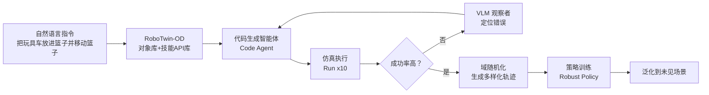
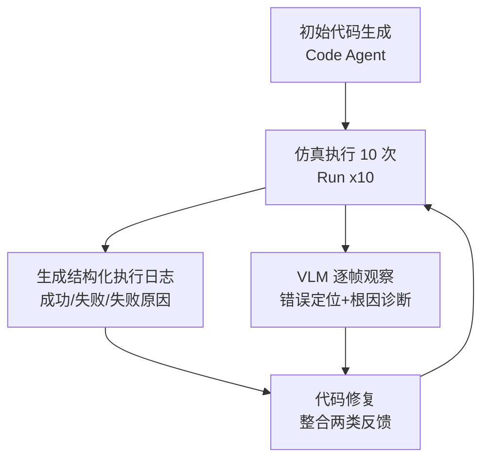

# 第 3 章：RoboTwin 2.0 论文精读

> 本章目标：逐节精读论文 *RoboTwin 2.0: A Scalable Data Generator and Benchmark with Strong Domain Randomization for Robust Bimanual Robotic Manipulation*（arXiv:2506.18088），让你能"看懂一篇顶会论文"，并建立自己的精读笔记模板。
>
> 建议：本章对照论文原文阅读效果最佳。论文位于 [papers/robotwin/paper/2506.18088v2.pdf](../../papers/robotwin/paper/2506.18088v2.pdf)；配套的逐式精读笔记见 [精读：RoboTwin 2.0](精读/RoboTwin2.0_arXiv2025.md)。
>
> **论述规范说明**：§3.5 与 §3.6 的方法/基准**设计决策**均按 CONSTRAINTS.md §3.4 的五步法补全（论文原文动机=①、方法=②、与替代方案对比=③、理论/实证依据=④、机制论证=⑤）；纯转述论文实验数字的小节（如 §3.2.3、§3.7）保持精读体原样，不做五步改造。

---

## 3.0 读论文前的准备：先看这 6 个问题

读完全文后，你应该能回答：

1. 论文要解决什么问题？（动机）
2. 为什么现在的方法解决不了？（不足）
3. 论文提出了什么方案？（方法）
4. 方案如何被验证？（实验）
5. 实验结果证明了什么？（结论）
6. 论文的局限和后续方向是什么？（讨论）

带着问题读，效率翻倍。

---

## 3.1 标题解读（先读懂论文在做什么）

> **RoboTwin 2.0: A Scalable Data Generator and Benchmark with Strong Domain Randomization for Robust Bimanual Robotic Manipulation**

拆解标题，四个关键词：

| 关键词 | 含义 |
|--------|------|
| **Scalable Data Generator** | 可扩展的数据生成器（能自动化、大规模造数据） |
| **Benchmark** | 基准评测（统一的测试任务集，方便比较不同算法） |
| **Strong Domain Randomization** | 强域随机化（训练时大量随机干扰，增强鲁棒性） |
| **Robust Bimanual Robotic Manipulation** | 鲁棒的双臂机器人操作（最终目标） |

一句话：**RoboTwin 2.0 是一个既能"自动大规模生成仿真数据"、又能"统一评测"的双臂操作平台，通过强域随机化让策略在真实世界更鲁棒。**

---

## 3.2 摘要精读（Abstract）

### 3.2.1 背景与问题

> 基于仿真的数据合成已经成为提升真实世界机器人操作的有力范式。然而，现有合成数据集在鲁棒的双臂操作上仍然不足，原因有二：
> **（1）缺乏可扩展、可自动化的新任务数据生成方法；**
> **（2）仿真环境过于简化，无法捕捉真实世界的复杂性。**

**翻译成人话**：
- 问题 1：想加一个新任务，得人工写代码、人工布置场景，扩展性差
- 问题 2：仿真里太"干净"了（没有杂物、光线固定），学出来的模型到真实世界就"傻"

### 3.2.2 方法概述（论文的四板斧）

| 组件 | 英文 | 一句话解释 |
|------|------|-----------|
| **对象库** | RoboTwin-OD | 731 个物体、147 类，带语义和操作标注 |
| **专家数据合成流水线** | Expert Data Synthesis Pipeline | 用 MLLM 自动写任务执行代码 + 仿真内闭环纠错 |
| **五维域随机化** | Domain Randomization | 对杂波、光照、背景、桌面高度、语言指令 5 个维度做随机化 |
| **50 任务 × 5 平台** | 50 Tasks × 5 Embodiments | 在 5 种机械臂上实例化 50 个双臂任务 |

### 3.2.3 结果摘要（记住这几个数字）

| 结果 | 数值 | 含义 |
|------|------|------|
| 代码生成成功率提升 | +10.9% | 自动写代码更可靠 |
| 少样本（10 条真实验 + 大规模合成数据） | +367% 相对提升 | 合成数据威力巨大 |
| 零样本（纯合成数据） | +228% 相对提升 | 纯合成也能用 |
| 数据集规模 | 10 万+ 条轨迹 | 大而全 |

---

## 3.3 引言精读（Introduction）

### 3.3.1 为什么要做双臂操作？

> 双臂操作对机器人完成复杂真实世界任务至关重要：协同装配、工具使用、物体交接等。

**发展双臂 VLA 基础模型**需要**同时满足**高质量、多样性、大规模的数据集——这是全文反复强调的"不可能三角"（数据质量、数据多样性、数据规模）。

### 3.3.2 真实世界数据采集为何不可行？

> 缺乏物体几何、场景杂乱度、光照、语言指令、机器人平台（embodiment）的足够变化时，学到的策略容易过拟合到狭窄分布，无法泛化到新环境或新硬件。而在大规模上采集真实演示极其昂贵、耗时且后勤复杂。

**三个痛点**：贵、慢、脏（前面第 1 章讲过）。

### 3.3.3 现有仿真数据流水线的三大缺陷（论文核心立论！）

这是论文最重要的"靶子"，务必记住：

| 缺陷 | 说明 |
|------|------|
| **① 缺乏自动化质量控制** | 没有"专家级验证闭环"，生成的大量轨迹包含执行失败或次优抓取，污染策略学习 |
| **② 域随机化流于表面** | 场景太干净太单一，缺少杂乱、光照变化、模糊语言指令等真实因素 |
| **③ 忽视跨平台（embodiment）差异** | 不同机械臂的抓取习惯不同（低 DoF 爱侧抓、高 DoF 能顶抓），现有数据集没编码这种差异 |

> 🔑 **记住这三个缺陷，因为它们逐一对应 RoboTwin 2.0 的三大组件**：
> - 缺陷① → **MLLM + 仿真内反馈的专家数据生成**
> - 缺陷② → **五维域随机化**
> - 缺陷③ → **体态感知适配（Embodiment-Aware Adaptation）**

### 3.3.4 论文的三大贡献（正文明确列出）

1. **自动化专家数据生成框架**：MLLM + 仿真内闭环反馈 → 专家级轨迹
2. **系统性域随机化策略**：提升数据多样性和 sim-to-real 泛化
3. **体态感知适配机制**：基于物体功能属性（affordance）生成机器人专属操作候选

以及**释放的资源**：
- RoboTwin-OD 资产库（731 物体）
- 大规模预采集的多平台、域随机化轨迹数据集（10 万+ 条，50 任务，5 平台）
- 可扩展双臂数据生成器 + 标准化评测基准

---

## 3.4 方法总览（Method Overview）

论文整体流水线（对应论文 Figure 2）：



**一句话理解流水线**：
> 自然语言任务描述 + 对象库 + 技能 API → MLLM 写代码 → 仿真里跑 10 遍 → 成功率高就收下（配域随机化收集数据），失败就让 VLM 找错、MLLM 改代码，最多迭代 5 轮。

---

## 3.5 方法精读（第 2 节 Method）

### 3.5.1 专家代码生成（2.1 节）——闭环双智能体

**两个智能体：**

| 智能体 | 角色 | 输入 → 输出 |
|--------|------|-------------|
| **代码生成智能体（Code Agent）** | 写程序 | 任务描述 + API 列表 + 示例 → Python 代码 |
| **VLM 观察者（VLM Observer）** | 检查执行 | 执行视频帧 + 代码 → 错误定位 + 原因诊断 |

**输入规格（Input Specification）**：
- 任务名称 + 自然语言目标描述
- 通用 API 列表
- 示例函数调用
- 层级化约束规格（hierarchical constraint specification）

**闭环迭代流程：**



**停止条件**：
- ✅ 某轮 10 次运行成功率 > 0.5（50%），收下代码
- ❌ 连续 5 轮未达标，放弃（避免无限迭代）

> 💡 **为什么要跑 10 次？** 因为仿真有随机性（动力学噪声、控制器抖动、传感器噪声），跑 10 次取成功率更可靠，避免"运气好跑通一次"。

**与之前方法（GenSim2、RoboGen）的区别**：RoboTwin 2.0 支持**零样本生成复杂双臂行为**，不止于简单的 pick-and-place。

**五步分析（设计决策）：为什么代码生成必须做成"仿真内闭环"**

**① 问题场景（论文原文动机，§3.3.3 缺陷①）** 手头：一个会写代码的大模型（MLLM），任务描述与 API 列表齐全。缺的：一次性生成的代码无法保证正确——论文原文指出，没有"专家级验证闭环"时，生成的大量轨迹包含执行失败与次优抓取，直接污染策略学习。想要的：自动生成 + 自动验证 + 自动修复的闭环，让"专家级"不依赖人工检查。

**② 解决方法（论文 §2.1，即本节上方流程）** 双智能体闭环：代码生成智能体产出 Python 任务代码 → 仿真执行 10 次取成功率 → 两路反馈（结构化执行日志给定量结论：哪次失败、哪类失败；VLM 观察者给定性定位：哪一步、哪一行、什么原因）→ 代码智能体合并反馈修复；某轮成功率 > 0.5 通过，连续 5 轮未达标放弃。

**③ 选型理由（与替代方案对比）**

- **vs RoboTwin 1.0**（真机遥操作演示 + GPT-4V 一次性生成代码，详见 [精读：RoboTwin 1.0](精读/RoboTwin1.0_ECCVW2024.md)）：1.0 生成后没有验证-修复回路，代码失败就作废；2.0 的闭环把失败代码"救"回来——平均成功率从 1.0 Vanilla 47.4% 提升到 2.0 + 多模态反馈 71.3%（论文 Table 1），迭代均值仅 1.76 轮（CR-Iter）。
- **vs GenSim2 / RoboGen 等自动任务生成工作**：它们主要覆盖单臂 pick-and-place 原语；2.0 借助双臂 API 与约束规格支持**零样本生成复杂双臂行为**（论文 §2.1 末原话）。
- **代价**：每任务要多轮仿真执行与 VLM 观察（VLM 单次观察约 6,894 token，附录 G.4），且 VLM 误报不低（精确率仅 0.208）——用 Top5-ASR 择优与"5 轮止损"控制成本。收益（可验证的专家级 + 规模化）大于代价，值得。

**④ 理论/实证依据** 论文 §2.1 与附录 G（成功率的形式化定义 $R_i = \frac{1}{M}\sum_{j=1}^{M} s_{i,j}$、$R_{\text{task}} = \frac{1}{N}\sum_{i=1}^{N} R_i$，附录 G.1，逐式解读见 [精读：RoboTwin 2.0](精读/RoboTwin2.0_arXiv2025.md) §4.2）；"LLM 写代码操控机器人"的思想源头：Code as Policies（Liang et al., ICRA 2023, arXiv:2209.07753）；实现模型：DeepSeek-V3（代码生成）+ moonshot-v1-32k-vision（VLM 观察），论文附录 G；消融数据：Table 1。

**⑤ 完整推理链**（闭环为什么能收敛到专家级）

**第一步（成功可机判）。** 每个任务有明确的终止条件（物体到位、姿态对齐），仿真可自动判定成败并记录 $s_{i,j} \in \{0,1\}$——代码质量因此有了客观的标量度量（依据：附录 G.1 的成功率定义；这也依赖"生成物是可执行代码"这一表示选择，见第 4 章 §4.1.1 ⑤）。

**第二步（10 次执行的意义）。** 单次执行受仿真随机性（初始扰动、控制器噪声）影响，$R_i = \frac{1}{10}\sum_{j=1}^{10} s_{i,j}$ 用 10 个样本估计成功率，抑制"碰运气通过"（依据：附录 G 的取平均设计；多次独立采样取平均可降低估计方差，即大数定律的直观应用）。

**第三步（失败可归因）。** 执行日志把失败分到四类（不可执行/左手抓取失败/右手抓取失败/目标摆放错误），VLM 再定位到步与代码行——修复的搜索空间从"整段代码"缩小到"一个片段"（依据：论文 §2.1 的结构化反馈设计）。

**第四步（迭代收敛的结构）。** 第三步把修复变成"小步修改 + 即刻重测"，每轮反馈都指向具体缺陷，因此收敛轮数低（实测 CR-Iter = 1.76，Table 1）；连续 5 轮止损保证失败任务不无限消耗算力。

**第五步（消融验证每个成分的贡献）。** Table 1：R1.0 Vanilla 47.4% → +执行日志反馈 49.2%（+1.8 个百分点）→ 再 +VLM 多模态反馈 63.9%（+14.7 个百分点）；R2.0 侧 62.1% → 66.7% → 71.3%（+4.6 / +4.6）。两路反馈都有效、VLM 定性反馈贡献更大，支持"闭环 = 定量日志 + 定性定位"的双通道设计（依据：Table 1 的逐级消融数据）。

**第六步（结论）。** ① 所指出的"缺专家级验证"由第一至四步的机制补齐，并经第五步消融实证——三大缺陷中的缺陷①由此对应解决（§3.3.3 的映射表）；摘要口径的代码生成成功率提升 +10.9% 即来自这套闭环（对照 3.2.3 表）。

### 3.5.2 域随机化（2.2 节）——五维随机化

| 维度 | 做法 | 为什么有用 |
|------|------|-----------|
| **场景杂乱** Clutter | 加入任务无关的干扰物（从 RoboTwin-OD 采样），排除与任务物体相似的干扰物 | 模型学会"无视无关物体" |
| **背景纹理** Background | 用 Stable Diffusion v2 生成 + 人工筛选出 11000 张贴图 | 防止过拟合"干净仿真背景" |
| **光照** Lighting | 随机化光颜色、类型、强度、位置 | 颜色温度会大幅改变物体外观 |
| **桌面高度** Tabletop Height | 在合理范围随机 | 改变视角与机器人-物体空间关系 |
| **语言指令** Language | 用 MLLM 生成多样任务模板 + 多样物体描述，组合成无数种指令 | 提升语言泛化 |

> 🔑 **关键数字**：纹理库 **11000 张**（由 1000 条 LLM 生成的表面描述 × Stable Diffusion 每描述 20 张 = 20000 张初筛，人工过滤到 11000 张）。

**语言组合示例**（论文原文例子）：
- 模板："用 {a} 把 {A} 放到 {B} 的左边"
- 实例 1："用左臂把酱油罐放到灰色厨房锅的左边"
- 实例 2："用左臂把白色塑料盖酱油罐放到厨房锅左边以便烧饭烹饪"

**组合爆炸**：任务指令数 × 物体描述数 = 极大数量的指令变体。

**五步分析（设计决策）：为什么域随机化要做成"五维系统化"**

**① 问题场景（论文原文动机，§3.3.3 缺陷②）** 手头：一个物理可信的仿真器（§3.5.1 产出的代码可以在里面跑），能批量产出"干净"轨迹。缺的：真实世界的"脏"——杂乱桌面、多变光照与背景、口语化多样的指令；论文原文指出仿真环境过于简化、无法捕捉真实世界的复杂性，策略过拟合到狭窄分布。想要的：把真实环境的变化系统性搬进训练数据。

**② 解决方法（论文 §2.2，即上方表格）** 五个维度的自动化随机化：场景杂乱、背景纹理、光照、桌面高度、语言指令——每个维度都有自动施加机制（标注采样、生成式纹理库、参数范围随机、模板×描述组合），统一口径见论文附录 C。

**③ 选型理由（与替代方案对比）**

- **vs RoboTwin 1.0**：1.0 只有定性的"变摆放"；2.0 升级为五维系统化、由管线自动施加（两版对照见 [精读：RoboTwin 2.0](精读/RoboTwin2.0_arXiv2025.md) §4.3）。
- **vs 数字孪生 / 照片级渲染**：孪生逐场景建模不可扩展（第 1 章 §1.6 ③）；随机化"以覆盖换逼真"，一次搭建全任务受益。
- **vs 鲁棒强化学习路线**（DART 噪声注入、EPOpt 最坏情形优化）：它们随机化的是动力学扰动、且依赖 RL 训练回路；2.0 面向模仿学习数据集，把随机化做在数据分布上并纳入**语言**维度——这是 RL 鲁棒化文献没有覆盖的（论文 §5.3 相关工作的定位原话）。
- **代价**：随机化让评测变难（第 6 章实验中 Hard 档全策略大幅下滑），且可能引入语义冲突——靠剂量控制兜底（杂乱维度排除相似干扰物；附录 C 桌高 ≤3 cm、光照限物理合理范围）。

**④ 理论/实证依据** 域随机化理论源头：Tobin et al., IROS 2017（arXiv:1703.06907，视觉域随机化使仿真训练的网络零微调迁移真机）；动力学随机化：Peng et al., ICRA 2018（arXiv:1710.06537）；"训练分布覆盖测试分布 ⇒ 策略泛化"的完整论证见第 4 章 §4.2.1 的 (4.1)–(4.2)；本系统的消融实证：论文 §4.3 Table 3（DR 预训练使 RDT 相对 +31.9%、π0 相对 +29.3%）、§4.4 Table 4（真机最差配置相对 +367%）。

**⑤ 完整推理链**（五维从何而来：每一维对应一类真实变化源）

**第一步（差距溯源到变化源）。** 第 2 章 §2.5 ⑤ 的三分类指出感知差距是主要失效通道；对语言条件（VLA）操作任务再细分，真实环境的变化可归为五类：干扰物（杂乱）、背景、光照、视角/空间关系（桌面高度改变相机-物体几何）、指令措辞（依据：三分类框架 + 语言条件策略的输入构成 = 图像 + 文本，五类即输入空间的变化来源枚举）。

**第二步（每维的必要性：反证）。** 去掉任一维 ⇒ 对应变化源在训练分布中缺失 ⇒ 真实测试遇到该变化时策略面对分布外输入（依据：第 1 章 §1.6 ⑤ 第三步的分布偏移原理）。例：没有杂乱 ⇒ 策略把干扰物当目标（Table 5 中 Easy→Hard 的崩塌就是"分布内→分布外"的量化对照）；没有语言随机化 ⇒ 换一种说法指令就失效（附录 H/I 指令多样性设计的动机）。

**第三步（覆盖条件的实现）。** 五维联合随机化使训练分布成为五维变化空间的乘积采样，真实条件以高概率落入其中（依据：第 4 章 §4.2.1 的覆盖条件 (4.2)；联合随机 = 在乘积空间撒点，各维独立采样即可覆盖各自的变化源）。

**第四步（实证校验：提升来自分布宽度而非数量）。** 控制变量实验（Table 3）：同样的 9,600 条预训练轨迹（32 任务），仅把"干净"换成"域随机化"，RDT 从发布权重的 18.8% 升至 24.8%（相对 +31.9%）、π0 从 22.5% 升至 29.1%（相对 +29.3%）；而干净数据预训练几乎无效（RDT 甚至降到 14.6%）——数据量不变、仅分布不同，提升只能归因于分布宽度（依据：Table 3 六列对照）。真机上（Table 4）最难的"未见背景 + 杂乱"档收益最大（9.0% → 42.0%），与"训练分布补上了真机演示里缺失的环境变化"的机制解释一致（论文 §4.4 末归因）。

**第五步（结论）。** 五维不是拍脑袋的清单，而是"真实变化源分类 → 每类一个随机化维度"的系统映射（依据：第一、二步）；覆盖机制有效、剂量可控（③ 的代价条款），缺陷②由此对应解决。

### 3.5.3 体态感知抓取适配（2.3 节）

**问题**：同样抓一个罐子——
- **Franka（7-DoF）**：喜欢从上往下抓（顶抓）
- **Piper（低 DoF）**：只能从侧面抓（侧抓）

**做法**：
1. 给每个物体标注丰富的**候选操作位姿**（多个抓取轴 + 多个接近方向）
2. 施加偏向高可达方向的**角度扰动**，扩大可行空间
3. 结合"优选操作方向 + 随机位姿扰动 + 并行运动规划尝试"生成候选抓取

> 💡 这本质上是给机器人"按能力定制抓取方案"，解决低 DoF 机械臂"够不着"的问题。

**五步分析（设计决策）：为什么抓取生成必须"体态感知"**

**① 问题场景（论文原文动机，§3.3.3 缺陷③）** 手头：物体上已标注候选抓取位姿，5 个平台要共用一套数据生成管线。缺的：同一套抓取生成无法同时适配所有臂——抓罐子时 Franka（7-DoF）偏好顶抓，Piper（低 DoF）只适合侧抓；1.0 管线不区分本体，Piper 自动数据采集成功率仅 2.4%（Table 2）。想要的：为每种本体自动生成它"够得着"的抓取候选。

**② 解决方法（论文 §2.3，即上方三步做法）** 丰富的候选操作位姿集（多抓取轴 × 多接近方向）→ 偏向高可达方向的角度扰动扩大可行空间 → 并行运动规划尝试筛出可行抓取（底层规划器为 GPU 加速的 CuRobo）。

**③ 选型理由（与替代方案对比）**

- **vs RoboTwin 1.0**（统一抓取生成，不区分本体）：低 DoF 平台大面积不可行（Piper 2.4%）；体态感知后 Piper +22.7 个百分点、平均成功率 52.2% → 60.5%（Table 2）。
- **vs 给低 DoF 平台人工定制抓取**：50 任务 × 5 平台 = 250 个组合，人工逐个调不可扩展；基于 affordance 标注 + 可达性筛选是全自动的，随任务生成自动适配新本体。
- **代价**：需要每个物体预先标注多轴多方向的候选集（RoboTwin-OD 的标注管线，§3.6.1）与每本体的并行规划筛选计算；对高 DoF 平台几乎无增益（Franka −0.1 个百分点）——但这是预期行为而非缺陷（⑤ 第四步的差分论证）。

**④ 理论/实证依据** affordance（功能可供性，物体"能被怎么用"的属性）标注思想承袭 RoboTwin 1.0 的功能轴设计并系统化（[精读：RoboTwin 1.0](精读/RoboTwin1.0_ECCVW2024.md)；论文 §3.1 的关键点-轴标注）；运动学可达性判据：第 2 章 (2.1)–(2.2) 与 Siciliano et al. 2009；"大批生成—物理校验筛选"的抓取合成同构思路：DexGraspNet（arXiv:2210.02697，[精读：DexGraspNet](精读/DexGraspNet_NeurIPS2022.md)，1.3M 候选 + 力闭合检验）；实证：论文 §4.2 Table 2。

**⑤ 完整推理链**（低 DoF 失败的定位、机制与差分验证）

**第一步（可行抓取的四个条件）。** 候选抓取 $g$ 可行 ⟺ IK 有解且在关节限位内（第 2 章 (2.2)）∧ 存在无碰撞路径（运动规划成功）∧ 闭合稳定。任一不满足即淘汰（依据：第 2 章 §2.1.2 ⑤ 的运动学分析 + 规划可行性定义）。

**第二步（7-DoF 与 6-DoF 的差别精确落位）。** 7-DoF 冗余臂有 1 维自运动流形：固定 $g$ 仍可调整内部构型，IK/限位/奇异三个运动学条件的满足率高；6-DoF 恰定无冗余，顶抓类姿态常落在可达空间之外（依据：第 2 章 §2.1.2 ⑤ 第三、四步）。第三、四个条件（碰撞、稳定）与本体冗余无关——两种臂同样苛刻。所以本体差异**只**通过前两个条件起作用。

**第三步（旧管线失败由此定位）。** 1.0 管线以统一（隐含顶抓习惯的）方式生成候选，对 Piper 大量候选在第一个条件上就被淘汰 ⇒ 成功率 2.4%，而同一管线下 Franka 67.3%（Table 2）——失败集中于"运动学可行性"，而非任务本身或规划器。

**第四步（三步机制的逐条对应）。** 多轴 × 多方向候选 = 把候选集从"单一姿态"扩成集合，提高 $\{g : \mathrm{IK}(g) \neq \emptyset\}$ 的基数；可达性偏向的角度扰动 = 把新增候选向各本体可达性高的方向集中，提高集合内的可行比例；并行规划尝试 = 逐个验证路径与碰撞条件，输出可行子集——三步分别作用于第一、二步中本体敏感的条件（依据：论文 §2.3 的设计与本节 ② 的机制对应）。

**第五步（差分实证检验归因）。** 若提升来自"任务变容易"或"规划器变好"，所有平台应同步上涨；实测（Table 2）：受限平台大涨（Piper +22.7、Aloha-AgileX +13.7、ARX-X5 +5.6），灵活平台持平（Franka −0.1、UR5 −0.5）——只有"可行性瓶颈按本体分布"的假设能解释这一分化（依据：Table 2 数据 + 第二步的机制预测）。缺陷③由此对应解决。

---

## 3.6 数据与基准精读（第 3 节）

### 3.6.1 RoboTwin-OD 对象库（3.1 节）

**构成（731 个物体 = 三部分）：**

| 来源 | 数量 | 用途 |
|------|------|------|
| 自建（Rodin 平台 RGB→3D 重建 + 凸分解 + 网格合并） | 534 个 / 111 类 | 主要操作物体 |
| Objaverse | 153 个 / 27 类 | 增强干扰物视觉语义多样性 |
| SAPIEN PartNet-Mobility（可活动物体） | 44 个 / 9 类 | 铰接/活动物体操作 |

**每个物体的标注**：
- **语言标注**：每个物体 15 条描述（形状、纹理、功能、部件、粒度各不相同）
- **操作标注（affordance）**：放置点、功能点、抓取点、抓取轴

**五步分析（紧凑，设计决策）：为什么物体库要"三类来源 + 两类标注"**

**① 问题场景** 手头：§3.5 的三大组件要落地——杂乱采样要干扰物、体态感知要抓取标注、语言随机化要物体描述、50 任务还有开门开抽屉的铰接物体需求。缺的：一个同时满足"几何可仿真（碰撞模型）、外观多样、带操作标注"的物体资产库。想要的：按用途组织、标注齐全的库。

**② 解决方法** 三类来源各司其职（上方表格）：自建 534 个（Rodin 单图生成 3D + 凸分解 + 网格合并）、Objaverse 153 个（视觉语义多样的干扰物）、PartNet-Mobility 44 个（带关节的活动物体）；两类标注：每物体 15 条语言描述 + 四类关键点-轴（放置/功能/抓取/抓取轴）。

**③ 选型理由** 替代方案：全部自建——成本高且视觉多样性不足；全部用 Objaverse——大量模型没有碰撞友好的几何与操作标注。凸分解的取舍：精确网格碰撞检测昂贵，凸包组合近似在精度与速度之间折中（物理引擎处理复杂几何的常规做法）；Objaverse 只当干扰物、不作操作目标，正是规避其"缺操作标注"的短板。

**④ 理论/实证依据** SAPIEN / PartNet-Mobility：Xiang et al., CVPR 2020（arXiv:1911.10330，2300+ 铰接物体带关节标注，44 个活动物体取自该库）；Rodin 单图 3D 生成（hyper3d.ai，论文 §3.1）；标注体系与 1.0 功能轴的承继关系：[精读：RoboTwin 1.0](精读/RoboTwin1.0_ECCVW2024.md)、[精读：RoboTwin 2.0](精读/RoboTwin2.0_arXiv2025.md) §4.5。

**⑤ 完整推理链**（每项资产/标注都能找到上游消费者）

**第一步（杂乱维的消费）。** §3.5.2 维度①需要"任意可摆"的干扰物 → 几何合法（凸分解碰撞体）+ 视觉多样 → Objaverse 部分与自建部分共同供给（依据：§3.5.2 表格的采样来源）。

**第二步（体态感知的消费）。** §3.5.3 第二步需要"多抓取轴 × 多接近方向"的候选 → 必须预标注抓取点/抓取轴（依据：§3.5.3 ② 的输入）。

**第三步（语言随机化的消费）。** §3.5.2 维度⑤需要每物体多条描述 → 15 条/物体（依据：§3.5.2 的组合公式与附录 I 的生成规格）。

**第四步（铰接任务的消费）。** 开门/开抽屉类任务需要带关节的活动物体 → PartNet-Mobility 的 44 个（依据：关节标注的定义，SAPIEN 2020）。

**第五步（结论）。** 三类来源与两类标注不是资产清单，而是三大组件的输入依赖表——库的每一项都服务于管线（依据：第一至四步）。

### 3.6.2 50 任务基准（3.2 节）

- **50+ 双臂协作任务**（放物、递物、叠放、开门、按压、摇晃……）
- **5 种机器人平台**（Aloha-AgileX、ARX-X5、Piper、Franka、UR5）
- **10 万+ 预采集轨迹**（HuggingFace 公开下载）

**五步分析（设计决策）：为什么基准要"50 任务 × 5 平台 × Easy/Hard 双档"**

**① 问题场景** 手头：各家的策略模型（VLA 大模型与单任务小模型）都需要比较。缺的：一个能区分"任务能力"与"抗分布偏移能力"的统一评测协议——只在干净环境测出的排名，到真实世界可能反转。想要的：标准化、可复现、对泛化能力敏感的评测设计。

**② 解决方法**（上方三条 + 论文 §4.5 协议）50 个双臂协作任务覆盖多种协作模式（§2.2）；5 种本体覆盖高/低自由度（§2.1）；预收集 10 万+ 轨迹统一训练数据；评测每任务 100 次执行取成功率，分 Easy（干净）/ Hard（域随机化）两档。

**③ 选型理由** 替代方案：只测 Easy——无法暴露分布偏移下的脆弱性（⑤ 的排名反转证据）；只测 Hard——抬高门槛、掩盖基础能力差异。双档把两个维度分离。多平台则是"体态感知"主张的可检验性要求——只有多平台才能做出 §3.5.3 ⑤ 第四步的差分论证。代价：50 × 5 全矩阵评测计算量大（附录 K/L 的表格规模可见一斑）。

**④ 理论/实证依据** 指标口径：成功率（每任务 100 次执行，论文 §4.5）；Easy/Hard 双档与统一 DR 口径：论文附录 C（训练设置两档完全相同、只变评测环境）；与相关基准的逐项对比：附录 B Table 6（RoboCasa 缺自动化与双臂、Meta-World 无 DR 与自动生成、RoboTwin 1.0 无系统 DR——论文原文口径，逐条对比见 [精读：RoboTwin 2.0](精读/RoboTwin2.0_arXiv2025.md) §7）。

**⑤ 完整推理链**（双档为什么必要：一个排名反转的实证）

**第一步（泛化是分布外性质）。** 泛化能力必须在与训练分布不同的条件下才能观测（依据：第 1 章 §1.6 ⑤ 第三步的分布偏移原理）。

**第二步（只有干净档无法区分两类策略）。** 干净评测条件落在训练分布之内，"背题型"策略（过拟合训练分布）与"真泛化"策略得分无法区分（依据：第一步——分布内评测不提供分布外信息）。

**第三步（Hard 档构造受控的分布外条件）。** Hard 档在评测时施加杂乱 + 光照 + 纹理 + 桌高随机化，训练设置与 Easy 完全相同（依据：附录 C 口径——两档唯一差异是评测环境，构成控制变量）。

**第四步（实证：两档排名确实不同）。** Table 5：Easy 档 DP3 55.2% 居首、Hard 档暴跌至 5.0%；π0 Easy 46.4%（第二）、Hard 16.3%（第一）——排名反转。若只报 Easy，会得出"DP3 最优"的误导性结论（依据：Table 5 数据）。

**第五步（结论）。** 50 任务保协作模式覆盖、5 平台保本体覆盖、双档保泛化可测——三者合起来才让"哪个策略更值得部署"成为可回答的问题（依据：第一至四步）。

---

## 3.7 实验精读（第 4 节）——先看结构

论文实验回答三个问题：

| 实验 | 问题 | 对应论文章节 |
|------|------|-------------|
| 实验 1（4.1） | 代码生成器能不能自动写出好代码？ | Table 1 |
| 实验 2（4.2） | 体态感知抓取有没有用？ | Table 2 |
| 实验 3（4.3） | 域随机化数据能不能提升策略鲁棒性？ | Table 3 |
| 实验 4（4.4） | 真机 sim-to-real 表现如何？ | Table 4 |
| 实验 5（4.5） | 作为基准，各策略表现如何？ | Table 5 |

> 详细解读见第 6 章《实验结果与解读》。

---

## 3.8 相关工作（第 5 节）——领域地图

论文把相关工作分成三块，帮你建立领域地图：

### 5.1 机器人操作的数据集与基准
| 工作 | 特点 |
|------|------|
| SAPIEN | 2300+ 可活动物体仿真 |
| ManiSkill2 | 百万级演示 |
| Meta-World / CALVIN / LIBERO / RoboVerse | 多任务 / 语言条件 / 终身学习 / 域随机化 |
| RoboCasa | 大规模人类演示（缺自动化、缺双臂） |
| AgiBot World / RoboMIND / Open X-Embodiment / Bridge | 真实世界大规模数据集 |
| **RoboTwin 1.0** | 用仿真数字孪生镜像真实演示做双臂基准（本作前身） |

### 5.2 操作策略学习
- **RT-1 / RT-2**：Google 的视觉-语言-动作模型（VLA 鼻祖）
- **RDT-1B / π0 (Pi0)**：扩散式 VLA，双臂大模型
- **OpenVLA / CogACT / Octo / LAPA**：开源 VLA 与微调适配
- **DP / ACT / DP3 / 3D Diffusion Policy**：单任务策略（有的用 3D 点云）

### 5.3 模仿学习中的域随机化
- Tobin et al.（2017）、Peng et al.（2018）：域随机化开山之作
- DART（噪声注入）、EPOpt（最坏情形集成）：鲁棒策略
- **区别**：以往"孤立随机化"，RoboTwin 2.0 将**交互式仿真反馈 + 系统性域随机化**结合

---

## 3.9 结论（第 6 节）与局限

**论文结论**：
> RoboTwin 2.0 集成了 MLLM 任务生成、体态自适应行为合成、全面域随机化，产出了视觉、语言、物理多样性丰富的数据，并验证了对杂乱环境鲁棒、对未见任务泛化、跨平台操作的能力。

**作者自述的未来方向**：
- 真实世界部署（real-world deployment）
- 多物体任务复杂度

**作为读者应补充的局限**（批判性思考）：
1. 主要评估仍是"仿真为主 + 少量真机"，真机仅 4 个任务、单平台
2. 代码生成成功率仍有相当比例失败（平均 43.34%，见附录 G.3）
3. VLM 观察者的误报率偏高（见附录 G.4，精确率仅 0.208）
4. 域随机化可能让某些任务变得更难（如 Hard 条件下所有策略成功率大幅下降）

---

## 3.10 附录精读（快速浏览哪些值得看）

| 附录 | 内容 | 值得关注的点 |
|------|------|-------------|
| B | 与现有基准对比表 | 一键看清 RoboTwin 2.0 差异化定位 |
| C | 域随机化设置 | 桌面高度变化 ≤3cm 等细节 |
| D | 训练细节 | RDT/Pi0/ACT/DP/DP3 超参数 |
| F | 与 1.0 代码质量对比 | AST 相似度、CodeBLEU 等指标 |
| G | 代码生成实验细节 | 指标定义、VLM 观察者真实能力评估 |
| H/I | 语言指令/描述生成示例 | 很直观，零基础可读 |
| K | 50 任务完整基准表 | 所有策略全任务结果 |
| L | 各平台成功率表 | 跨平台对比 |

---

## 3.11 一篇论文的"精读笔记模板"（建议收藏）

> 以后读任何论文，都可以用这个模板：

```markdown
# 论文精读：[标题]
- 会议/年份：
- 一句话总结：
- 1. 动机（要解决什么问题）：
- 2. 不足（现有方法差在哪）：
- 3. 方法（核心思路，画流程图）：
- 4. 实验（验证了什么，关键数字）：
- 5. 结论（证明什么）：
- 6. 局限与未来工作：
- 7. 与我的研究的关系：
```

---

## 3.12 本章小结（自测清单）

1. 现有仿真数据流水线的三大缺陷是什么？
2. 论文的三大组件如何逐一对应三大缺陷？
3. 代码生成闭环的流程、停止条件是什么？
4. 五维域随机化分别是哪五个？
5. 为什么需要"体态感知抓取"？
6. RoboTwin-OD 的三部分构成和标注是什么？
7. 论文四大实验结果各回答什么问题？

> **动手练习**：用 3.11 的模板，独立为 RoboTwin 2.0 写一份你自己的精读笔记（不要看本章内容，凭记忆写，再对照检查）。
