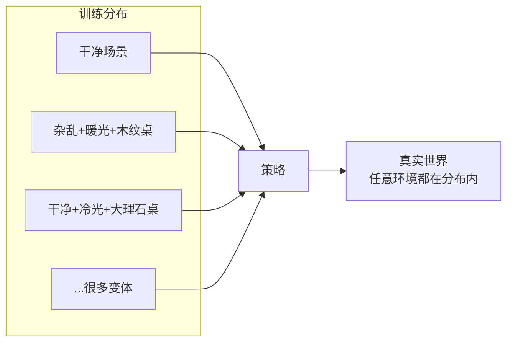
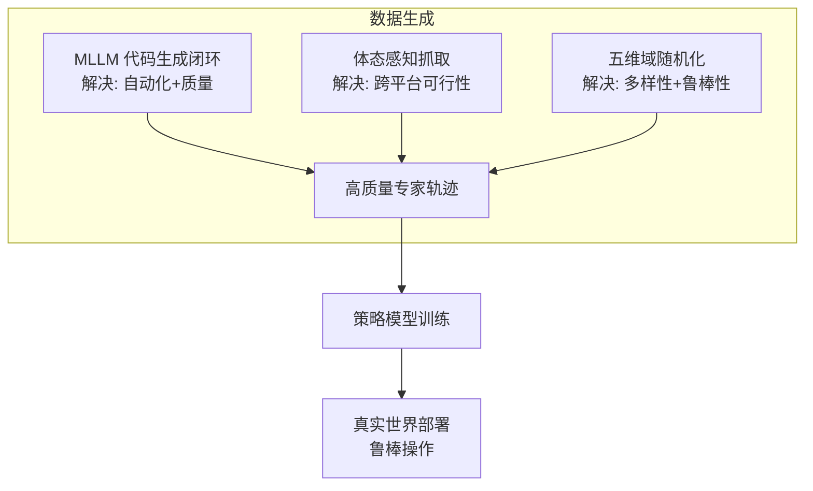

# 第 4 章：核心技术详解

> 本章目标：深入拆解 RoboTwin 2.0 的三大核心技术，让零基础读者真正"弄懂原理"。三大技术对应论文第 2 节：
> 1. **MLLM 专家代码生成闭环**（2.1 节）
> 2. **五维域随机化**（2.2 节）
> 3. **体态感知抓取适配**（2.3 节）
>
> **论述规范说明**：本章三大技术的设计决策均按 CONSTRAINTS.md §3.4 的五步法完整展开（**① 问题场景 → ② 解决方法 → ③ 选型理由 → ④ 理论依据 → ⑤ 完整推理链**，每步注明依据）；纯操作/示例内容在节首注明"操作步骤，不含理论"。本章公式编号 (4.1)–(4.4) 供后续章节与代码精读回引。

---

## 4.1 技术一：MLLM 专家代码生成闭环

### 4.1.1 为什么让大模型"写代码"而不是"直接出动作"？

**五步分析（本章第一设计决策）：为什么让 MLLM 写代码而非端到端直出动作序列**

**① 问题场景** 手头：50 个双臂任务的文字描述、一个物体与技能 API 库、一个会写代码的 MLLM——要用它们批量生产专家演示。缺的：让 MLLM 输出"机器人的行为"的方式——是让它直接吐出一串关节角度，还是让它写程序？想要的：一种**正确率可验证、失败可修复、且不依赖已有机器人演示数据**的行为输出形式。

**② 解决方法** 候选两条（下方对比表）：(a) MLLM 直接输出动作序列；(b) MLLM 在 API 库约束下写"技能代码"，仿真执行。RoboTwin 2.0 选 (b)：给大模型一套"高级积木"（API），它只负责把积木按正确顺序拼起来。

**③ 选型理由（与端到端 VLA 直出动作对比）**

- **样本效率**：直出动作要求为"连续控制输出"专门建设施并用机器人数据训练——RT-2 把动作离散成 token、靠机器人数据微调后才输出动作（arXiv:2307.15818）；RT-1 用 13 万条真机演示训练（arXiv:2212.06817）。而数据生成阶段恰恰最缺的就是动作数据（先有鸡还是先有蛋）。写代码只依赖 MLLM 预训练就有的代码能力，每任务**零演示起步**。
- **出错面**：一条 30 秒双臂轨迹 ≈ 数百步 × 14 维连续值；一段任务代码 ≈ 10~20 行 API 调用。"拼错"的粒度从"每一个数"缩小到"几行调用"，且调用语义显式（grasp/place/move），可读可查。
- **安全可验证性**：一串动作落盘前无法机器预检"它会不会撞桌"；代码可以先在仿真里执行 10 次、以成功率为闸门，不合格不进数据集（§4.1.5 的停止条件）——闭环修复也只有在"代码"这种可编辑表示上才成立。
- **代价**：依赖一套可靠的技能 API 库（工程成本：RoboTwin-OD 标注 + API 封装）；技能表达力上限 = API 的组合空间，超出范围的技能写不出。
- **结论**：数据生成的第一需求是"可验证的专家级"，(b) 是唯一同时满足"零演示起步 + 可验证 + 可修复"的选项——值得。

**④ 理论依据** "LLM 写代码操控机器人"范式出处：Code as Policies（Liang et al., *"Code as Policies: Language Model Programs for Robotic Control"*, ICRA 2023, arXiv:2209.07753）；对比面（VLA 直出动作）：RT-2（arXiv:2307.15818，[精读：RT-2](精读/RT2_arXiv2023.md)）、RT-1（arXiv:2212.06817，[精读：RT-1](精读/RT1_arXiv2022.md)）；本系统的实现与评测：RoboTwin 2.0 §2.1 + 附录 G/F（[精读：RoboTwin 2.0](精读/RoboTwin2.0_arXiv2025.md) §4.1）。

两条候选方案对比——这是一个重要的设计选择，值得仔细理解：

| 方案 | 做法 | 优点 | 缺点 |
|------|------|------|------|
| 让 LLM 直接输出动作 | 输入画面→输出关节角度 | 端到端简单 | 大模型没见过机器人控制，极易出错 |
| **让 LLM 写"技能代码"** | 输入任务→输出 Python 调用 API 的代码 | 代码可检查、可执行、可纠错、语义明确 | 需要可靠的"技能 API 库" |

**RoboTwin 2.0 的选择**：让 MLLM **在 API 库的约束下写代码**。这等于给大模型一支"高级积木"，它只需要把积木按正确顺序拼起来。

> 💡 类比：不是让大模型直接开车（动作），而是让它用"方向盘、油门、刹车"这几个抽象接口写"驾驶步骤"。

**⑤ 完整推理链**（从 MLLM 的能力分布推出"写代码"更优）

**第一步（能力分布前提）。** MLLM 的预训练语料包含海量自然语言与程序代码，"按 API 规范组合调用"的能力在预训练中直接习得（依据：代码预训练是 LLM 的标准配置；Code as Policies 实证 GPT 系列模型在**无机器人微调**的条件下即可写出可执行的机器人策略代码，arXiv:2209.07753）。

**第二步（动作输出的前提对照）。** 直出连续动作不是预训练能力——必须为动作另建设施（动作 token 化 / 扩散头）并用机器人数据训练（依据：RT-2 的动作 token 化设计与训练流程、RT-1 的数据规模，arXiv:2307.15818 / 2212.06817）。

**第三步（数据可得性判定）。** 本系统的目标就是"生成数据"，起点没有任务演示数据——第二步的前提在本场景不成立，第一步的前提成立（依据：场景设定与第一、二步）。

**第四步（验证通道差异）。** 代码 + API 的输出可在仿真中执行并自动判定成败（成功率 $R_i$，论文附录 G.1）；失败可由执行日志与 VLM 定位到行（§4.1.4）。动作序列的中间表示不可读，失败无法定位、更无法自动修复（依据：§4.1.4 的反馈机制只在代码这种可编辑表示上可实施）。

**第五步（结论与实证）。** 在"零演示起步 + 可验证 + 可修复"三个约束下只有 (b) 全部满足（依据：第一至四步）；实证：R2.0 + 多模态反馈平均成功率 71.3%（Table 1），且 R2.0 生成的代码比 1.0 更短、结构更接近人写参考（token 569.4 vs 1236.6、AST 相似度 44.78% vs 23.72%，附录 F Table 7）——"约束下的代码生成"路线在质量与成本两端同时占优。

### 4.1.2 三个输入条件（代码生成的前提）

> 本节为代码智能体的**输入规格说明**：操作步骤，不含理论；这些输入在方法中的作用见 §4.1.1 的 ② 与 ⑤。

代码智能体生成代码时被"喂"了三样东西：

```
输入 1：通用 API 列表
    grasp_actor(actor, arm_tag, ...)   # 抓取物体
    place_actor(actor, arm_tag, target_pose, ...)  # 放置物体
    move_by_displacement(...)          # 平移
    back_to_origin(...)                # 回原点
    open_gripper / close_gripper(...)  # 开关夹爪
    ...

输入 2：示例函数调用（few-shot 示例）
    展示几个"正确用法"

输入 3：层级化约束规格
    任务特定的约束（如"必须用左臂抓""约束模式=align"）
```

### 4.1.3 生成一个真实例子（论文附录 G.5 的 place_shoe）

> 代码示例（操作步骤，不含理论）：看大模型生成代码的"风格"即可，逐行原理见 §4.1.1。

我们来看看大模型为"放鞋子"任务生成的代码（节选，理解风格即可）：

```python
class gpt_place_shoe(place_shoe):
    def play_once(self):
        # 1. 保存初始画面
        self.save_camera_images(task_name="place_shoe", step_name="step1_initial_scene_state")

        # 2. 判断鞋子在左还是右，选择用哪只手
        shoe_pose = self.shoe.get_pose()
        arm_tag = ArmTag("left" if shoe_pose.p[0] < 0 else "right")

        # 3. 抓取鞋子
        self.move(self.grasp_actor(actor=self.shoe, arm_tag=arm_tag, pre_grasp_dis=0.1))

        # 4. 抬起鞋避免碰撞
        self.move(self.move_by_displacement(arm_tag=arm_tag, z=0.07, move_axis='world'))

        # 5. 获取目标块的功能点作为放置目标
        target_pose = self.target_block.get_functional_point(1, "pose")

        # 6. 放置鞋子（对齐约束）
        self.move(self.place_actor(actor=self.shoe, arm_tag=arm_tag,
                                   target_pose=target_pose, functional_point_id=0,
                                   constrain="align"))

        # 7. 抬爪、回原点、保存最终画面
        self.move(self.move_by_displacement(arm_tag=arm_tag, z=0.07, move_axis='world'))
        self.move(self.back_to_origin(arm_tag=arm_tag))
```

**你能看到的关键点**：
- 代码是**步骤化**的，每步有注释
- 用到了**功能点（functional point）**——物体的"关键位置"标注（第 5 章详述）
- 用 `arm_tag` 区分左右手——支持双臂
- 用 `constrain="align"` 指定对齐约束

### 4.1.4 闭环反馈：VLM 观察者怎么"挑错"

**执行日志（Execution Log）** 是"定量"反馈，能告诉我们：
- 哪些试次成功/失败
- 失败类型：代码不可执行 / 左手抓取失败 / 右手抓取失败 / 目标位置错误

**VLM 观察者**是"定性 + 定位"反馈：
- 逐帧看执行视频
- 判断每一步是否成功
- 定位失败发生在第几步
- 诊断根本原因（逻辑错误？API 用错？）

**一个 VLM 观察者的真实推理案例**（论文附录 G.4，挂杯子任务）：

> Step 1: 左臂成功从左侧拿起杯子
> Step 2: 左臂成功把杯子放到中间位置
> Step 3: 右臂成功从中间拿起杯子
> Step 4: 右臂尝试把杯子挂到架子上但**失败**
> Step 5: 右臂挂完正在移开
>
> 整体任务未完成。失败发生在 **Step 4**。代码中 `middle_target_pose` 是一个 list，而代码用了 `.p` 访问其属性，应改为 `middle_target_pose[0]`……（定位到具体代码行）

**厉害之处**：VLM 不仅能说"失败了"，还能说出"哪一行代码错了、怎么改"。

**五步分析（紧凑）：为什么除了执行日志还要一个 VLM 观察者**

**① 问题场景** 手头：跑 10 次得到的执行日志，能给出"第几次、哪类失败"（不可执行/左抓失败/右抓失败/目标位错）。缺的：日志是纯定量的——它不知道**为什么**右手抓取失败：是抓取点标注问题、接近方向被桌面挡住，还是代码里目标坐标取错了变量？想要的：能定位到"哪一步、哪一行、什么原因"的反馈。

**② 解决方法** 加一个 VLM 观察者：逐帧检查执行视频，输出每步成败、失败步定位、根因诊断（逻辑缺陷 / API 误用 / 系统性问题），与日志一起喂给代码智能体（§4.1.5 流程的第 3 步）。

**③ 选型理由** 替代方案：(a) 只用日志——修复只能盲改，迭代轮数增加；(b) 人工看视频修代码——质量最高但不可扩展（数据工厂的核心诉求是自动化）。Table 1 的消融给出量化对比：只加日志反馈 ASR 47.4% → 49.2%（+1.8），再加 VLM 反馈到 63.9%（+14.7）——VLM 通道贡献了反馈增益的大头。代价：VLM 误报不低（130 条人工标注执行序列上精确率仅 0.208、准确率 0.431，附录 G.4），单次观察约 6,894 token 的成本；靠"与日志交叉验证 + 5 轮止损"控制。

**④ 理论/实证依据** 多模态大模型的视频帧理解与诊断能力（moonshot-v1-32k-vision，论文附录 G）；"定量 + 定性"双通道反馈的设计与诚实评估：RoboTwin 2.0 附录 G.4（含 VLM 真实能力的负结果）；消融数据：Table 1。

**⑤ 完整推理链**

**第一步（修复需要现象到缺陷的映射）。** 把"失败现象"映射回"代码缺陷"，需要看到执行过程的空间细节（物体在哪、手停在哪、碰没碰到）——日志只有符号级事件，不含空间细节（依据：上方日志字段清单）。

**第二步（模态匹配）。** 空间细节只存在于执行视频帧中 → 需要能"读图"的模型，即 VLM（依据：信息在哪个模态，就需要能读取该模态的模型——模态匹配原则）。

**第三步（消融验证信息确实被利用）。** Table 1 中 VLM 反馈带来 +14.7 个百分点、远大于日志的 +1.8（R1.0 侧），说明第二步引入的"额外信息"转化为了修复质量（依据：Table 1 两级消融的差分）。

**第四步（边界：两通道互补而非替代）。** VLM 对"抓取轴参数错误"这类**不可见**缺陷会误报（精确率 0.208）——缺陷不在图像里而在代码与标注里（依据：附录 G.4 的负结果分析 + 第一步的模态分析：图像模态只承载可见信息）。日志保证不漏、VLM 负责定位，两者合并输入修复器。

### 4.1.5 迭代流程与停止条件（回顾）

> 本节为闭环执行流程与指标口径的**回顾清单**：操作步骤，不含理论；其设计原理见 §4.1.1 与 §4.1.4 的五步分析。

```
每轮：
  1. 生成/修复代码
  2. 仿真执行 10 次
  3. 生成执行日志 + VLM 观察
  4. 汇总两类反馈
  5. 修复代码

终止：
  ✅ 某轮成功率 > 50%  → 接受代码
  ❌ 连续 5 轮未达标  → 放弃
```

**评估指标回顾**（论文附录 G.1）：
- **ASR**：Average Success Rate，所有生成代码的平均成功率
- **Top5-ASR**：每任务取前 5 好的候选的成功率（模拟"择优选择"）
- **CR-Iter**：平均迭代轮数
- **Token**：生成代码的平均 token 数（成本）

### 4.1.6 小测验

1. 为什么选择"写代码"而不是"直接出动作"？
2. 代码生成的三个输入是什么？
3. 定量反馈（执行日志）和定性反馈（VLM）各自提供什么？
4. 停止条件是什么？

---

## 4.2 技术二：五维域随机化（Domain Randomization）

### 4.2.1 原理：为什么随机化有用？

**五步分析（本章第二设计决策）：为什么"往死里随机"就能让策略在真实世界站得住**

**① 问题场景** 手头：§4.1 产出的专家轨迹——但都是"干净"条件下的（固定光照、空桌面、标准说法的指令）。缺的：真实部署环境的多样性（杂乱、光照、背景、桌高、措辞）——用干净数据训练的策略遇到没见过的条件就失效（第 3 章 Table 3：干净数据预训练的 RDT 在 8 个仿真任务平均仅 14.6%，比不预训练的 18.8% 还低）。想要的：在不增加真实采集的前提下，把真实环境变化装进训练数据。

**② 解决方法** 域随机化（Domain Randomization, DR）的核心思想：**训练时把环境"往死里随机"——物体乱摆、光线乱打、背景乱换——让策略学会在各种条件下都能完成任务。到了真实世界，无论环境如何，都落在模型"见过"的分布里**（训练分布覆盖的直观表述，形式化见 ⑤ 的 (4.2)）。具体做法：生成每条训练轨迹时，对五个维度（杂乱 / 背景 / 光照 / 桌高 / 语言，§4.2.2 逐一实现）在合理范围内随机采样。

**③ 选型理由** 对比替代方案：(a) 照片级渲染 + 数字孪生——把仿真做得更像真实；优点是保真，代价是每个场景逐个建模、不可扩展（第 1 章 §1.6 ③），且"更像"是有方向的逼近，永远追不上真实世界的全部变化；(b) 真机采更多样数据——贵、慢、脏（第 1 章 §1.4）；(c) 域随机化——不追求单帧逼真、追求分布覆盖，边际成本 ≈ 采样成本，维度可枚举可扩展。代价：随机化让任务本身变难（模型要学更多条件），需要剂量控制（§4.2.3）。对"鲁棒性优先"的数据工厂场景，(c) 值得。

**④ 理论依据** 域随机化的理论与实证源头：Tobin et al., *"Domain Randomization for Transferring Deep Neural Networks from Simulation to the Real World"*, IROS 2017（arXiv:1703.06907）；动力学随机化：Peng et al., *"Sim-to-Real Transfer of Robotic Control with Dynamics Randomization"*, ICRA 2018（arXiv:1710.06537）；分布偏移下的误差上界：Ben-David et al., *"A theory of learning from different domains"*, Machine Learning 79 (2010)；本系统的消融：RoboTwin 2.0 §4.3（Table 3）与 §4.4（Table 4）。



**⑤ 完整推理链**（从"真实-仿真分布差距"推出"随机化范围 ⊇ 测试分布 ⇒ 策略泛化"）

**第一步（差距的数学面）。** 策略是条件分布 $\pi(a \mid o)$，其成功率取决于测试观测 $o$ 所在的分布。记仿真训练分布为 $\mathcal{D}_{\text{sim}}$、真实测试分布为 $\mathcal{D}_{\text{real}}$（依据：模仿学习/监督学习的标准设定）。

**第二步（分布偏移抬高误差上界）。** 域适应理论给出：对任意假设 $h$，
$$\varepsilon_{\mathcal T}(h) \;\le\; \varepsilon_{\mathcal S}(h) \;+\; d_{\mathcal H\triangle\mathcal H}(\mathcal S, \mathcal T) \;+\; \lambda, \tag{4.1}$$
即目标域（真实）误差 ≤ 源域（仿真训练）误差 + 两域散度 + 理想联合误差项 $\lambda$（依据：Ben-David et al. 2010, Theorem 1；散度项 $d_{\mathcal H\triangle\mathcal H}$ 度量两分布在策略关注的特征子集 $\mathcal H$ 上的差异；$\lambda$ 是在两域上都表现最好的假设的误差，不可控）。

**第三步（随机化压缩可控项）。** 域随机化不缩小真实分布，而是**扩大训练分布**：五维随机采样后，DR 覆盖条件为
$$\mathcal{D}_{\text{test}} \subseteq \mathcal{D}_{\text{train}}. \tag{4.2}$$
(4.2) 一旦近似成立，真实观测落在训练分布内部——策略在真实条件上处于"分布内"状态；第 (4.1) 式中可控的两项（源域误差与散度）随两分布重合度增大而减小（依据：(4.1) 的界结构 + Ben-David 界两可控项的单调性；实证锚点：Tobin et al. 2017——用随机化渲染参数的仿真图像训练的抓取网络，零微调直接在真机抓取成功）。

**第四步（本系统的消融实证）。** 控制变量实验（Table 3）：同样 9,600 条预训练轨迹（32 任务），仅把"干净"换成"域随机化"：干净预训练几乎无效（RDT 甚至从发布权重的 18.8% 降到 14.6%），DR 预训练后 RDT 达 24.8%、π0 达 29.1%（相对各自发布权重 +31.9% / +29.3%）——数据量不变、仅分布不同，提升只能归因于**分布宽度**（依据：Table 3 六列对照）。真机上（Table 4）最难的"未见背景 + 杂乱"配置从 9.0% 升到 42.0%（相对 +367%），与"DR 数据预先覆盖了真机演示中没有的环境变化"的归因一致（依据：论文 §4.4 末的归因分析）。

**第五步（结论与前提）。** 因此：只要 (4.2) 的覆盖条件近似成立、且随机化不污染监督信号（该前提由 §4.2.3 的剂量控制保证），仿真数据训练的策略即可在真实分布上保持性能——这就是五维域随机化的理论骨架。

### 4.2.2 五个维度的实现细节

> 五个维度的"必要性"论证见 §4.2.1 ⑤（每一维对应一类真实变化源）；本节讲**实现**。语言维度的组合规模记为 (4.3)，供第 5 章数据规格回引。

#### 维度①：场景杂乱（Clutter）
- 从 RoboTwin-OD 采样**任务无关的干扰物**加到桌面
- 用**碰撞感知放置 + 预计算体积**保证物理合理
- **排除与任务物体视觉/语义相似的干扰物**，避免"模型看错对象"
- 每个物体带放置标注 → 通用 API 可自动插入

> 💡 类比：考试时故意在卷子里放几道"陷阱题"干扰项，训练"定力"。

#### 维度②：背景纹理（Background Textures）
**纹理库是怎么来的？**
1. 用 LLM 提示生成 + 网页爬取 → 1000 条表面描述（如"暖木纹桌面""大理石厨房台面"）
2. 用 **Stable Diffusion v2** 每条描述生成 20 张图 → 20000 张
3. 人工筛选 → **11000 张**高质量纹理

#### 维度③：光照变化（Lighting）
- 随机化：光**颜色、类型、强度、位置**
- 保持物理合理范围
- 效果：颜色温度改变会让物体外观剧烈变化（如暖光 vs 冷光下的鞋子）

#### 维度④：桌面高度（Tabletop Height）
- 在合理范围均匀随机（实验设置：≤3cm）
- 改变相机视角和机器人-物体空间关系

#### 维度⑤：语言指令（Language Instructions）
**两级生成**：
- **任务模板**：如 "用 {a} 把 {A} 放到 {B} 的左边"（60 个模板：50 训练 + 10 评测）
- **物体描述**：每个物体 15 条（如 041_shoe 有 "绿色鞋""青绿运动鞋""厚米色鞋底青绿跑鞋"……）

**组合方式**：
$$N_{\text{指令}} = N_{\text{任务模板}} \times N_{\text{物体描述}} \tag{4.3}$$

一条轨迹的指令由"模板 + 物体描述"随机组合而成，产生**语言上的组合爆炸**，显著提升语言泛化。

### 4.2.3 五维随机化的"剂量"控制（为什么不是越随机越好）

**五步分析（紧凑）：为什么"剂量"必须控制——不是越随机越好**

**① 问题场景** 手头：§4.2.1 的机制已经成立——随机化扩大训练分布。缺的：随机化的"度"——若干扰物与任务物体长得几乎一样、光照乱到物体不可辨认，策略连监督信号都学错。想要的：随机化的边界准则。

**② 解决方法** 三条剂量准则（下方清单）：**语义冲突排除**（干扰物不能和任务物体长得太像，否则策略学混）、**物理合理范围**（光照、高度都在合理区间，否则学到的模式不真实）、**评估区分**（Easy（干净）与 Hard（随机化）两档，用于衡量"抗干扰能力"）。

**③ 选型理由** 与"无限随机化"对比：无限随机化的训练分布确实更宽，但混入了与任务目标**冲突**的样本（把干扰物当目标、在不可能的光照下学颜色特征），监督被污染——分布宽了、信号错了，两头落空。控制剂量 = 在"覆盖测试分布（(4.2)）"与"保持标注/监督正确"之间取平衡。

**④ 理论/实证依据** 覆盖条件 (4.2) 只保证"测试条件在训练分布内"，不保证"训练分布内的一切条件都该学"——这是覆盖论证的边界（依据：§4.2.1 ⑤ 推理链的结构）；行为克隆对歧义/多模态数据的已知弱点：Diffusion Policy（arXiv:2303.04137，[精读](精读/DiffusionPolicy_RSS2023.md) 对"均值动作两头落空"问题的分析）；具体剂量参数：论文附录 C（桌高 ≤3 cm、光照物理合理范围、干扰物语义排除）。

**⑤ 完整推理链**

**第一步（DR 的收益来源）。** 收益来自"测试条件落入训练分布"（(4.2)，§4.2.1 ⑤ 第三步）。

**第二步（收益的前提：监督一致）。** DR 之后专家代码仍按物体 ID 执行，动作标签仍然正确；但**策略是从图像学的**——若干扰物与目标视觉/语义几乎相同，同一画面可能对应两个不同的正确目标，(观测, 动作) 对中出现"同图异标"的歧义样本；模仿学习在这些样本上的最优解是输出"平均动作"，两个方向都做不对（依据：行为克隆对多模态/歧义目标的已知失效模式，Diffusion Policy arXiv:2303.04137 的动机分析）。

**第三步（对策逐条对应前提）。** 排除相似干扰物（维度①）= 保护"图像 → 目标"映射的唯一性；光照/桌高限制在物理合理且标注仍有效的区间（附录 C）= 保护"图像 → 几何"映射的可学性——剂量控制不是削弱随机化，而是守住第二步的前提。

**第四步（可检验性）。** Easy/Hard 双档评测（第 3 章 §3.6.2）把"抗干扰能力"单独度量，使剂量选择可以被实验检验而非凭感觉。

**第五步（结论）。** 剂量控制 = 覆盖条件 (4.2) 与监督一致性两条约束的联立（依据：第一至四步）；这解释了上方"语义冲突排除 / 物理合理范围 / 评估区分"三条的具体安排。

> 🔑 **核心数字**：RoboTwin 2.0 中所有实验的域随机化包含：杂乱场景 + 随机光照 + 桌面高度变化（≤3cm）+ 未见语言指令 + 随机背景纹理。

### 4.2.4 小测验

1. 域随机化的核心思想一句话是什么？
2. 五维分别是哪五个？
3. 纹理库的生成流程是什么？最终多少张？
4. 为什么干扰物要排除"和任务物体相似"的？

---

## 4.3 技术三：体态感知抓取适配（Embodiment-Aware Grasp Adaptation）

### 4.3.1 问题本质：不同机械臂"手癖"不同

同一个罐子，不同的机械臂有**不同的最优抓法**：

| 机械臂 | DoF | 抓取偏好 |
|--------|-----|---------|
| Franka | 7 | 从上往下顶抓（top-down），精准 |
| Piper | 6（低） | 只能从侧面抓（side/lateral） |

**为什么低 DoF 需要侧抓？**
低 DoF 机械臂的**可达工作空间（reachable workspace）**小、手腕自由度少，无法摆出"从正上方垂直下压"的姿势。如果数据生成时强行要求顶抓，就会大量失败。

**五步分析（本章第三设计决策）：为什么抓取生成要"感知体态"**

**① 问题场景** 手头：物体已带候选抓取标注（多轴多方向，§4.3.2 第 1 步的输入），5 种本体要共用一套数据生成管线。缺的：同一套抓取生成无法同时适配所有臂——1.0 管线不分本体，Piper 自动数据采集成功率仅 2.4%，而同一管线下 Franka 67.3%（Table 2）。想要的：让候选抓取自动适配每个本体的可达能力。

**② 解决方法**（下方三步）丰富的候选位姿集（多抓取轴 × 多接近方向）→ 偏向高可达方向的角度扰动 → 并行运动规划尝试筛出可行解（CuRobo）。

**③ 选型理由** 对比：(a) 全平台统一抓取生成——简单，但把 7-DoF 的"抓取习惯"强加给 6-DoF，低自由度平台大面积失败（⑤ 第三步的定位）；(b) 为低 DoF 平台人工定制抓取——质量可控，但 50 任务 × 5 平台 = 250 个组合，人工不可扩展；(c) 体态感知自动适配——一次物体侧标注 + 每本体自动筛选，规模化且随新任务自动扩展。代价：需要物体侧的丰富标注（RoboTwin-OD）与每本体的并行规划计算；对高 DoF 平台几乎无增益（Franka −0.1）——但这正是机制起效的差分证据（⑤ 第五步）。

**④ 理论依据** 运动学可达性与冗余分析：第 2 章 (2.1)–(2.2)、Siciliano et al. 2009；affordance 标注体系：RoboTwin 1.0 的功能轴（[精读：RoboTwin 1.0](精读/RoboTwin1.0_ECCVW2024.md)）→ 2.0 的四类关键点-轴（论文 §3.1）；"大批生成—物理校验筛选"的抓取合成参照：DexGraspNet（[精读](精读/DexGraspNet_NeurIPS2022.md)，1.3M 候选 + 力闭合检验筛选）；实证：RoboTwin 2.0 §4.2 Table 2。

**⑤ 完整推理链**（从"低 DoF 够不着"推出三步机制，再用差分实验验证归因）

**第一步（可行抓取的形式化）。** 记候选抓取为末端位姿 $g \in SE(3)$，则
$$g \text{ 可行} \iff \mathrm{IK}(g) \neq \emptyset \;\wedge\; \mathrm{Plan}(g) \neq \emptyset \;\wedge\; \text{无碰撞}(g) \;\wedge\; \text{闭合稳定}(g), \tag{4.4}$$
（依据：位姿可达是 IK + 关节限位问题（第 2 章 (2.2)）；路径可达是运动规划问题（第 2 章 §2.4.3）；闭合稳定是抓取物理。）候选集的可行率由这四个条件联合决定。

**第二步（7-DoF 与 6-DoF 的差异精确定位）。** 7-DoF 冗余臂有 1 维自运动流形：固定 $g$ 仍可调整内部构型，IK/限位/奇异三个运动学条件满足率高；6-DoF 恰定无冗余，顶抓类姿态常落在可达空间之外（依据：第 2 章 §2.1.2 ⑤ 第三、四步）。而 (4.4) 的后两个条件（碰撞、稳定）与本体冗余无关——本体差异**只**通过前两个条件起作用。

**第三步（旧管线失败由此定位）。** 1.0 管线以统一（隐含顶抓习惯的）方式生成候选，对 Piper 大量候选在第一个条件上就被淘汰 ⇒ 2.4%；同一管线下 Franka 67.3%（Table 2）——失败集中于"运动学可行性"，而非任务本身或规划器。

**第四步（三步机制逐条对应）。** 多轴 × 多方向候选 = 把候选集从"单一姿态"扩成集合，提高 $\{g : \mathrm{IK}(g) \neq \emptyset\}$ 的基数（作用于第一个条件）；可达性偏向的角度扰动 = 把新增候选向该本体可达性高的方向集中，提高集合内的可行比例（作用于第一、二条件之间）；并行运动规划尝试 = 逐个验证 Plan/碰撞条件，输出可行子集（作用于第二、三条件）——三步合起来把 (4.4) 各条件的命中率按本体提升（依据：论文 §2.3 的设计与本节 ② 的对应）。

**第五步（差分实证检验归因）。** 若提升来自"任务变容易"或"规划器变好"，所有平台应同步上涨；实测（Table 2）：受限平台大涨（Piper +22.7、Aloha-AgileX +13.7、ARX-X5 +5.6），灵活平台持平（Franka −0.1、UR5 −0.5），平均 52.2% → 60.5%——只有"可行性瓶颈按本体分布"的假设能解释这一分化（依据：Table 2 数据 + 第二步的机制预测）。

### 4.3.2 论文的做法（三步）

**第 1 步：丰富的候选操作位姿标注**
每个物体标注多个候选操作位姿，覆盖：
- 多个**抓取轴**（grasp axis）
- 多个**接近方向**（approach direction）

**第 2 步：偏向高可达方向的扰动**
施加**角度扰动**，且扰动偏向"机器人可达性更高"的方向，扩大可行抓取空间。

**第 3 步：并行运动规划**
用并行的运动规划尝试组合出最终候选，确保抓取在运动学上可行。


### 4.3.3 效果（预告，详见第 6 章）

| 平台 | RoboTwin 1.0 成功率 | RoboTwin 2.0 成功率 | 提升 |
|------|--------------------|--------------------|------|
| Aloha-AgileX | 65.1% | 78.8% | **+13.7%** |
| **Piper** | 2.4% | 25.1% | **+22.7%** |
| ARX-X5 | 68.6% | 74.2% | +5.6% |
| Franka | 67.3% | 67.2% | ≈0（本来就很灵活） |
| UR5 | 57.6% | 57.1% | ≈0（本来就很灵活） |

**关键结论**：体态感知抓取对**低自由度/受限平台**提升巨大，对高自由度平台提升有限（本来就能抓）。

### 4.3.4 小测验

1. 为什么低 DoF 机械臂更适合侧抓？
2. 体态感知抓取的三步流程是什么？
3. 实验结果说明了什么规律？

---

## 4.4 三大技术的协同关系

三大技术不是孤立的，它们共同服务于"造出高质量、多样、真实的数据"：



| 技术 | 主要解决 | 对应论文缺陷 |
|------|---------|-------------|
| MLLM 代码生成闭环 | 自动生成专家级轨迹 | 缺陷①（无自动化质量控制） |
| 五维域随机化 | 数据多样性与 sim-to-real | 缺陷②（环境过于简化） |
| 体态感知抓取 | 跨平台可行性 | 缺陷③（忽视 embodiment 差异） |

三者与第 1 章 §1.5"三大支柱"的对应：代码生成闭环与体态感知加固**数据生成**支柱，域随机化加固**仿真环境的数据质量**，三者产物共同喂给**策略学习**支柱——依赖结构的推导见第 1 章 §1.5 ⑤。

---

## 4.5 本章小结（自测清单）

1. 用你自己的话，讲清楚"代码生成闭环"是如何工作的。
2. 五维域随机化中，哪一维你最难理解？为什么论文需要它？
3. 体态感知抓取为什么能显著提升 Piper 但几乎不影响 Franka？
4. 三大技术如何形成"一个完整的数据生成系统"？

> **动手练习**：选一个日常双臂动作（如"剥香蕉"或"倒水"），尝试：
> - 把它拆成 API 步骤（像 4.1.3 那样写伪代码）
> - 设计三个域随机化维度来增强它
> - 思考低自由度机器人做这个动作会遇到什么困难
