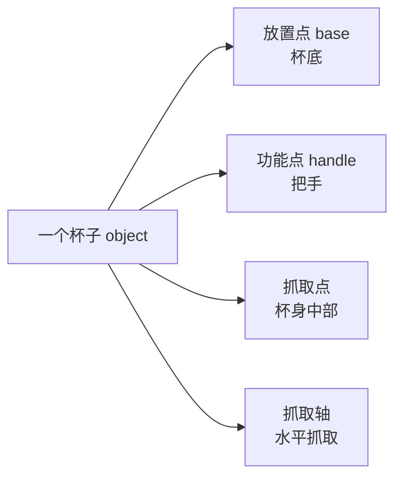

# 第 5 章：RoboTwin-OD 数据集与 50 任务基准

> 本章目标：理解 RoboTwin 2.0 的两大"实体资产"——对象库 RoboTwin-OD 和 50 任务基准，以及它们如何支撑数据生成与评测。

---

## 5.1 为什么要先建"对象库"？

想造"把物体从 A 放到 B"的数据，前提是仿真里**有物体**，而且物体要**足够真实、足够多、足够多样**。

RoboTwin-OD（RoboTwin Object Dataset）就是这样一个**3D 物体资产库**：
- **731 个物体实例**
- **147 个类别**（瓶子、碗、鞋、杯子、遥控器、电子产品、食物……）
- 全部带**语义标注**和**操作标注**

```mermaid
flowchart LR
    subgraph RoboTwin-OD (731 objects)
        A[自建物体 534个/111类]
        B[Objaverse 153个/27类]
        C[PartNet-Mobility 44个/9类]
    end
    A --> D[仿真场景]
    B --> D
    C --> D
```

**知识点：RoboTwin-OD 为什么按"语义 × 物理"双属性组织？**

**① 问题场景** 手头：一个数据生成闭环（MLLM 写任务代码 → 仿真执行 → 自动纠错，第 4 章 §4.1）等着"吃"物体资产；缺的：现成 3D 资产库（如 Objaverse）只有"好看、可指称"的模型，**没有**物理引擎能用的碰撞模型，也**没有**"哪里能抓、哪里能放"的操作标注——闭环里的 CuRobo 运动规划一跑就穿模、抓取规划无从下手。想要的：既能被语言指令指称（语义）、又能被物理仿真稳定操作（物理）的物体库。

**② 解决方法** 给每个物体同时配两类属性：**语义属性**——147 个类别 + 每物体 15 条覆盖形状/纹理/功能/部件/粒度的语言描述（§5.3.1）；**物理属性**——凸分解后的碰撞模型 + 放置点/功能点/抓取点/抓取轴的点-轴标注（§5.3.2）。物体来源按"缺什么补什么"分三路：自建 534 个补齐双属性（主要操作物体）、Objaverse 153 个只当干扰物（只需视觉多样性）、PartNet-Mobility 44 个天然带关节模型（铰接操作）。

**③ 选型理由** 候选 (a) 全部用 Objaverse 等现成库：省去自建，但网格多非凸、无碰撞模型（物理引擎对非凸网格碰撞检测又慢又易穿模），更无操作标注，抓取只能盲试——闭环根本转不起来；候选 (b) 全部自建：质量可控，但 731 个物体全走 RGB→3D 重建 + 凸分解成本过高。折中方案 (c) 的代价是三来源视觉风格不一（域差异），这一点由纹理库与背景随机化（§5.4）吸收——换来的是"主要操作物体双属性齐全、干扰物便宜量大"。

**④ 理论依据** 可供性（affordance）理论：物体对行为者呈现的"可操作性"（Gibson, *The Ecological Approach to Visual Perception*, 1979）——点-轴标注正是 affordance 的几何化落地；抓取标注方法论可对照 DexGraspNet 的可微力闭合抓取合成（[精读笔记](精读/DexGraspNet_NeurIPS2022.md)）；语言描述的多粒度改写服务于语言域随机化（论文 §2.2、附录 I 的指令组合）。

**⑤ 完整推导**（从闭环需求推双属性的必要性）
第一步：数据生成闭环的产物是（初始场景, 语言指令, 专家轨迹）三元组（依据：论文 §2 管线定义，第 4 章 §4.1）。
第二步：语言指令由"模板 × 物体描述"实例化（依据：附录 I 的占位符组合），故每个物体必须携带可指称的语义属性——缺了它，指令模板池无法实例化。
第三步：专家轨迹由运动规划器在仿真中生成（依据：§2.1 闭环 + 附录 E CuRobo），规划需要碰撞模型与候选抓取位姿——故物体必须携带物理属性；缺了它，轨迹生成或穿模失败、或抓取点无从确定（依据：§2.3 体态感知抓取的输入就是这些点-轴标注）。
第四步：两个属性分别服务三元组的不同成员，任缺其一闭环即断链（依据：第二、三步的依赖关系）——所以双属性是管线的**必要条件**，而非"标注更丰富"的锦上添花；三来源按此需求各取所长，即得 §5.2 的构成表。

---

## 5.2 RoboTwin-OD 的三部分构成

| 来源 | 数量 | 生成方式 | 用途 |
|------|------|---------|------|
| **自建物体** | 534 个 / 111 类 | Rodin 平台做 **RGB→3D 重建**，再**凸分解** + **网格合并**保证物理碰撞模型准确 | 主要操作物体 |
| **Objaverse** | 153 个 / 27 类 | 开源 3D 资产库 | 主要用于杂乱场景，增强**视觉与语义多样性** |
| **PartNet-Mobility** | 44 个 / 9 类 | SAPIEN 自带可活动物体 | **铰接/活动物体**（门、抽屉等）操作 |

> 💡 **为什么自建物体要做"凸分解"？**
> 3D 重建得到的网格往往形状复杂，物理引擎计算碰撞慢且不准。**凸分解（Convex Decomposition）** 把复杂形状拆成多个凸多面体，物理仿真又快又稳。

---

## 5.3 每个物体的两类标注（论文的匠心之处）

### 5.3.1 语言标注（Language Annotation）

每个物体有 **15 条**自然语言描述，从不同角度描述同一个物体。以 `041_shoe`（鞋子）为例：

> "green shoe"（绿鞋）
> "teal sneaker"（青绿运动鞋）
> "rubber sole running shoe"（橡胶底跑鞋）
> "blue and green running shoe"（蓝绿跑鞋）
> "teal running shoe with thick beige sole"（厚米色底青绿跑鞋）
> ……

**为什么需要 15 条？**
- 真实世界里同一物体有无数种叫法
- 训练时随机抽取描述 → 模型学会"无论怎么说都能理解"
- 这是"语言域随机化"的数据基础

### 5.3.2 操作标注（Manipulation Annotation / Affordance）

每个物体标出**关键点-轴**信息，告诉机器人"这个物体哪里能抓、哪里能放、哪里能按"：

| 标注 | 含义 | 例子 |
|------|------|------|
| **放置点** Placement Point | 物体平放时的支撑位置 | 瓶子底部 |
| **功能点** Functional Point | 物体的"功能位置"，用于交互 | 杯子把手、开关按钮 |
| **抓取点** Grasp Point | 夹爪应该夹的位置 | 瓶子中部 |
| **抓取轴** Grasp Axis | 夹爪的抓取方向 | 竖直 / 水平 |



**这些标注如何用？**
- 放置任务：`target_block.get_functional_point(1, "pose")` 获取目标功能点位姿
- 抓取任务：用抓取点和抓取轴规划夹爪位姿

> 🔑 **这些标注是"体态感知抓取"（第 4 章）的数据基石**——有了多轴多点的标注，才能为不同机器人生成不同抓法。

---

## 5.4 纹理库（支持背景域随机化）

- 来源：LLM 生成 + 网页爬取 → **1000 条**表面描述
- 生成：Stable Diffusion v2，每条描述 20 张 → **20000 张**
- 筛选：人工参与（human-in-the-loop）→ **11000 张**高质量纹理

纹理用于：桌面材质、背景墙面，让仿真场景视觉丰富、避免过拟合"干净仿真"。

---

## 5.5 50 任务基准（Benchmark）

**知识点：为什么是 50 任务 × 5 机械臂的"广度"？**

**① 问题场景** 手头：一个能自动生成双臂任务数据的管线（§5.5.1）；缺的：一个能让人信服地回答"策略 A 是否比策略 B 更会泛化"的评测集——任务太少（RoboTwin 1.0 只有 14 个）策略可能把任务"背下来"，平台只有一个则结论无法外推到别的机器人；想要的：同时覆盖**任务语义广度**与**机器人本体广度**的基准。

**② 解决方法** 两个维度同时铺开：任务侧用自动化任务生成框架（MLLM 代码生成闭环）批量构造 50 个双臂协作任务（§5.5.2）；本体侧支持 5 种机械臂并允许异构双臂任意配对（§5.5.3，附录 E）——数据生成采用"物体中心、与机器人无关（object-centric, embodiment-agnostic）"框架，同一份任务程序在 5 个本体上各自产出数据。

**③ 选型理由** 替代方案一：沿用 1.0 的 14 任务 + 单一双臂平台——评测便宜，但"任务记忆"与"本体特化"都检测不出来（任务少到可以逐任务调参）。替代方案二：只扩任务不扩本体（如 Meta-World 的 50 任务，全部单臂、无域随机化，见 §5.7 对比表）——考不了"换一台机器人还行不行"，而跨本体恰是 VLA 时代的核心诉求。50 × 5 的代价：评测成本随"任务数 × rollout 数 × 本体数"线性增长（50 × 100 × 5 = 25,000 次完整执行），且逐任务成功率方差大、均值易掩盖短板（这正是 §5.6 评测协议要处理的问题）。在本场景下值得：数据生成已被自动化压平，剩余成本集中在评测 rollout，广度买到的是结论的外推力。

**④ 理论依据** 跨本体正迁移的实证：OXE 把 22 种本体、1M+ 真实轨迹统一后共训，RT-1-X 在小数据域上平均成功率比各数据集原方法高约 50%（Open X-Embodiment, arXiv:2310.08864，[精读笔记](精读/OpenXEmbodiment_ICRA2024.md)）——本体广度是可兑现的收益，不是摆设；评测方法论：RT-1 的 seen/unseen 任务分层与泛化层级设计（[RT-1 精读](精读/RT1_arXiv2022.md)）——广度分级才能区分"记住"与"泛化"。

**⑤ 完整推导**（为什么广度是区分"记忆"与"泛化"的最小配置）
第一步：基准的产出是策略在指定变化维度上的成功率估计（依据：评测协议定义——每任务 100 次 rollout 统计成功率，§5.6）。
第二步：泛化差距只会在与训练分布不同的取值上显现（依据：域偏移的定义——训练与评测分布不一致；Hard 档正是按此构造，第 4 章 §4.2）。
第三步：单一任务（或单一本体）下，策略靠记住该任务（或该本体的运动学）即可得高分——评测无法把"记住"与"会了"分开（依据：RoboTwin 2.0 论文 §1 对既有管线"干净而同质"的批评，以及 1.0 → 2.0 从 14 扩到 50 任务的动机）。
第四步：任务语义与本体运动学近似独立变化，覆盖量按乘积增长——50 任务（9 类协作模式）× 5 本体是当前自动化管线供得起的最小充分网格（依据：论文 §3.2、Fig. 5、Fig. 8；附录 E 证明该框架可继续扩本体）。
第五步：结论——广度的价值 = 把"策略在哪些任务/本体上失效"变成可定位的矩阵（附录 L 逐任务 × 逐本体成功率），代价由自动化数据生成与批量评测摊薄（依据：§5.5.4 的 10 万+ 预收集轨迹）。

### 5.5.1 任务从哪来？

任务 = **自动化任务生成框架（MLLM 代码生成闭环）** 的产物。也就是说：RoboTwin 2.0 不仅能自动生成单个任务的代码，还能**系统性地构建一大批任务**。

### 5.5.2 任务类别一览（理解多样性）

50+ 任务覆盖多种双臂协作模式：

| 类别 | 例子 |
|------|------|
| 抓取放置 | Place Shoe、Place Empty Cup、Pick Dual Bottles |
| 交接 | Handover Block、Handover Mic |
| 叠放 | Stack Bowls Two/Three、Stack Blocks Two/Three |
| 开合操作 | Open Laptop、Open Microwave |
| 按压/点击 | Press Stapler、Click Bell、Turn Switch |
| 倾倒 | Dump Bin Bigbin |
| 摇晃 | Shake Bottle、Shake Bottle Horizontally |
| 移动 | Move Can Pot、Move Playingcard Away |
| 复杂组装 | Place Burger Fries、Place Container Plate |

### 5.5.3 5 种机器人平台（Embodiment）

| 平台 | DoF | 特点 |
|------|-----|------|
| Aloha-AgileX | 6 | 低成本双臂，遥操作友好 |
| ARX-X5 | 6 | 低成本六轴 |
| Piper | 6 | 受限平台（论文重点提升对象） |
| Franka | 7 | 高灵活性，顶抓 |
| UR5 | 7 | 工业级，大工作空间 |

**还支持异构双臂组合**（附录 E）：
- 例如"左手 Franka + 右手 UR5"
- 通过**物体中心、与机器人无关（object-centric, embodiment-agnostic）**的数据生成框架实现
- 用 CuRobo 做 GPU 加速运动规划，支持各种运动学约束

> 💡 **创新点**：多数数据集只支持单一固定平台。RoboTwin 2.0 支持"任意组合双臂"，为跨平台研究铺路。

### 5.5.4 数据集规模

- **10 万+ 条**预采集双臂轨迹
- 每条轨迹包含：多视角图像、关节动作、语言指令
- 公开下载：HuggingFace `TianxingChen/RoboTwin2.0`

---

## 5.6 评测协议（怎么用这些数据做基准）

RoboTwin 2.0 作为基准，定义了标准化的评测方式（详见第 8 章实操）：

| 设置 | 训练数据 | 评测环境 | 目的 |
|------|---------|---------|------|
| **Easy（干净）** | 每任务 50 条干净演示 | 干净环境 | 测"基本能力" |
| **Hard（随机化）** | 同上（训练不变） | 杂乱 + 随机光照/纹理/高度 | 测"鲁棒性" |

**评测流程**：
- 每任务 50 条干净演示训练
- 100 次 rollout（rollout = 让模型执行一次任务）测试
- 报告成功率

**支持评测的策略**：ACT、DP、RDT、Pi0、DP3 等 5+ 种（详见第 8 章）。

**知识点：评测报告为什么给"均值 + 逐任务/最差明细"，而不是只报一个均值？**

**① 问题场景** 手头：50 任务 × 5 本体 × Easy/Hard 的成功率矩阵（每格 = 100 次 rollout）；缺的：一个既能一句话概括、又不掩盖失败模式的报告口径——只报均值时，"全面 60 分"与"一半任务满分、一半任务零分"看起来一样；想要的：让人能定位"策略到底在哪崩"的协议。

**② 解决方法** 双层报告：正文给跨任务平均成功率（Table 2/3/5 的均值列）；附录给完整明细——附录 L（Table 11）公开全部 50 任务 × 5 本体逐格成功率，代码生成附录 G.3 逐任务成功率，sim-to-real 的 Table 4 则把**最差评测配置**的相对提升单独写进摘要（"最差配置 +367%"）。

**③ 选型理由** 替代方案：只报均值——论文写作最省事，但均值是分布的一阶摘要，丢掉方差与尾部：Piper 的 25.1% 均值无法回答它是"各任务均匀地弱"还是"个别任务接近零分"（只有附录 L 明细能回答），DP 在 Hard 的 0.6% 也无法告诉你它是"均匀差"还是"个别任务拖累"。双层报告的代价是版面与计算（25,000 次 rollout 的全矩阵），但它把结论变成**可证伪**的：任何读者都能查到最差行去反驳——这正是基准作为公共基础设施的义务。

**④ 理论依据** 基准评测方法论：RT-1 的 seen/unseen 分层报告与泛化层级（[RT-1 精读](精读/RT1_arXiv2022.md)）；OXE 的逐数据域报告 + "留一数据集"消融——跨域增益必须能在明细中定位（arXiv:2310.08864，[精读笔记](精读/OpenXEmbodiment_ICRA2024.md)）；最坏情形视角：EPOpt 以模型集成的最坏情形优化鲁棒性（Rajeswaran et al., ICLR 2017）——鲁棒性主张应以最差配置检验。

**⑤ 完整推导**（从"均值丢信息"到"双层报告"）
第一步：策略的真实能力是成功率在"任务 × 本体 × 随机化条件"上的**分布**，评测是对该分布的采样估计（依据：§5.6 协议——每任务 100 次 rollout）。
第二步：均值不唯一决定分布——两个成功率分布可以有相同均值而失败模式完全不同（依据：统计学基本事实，均值只是一阶矩）。
第三步：在本基准中有现成的反例：代码生成平均 43.34%，但逐任务从 `pick_dual_bottles` 的 100% 到 `click_bell` 的 10%（附录 G.3）——只看均值会漏掉"按铃类任务系统性失败"这一可行动信息（依据：第 6 章 §6.2.3 转录的数据）。
第四步：同理，本体维度的最差行（Piper）与条件维度的最差配置（Table 4 的 unseen × 杂乱）各自暴露一个改进方向——明细把"均值不动"变成"知道该修哪"（依据：附录 L；第 6 章 §6.3.2、§6.5.3 的解读）。
第五步：结论——报均值负责概括，报明细/最差负责可证伪；读者使用基准时的读表法也应如此：先看均值定档次，再查最差行找改进点（第 6 章各节即按此法展开）。

---

## 5.7 与现有基准的对比（论文附录 B，帮你看清定位）

| 基准 | 任务数 | 域随机化 | 自动数据生成 | VLA 训练评测 |
|------|-------|---------|-------------|-------------|
| Meta-World | 50 | ✕ | ✓ | ✕ |
| Robosuite | 9 | ✕ | ✕ | ✕ |
| RoboCasa | 25 | ✓ | ✕ | ✕ |
| ManiSkill2 | 20 | ✕ | ✓ | ✕ |
| AutoBio | 16 | ✕ | ✓ | ✓ |
| RoboTwin 1.0 | 14 | ✕ | ✓ | ✓ |
| **RoboTwin 2.0** | **50** | **✓** | **✓** | **✓** |

**RoboTwin 2.0 的差异化**：**同时**满足"任务多 + 有域随机化 + 自动数据生成 + 支持 VLA 训练评测"——四项全占。

---

## 5.8 本章小结（自测清单）

1. RoboTwin-OD 由哪三部分构成？各自来源和用途？
2. 每个物体的"语言标注"和"操作标注"分别是什么？为什么重要？
3. 纹理库怎么来的？有多少张？
4. 50 任务覆盖哪些协作模式？请举例。
5. 5 种平台各自特点？为什么支持异构双臂组合？
6. Easy/Hard 评测协议有何区别？
7. 相比其他基准，RoboTwin 2.0 的差异化优势是什么？

> **动手练习**：访问 RoboTwin 对象文档（https://robotwin-platform.github.io/doc/objects/），挑 3 个你感兴趣的物体，观察它们的语言描述和功能点标注；再访问任务文档（https://robotwin-platform.github.io/doc/tasks/），给 3 个任务标注"属于哪类协作模式"。
